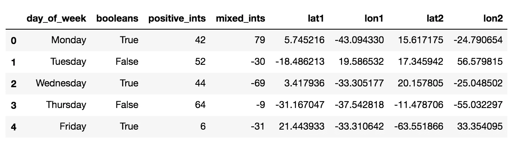

# 如何避免熊猫大混乱

> 原文：<https://towardsdatascience.com/how-to-avoid-a-pandas-pandemonium-e1bed456530?source=collection_archive---------18----------------------->

## [入门](https://towardsdatascience.com/tagged/getting-started)

## 深入探究熊猫的常见错误。第一部分:编写好的代码并发现无声的失败。


由[凯文·Ku](https://unsplash.com/@ikukevk?utm_source=medium&utm_medium=referral)在 [Unsplash](https://unsplash.com?utm_source=medium&utm_medium=referral) 上拍摄

当你第一次开始使用熊猫的时候，最好是先把脚弄湿，然后在出现问题的时候处理。然后，几年过去了，你已经能够用它构建的惊人的东西开始积累，但是你有一个模糊的暗示，你一直在犯同样的错误，对于看起来很简单的操作，你的代码运行得非常慢。这是时候深入了解熊猫的内部工作原理，让你的代码更上一层楼了。与任何库一样，优化代码的最佳方式是理解语法下面发生了什么。

首先，在第一部分**中，我们将吃我们的蔬菜，并涵盖编写干净的代码和发现常见的无声故障。然后在 [**第二部分**](https://medium.com/@protagonistwu/how-to-avoid-a-pandas-pandemonium-part-ii-3426f53d7fba) 中，我们将开始加速你的运行时间并降低你的内存占用。**

我还做了一个 [Jupyter 笔记本，上面有整个课程](https://github.com/pambot/notebooks/blob/master/pandas-pandemonium.ipynb)，包括两部分。

首先，让我们制造一些假数据来玩。我将制作一个大的数据框来说明更大的处理问题，并制作一个小的数据框来说明局部的点变化。

```
*# for neatness, it helps to keep all of your imports up top*
**import** **sys**
**import** **traceback**
**import** **numba**
**import** **numpy** **as** **np**
**import** **pandas** **as** **pd**
**import** **numpy.random** **as** **nr**
**import** **matplotlib.pyplot** **as** **plt**

% matplotlib inline*# generate some fake data to play with*
data = {
    "day_of_week": ["Monday", "Tuesday", "Wednesday", "Thursday", "Friday", "Saturday", "Sunday"] * 1000,
    "booleans": [**True**, **False**] * 3500,
    "positive_ints": nr.randint(0, 100, size=7000),
    "mixed_ints": nr.randint(-100, 100, size=7000),
    "lat1": nr.randn(7000) * 30,
    "lon1": nr.randn(7000) * 30,
    "lat2": nr.randn(7000) * 30,
    "lon2": nr.randn(7000) * 30,
}

df_large = pd.DataFrame(data)df_large.head()
```



```
small = {
    'a': [1, 1],
    'b': [2, 2]
}df_small = pd.DataFrame(small)df_small
```


太好了，现在我们都准备好了！

# 编写优秀的代码

在我们做“酷”的事情之前，比如编写更快、更优化内存的代码，我们需要在一些看起来相当平凡的编码最佳实践的基础上做这件事。这些都是小事情，比如有表达性地命名事物和编写健全性检查，这将有助于保持代码的可维护性和可读性。

## 健全检查很简单，完全值得

仅仅因为这大部分只是数据分析，并且为它建立一整套单元测试可能没有意义，并不意味着你根本不能做任何种类的检查。在你的笔记本代码中加入`assert`不需要太多额外的工作就可以走很长的路。

上面，我们制作了一个数据帧`df_large`,其中包含一些带有预定义规则的数字。例如，您可以通过修剪空白并检查条目数量是否保持不变来检查数据输入错误:

```
large_copy = df_large.copy()**assert** large_copy["day_of_week"].str.strip().unique().size == large_copy["day_of_week"].unique().size
```

如果运行这段代码，应该不会发生任何事情。但是，稍微修改一下，打破它，然后…

```
large_copy.loc[0, "day_of_week"] = "Monday "**assert** large_copy["day_of_week"].str.strip().unique().size == large_copy["day_of_week"].unique().size
```

**嘭！AssertionError。**假设您有一些丢弃重复项并将增量发送给客户端的代码。添加的少量空白会被遗漏，并作为它自己唯一的数据点发送出去。当是一周中的某几天时，这没什么大不了的，您可以很容易地对其进行抽查，但是如果是潜在的成千上万或更多的唯一字符串，这种检查可以让您省去一个大麻烦。

## 使用一致的索引

Pandas 在索引方面给了你很大的灵活性，但是如果你没有保持一致的风格，它会给你带来很多困惑。这是一个提议的标准:

```
*# for getting columns, use a string or a list of strings for* multiple columns
*# note: a one-column DataFrame and a Series are not the same thing*
one_column_series = df_large["mixed_ints"]
two_column_df = df_large[["mixed_ints", "positive_ints"]]*# for getting a 2D slice of data, use `loc`*
data_view_series = df_large.loc[:10, "positive_ints"]
data_view_df = df_large.loc[:10, ["mixed_ints", "positive_ints"]]*# for getting a subset of rows, also use `loc`*
row_subset_df = df_large.loc[:10, :]
```

这只是结合了我个人用的和我见过别人做的。这里有另一组方法来做与上面完全相同的事情，但是你可能会明白为什么它们要么没有被广泛采用，要么不被鼓励使用。

```
*# one way is to use `df.loc` for everything, but it can look clunky*
one_column_series = df_large.loc[:, "mixed_ints"]
two_column_df = df_large.loc[:, ["mixed_ints", "positive_ints"]]*# you can use `iloc`, which is `loc` but with indexes, but it's not as clear
# also, you're in trouble if you ever change the column order*
data_view_series = df_large.iloc[:10, 2]
data_view_df = df_large.iloc[:10, [3, 2]]*# you can get rows like you slice a list, but this can be confusing*
row_subset_df = df_large[:10]
```

这里有一个关于最后一个例子的小问题:`df_large[:10]`得到前 10 行，但是`df_large[10]`得到第 10 列。这就是为什么尽可能清晰地对事物进行索引是如此重要，即使这意味着你必须做更多的打字工作。

## 但是不要使用链式索引

什么是链式索引？当你分别索引列和行时，会对`__getitem__()`进行两次单独的调用(或者更糟，如果你正在赋值，一次调用`__getitem__()`，一次调用`__setitem__()`，我们将在下面演示)。如果您只是索引而不是赋值，这还不错，但是从可读性的角度来看，这仍然不理想，因为如果您在一个地方索引行，然后索引一列，除非您对变量命名非常严格，否则很容易丢失索引的确切内容。

```
*# this is what chained indexing looks like*
data_view_series = df_large[:10]["mixed_ints"]
data_view_df = df_large[:10][["mixed_ints", "positive_ints"]]*# this is also chained indexing, but low-key*
row_subset_df = df_large[:10]
data_view_df = row_subset_df[["mixed_ints", "positive_ints"]]
```

第二个例子不是人们通常想要做的，它经常发生在人们在嵌套的`for`循环中修改数据帧的时候，首先你遍历每一行，然后你想对一些列做一些事情。如果你得到了一个`SettingWithCopyWarning`，试着寻找这些类型的模式或者任何你可能分别切片行然后切片列(或者反过来)的模式，并用`df.loc[rows, columns]`替换它们。

# 常见的无声故障

即使你做了以上所有的事情，有时熊猫的灵活性会诱使你犯错误，而这些错误实际上并不会使你犯错。这些是特别有害的，因为你常常意识不到有问题，直到下游的事情没有意义，并且很难追溯到原因是什么。

## 查看与复制

数据框的视图和副本在其包含的值方面可能与您完全相同，但视图引用的是现有数据框的一部分，而副本则是完全不同的数据框。如果更改视图，则更改现有数据框架，但如果更改副本，则原始数据框架不受影响。当您认为正在修改副本时，请确保没有修改视图，反之亦然。

事实证明，你是在处理一个副本，还是一个观点是很难预测的！从内部来说，panases 会返回一个视图或一个副本，来尝试进行优化，具体取决于数据帧和您采取的操作。您可以使用`df.copy()`强制熊猫为您制作一份拷贝，也可以通过设置`inplace=True`强制熊猫在数据帧可用时就地操作。

何时进行复制，何时使用视图？这很难确定，但是如果您的数据很小，或者您的资源很大，并且您希望实现功能化和无状态化，您可以尝试为每个操作创建一个副本，就像 Spark 所做的那样，因为这可能是最安全的方法。另一方面，如果您有大量数据，并且有一台普通的笔记本电脑，您可能希望在适当的位置进行操作，以防止笔记本电脑崩溃。

```
*# intentionally making a copy will always make a copy*
small_copy = df_small.copy()small_copy
```


虽然它们看起来完全相同，但这实际上是一个完全独立的数据对象，不同于我们之前制作的`df_small`。

我们来看看`inplace=True`是做什么的。`df.drop()`是一个允许您从数据框架中删除列的方法，也是一个熊猫数据框架方法，它允许您指定是希望就地执行操作，还是希望操作返回新对象。返回一个新的对象，或者`inplace=False`始终是缺省值。

```
small_copy.drop("b", axis=1)small_copy
```


跌落发生了什么？它返回一个新对象，但您没有用变量指向它，所以它消失了。原文`small_copy`保持不变。现在让我们打开就地修改:

```
small_copy.drop("b", axis=1, inplace=True)small_copy
```


原来的`small_copy`，现在已经变了。好在我们做了一份拷贝！

让我们重新制作`small_copy`并做点修改，看看我之前所说的原始数据框架是一个不同的对象是什么意思。

```
*# let's see what happens if you assign to a copy*
small_copy = df_small.copy()*# you should always use `loc` for assignment*
small_copy.loc[0, 'b'] = 4small_copy
```


```
*# original is unchanged*
df_small
```


## 注意无序处理

在 Jupyter 笔记本中，无序地更改和重新处理单元几乎是不可避免的——我们知道不该这样做，但最终总是会发生。这是 view vs. copy 问题的一个子集，因为如果知道要进行的更改从根本上改变了列的属性，就应该消耗内存成本并创建一个新的副本，否则可能会发生类似的情况，在此块中反复运行后两个单元格，看到最大值变得非常不稳定。

```
large_copy = df_large.copy()
large_copy.loc[0, "positive_ints"] = 120
large_copy["positive_ints"].max()> 120
```

记住，`positive_ints`被设置在 0 到 100 之间，这意味着将第一个值设置为 120 意味着现在最大值必须是 120。但是如果我运行几次这样的细胞会怎么样呢？

```
large_copy["positive_ints"] = large_copy["positive_ints"] * 3
large_copy["positive_ints"].max()> 360
```

第一次运行它时，它的行为与预期的一样，但是再次运行它…

```
large_copy["positive_ints"] = large_copy["positive_ints"] * 3
large_copy["positive_ints"].max()> 1080
```

这个例子看似显而易见，但让细胞不可逆地改变数据，并在每次重新运行时自动构建，这真的很容易。避免这个问题的最好方法是，当您开始一个将产生显著的就地数据突变的单元时，用新的变量名创建一个新的数据框架。

```
large_copy_x3 = large_copy.copy()
large_copy_x3["positive_ints"] = large_copy["positive_ints"] * 3
large_copy_x3["positive_ints"].max()> 360
```

无论你运行那个块多少次，它总会返回 360，就像你最初预期的那样。

## 切勿将错误设置为“忽略”

默认情况下，一些 Pandas 方法允许您忽略错误。这几乎总是一个坏主意，因为忽略错误意味着它只是将未解析的输入放在输出应该在的地方。让我们用两个正常的日期和一个未来的日期制作一个系列。

```
parsed_dates = pd.to_datetime(["10/11/2018", "01/30/1996", "04/15/9086"], format="%m/%d/%Y", errors="ignore")parsed_dates> array(['10/11/2018', '01/30/1996', '04/15/9086'], dtype=object)
```

请注意，在示例输出中，如果您不太熟悉 Pandas 输出应该是什么，那么看到`array`类型的输出对您来说可能并不奇怪，您可能只是继续您的分析，而不知道有什么地方出错了。

如果你关闭`errors="ignore"`，你会看到回溯:

```
Traceback (most recent call last):
  File "<ipython-input-22-12145c38fd6e>", line 3, in <module>
    pd.to_datetime(["10/11/2018", "01/30/1996", "04/15/9086"], format="%m/%d/%Y")
pandas._libs.tslibs.np_datetime.OutOfBoundsDatetime: Out of bounds nanosecond timestamp: 9086-04-15 00:00:00
```

这里发生的事情是，Python 时间戳以纳秒为单位进行索引，该数字存储为一个`int64`，因此任何晚于大约 2262 年的年份都将超出其存储能力。作为一名数据科学家，你可能会被原谅不知道这一点点的秘密，但这只是隐藏在 Python/Pandas 中的许多隐藏的特质之一，所以忽略它会给你带来危险。

如果你想知道，这就是约会系列应该有的样子:

```
pd.to_datetime(["10/11/2018", "01/30/1996"], format="%m/%d/%Y")> DatetimeIndex(['2018-10-11', '1996-01-30'], dtype='datetime64[ns]', freq=None)
```

## `object` dtype 可以隐藏混合类型[](http://localhost:8888/notebooks/pandas-pandemonium.ipynb#The-object-dtype-can-hide-mixed-types)

每个熊猫列都有一个类型，但是有一个叫做`object`的超级类型，这意味着每个值实际上只是一个指向某个任意对象的指针。这使得熊猫有很大的灵活性(即列表或字典或任何你想要的东西的列！)，但这可能会导致静默失败。

**剧透预警:**这不会是`object`型第一次给我们带来问题。我不想说你不应该使用它，但是一旦你进入生产模式，你绝对应该谨慎使用它。

```
*# we start out with integer types for our small data*
small_copy = df_small.copy()
small_copy.dtypes> 
a    int64
b    int64
dtype: object*# reset ones of the column's dtype to `object`*
small_copy["b"] = small_copy["b"].astype("object")
small_copy.dtypes>
a    int64
b    object
dtype: object
```

现在让我们再做一些恶作剧，用可能是最令人沮丧的无声失败之一来改变`b`专栏。

```
small_copy["b"] = [4, "4"]
small_copy
```


(我相信对你们中的许多人来说，这是黑板上的钉子的数据等价物。)

现在，假设您需要删除重复项并发送结果。如果您按列`a`放置，您将得到预期的结果:

```
small_copy.drop_duplicates("a")
```


但是，如果您按列`b`放置，您将得到以下结果:

```
small_copy.drop_duplicates("b")
```


## 谨慎对待熊猫模式推理

当你加载一个大的混合型 CSV 时，Pandas 给你设置`low_memory=False`的选项，当它遇到一些它不知道如何处理的数据时，它实际上正在做的只是使整个列`object`类型化，以便它可以转换为`int64`或`float64`的数字得到转换，但它不能转换的东西只是作为`str`放在那里。这使得列值暂时能够和平共存。但是一旦你尝试对它们做任何操作，你会发现 Pandas 一直试图告诉你，你不能假设所有的值都是数字。

**注意:**记住，在 Python 中，`NaN`是一个`float`！因此，如果您的数字列有它们，即使它们实际上是`int`，也将其转换为`float`。

让我们创建一个故意迟钝的数据帧，并把它保存在某个地方，以便我们可以读回它。这个数据帧有一个整数和一个字符串的组合，作者(很可能是人，可能在 Excel 中工作)认为这是一个 NaN 值的指示，但实际上缺省的 NaN 解析器并不包含它。

```
mixed_df = pd.DataFrame({"mixed": [100] * 100 + ["-"] + [100] * 100, "ints": [100] * 201})mixed_df.to_csv("test_load.csv", header=True, index=False)
```

当您读回它时，Pandas 将尝试进行模式推理，但它会在混合类型列上出错，并且不会试图对此过于固执己见，而是将值保留在`object`列中。

```
mixed_df = pd.read_csv("test_load.csv", header=0)
mixed_df.dtypes>
mixed    object
ints     int64
dtype: object
```

确保正确解释数据的最佳方法是手动设置 dtypes 并指定 NaN 字符。这是一件痛苦的事情，而且您并不总是必须这样做，但是打开您拥有的任何数据文件的前几行并确保它真的可以被自动解析总是一个好主意。

```
mixed_df = pd.read_csv("test_load.csv", header=0, dtype={"mixed": float, "ints": int}, na_values=["-"])
mixed_df.dtypes>
mixed    float64
ints     int64
dtype: object
```

# 结论，第一部分

熊猫可能是自切片列表以来最伟大的东西，但它是自动魔法，直到它不是。要了解何时以及如何让它掌控方向盘，何时必须手动超越，你要么需要对它的内部工作原理有一个扎实的了解，要么你可以像我一样，用头撞它们五年，并尝试从你的错误中吸取教训。俗话说，骗我一次，不要脸。愚弄我 725 次…不能再愚弄我了。

请查看[第二部分:加速和内存优化](https://medium.com/@protagonistwu/how-to-avoid-a-pandas-pandemonium-part-ii-3426f53d7fba)。