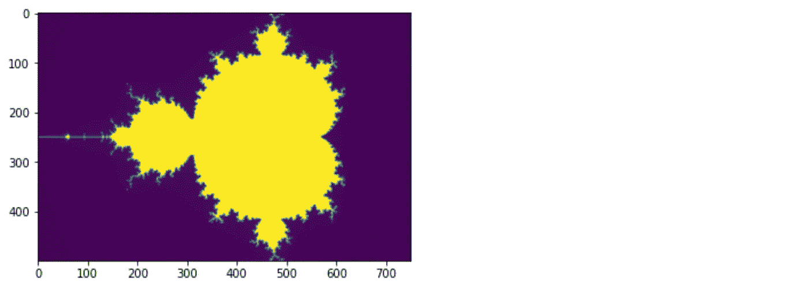

# 如何避免熊猫大混乱，第二部分

> 原文：<https://towardsdatascience.com/how-to-avoid-a-pandas-pandemonium-part-ii-3426f53d7fba?source=collection_archive---------43----------------------->

## 深入探究熊猫的常见错误。第二部分:加速和内存优化


照片由 [Alex wong](https://unsplash.com/@killerfvith?utm_source=medium&utm_medium=referral) 在 [Unsplash](https://unsplash.com?utm_source=medium&utm_medium=referral) 上拍摄

在 [**第一部分**](https://medium.com/@protagonistwu/how-to-avoid-a-pandas-pandemonium-e1bed456530) 中，我们回顾了如何编写干净的代码并找出常见的无声故障。在**第二部分**中，我们致力于加速你的运行时间并降低你的内存占用。

我还做了一个 [Jupyter 笔记本，上面有整个课程](https://github.com/pambot/notebooks/blob/master/pandas-pandemonium.ipynb)，包括两部分。

这是前一部分的一些代码设置，但是我把它放在这里是为了让这一部分能够独立存在。

```
*# for neatness, it helps to keep all of your imports up top*
**import** **sys**
**import** **traceback**
**import** **numba**
**import** **numpy** **as** **np**
**import** **pandas** **as** **pd**
**import** **numpy.random** **as** **nr**
**import** **matplotlib.pyplot** **as** **plt**

% matplotlib inline*# generate some fake data to play with*
data = {
    "day_of_week": ["Monday", "Tuesday", "Wednesday", "Thursday", "Friday", "Saturday", "Sunday"] * 1000,
    "booleans": [**True**, **False**] * 3500,
    "positive_ints": nr.randint(0, 100, size=7000),
    "mixed_ints": nr.randint(-100, 100, size=7000),
    "lat1": nr.randn(7000) * 30,
    "lon1": nr.randn(7000) * 30,
    "lat2": nr.randn(7000) * 30,
    "lon2": nr.randn(7000) * 30,
}

df_large = pd.DataFrame(data)*# let's copy this pro-actively, copy vs. view is in part i*
large_copy = df_large.copy()df_large.head()
```


# 启动你的熊猫

既然您已经有了很好的编码习惯，是时候尝试提升性能了。从矢量化到实时编译，您可以使用一系列方法来加快代码运行速度。为了测量瓶颈和量化性能增益，让我们介绍一下`timeit`，一个漂亮的 Jupyter 性能测量笔记本工具。你需要知道的是，将`%timeit`放在一行代码之前将测量该行代码的运行时间，而将`%%timeit`放在一个代码块中将测量整个代码块的运行时间。

对于这个例子，我选择了哈弗辛函数，因为它是一个很好的例子，这个函数看起来有点复杂，但实际上很容易优化。我在 [StackOverflow](https://stackoverflow.com/questions/4913349/haversine-formula-in-python-bearing-and-distance-between-two-gps-points) 上找到了这个示例函数。

```
**def** haversine(lat1, lon1, lat2, lon2):
    """Haversine calculates the distance between two points on a sphere."""
    lat1, lon1, lat2, lon2 = map(np.deg2rad, [lat1, lon1, lat2, lon2])
    dlat = lat2 - lat1
    dlon = lon2 - lon1
    a = np.sin(dlat/2)**2 + np.cos(lat1) * np.cos(lat2) * np.sin(dlon/2)**2
    c = 2 * np.arcsin(np.sqrt(a)) 
    **return** c %timeit haversine(100, -100, 50, -50)> 14.3 µs ± 308 ns per loop (mean ± std. dev. of 7 runs, 100000 loops each)
```

## 遍历行的三种不同方式

您可能已经知道 Pandas 是在 Numpy 的基础上构建的，以利用仅由底层 C 代码提供的优化，同时保持其可访问的 Python 接口。然而，就像任何脚踏两个世界的事物一样，你需要知道边界在哪里，以充分利用它的双重性。根据迭代数据帧的方式，您可以充分利用或完全忽略这些优化。

如果您对 Pandas 完全陌生，并且只是将 DataFrames 视为嵌套 Python 列表的包装器，那么您的第一反应可能是一次遍历一行，比如使用`df.iterrows()`。

```
%%timeit# `iterrows` is a generator that yields indices and rows
dists = []
for i, r in large_copy.iterrows():
    dists.append(haversine(r["lat1"], r["lon1"], r["lat2"], r["lon2"]))large_copy["spherical_dist"] = dists> 736 ms ± 29.4 ms per loop (mean ± std. dev. of 7 runs, 1 loop each)
```

每个循环 740 毫秒是 3/4 秒，真的可以累加。100，000 行将花费您 20 个小时。

使用`df.apply()`方法有一个稍微优化的方法，它对 DataFrame 和 Series 对象都有效。您定义一个自定义函数并发送它，在某些情况下，它会尝试推断更快的方法来更快地处理 DataFrame 列。

```
large_copy["spherical_dist"] = large_copy.apply(
    lambda r: haversine(r["lat1"], r["lon1"], r["lat2"], r["lon2"]), axis=1
)> 387 ms ± 31.1 ms per loop (mean ± std. dev. of 7 runs, 1 loop each)
```

这是一种进步，但并不惊人。您需要做的是使用矢量化，简单地说，就是向 Numpy 兼容函数中输入一系列值，这些值通常一次取一个值，这样 C 代码就可以自由地在内部分割向量并进行并行处理。Numpy 函数通常可以接受单个值、一个向量或一个矩阵。如果内部处理可以在每一步都作用于单个值或值的向量，则可以使用现成的矢量化。

```
%timeit large_copy["spherical_dist"] = haversine(\
    large_copy["lat1"], \
    large_copy["lon1"], \
    large_copy["lat2"], \
    large_copy["lon2"] \
)> 2.17 ms ± 188 µs per loop (mean ± std. dev. of 7 runs, 1000 loops each)
```

这大约是 100 倍的速度提升——20 小时缩短到大约 4 分钟。请注意，我没有以任何方式更改原始函数。如果你去看代码，你可以自己追踪这些值是如何既可以是单个值也可以是一个序列的。

## 迭代的一些经验法则

与索引一样，Pandas 可以灵活地处理每行的值。以下是一些经验法则:

*   如果要对列的每个值应用相同的变换，应该使用矢量化。
*   如果需要条件矢量化，请使用布尔索引。
*   也适用于字符串！即`Series.str.replace("remove_word", "")`
*   你应该只对不能广播的特定功能使用`apply`。即`pd.to_datetime()`

## 用 Numba 进行实时编译

不能矢量化怎么办？这是否意味着你被`df.apply()`困住了？不一定——如果您的代码可以表示为纯 Python 和 Numpy 数组的组合，您应该尝试 Numba，看看您的代码是否可以为您加速。编写 Numba 与编写 Cython 完全不同，如果你只懂 Python，那么编写 cy thon 就很像编写一种全新的编程语言。同样，只要你的代码可以用纯 Python 和 Numpy 来表达，这实际上就是在现有函数的基础上添加一些装饰器。

这个例子基于一些函数，这些函数计算一个给定的复数是否是 Mandlebrot 集合的一部分，并通过尝试每个像素坐标来可视化产生的分形。取自 [Numba docs](http://numba.pydata.org/numba-doc/0.15.1/examples.html) 。

```
**def** mandel(x, y, max_iters):
    """
    Given the real and imaginary parts of a complex number,
    determine if it is a candidate for membership in the Mandelbrot
    set given a fixed number of iterations.
    """
    i = 0
    c = complex(x,y)
    z = 0.0j
    for i in range(max_iters):
        z = z*z + c
        if (z.real*z.real + z.imag*z.imag) >= 4:
            **return** i
    **return** 255**def** create_fractal(min_x, max_x, min_y, max_y, image, iters):
    height = image.shape[0]
    width = image.shape[1] pixel_size_x = (max_x - min_x) / width
        pixel_size_y = (max_y - min_y) / height
        for x in range(width):
            real = min_x + x * pixel_size_x
            for y in range(height):
                imag = min_y + y * pixel_size_y
                color = mandel(real, imag, iters)
                image[y, x] = color **return** image image = pd.DataFrame()
image["pixels"] = np.zeros(1, dtype=np.uint8)%timeit create_fractal(-2.0, 1.0, -1.0, 1.0, image, 20)> 30.5 ms ± 11.4 ms per loop (mean ± std. dev. of 7 runs, 100 loops each)
```

这里是完全相同的功能，但在顶部有 Numba 装饰。我不得不使输入数据非常非常小，因为`timeit`运行许多次迭代来测量速度。

```
@numba.jit **def** mandel(x, y, max_iters):
    """
    Given the real and imaginary parts of a complex number,
    determine if it is a candidate for membership in the Mandelbrot
    set given a fixed number of iterations.
    """
    i = 0
    c = complex(x,y)
    z = 0.0j
    for i in range(max_iters):
        z = z*z + c
        if (z.real*z.real + z.imag*z.imag) >= 4:
            **return** i
    **return** 255@numba.jit
**def** create_fractal(min_x, max_x, min_y, max_y, image, iters):
    height = image.shape[0]
    width = image.shape[1] pixel_size_x = (max_x - min_x) / width
        pixel_size_y = (max_y - min_y) / height
        for x in range(width):
            real = min_x + x * pixel_size_x
            for y in range(height):
                imag = min_y + y * pixel_size_y
                color = mandel(real, imag, iters)
                image[y, x] = color **return** image image = pd.DataFrame()
image["pixels"] = np.zeros(1, dtype=np.uint8)%timeit create_fractal(-2.0, 1.0, -1.0, 1.0, image, 20)> 1.63 ms ± 84 µs per loop (mean ± std. dev. of 7 runs, 1 loop each)
```

这是打字 5 秒钟速度的 18 倍。如果你的函数需要一些复杂的循环和条件混合在一起，看看你是否能运用一些 Numba 魔法还是值得的。

如果您感到好奇，这就是当您将`create_fractal`函数应用到全零的实际输入时它的样子:



# 管理你的记忆

如果您使用 Pandas 已经有一段时间了，那么您可能在某个时候遇到过中等大小的数据帧使您的 Python 进程崩溃的情况。令人困惑的是，当数据帧看起来没有那么大时，或者也许你记得上周在同一台笔记本电脑上处理更大的东西，但那台没有崩溃。怎么回事？

熊猫记忆问题的最大元凶可能是:

*   你的引用仍然附加在变量上，这意味着它们不会被垃圾回收。
*   你有太多的数据帧副本。
*   您可以进行更多的就地操作，这不会产生数据帧的副本。
*   `object`数据类型比固定数据类型占用更多的内存。

## 碎片帐集

垃圾收集是 Python 通过释放对程序不再有用的内存来释放内存的过程。您可以通过移除对该对象的引用来释放内存引用的对象。这将标记以前引用的对象以释放内存。

让垃圾收集帮助您管理内存的最佳方式是将您能做的任何事情包装到函数中。在函数中声明的变量只作用于函数，所以当函数结束运行时，它们会被丢弃。另一方面，全局变量(如`large_copy`)一直保留到 Python 进程结束(即笔记本内核关闭)。即使你`del`了一个变量，它也只是减少了 1 个引用，但是如果引用计数不是 0，被引用的对象实际上并没有被删除。这就是为什么全局变量会破坏你认为你的记忆。

只是为了好玩，您可以通过使用`sys.getrefcount(var_name)`来查看变量的引用计数。

```
*# `foo` is a reference*
foo = []sys.getrefcount(foo) # this temporarily bumps it up to 2> 2# yet another global reference bumps it up again 
foo.append(foo)sys.getrefcount(foo)> 3
```

此时，`del`将无法对其进行垃圾收集，全局范围内引用过多。

## 数据类型占用大量内存

又是那些讨厌的`object`dtype！毫不奇怪，告诉熊猫你需要能够在任何时间任何地方存储任何东西意味着它会为你存储的东西预先分配大量的初始内存。如果您存储的是复杂的东西，这没问题，但是如果您存储的是可以简单表示的东西，您可能想看看是否可以将 dtype 改为更适合您情况的类型。

检查数据帧占用了多少内存实际上比你想象的要容易。它已经内置到 DataFrame 对象中。

```
large_copy.info(memory_usage="deep")>
<class 'pandas.core.frame.DataFrame'>
RangeIndex: 7000 entries, 0 to 6999
Data columns (total 8 columns):
day_of_week      7000 non-null object
booleans         7000 non-null bool
positive_ints    7000 non-null int64
mixed_ints       7000 non-null int64
lat1             7000 non-null float64
lon1             7000 non-null float64
lat2             7000 non-null float64
lon2             7000 non-null float64
dtypes: bool(1), float64(4), int64(2), object(1)
memory usage: 773.5 KB
```

节约内存的一个常见做法是向下转换。例如，如果您知道您的整数不需要 64 位，就将它们转换为 32 位。但是，正如我们将会看到的，并不是所有的向下投射都具有同等的影响力。

```
large_copy["positive_ints"] = large_copy["positive_ints"].astype(np.int32)large_copy.info(memory_usage="deep")>
<class 'pandas.core.frame.DataFrame'>
RangeIndex: 7000 entries, 0 to 6999
Data columns (total 8 columns):
day_of_week      7000 non-null object
booleans         7000 non-null bool
positive_ints    7000 non-null int32
mixed_ints       7000 non-null int64
lat1             7000 non-null float64
lon1             7000 non-null float64
lat2             7000 non-null float64
lon2             7000 non-null float64
dtypes: bool(1), float64(4), int32(1), int64(1), object(1)
memory usage: 746.2 KB
```

3%的降幅其实并不显著。如果你有字符串列，并且它们被存储为一个`object`类型，那么它们总是比浮点数和整数更容易占用内存。

所有的`str`类型在熊猫中都被存储为`object`，因为它们可以是任意长度。您可以将字符串列向下转换为固定长度的`str`类型。例如，这个限制为 10 个字符:

```
large_copy["day_of_week"] = large_copy["day_of_week"].astype("|S10")large_copy.info(memory_usage="deep")>
<class 'pandas.core.frame.DataFrame'>
RangeIndex: 7000 entries, 0 to 6999
Data columns (total 8 columns):
day_of_week      7000 non-null object
booleans         7000 non-null bool
positive_ints    7000 non-null int32
mixed_ints       7000 non-null int64
lat1             7000 non-null float64
lon1             7000 non-null float64
lat2             7000 non-null float64
lon2             7000 non-null float64
dtypes: bool(1), float64(4), int32(1), int64(1), object(1)
memory usage: 636.8 KB
```

降价 18%并不坏，但是我们还能做得更多吗？你碰巧知道在`day_of_week`一周最多只有 7 天。有一种`category`类型可以利用由一小组重复元素组成的列。

```
large_copy["day_of_week"] = large_copy["day_of_week"].astype("category")large_copy.info(memory_usage="deep")>
<class 'pandas.core.frame.DataFrame'>
RangeIndex: 7000 entries, 0 to 6999
Data columns (total 8 columns):
day_of_week      7000 non-null category
booleans         7000 non-null bool
positive_ints    7000 non-null int32
mixed_ints       7000 non-null int64
lat1             7000 non-null float64
lon1             7000 non-null float64
lat2             7000 non-null float64
lon2             7000 non-null float64
dtypes: bool(1), category(1), float64(4), int32(1), int64(1)
memory usage: 315.2 KB
```

仅从一个专栏来看，就减少了 59%!

# 结论，第二部分

我几乎惭愧地承认，在我开始寻找优化之前，我花了几年时间使用 Pandas，即使在今天，我也没有对我制作的每一台笔记本进行优化。但是，通过一些简单的技巧，您可以看到几行代码的差异，甚至是如何处理单个列，会导致 10-100 倍的速度提升和 50%以上的内存减少。这绝对是一套不错的锦囊妙计。

如果您错过了它，请查看[第一部分:编写好的代码并发现无声的失败。](https://medium.com/@protagonistwu/how-to-avoid-a-pandas-pandemonium-e1bed456530)