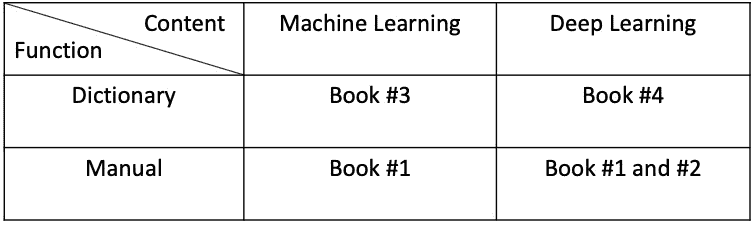

# 如何避免停留在你的机器学习书单中第一本书的第一章

> 原文：<https://towardsdatascience.com/how-to-avoid-stopping-at-chapter-1-of-the-first-book-in-your-machine-learning-booklist-a38a41936735?source=collection_archive---------42----------------------->

## 读书比看书单更重要。如果你想完成你在机器学习方面的书单，我的策略大概可以帮到你。

本·怀特在 [Unsplash](https://unsplash.com?utm_source=medium&utm_medium=referral) 上的照片

Y 在你阅读这篇文章之前，你可能已经通读了数十份机器学习书目。但是你看完里面的书了吗？

我也没有。

我发现，当我对读一本新书充满热情时，这种热情会在我到达书的中心部分之前在某个地方耗尽。

大部分没看完的书我都卡在了 ***第 1 章*** 里。所以，那时候，我从书上读了几百遍的东西只有机器学习的历史和机器学习的基本概念。

大约半年前，我试图解决反复阅读第一章的问题。我制定了一个阅读策略，它对我很有效。

我以我自己的机器学习书目为例与你分享。如果你和我有同样的问题，希望这篇文章能帮到你。没有必要从我这里复制一切，但是值得一试把这个策略应用到你的书单上。

## 第一步:根据你的需求过滤你的书单。

布莱克·理查德·弗多恩在 [Unsplash](https://unsplash.com?utm_source=medium&utm_medium=referral) 上拍摄的照片

我之所以想看机器学习方面的书，可以用两层需求来解释。*首先，*我希望能够在我开始阅读书籍的时候就能输入我的机器学习代码。*二、*我想看完之后能够理解算法。

第一层是面向工程的，第二层是面向研究的。

基于这些需求，我在最终书单中保留了四本书:

1.  [使用 Scikit-Learn、Keras 和 TensorFlow 进行机器实践学习。](https://www.oreilly.com/library/view/hands-on-machine-learning/9781492032632/)
2.  [用 Python 进行深度学习。](https://www.manning.com/books/deep-learning-with-python)
3.  [统计学习的要素。](https://web.stanford.edu/~hastie/ElemStatLearn/)
4.  [深度学习。](https://www.deeplearningbook.org/)

动手项目编码选择书本***# 1******# 2***，数学理论学习选择书本***# 3******# 4***。

## 第二步:对你的过滤书单中的书籍进行分类。

安妮·斯普拉特在 [Unsplash](https://unsplash.com?utm_source=medium&utm_medium=referral) 拍摄的照片

得到我的过滤书单后，我把它们按两个维度进行分组。

第一维是内容，第二维是功能，如下表所示。

我的书单分类表(作者[俞峰](https://medium.com/@jianan.jay.lin)

我以自己喜欢的方式设计了分类。具体来说，我使用了“机器学习”和“深度学习”来拆分涵盖机器学习广泛主题的书籍和专注于深度神经网络的书籍。

我把那些有沉重方程式和数学解释的书定义为“字典”，把那些有数吨行代码的书定义为“手册”。

任意命名，但对我有用。

## 步骤 3.1:阅读一本手册和字典。

照片由 [Dmitry Ratushny](https://unsplash.com/@ratushny?utm_source=medium&utm_medium=referral) 在 [Unsplash](https://unsplash.com?utm_source=medium&utm_medium=referral) 上拍摄

至于上一步归类为“机器学习”的书籍，我把书 ***#3*** 放在手边，开始阅读来自 ***第二章*** 名为*“端到端机器学习项目”*的书 ***#1*** 。

在阅读过程中，每当我想更深入地理解*书中解释的术语时，我就会查阅*书。**

**例如，当我读到第 ***#1*** 本书第 *#70* 页的 ***决策树回归器*** 时，我打开我的第 ***#3*** 本书，通读第 *#307 页 *9.2.2* 小节的 ***回归树*** 。*然后我又回到了第*本书的第 *#70* 页，把相关段落看了一遍。***

**这个策略的实施，一开始让我花了一些时间去熟悉，但是习惯之后我显著提高了阅读效率。**

**节省我开阖书时间的一个窍门就是下载一个电动版的书 ***#3*** 和一个纸质版的书 ***#1*** 一起使用。**

## **步骤 3.2:在您自己的数据上尝试相同的代码。**

****

**照片由 [Hitesh Choudhary](https://unsplash.com/@hiteshchoudhary?utm_source=medium&utm_medium=referral) 在 [Unsplash](https://unsplash.com?utm_source=medium&utm_medium=referral) 上拍摄**

**在学习了 ***#1*** 一书中*加州房屋数据*的分析后，我在 R 中的 [*汽车数据集*上应用了相同的代码。](https://stat.ethz.ch/R-manual/R-devel/library/datasets/html/mtcars.html)**

**我没有简单地将代码从一个数据集复制粘贴到另一个数据集。我在新的数据集上应用了从书 ***#1*** 中学到的基本数据可视化工具，并基于可视化提出了几个我想问的问题。**

**这些问题可能很简单。例如， *mpg* 能否通过其他特征预测，如*气缸数*和*总马力*？目的是训练第一眼看完资料后的提问能力。**

**接下来，根据这些问题进行建模。比如我在汽车数据集上构建了一个 [***随机森林回归器***](https://scikit-learn.org/stable/modules/generated/sklearn.ensemble.RandomForestRegressor.html) ，以 *mpg* 为因变量。**

## **第 3.3 步:阅读第 1 章。**

****

**米歇尔·巴洛格在 [Unsplash](https://unsplash.com?utm_source=medium&utm_medium=referral) 上的照片**

**我之所以把这一步放在这里，并不是因为我讨厌第 1s 章。**

**正如我所说，通常第 1 章描述了机器学习的历史，基本概念，以及对机器学习的社会行为(如机器学习研究投资随时间的变化)。随着这本书其他部分的完成，对我来说第一章看起来比以前更有内容*。***

***另外，把第一章作为最后一步阅读，帮我生成了我在机器学习方面的 ***新书目*** 。具体来说，在了解了将机器学习方法应用于我们日常生活的历史和挑战之后，我对人工智能的未来变得更加感兴趣。***

**因此，我制作了我的新书目录，如下所示:**

1.  **尼克·博斯特罗姆。[超智能。路径，危险，策略。](https://www.google.com/books/edition/Superintelligence/7_H8AwAAQBAJ?hl=en&gbpv=0)**
2.  ****最大标记**。[生活 3.0。](https://www.google.com/books/edition/Life_3_0/2hIcDgAAQBAJ?hl=en&gbpv=0)**

## **第四步:为你的代码编一个故事，并告诉其他人。**

****

**照片由[米米·蒂安](https://unsplash.com/@mimithian?utm_source=medium&utm_medium=referral)在 [Unsplash](https://unsplash.com?utm_source=medium&utm_medium=referral) 上拍摄**

**人们通常会低估机器学习领域讲故事的能力。**

**所有的技术本身不能形成一个故事，除非你的目的是开发新的算法，这远远不够阅读几本书。最佳实践是用你的领域知识将机器学习技能应用于现实世界的问题。**

**此外，从实践中获得的第一手经验在任何书中都找不到。这是我写的另一篇文章，详细描述了这样的经历。**

** [## 我以前从未注意到的过度拟合的一个潜在原因

### 当训练数据中的性能比测试数据中的性能好得多时，就会发生过度拟合。默认…

towardsdatascience.com](/one-potential-cause-of-overfitting-that-i-never-noticed-before-a57904c8c89d)** 

**我真的希望我的阅读策略可以帮助你完成你的书单，并在数据科学方面更进一步。**

****

**美国宇航局在 [Unsplash](https://unsplash.com?utm_source=medium&utm_medium=referral) 拍摄的照片**

## **参考资料:**

1.  ****特雷弗·哈斯蒂**、**罗伯特·蒂布拉尼**和**杰罗姆·弗里德曼**。[统计学习的要素。](https://web.stanford.edu/~hastie/ElemStatLearn/)**
2.  **伊恩·古德菲勒、**约舒阿·本吉奥**和**亚伦·库维尔**。[深度学习。](https://www.deeplearningbook.org/)**
3.  **奥雷连恩·盖伦。[使用 Scikit-Learn、Keras 和 TensorFlow 进行机器学习。](https://www.oreilly.com/library/view/hands-on-machine-learning/9781492032632/)**
4.  **弗朗索瓦·乔莱。[用 Python 进行深度学习。](https://www.manning.com/books/deep-learning-with-python)**