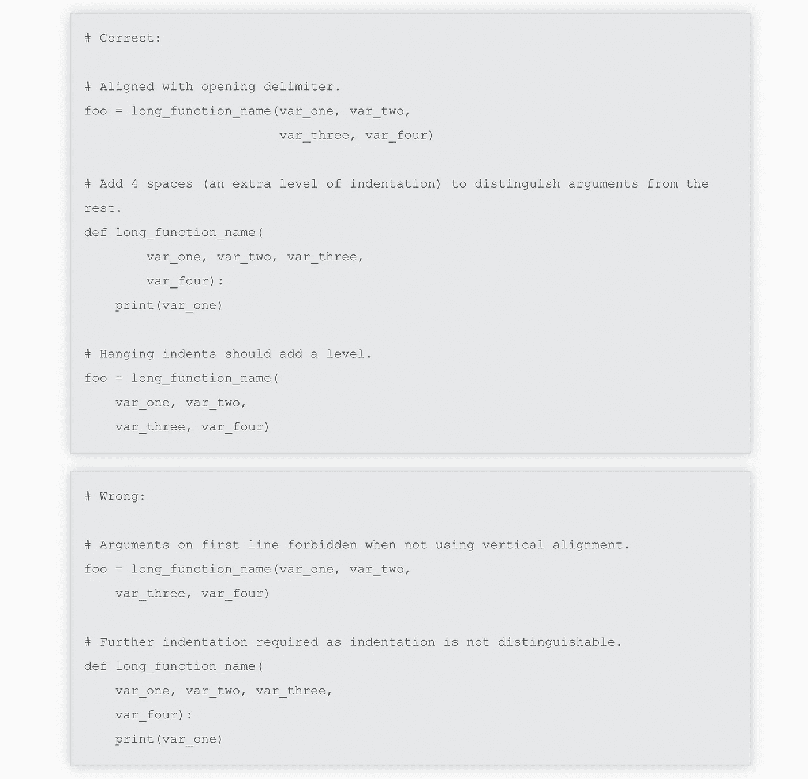

# 如何避免编写草率的 SQL

> 原文：<https://towardsdatascience.com/how-to-avoid-writing-sloppy-sql-43647a160025?source=collection_archive---------12----------------------->

照片由[阿毛里·古铁雷斯](https://unsplash.com/@amaury_guti?utm_source=unsplash&utm_medium=referral&utm_content=creditCopyText)在 [Unsplash](https://unsplash.com/s/photos/sloppy?utm_source=unsplash&utm_medium=referral&utm_content=creditCopyText) 上拍摄

## 更好的 SQL

## 让您的 SQL 代码更易读、更容易理解

SQL 简单易懂，易于使用。从查询中很容易得到正确的结果。然而，阅读其他人正确运行的查询并不容易。SQL 并不强制要求编写查询的全局格式标准(就像 Python 中的`PEP8`)。有类似于 [SQL 风格指南](https://www.sqlstyle.guide)的倡议，但是它没有广泛的追随者。因此，很难让人们以某种方式写作。此外，大多数 SQL IDEs 也不支持同样的查询美化。

> 任何傻瓜都能写出计算机能理解的代码。优秀的程序员编写人类能够理解的代码——马丁·福勒

然后，这就变成了一个需要通过自律来解决的问题。如何确保他们编写的 SQL 代码容易被其他人阅读和理解？有一些简单的步骤可以遵循。最重要的是，遵循一个风格指南会让一切变得简单得多。想想这个—

# 遵循风格指南

从一开始，Python 就倾向于简单易读。缩进的原理本身很好地解决了可读性问题。SQL 从一开始就没有任何可以强制执行的标准。让我们回头再来讨论这个问题。现在，请看这个例子，它演示了如何使用`PEP8`标准在 Python 中正确缩进

摘自吉多·范·罗苏姆的 [PEP8 页](https://www.python.org/dev/peps/pep-0008/)

我遇到的最著名和最有用的风格指南是 Simon Holywell 的 SQL 风格指南。没有必要重复本风格指南中的内容，但值得强调的是，命名约定、别名和缩进大大有助于使代码更易于阅读和理解。这是风格指南的摘录—

摘自 Simon Holywell 的 [SQL 风格指南](https://www.sqlstyle.guide)

看，风格指南说的是最简单的事情。关注这些最简单的事情的每一点努力都会使你的代码更加整洁。

# 错认假频伪信号

SQL 是关于连接、表、cte 等等的。在一个数据库中，在给定的时间有如此多的对象。当编写一个查询时，我们确实需要访问很多这样的查询。有时候，说实话，太多了。如果发生这种情况，应该有一种访问这些数据库对象的简单方法。

在组织内部，这种简写应该很容易识别。例如，如果有一个名为`delivery_packages`的表，那么它的别名应该是`dp`。根据经验，对于 snake case 表名中的每个单词，只取表名的第一个字母。`order_feedback_comments`的别名应为`ofc`。确保这些表的别名也不要太短。确保它们有一定的意义。查看[这篇文章](https://sqlblog.org/2009/10/08/bad-habits-to-kick-using-table-aliases-like-a-b-c-or-t1-t2-t3)。

# 注释您的 SQL 代码

如果查询有很多行，将其分成 cte 或子查询，或者创建临时中间表。如果您不希望这样做，无论哪种方式，请确保以易于阅读和理解的方式注释您的 SQL 代码，并用尽可能少的词语解释您正在使用查询做什么。警告、问题、性能相关的东西——所有其他的都应该详细注释。

> 如果你的代码易于阅读，它就易于重用

如果没有适当的注释，通读千行查询可能并且应该是困难的。尽量不要让它变得困难。评论评论好。遵循一个风格指南。

# 小心子查询

最后，作为一般的经验法则，如果可能的话，将子查询保持在最少——不仅仅是因为性能原因。复杂的多级子查询可能会很快完成工作，但越来越难以维护。如果您的数据库支持 cte，请尽可能使用它们，而不是使用子查询。如果查询变得太复杂并且有太多的子查询，那么创建临时表(可能在内存中)，然后从那里开始。

> 聪明的程序员和专业的程序员的一个区别是，专业的程序员明白清晰才是王道。专业人士善用他们的能力，写别人能理解的代码——罗伯特·马丁

[避免马虎。写出更好的 SQL](https://linktr.ee/kovid) 。

*专业的大声喊出来给 Vicky Boykis 作* [*写关于这个*](http://veekaybee.github.io/2015/06/02/good-sql/) *的方式早在 2015 年和 Simon Holywell 作准备的* [*SQL 风格指南*](https://www.sqlstyle.guide) *。*