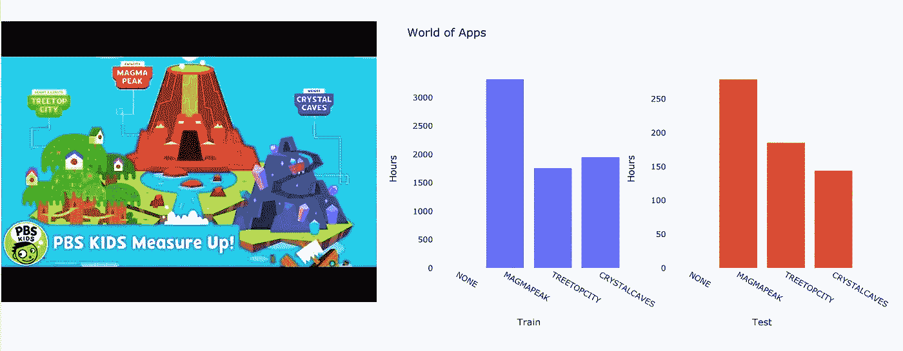
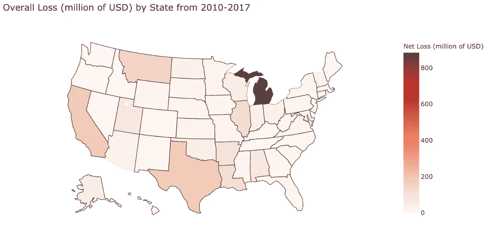

# 如何成为 2020 年的数据科学家

> 原文：<https://towardsdatascience.com/how-to-be-a-data-scientist-in-2020-9bc3cf4ff007?source=collection_archive---------44----------------------->

## 理解机器学习项目的生命周期并揭示成功项目的标准。

[来源](https://unsplash.com/s/photos/leader?utm_source=medium&utm_medium=referral)

数据科学团队是每个大公司的核心。一个成功的数据科学家需要成为业务战略的负责人，能够通过数据做出发现和愿景，能够通过沟通和可视化说服利益相关者。然而，如今的数据量呈指数级增长，这使得数据科学工作变得更加复杂。每个公司都开始理解数据的重要性，并尽可能多地收集数据。数据大小从几千兆字节增加到几千兆字节。云存储和计算变得更加流行。最终用户组织正在采用云存储解决方案作为主要存储选项。因此，2020 年的数据科学家需要具备大数据知识以及与之相关的工具。在这篇博客中，我将从 AWS 的角度介绍机器学习项目的生命周期。看完这个，我们就明白成为 2020 数据科学家需要什么了。

机器学习项目生命周期。资料来源:Huy Bui

# I)检测问题

创建机器学习项目最重要的一步是检测业务问题。很多情况下，数据科学家迷失在数据中，浪费时间与大数据争论，解决一个对业务没有显著改善的非常困难的问题，甚至完成一个项目，感觉好像有人以前做过一样。每个数据科学项目都需要仔细规划。没有计划就是计划失败。了解业务环境和可能采取的业务行动将为数据科学家节省大量时间，并为您的公司节省大量资金。这对于参加商务会议、与高管员工聊天以及始终站在利益相关者的角度来看都很重要。

# II)数据收集

在弄清楚问题之后，数据科学家需要获得数据并适当地组织数据。数据收集可以在内部或外部进行。大多数结构化数据存储在关系数据库中。所以，学习 SQL 是必不可少的。SQL 可能很古老，但却无处不在。你甚至可以在 FAANG 公司或者非技术行业的高性能数据库系统中看到 SQL。

生产中的机器学习算法需要经常调整。因此，数据科学家需要找到一种高效的方法来处理大量数据，并自动化这一过程。**批处理**和**实时处理**是这方面的两个重要概念。它有助于以批处理(每日更新)或实时内容的方式向数据仓库交付数据输入。数据科学团队的一个职能是监控开发模型。因此，想要处理流数据的数据科学家需要熟悉 Spark 或 Hadoop 等大数据工具。

Spark 最初发布于 2014 年 5 月 26 日。[来源](https://en.wikipedia.org/wiki/Apache_Spark)

当从外部收集数据时，需要不断地重新评估数据集的相关性和可信度。没有确定最佳数据源的公式。这更像是探索未知的旅程，是数据科学过程中最有趣的部分。下面是我做的几个项目中的几个例子，来说明迷人的数据是如何引导我们的。

**场景 1** :一家非营利公司想了解孩子们如何学习实施他们的在线课程。从 PBS Kids Measure Up 等基于游戏的学习应用程序中收集数据！可能是个好主意。分析玩家的线性学习路径、他们对每个科目的专注程度以及他们在不同评估中的表现有助于改进教学方法。

孩子们倾向于选择位于屏幕中央的图像。资料来源: [Huy Bui](https://github.com/williamhuybui/Predicting-Kids-Learning-Outcome-Through-PBSKidsMeasureUp-app-Flatiron-School-Capstone-Project)

**场景 2** :一位石油和天然气客户希望了解机器学习如何帮助他们的石油和天然气公司。检测美国管道事故，并向他们展示 ML 如何防止设备故障，将激励客户投资该项目。

每个州的净损失都是由与石油相关的灾难造成的。来源: [Huy Bui](/rolling-in-the-deep-589f3460960f)

同样值得了解的是，数百万个数据点是如何存储的，以及我们如何安全地维护它们。亚马逊 S3 是目前最受欢迎的云服务。亚马逊 S3 将数据存储在多个位置，以便在事故发生时提供备份。出于安全目的，亚马逊 S3 可以定制不同级别的访问权限。您还可以控制日志历史记录、定义警报和自动化工作流，而无需管理额外的基础架构。最棒的是亚马逊 S3 连接了许多其他最先进的机器学习工具，与其他编程语言高度可比。

# III)评估指标

我们如何知道我们的策略是否有效？数据科学家需要考虑两个指标:

## 机器学习指标:

当想到指标时，我们通常会想到准确性、MSE、F1、kappa Cohen……然而，在这篇文章中，我将强调具有更多商业意义的指标。成本和精度的权衡。例如:

在二进制分类问题中，如果我们想预测设备故障，假设错误分类负面样本(不知道故障设备)的成本是错误分类正面样本(派技术人员检查状况良好的设备)的三倍以上，哪个模型的成本最低，召回率至少为 60%？

要回答这个问题，我们需要使用混淆矩阵，计算什么是假阳性和假阴性的阈值。通过与领域专家的交流了解每个错误预测的成本在利用机器学习方面发挥着重要作用。

## 2.业务指标。

**KPI**代表**关键绩效指标**。KPI 应该对每一个业务层面都是全面的，并且在任何项目的初始阶段之前就已经预先定义好了。一些关键绩效指标可能包括:提高客户满意度超过 7/10 或减少 20%的劳动力成本。选择正确的 KPI 依赖于对组织的重要性的良好理解。有很多不同的 KPI，但是我们需要知道的两个 KPI:**业务流程(BP)KPI**和**数据科学(DS)KPI**。为数据科学项目制定指标的流程通常首先从 BP KPIs 开始，然后转化为 DS KPIs。例如，如果 BP KPI 是将垃圾邮件的投诉减少一半，那么当转换为 DS KPI 时，我们的目标是将误报率降低到 x%。

理解项目的目标对于项目经理和数据科学家来说都很重要。数据科学项目不成功的标志是问题太广泛，无法解决，无助于业务，或者需要很长时间才能完成。需要有一个标准的程序来决定成功与否。一个流行的 KPI 标准是 **SMART。**这种型号被许多不同的行业广泛使用

你也可以在这里阅读关于[敏捷方法](https://www.wrike.com/project-management-guide/project-management-basics/)的内容，它解释了关于项目管理的更多细节。

# III)算法选择

这是流程中最“数据科学”的部分。有两个主要步骤值得一提:**数据探索**和**机器学习**。

数据探索包括描述性统计、可视化和回答分析数据时出现的一系列逻辑问题。数据科学家不应该低估简单性。这一步中的许多商业洞察和发现，往往比应用机器学习有更多的好处。数据探索揭示隐藏的特征，并为特征工程打开新的思路。发现的一个例子是沃尔玛在假日周的需求分布:

资料来源:Huy Bui

数据被水平标准化。前三个节日有着相同的特点。消费者在超级碗、母亲节、父亲节前**消费很多。相比之下，消费者在新年和万圣节后花费更多的 T2。最后，平安夜**没有销售**，因为所有沃尔玛商店都关门了。**

下一步是选择正确的机器学习算法。一般来说，您选择的算法需要满足 DS KPI，并且是可解释的。

**选择合适的算法**:在本地大数据上训练多个算法并不容易。然而，云计算使这项任务变得非常容易。AWS 的 SageMaker Auto Pilot 是这项任务的主要工具之一。SageMaker Autopilot 自动检查原始数据，应用功能处理器，挑选最佳算法集，训练和调整多个模型，跟踪它们的性能，然后根据性能对模型进行排名，所有这些都只需几次点击。2020 年的数据科学家需要适应新技术，SageMaker 自动驾驶仪是你应该放在工具箱里的东西。

**可解释性**:在拥有了非常复杂的算法和高准确率之后，下一步就是通过用人类语言向项目经理解释你的机器学习算法来打动他们。数据科学家需要学习如何说服决定他们项目生命的人。理解利益相关者想要看到什么的一个方法是想象如果你是他们，你会问什么问题。想象一下，有人跟你说要买房子。他们会说什么来说服你？如果这个人能解释所有的因素，如房间数量、建造年份、位置、到最近超市的距离……并告诉你这些因素如何影响决策，这足以说服你吗？。在让机器学习变得可以理解的过程中，**特性重要性**是关键。展示机器学习模型如何为一个特征分配不同的权重，将使观众了解“黑盒”背后发生了什么。Parul Pandey[提到了三个重要因素来为 ML 模型带来透明度:](/interpretable-machine-learning-1dec0f2f3e6b)

*   最重要的特征是什么？
*   每个特征如何与单个预测相关联？
*   每个特征如何与多个预测相关联？

# IV)部署模型

当模型满足 KPI 标准时，数据科学家需要将其投入生产。因为各种不可预见的因素会对结果产生负面影响，所以总是比较 ML 模型和 KPI 是必要的。该模型需要定期调整，以适应数据特征的变化。有时，灾难(如冠状病毒)可能会完全改变趋势，你必须重新训练模型，甚至重复整个过程。AWS 提供了一项服务，我们可以监控性能，并在预测指标低于指定阈值时向您发送警报。

# 结论

数据科学中有许多主题，数据科学家只需要了解其中的几个。但是，市场是竞争的，需要适应性。理解技术的趋势并应用它们是对你的项目负责的好方法，有助于你在人群中脱颖而出。综上所述，有三件事我建议看一看:

*   业务 KPI 或[敏捷方法](https://www.wrike.com/project-management-guide/agile-methodology-basics/)
*   [火花](https://spark.apache.org/)
*   [AWS 贤者制造者](https://aws.amazon.com/sagemaker/)和自动驾驶仪

感谢您的阅读！