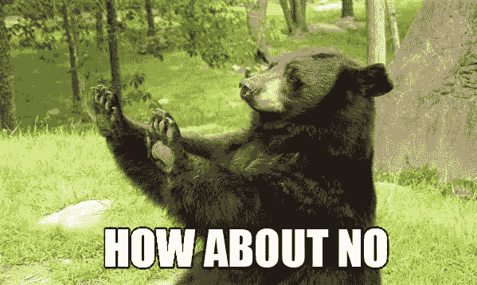

# 如何做一个 AI 傻逼

> 原文：<https://towardsdatascience.com/how-to-be-an-ai-idiot-8559c65d91a8?source=collection_archive---------10----------------------->

## 7 种严重破坏你的机器学习项目的方法

上周，你和[憨豆先生一起经历了他的冒险](http://bit.ly/quaesita_mrbean)，完成了基本的训练、验证和测试。从[的那个例子](http://bit.ly/quaesita_mrbean)中很自然地可以得出一些如何(不)成为 AI 白痴的规则，但让我明确地为你拼写出来。(如果它们听起来似曾相识，请节哀顺变。)

图片:[来源](https://tenor.com/view/mr-bean-rowan-atkinson-funny-nose-tissue-in-the-nose-gif-15564255)。

# 故事到此为止

在上一集里，你扮演了憨豆先生耐心教授的角色。既然你越来越擅长，那就让你坚持下去吧。我经常说避免应用人工智能中最大陷阱的最好方法是永远不要忘记学习和教学的基础，所以我私下希望你永远保持憨豆先生教授的心态。

> 永远不要忘记学习和教学的基础！

三个阶段的快速提醒(在[上一篇文章](http://bit.ly/quaesita_mrbean)中有更详细的解释):

*   **训练阶段:**憨豆先生(你心爱的 AI 系统的占位符)在课堂上看到的例子中寻找模式，然后把这些模式变成模型(菜谱)。
*   **验证阶段:**看看憨豆先生的食谱在他没有明确研究的例子上表现如何。如果分数看起来不错，他就去考试，否则就重新开始训练阶段。
*   **考试阶段:**憨豆先生参加期末考试，学习是否允许去生产或者转专业。

训练阶段相当简单——你把例子塞给学生(把[数据](http://bit.ly/quaesita_hist)塞给机器学习[算法](http://bit.ly/quaesita_emperor))，并且大多抱着最好的希望(我只是半开玩笑)。点击了解更多关于它如何工作的信息[。](http://bit.ly/quaesita_emperor)

在我们列出成为人工智能白痴的方法之前，让我们从你尊敬的教授的角度谈谈更微妙的阶段——验证和测试。

# 验证和测试之间的细微差别

如果你所关心的只是让不值得的学生不及格，你就不需要验证阶段。你需要的只是测试。可怜的憨豆先生训练，发现一个模式([这是一个愚蠢的模式](http://bit.ly/quaesita_mrbean))，冲向你的考试，考试失败，被数学专业开除。你抓住并处决了一个无知的人。干得好！

> 测试是关于守门的。只有有价值的人才能通过！测试让你免于发布糟糕的原型。

一个好老师帮助学生进步。图片:[来源](https://www.gannett-cdn.com/presto/2019/07/09/USAT/95f3e51a-46d4-467c-9698-b8485e0a62c1-GettyImages-1005285232.jpg?crop=2120,1193,x1,y0&width=2120&height=1193&format=pjpg&auto=webp)。

但是你想帮助学生进步的愿望呢？你帮助他们变得更好的承诺呢？他们救赎和自我提升的机会在哪里？验证，那就是。

> 验证是关于救赎的。这是一个掸去灰尘再试一次的机会。验证允许你迭代出更好的原型。

如果你真的关心你的学生，当你发现他们对某个食谱的尝试是愚蠢的，但已经为时太晚，无法帮助他们时，你会感到难过。(关于期末考试本身。)你是什么，老师还是刽子手？

> 你是什么人，老师还是刽子手？

如果你的最终目标是培养合格有效的学生，你会希望提供练习题(来自验证数据集)来帮助你的学生在面对教授断头台之前提高。

# 如何不做 AI 傻逼

虽然人工智能项目的领导者可能有理由不知道他们的工程师和数据科学家处理的数学本质，但没有理由忘记学习和教学的基础。如果你曾经考虑过设置一个考试，你已经有了防止一些主要流程出错所需的大多数常识工具。这里有几个例子。

图片:[来源](https://i.kym-cdn.com/photos/images/newsfeed/000/129/577/How+About+No.jpg)。

## 永远不要忘记人工智能就是用例子来解释

如果你的例子不好，你应该感到难过。如果你不给学生足够多的高质量的例子来学习，你怎么能指望他们有效地学习呢？哦，如果你给你的学生[有偏见的例子](http://bit.ly/quaesita_aibias)，你会得到一个有偏见的学生。那是你的错，教授。

## 不要根据测试数据进行训练

那种考试如果靠死记硬背就能通过，对你没什么好处。机器学习是为了在新的例子上取得成功——如果你只关心在旧的东西上表现良好，那么跳过 ML/AI 的头痛问题，使用查找表。为了保证你评估的是正确的事情(对新数据的表现)而不是记忆旧数据的能力，确保你的学生没有机会学习(呃，记忆)你的任何测试示例。

永远不要把培训或验证数据放在期末考试上，这只会降低你正确测试学生的能力。(哦，我有没有提到电脑是有史以来最好的记忆者？)

## 永远不要混淆你的数据集

如果你没有在开始之前仔细管理和拆分你的数据*，你将如何防止上述问题？[数据分割](http://bit.ly/quaesita_sydd)是最好的数据科学快速解决方案。在开始教学生之前，请确保将测试示例锁在一个安全的地方。*

## 在你设定考试标准之前，永远不要测试你的学生

即将面对 palm？停下你的手！虽然这一点似乎太明显而不值得一提，但你会惊讶地发现，领导力薄弱的真实项目团队经常进行测试，然后在测试后改变目标，因此无论如何，他们学生的分数最终都足够好。不要这样。(点击了解更多[。)](http://bit.ly/quaesita_dmguide)

## 永远不要重用测试数据

如果你忍不住对那些挑剔的统计学家们不屑一顾，他们坚持认为你不能使用一个测试数据集超过一次，让我们试着用不同的方式来说:“如果你给同一个学生两次相同的期末考试，不要相信他们第二次的表现。”考题不要重复使用！

## 永远不要跳过测试

测试将你从灾难中拯救出来。这是你对批准有毒原型的保护。如果你真的不在乎它(例如，如果你正在制作艺术作品)，鼓起勇气把你的最低要求性能指标设为-inf。没有吗？好的，[那就好好测试一下](http://bit.ly/quaesita_donttrust)。

## 永远不要太相信自己

还有一个薄弱环节:你，教授。如果你没有意识到自己考得不好怎么办？它可能发生在我们当中最好的人身上。确保建立一些安全网，以防万一，让这个世界远离你刚毕业的学生。

# 如何做一个 AI 傻逼

当团队缺乏熟练的人工智能领导时，或者当他们过于沉迷于工程的本质时，他们的常识可能会被抛弃。他们可能看不到基本的东西，最终发布了非常糟糕的解决方案。我在现实生活中看到的几乎每一个令人讨厌的人工智能灾难都可以追溯到上面列表中的一个项目，所以如果你在寻找人工智能傻瓜帽，我给了你一个不错的错误列表供你选择，请自便！

但是如果你更喜欢构建好的、有用的、有效的人工智能解决方案，那么就要时刻记住教授的观点。挪过去，机器学习……是时候考虑机器教学了！

# 感谢阅读！人工智能课程怎么样？

如果你在这里玩得开心，并且你正在寻找一个为初学者和专家设计的有趣的应用人工智能课程，这里有一个我为你制作的娱乐课程:

在这里欣赏整个课程播放列表:[bit.ly/machinefriend](http://bit.ly/machinefriend)