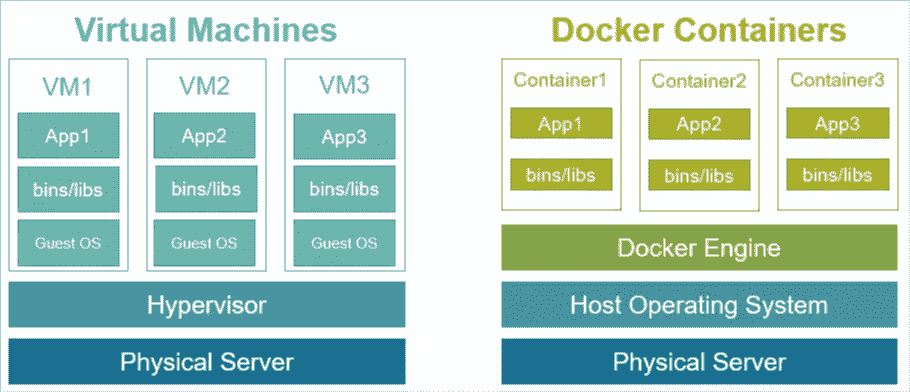
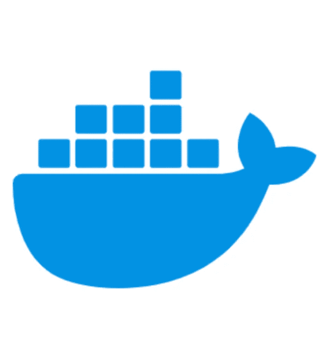

# 作为一名数据科学家，如何应对 Docker 的危险

> 原文：<https://towardsdatascience.com/how-to-be-dangerous-with-docker-as-a-data-scientist-b9cf7153a206?source=collection_archive---------40----------------------->

## 您需要了解的术语、语法和 CLI 命令将您的项目提升到一个新的水平


来源:[https://www . docker . com/sites/default/files/D8/2019-07/horizontal-logo-monochronous-white . png](https://www.docker.com/sites/default/files/d8/2019-07/horizontal-logo-monochromatic-white.png)

Docker 将允许您打包并在任何地方部署您的数据科学解决方案(通常迁移到云中)。它可能是数据科学工具 bet 中的一个重要工具，可以将数据科学工作从理论和研究转变为实践，并为您的业务增值。

# Docker 是什么？

点击[这里](https://en.wikipedia.org/wiki/Docker_(software))查看来自维基百科的无聊的正式定义。然后继续我下面的描述。

> Docker 可以让你捆绑你的代码在一个完全可复制的环境中运行所需的一切，这个环境很容易带到其他机器上*(比如在云中运行)*。Docker *(以及像 Kubernetes 这样的容器管理系统)*将这些包相互隔离。这带来了额外的可靠性和安全性，因为如果我的代码被黑客攻击或崩溃，它不会影响你的代码。

那么 Docker 像虚拟机吗？

**是的，有点**。在互联网上了解 docker 很多的人会告诉你*它实际上不像一个虚拟机*因为一些令人困惑的计算机术语。然而，这是一个有用的类比。您可以在同一台电脑上运行多个不同的、完全隔离的应用程序。有了虚拟机，每个新应用程序都有了完整的操作系统；而 docker 只带你需要的东西。这是它轻量级、可伸缩、甚至更安全的原因。



Docker 和虚拟机之间的架构差异

# 开始时你需要知道的

*   术语
*   流行的 Dockerfile 文件步骤
*   常见 CLI 命令

# 术语

**Dockerfile**
这只是一个文本文件，包含了构建 docker 映像的具体说明。使用该文件的一些常见操作包括:指定基本映像、复制所需文件、定义环境变量、安装第三方包，以及编写从该映像启动容器时将运行的默认命令。

**图像**
从 Dockerfiles 创建一个图像*，并用于*创建 Docker 容器*。图像一般存储在 Dockerhub ( [public](https://hub.docker.com/) )、Elastic Container Registry([AWS](https://aws.amazon.com/ecr/))和 Artifactory ( [other](https://cglcloud.jfrog.io/cglcloud/webapp/#/home) )这样的存储库中。*

容器这是实际完成工作的地方。创建新容器将运行您的代码。一些 docker 容器被构建为运行一段时间&之后关闭(如培训作业或数据处理作业)；其他的已经启动并永远保持运行(像 web 服务、API 端点、web 应用仪表板)。

> 如果你熟悉面向对象编程，那么“图像”就像一个类定义，而“容器”则是那个类的一个实例。一旦你有了一个类定义，你可以创建任意多的类实例。

**注册表**
想到一个 GitHub 的储存库，但是对于 Docker 图片。您可以在本地使用 docker 文件来创建图像。一旦你完成了这些图像的开发，你可以把它们推到一个注册中心，在那里它们将启动容器，或者其他人可以把它作为他们项目的基础图像。

这是每当从映像启动容器时运行的 CLI 命令。它通常由 docker 文件末尾的`ENTRYPOINT`或`CMD`步骤指定，或者从基本映像继承。您希望该命令启动完成任务所需的任何脚本或代码。([阅读更多](https://goinbigdata.com/docker-run-vs-cmd-vs-entrypoint/))

**标签**
这是一种给图片版本命名的方式。这有助于跟踪一段时间内图像的版本历史(类似于 git 标签如何提交)；或者只是用一个简单的名称来引用该图像。([阅读更多](https://www.freecodecamp.org/news/an-introduction-to-docker-tags-9b5395636c2a/))

**基础映像**
这是 docker 映像的起点，通常在 docker 文件的`FROM`语句中定义。几乎所有的东西都有一个基础图像。任何映像都可以是另一个映像的基础映像，只要它可以从注册表中访问。最基本的基础映像只是一个操作系统。

*一些可能有用的基础图像*:

*   [R 闪亮带潮](https://hub.docker.com/r/rocker/shiny-verse/dockerfile)
*   [带 Conda 的蟒蛇皮](https://hub.docker.com/r/continuumio/miniconda/)
*   [阿尔卑斯山](https://hub.docker.com/_/alpine)
*   [AWS Lambda](https://hub.docker.com/r/lambci/lambda/)
*   [Debian Linux](https://hub.docker.com/_/debian)

# 流行的 Dockerfile 文件步骤

`FROM`
这个命令在每个 Dockerfile 文件中都有。它定义了您将要构建的基础映像。您必须能够访问包含基本映像的注册表。

这将把文件从你的本地机器(或者你正在构建映像的地方)复制到 docker 映像(以及随后的容器)。这些文件应该相对于当前工作目录，您将从该目录构建 docker 映像。

`ENV`
这个为你的 docker 容器设置 OS 环境变量 **注意:用这个代替* `*RUN export*`。([下面是为什么](https://stackoverflow.com/questions/33379393/docker-env-vs-run-export))

`RUN`
这将运行 OS CLI 命令。通常，这样做是为了编辑基本文件系统或安装第三方软件包。

`WORKDIR`
设置执行入口点或 CMD 的起始目录。

`ARG`
允许您通过`docker build`命令将参数传递到 docker 文件中。

`EXPOSE`
这公开了一个端口，世界可以通过运行容器的机器访问这个端口。如果您有一个 web 应用程序、仪表板或 API 端点，那么您需要公开一个端口。很多时候这已经由你的基本形象来完成了。

`ENTRYPOINT`或`CMD`
新容器启动时将运行的 CLI 命令。这应该调用您希望 docker 容器做的所有其他事情。

ENTRYPOINT 和 CMD 的区别在于 CMD 可以被覆盖，而 ENTRYPOINT 不能被覆盖。([阅读更多](https://goinbigdata.com/docker-run-vs-cmd-vs-entrypoint/))

无论如何 ENTRYPOINT 都会运行。CMD 既可以单独运行，也可以用于向 ENTRYPOINT 添加额外的参数。CMD 将指定一些缺省值，在容器启动时运行，但是该参数或命令可以通过`docker run`覆盖。

# 常见 CLI 命令

## Docker 构建命令

最简单的版本就是在当前目录下构建 docker file:
`docker build .`

接下来你可能想做的是添加一个标签(注册表&版本名):
`docker build -t localRegistryName:TagName .`

然后，您可能想用`ARG`将一些参数传递到 docker 文件中:

```
docker build \
    -t localRegistryName:TagName \
    --build-arg DEPLOY_ENV=dev \
    .
```

复杂应用程序的另一个选择是，您可能将 docker 文件隐藏在一个文件夹中，或者想要从父目录中复制一些文件。您可以指定`-f`作为 docker 文件的路径。

```
docker build \
    -t localRegistryName:TagName \
    --build-arg DEPLOY_ENV=dev \
    -f path/to/the/Dockerfile \
    .
```

## Docker 运行命令

从映像运行容器的最简单方法:
`docker run localRegistryName:TagName`

**端口映射** 

*注意:第一个 PORTNUM 是您想要映射到的本地机器上的端口，第二个 PORTNUM 是您想要查看的来自 docker 容器的公开端口。端口号可以不同，但这只会使事情变得混乱。*

用 Bash
调试另一件你可能想做的事情是用 CLI 探索你的容器。您可以这样做来检查诸如:*我的代码文件被正确复制了吗？环境变量定义正确吗？*
`docker run -it localRegistryName:TagName /bin/bash`

注意:要实现这一点，有几件事必须是真的。1)您的映像需要安装 bash。所以这不能在 windows 容器上工作。2)你需要用 CMD 代替 ENTRYPOINT。 `*/bin/bash*` *用于在 docker 容器启动时覆盖 CMD。入口点仍然会运行并阻止您运行 bash 的尝试。*

## 多方面的

您可以使用
`docker image ls`
`docker container ls`轻松列出您当前的所有图像或正在运行的容器

您可能忘记标记图像，或者您只想添加另一个标记。您可以通过引用其他标签或其图像 ID 将标签添加到图像中。*(可以通过列出所有图像找到图像 ID)*

`docker tag OldRegistry:OldTag NewRegistry:NewTag`或
或`docker tag b25r13lkj89 NewRegistry:NewTag`

您可以通过
`docker stop ContainerName`或`docker kill ContainerName`停止当前正在运行的集装箱

**清理你的系统**
有不同的方法可以删除旧图像来清理你的工作空间。

`docker rmi RegistryName:TagName`将删除 1 幅图像
`docker system prune`将删除所有未标记的图像&不与运行中的容器关联
`docker system prune -a`将删除所有内容

# 结论

对于许多数据科学家来说，Docker 有一条陡峭的学习曲线，但是一旦你越过了这条曲线，你就会极大地提高你的工作生产能力。

感谢阅读！
*如果有任何我需要补充或修改的地方，请在评论中告诉我，欢迎反馈！*

