# 如何用 Python 花式

> 原文：<https://towardsdatascience.com/how-to-be-fancy-with-python-8e4c53f47789?source=collection_archive---------3----------------------->

Python 很酷。真的很酷。然而，我们中的许多人都是从不同的编程语言开始的，尽管我们很容易就学会了 Python，但我们仍然不擅长 Python 的做事方式。这篇文章介绍了我这些年来学到的一些技巧和实际例子。希望你喜欢它。

## 更新(2020 年 6 月 25 日):

最新的技巧在 [Github](https://github.com/dipam7/Fancy-python) 上。启动存储库，与他们保持联系。你也可以在 LinkedIn 上关注我的标签。

## -1.有用的键盘快捷键

缩进代码`Press Tab.`

取消代码`Press Shift + Tab.`

要注释或取消注释一堆代码，选择它并为 Mac 选择`Press Contrl + / or Command + /`。

要给某物加上引号，选择它，然后`Press Shift + ' or Shift + ".`

## 0.活力

Zip 可以用来一起遍历两个列表。

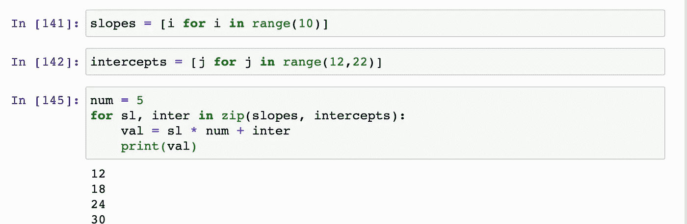

## 1.列出理解

Python 最棒的地方在于，你可以用如此少的代码完成如此多的工作。以列表理解为例。如果您想创建某个范围内的数字列表，您可以按如下方式轻松完成:

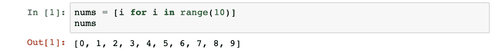

您还可以非常容易地对其应用条件。

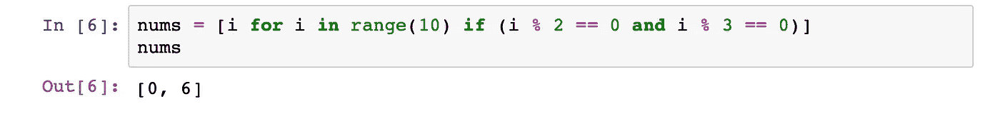

**实际例子:**

列表理解的一个非常酷的用例是将一个数字转换成它的单个数字。诀窍是将数字转换为字符串，迭代单个字符，将它们转换为 int 并存储在一个列表中。我们可以遵循所有的步骤

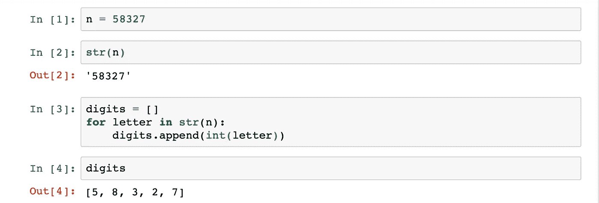

或者一起做

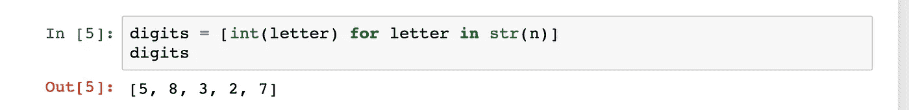

这也让我想起了 ***map()*** 的功能。

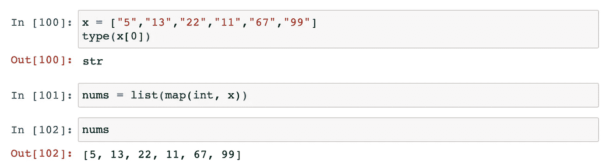

## 2.使用*运算符

*运算符可用于重复字符串。举个例子，

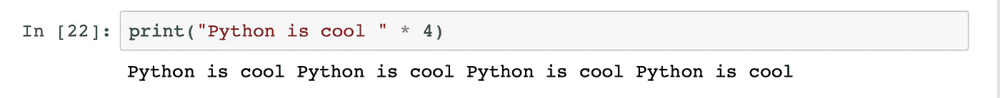

现在你可能不想打印很多次“Python 很酷”,但是你应该用它来做这样的事情

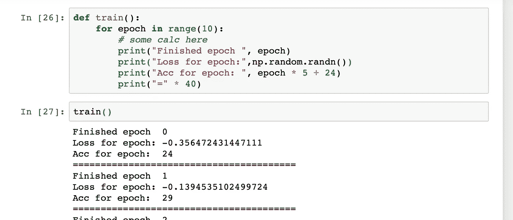

*操作符也可以用来解包列表之类的可重复项。

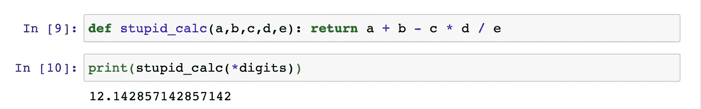

你也可以做一些像

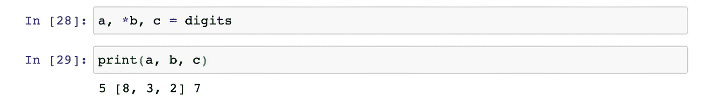

当我们有一个事先不知道参数个数的函数时，通常使用这个操作符。我们将它与*args 和**kwargs 一起使用。

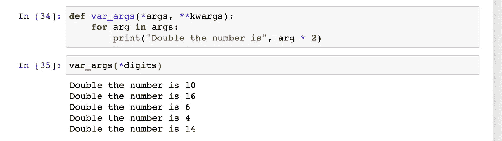

我们传递给函数的参数存储在*args 中。**kwargs 将存储命名参数或字典。

## 3.分音

您可以对函数做的其他事情是创建部分函数。它们是什么？假设我们有一个计算单利的函数。我们可以为一些参数设置默认值(从右到左)。

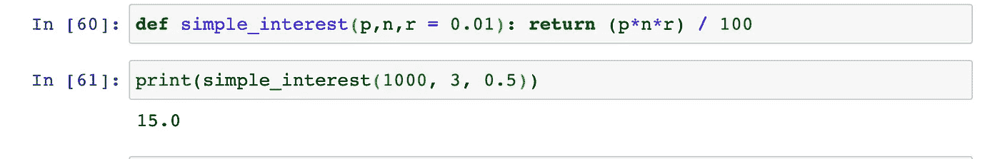

但是，我们不能以这种方式**仅设置 **p** 的默认值。**

我们可以使用部分函数来实现。在部分函数中，我们从左到右为一些参数设置默认值，然后将其用作函数。让我们只为 ***p*** 设置一个默认值。

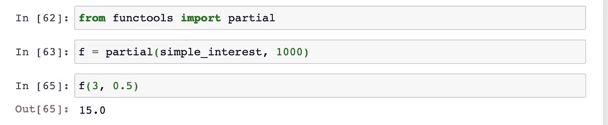

尽管分部从左到右工作，我们也可以通过使用命名参数跳过中间的参数。

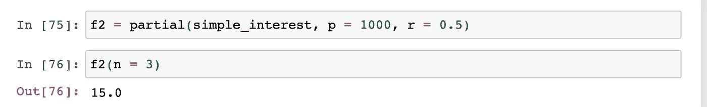

## 4.维护

测试驱动开发意味着你写测试，然后你写代码通过这些测试。您可以使用 ***断言在 Python 中编写迷你测试。*** 例如，你可能想确定某个物体的形状是你所期望的。

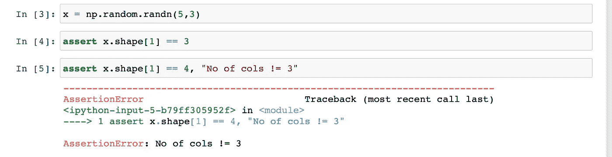

您也可以在逗号后编写自定义错误信息。编写这些小测试对于确保你的代码部分按预期工作非常有帮助。它还将帮助您高效地调试东西。

## 5.发电机

我们可以用 Python 中的 ***yield*** 关键字代替 ***return*** 关键字来创建一个生成器。使用生成器的好处是它可以即时生成东西，然后忘记它们。这样可以节省内存。

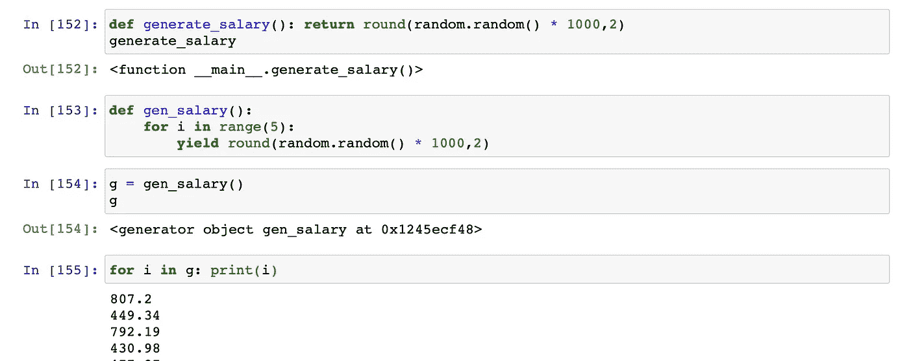

这就是本文的全部内容。这是一项正在进行的工作。当我遇到更多的东西时，我会不断地添加到 Github 库中。如果你有任何让你生活更轻松的建议，请在下面的评论区提出来，我们都会从中受益。

~快乐学习。