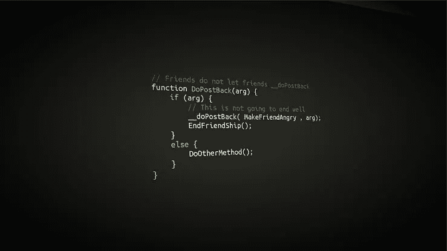
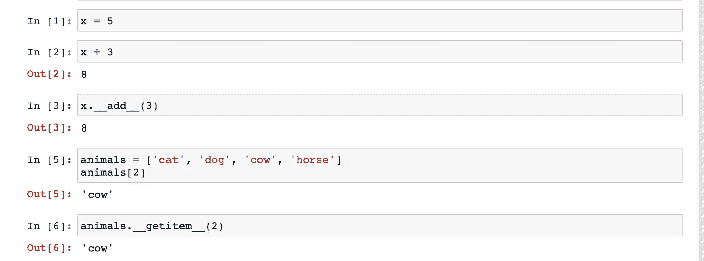
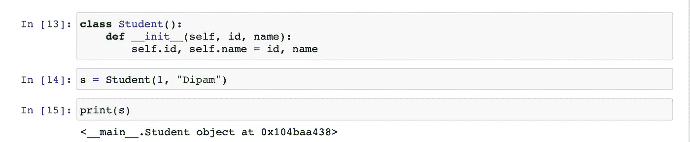
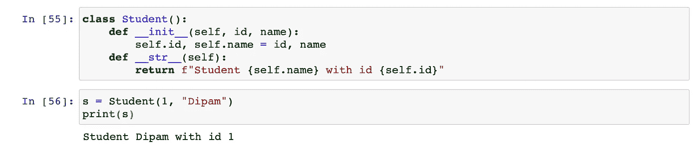
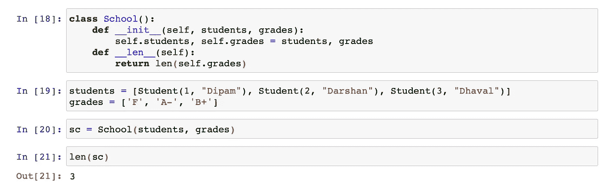
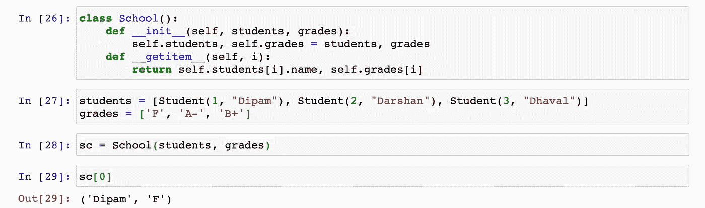
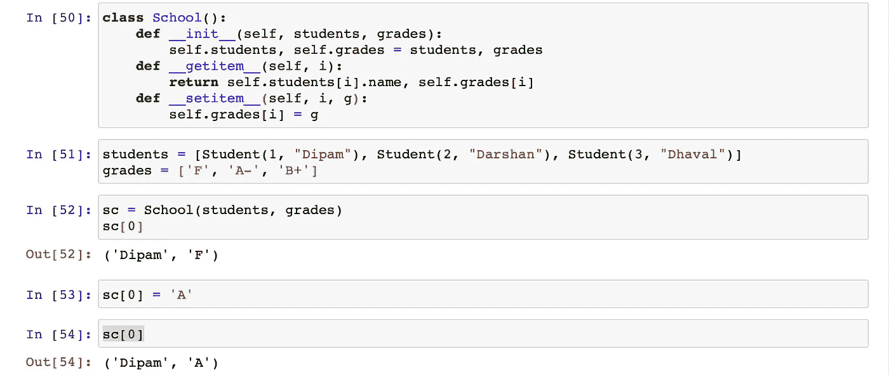
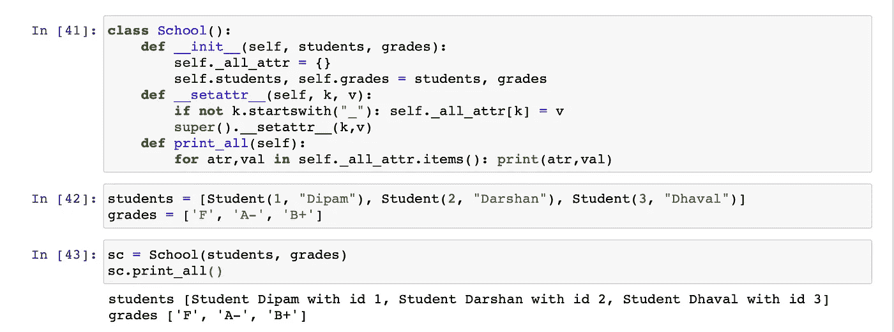
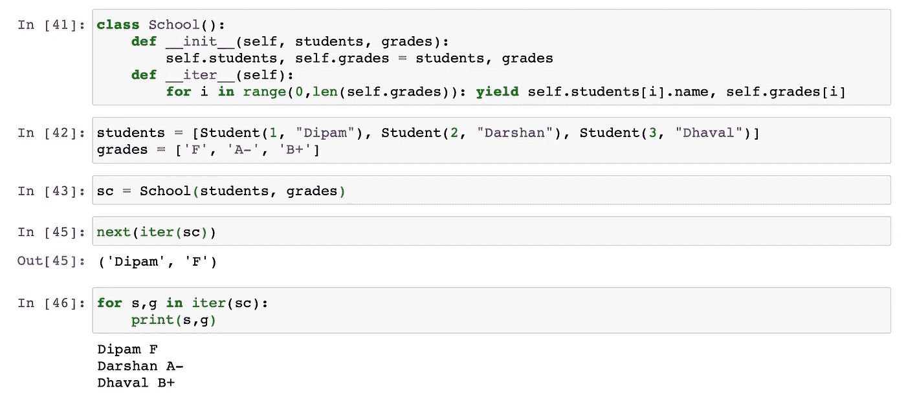
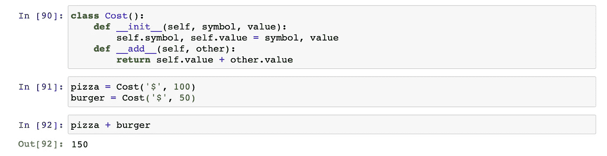

# 如何在 Python 中熟练使用 OOP

> 原文：<https://towardsdatascience.com/how-to-be-fancy-with-python-part-2-70fab0a3e492?source=collection_archive---------6----------------------->

## 本文基于 Python 中的神奇方法，通过 Python 中的 OOP 让我们的生活变得更加轻松。希望你喜欢它。

如果你不熟悉 Python 中的 OOP，我强烈推荐科里·斯查费的 YouTube 播放列表。

## 什么是魔术方法？

魔术方法是 python 中的特殊方法，以 2 个下划线开始和结束。它们也被称为 ***邓德*** 。我们在 Python 中做的很多事情都是在幕后使用 ***dunder 方法*** 完成的。看看下面的例子。

很酷，不是吗？我们将为我们的类实现这些方法，使它们更加直观。让我们看看怎么做。

## 1.__init__()

第一个神奇的方法是 init 方法。在 Python 中，它被用作类的构造函数。

## 2.__str__()

当我们创建类的对象时，我们希望能够看到它们内部的内容。我们希望我们的类有一个人类可读的表示。这就是邓德海峡的用武之地。

还有另一个方法叫做 ***__repr__()*** 可以用来返回对象的状态，但是在本文中我们将跳过它。

## 3.__len__()

现在假设我们有一个存储学生详细信息的班级学校。我们想要一种简单的方法来统计学校的学生人数。

## 4.__getitem__()

我们还希望有一种简单的方法来访问特定学生的记录…

## 5.__setitem__()

…并编辑它们

## 6.__getattr__()和 __setattr__()

当您创建一个类来获取和设置其属性时，这些方法在 Python 中自动可用。因此我们不需要定义它们。然而，如果我们想改变他们的行为，我们可以这样做。

例如，我们可以修改***_ _ setattr _ _()***的行为，以便在设置属性时将其存储在一个列表中，这样我们就可以轻松地访问所有属性。

## 7.__iter__()

我们可以使用 ***__iter__()*** 方法创建一个迭代器。然后我们可以用它一次访问一个学生。

## 8.__ 加 _ _()等数学方法

假设我们有一个名为 Cost 的类。

能够对这些物体进行数学运算是有意义的。这将使我们的代码更加直观和优雅。

## 结论:

这些是我发现非常有用的一些简单的 dunder 方法。如果你想了解更多，下面列出了一些你可以研究的方法。如果你有任何建议，请在评论中提出来，我会把它们写进文章里。

## `More methods`

*   `__new__`
*   `__del__`
*   `__enter__`
*   `__exit__`

~快乐学习。