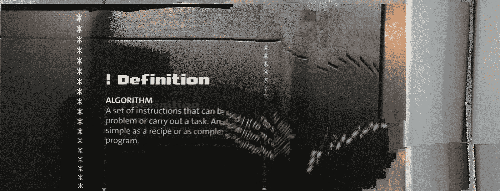

# 如何擅长算法？

> 原文：<https://towardsdatascience.com/how-to-be-good-at-algorithms-bb1dd19ab54b?source=collection_archive---------0----------------------->

## 我作为计算机科学本科生学习算法和数据结构的经历

如果你想让计算机做一件事，你必须告诉计算机怎么做。你必须编写一个计算机程序，一步一步地解释它必须完成什么任务以及应该如何完成这些任务。这就是**算法**发挥作用的地方。

> 算法是计算机用来解决给定问题以达到最终目标的一组指令。

图片来自 [Flickr](https://www.flickr.com/photos/byzantiumbooks/42712550880/) 的[比尔·史密斯](https://www.flickr.com/photos/byzantiumbooks/)

根据我的经验，学习算法对于设计和开发高效的计算机程序至关重要。在这篇文章中，我想与你分享我在本科学习算法的经历，以及它如何让我在职业生涯和学术工作中受益。

来自 [Pixabay](https://pixabay.com/?utm_source=link-attribution&utm_medium=referral&utm_campaign=image&utm_content=924920) 的 [StockSnap](https://pixabay.com/users/StockSnap-894430/?utm_source=link-attribution&utm_medium=referral&utm_campaign=image&utm_content=924920) 图片

# 初次相遇

我在中学的时候开始编程，是用 Visual Basic，制作计算器和交通灯模拟器。后来，我学习了 HTML 和 Java。那时，我开发桌面应用程序和 web 应用程序。这仅仅是编码，有时我不知道底层的逻辑。

进入大学并选择计算机科学与工程作为我的专业后，我在第二年开始学习数据结构和算法。这是一门必修课，每个人都必须上。

来自 [Pixabay](https://pixabay.com/?utm_source=link-attribution&utm_medium=referral&utm_campaign=image&utm_content=2344423) 的图片由[鲁迪和](https://pixabay.com/users/Skitterphoto-324082/?utm_source=link-attribution&utm_medium=referral&utm_campaign=image&utm_content=2344423)彼得·斯基特里安拍摄

# 从程序员到软件工程师

数据结构和算法课程是我理解计算机编程的一个转折点，它让我更像一个软件工程师而不是程序员来思考。我为什么这样说呢？让我给你举几个例子。

## 示例 1:排序算法

假设我们正在制作一个在线购物应用程序。我们希望让用户以价格递增的顺序查看项目。为此，我们必须按价格对商品进行分类。作为一名程序员新手，我会将价格添加到一个记录了价格指数的数组(或列表)中，然后简单地调用数组的内置`sort()`方法。在`sort()`方法内部实际发生了什么？我以前申请的时候不知道具体的方法。

排序算法是大学数据结构和算法课程中首先教授的基本主题之一。

*   [插入排序](https://en.wikipedia.org/wiki/Insertion_sort)
*   [选择排序](https://en.wikipedia.org/wiki/Selection_sort)
*   [快速排序](https://en.wikipedia.org/wiki/Quicksort)
*   [冒泡排序](https://en.wikipedia.org/wiki/Bubble_sort)
*   [合并排序](https://en.wikipedia.org/wiki/Merge_sort)

在了解了不同的排序算法后，我意识到并不是每种排序算法都适合每项任务。它们具有不同的时间复杂度，并且随着数据的大小而变化。最重要的是，在开发应用程序时，它们的运行时间非常重要，即使只有几秒钟。此外，我还学习了**就地排序算法**(就地排序元素)和**非就地排序算法**(排序时需要额外的空间来存储元素)。这些事情让我深入思考，在考虑时间和内存限制的同时，我应该为特定的应用程序使用什么样的排序算法。

## 示例 2:解析数学表达式

当我们在计算器或 MS Excel 等电子表格软件的单元格中输入数学表达式时，它会自动计算并返回答案。你有没有想过这个表达式是如何被求值的？我们必须开发一个电子表格软件并实现一个表达式解析器。我就是在这里了解到流行的 [**调车场算法**](https://en.wikipedia.org/wiki/Shunting-yard_algorithm) 。它利用队列来存储值，利用堆栈来存储操作符。我了解了在数据结构和算法课程中学到的队列和堆栈数据结构的实际应用，并理解了这些选择背后的逻辑。在我自己实现了调车场算法后，我为自己感到非常自豪，尽管许多实现已经可用。😃

## 示例 3:使用列表、集合和字典

每当我需要存储一堆值时，我会使用一个列表。当时，我并不关心我是否需要保持订单或允许副本；我会简单地使用一个列表。在我学习了列表、集合和字典之后，我意识到这些可以用在不同的场景中，并且使用一个比另一个更能加速我的代码。例如，如果我想检查一个值的成员资格，在集合或字典中(花费常数时间)比使用列表(花费与列表长度成比例的时间)要快得多。此外，列表允许您保留重复项，而集合不允许重复项。

图片由[皮克斯拜](https://pixabay.com/?utm_source=link-attribution&utm_medium=referral&utm_campaign=image&utm_content=1327493)的 Gerd Altmann 提供

这是我开始从程序员转变为软件工程师的一些经历。当我改用合适的数据结构或更快的算法时，我的代码性能有了显著的提高。

# 如何入门？

## 学习编程概念

在学习计算机科学中的算法之前，我对编程概念有很好的理解，比如变量、函数、类，尤其是面向对象编程(OOP)的概念。这些概念是理解计算机科学中更高级概念的基础。

## 学习和理解算法及其概念

除了我的课程材料，我还遵循了我们推荐的教科书 [**托马斯·h·科尔曼、查尔斯·e·莱瑟森、罗纳德·里维斯特和克利福德·斯坦**](https://en.wikipedia.org/wiki/Introduction_to_Algorithms)的《算法导论》。您可以从基础开始，例如

*   时间和空间复杂性分析
*   大 O 符号
*   递归
*   数组、矩阵、链表、栈、队列、树等基本数据结构。
*   基本算法，如搜索算法和排序算法。

为了分析算法，时间和空间复杂性分析是一个非常重要的主题。然后，您可以进入更高级的算法，如图形算法。

图片来自 [Pixabay](https://pixabay.com/?utm_source=link-attribution&utm_medium=referral&utm_campaign=image&utm_content=1052010) 的 [Dariusz Sankowski](https://pixabay.com/users/DariuszSankowski-1441456/?utm_source=link-attribution&utm_medium=referral&utm_campaign=image&utm_content=1052010)

要记住的最重要的事情是，你必须清楚地理解算法内部发生了什么。我曾经举一些简单的例子，应用算法，看看每一步会发生什么。算出例子帮助我更好地理解算法中发生了什么，我从来不需要记忆算法。如果我被要求为一个算法写一个伪代码，我可以很容易地联系到一个例子并计算出来，而不是必须精确地记住每一步。

## 用代码弄脏你的手

在我们的课程中，我们被要求用它们的基本操作从零开始实现不同的数据结构。我还记得用 C++实现二分搜索法树(BST)时的操作，包括插入、删除、搜索、前序遍历、后序遍历和无序遍历。我们必须创建一个 BST 类，并将所有这些操作作为函数来实现。我们甚至被要求用不同大小的数据集来比较某些操作的运行时间。这是一次很好的学习经历。我从这次练习中学到了很多，并对操作有了很好的理解。这些体验式学习过程帮助我更好地掌握了算法的概念。

可以开始用支持 OOP 的语言编码了。我发现下面的代码非常容易学习和编写。

*   C++
*   Java 语言(一种计算机语言，尤用于创建网站)
*   计算机编程语言

如果你是初学者，我会推荐你从这些语言中的一种开始。

# 学习资源

## 在线课程

您可以从以下网站学习在线课程

1.  [**Coursera**](https://www.coursera.org/) : [算法专门化](https://www.coursera.org/specializations/algorithms)，[数据结构与算法专门化](https://www.coursera.org/specializations/data-structures-algorithms)，[算法，第一部分](https://www.coursera.org/learn/algorithms-part1)，[算法，第二部分](https://www.coursera.org/learn/algorithms-part2)
2.  [**麻省理工学院开放课件**](https://ocw.mit.edu/index.htm) : [算法介绍](https://ocw.mit.edu/courses/electrical-engineering-and-computer-science/6-006-introduction-to-algorithms-fall-2011/)
3.  [**可汗学院**](https://www.khanacademy.org/) : [算法](https://www.khanacademy.org/computing/computer-science/algorithms)
4.  [**Udacity**](https://www.udacity.com/) : [算法简介](https://www.udacity.com/course/intro-to-algorithms--cs215)，[数据结构与算法简介](https://www.udacity.com/course/data-structures-and-algorithms-in-python--ud513)，[数据结构与算法简介](https://www.udacity.com/course/data-structures-and-algorithms-nanodegree--nd256)，[研究生算法简介](https://www.udacity.com/course/introduction-to-graduate-algorithms--ud401)，[可计算性，复杂度&算法](https://www.udacity.com/course/computability-complexity-algorithms--ud061)
5.  [**edX**](https://www.edx.org) : [算法:设计与分析，第一部分](https://www.edx.org/course/algorithms-design-and-analysis)，[算法:设计与分析，第二部分](https://www.edx.org/course/algorithms-design-and-analysis-part-2-2)，[算法与数据结构](https://www.edx.org/micromasters/ucsandiegox-algorithms-and-data-structures)，[算法设计与技术](https://www.edx.org/course/algorithmic-design-and-techniques)，[算法设计与分析](https://www.edx.org/course/algorithm-design-and-analysis)，[图形算法](https://www.edx.org/course/graph-algorithms)

以及更多的平台。你可以尝试提供的练习来获得更好的理解。

## 交互式算法可视化器

您可以尝试算法可视化平台，例如:

1.  [数据结构可视化](https://www.cs.usfca.edu/~galles/visualization/Algorithms.html)
2.  [算法可视化器](https://algorithm-visualizer.org/)
3.  [VisuAlgo](https://visualgo.net/)
4.  [排序算法动画| Toptal](https://www.toptal.com/developers/sorting-algorithms)
5.  [动画算法](http://www.algomation.com/)
6.  [算法动画和可视化](http://www.algoanim.ide.sk/)

可以在网上找到，并且了解算法是如何一步一步工作的。

## 编程挑战

理解了基础知识之后，你可以通过尝试编程挑战来实践你所学到的东西。以下平台提供了不同难度级别的非常好的挑战。

1.  [项目欧拉](https://projecteuler.net/)
2.  [黑客排名](https://www.hackerrank.com/)
3.  [厨师长](https://www.codechef.com/)
4.  [代码字节](https://www.coderbyte.com/)
5.  [练习](https://exercism.io/)
6.  [代码大战](https://www.codewars.com/)
7.  [LeetCode](https://leetcode.com/)

你练习得越多，理解得就越好。尝试编程挑战是学习如何应用所学理论解决问题的好方法。

图片由 [Lukas Bieri](https://pixabay.com/users/lukasbieri-4664461/?utm_source=link-attribution&utm_medium=referral&utm_campaign=image&utm_content=2452808) 来自 [Pixabay](https://pixabay.com/?utm_source=link-attribution&utm_medium=referral&utm_campaign=image&utm_content=2452808)

# 包裹

作为这篇文章的总结，我想根据我学习算法的经验总结以下 10 条建议。

1.  对基础有很好的理解。
2.  清楚地理解算法中发生的事情。
3.  用例子算出算法的步骤。
4.  彻底理解复杂性分析。
5.  尝试自己实现算法。
6.  记下重要的事情，以便日后参考。
7.  遵循学习平台上的在线课程。
8.  关注知名大学发布的在线讲座。
9.  尝试编程挑战。
10.  如果你在编程挑战中遇到难题，不要气馁。你可以阅读他们的教程，了解挑战结束后你卡在了哪里。

# 进一步阅读

如果你想了解更多关于数据结构和算法的内容，你可以看看下面的文章。

 [## 每个程序员都必须知道的 8 种常见数据结构

### 数据结构是一种在计算机中组织和存储数据的专门方法，以这种方式我们可以执行…

towardsdatascience.com](/8-common-data-structures-every-programmer-must-know-171acf6a1a42)  [## 直观解释的 10 种图形算法

### 10 种基本图形算法的快速介绍，包括示例和可视化

towardsdatascience.com](/10-graph-algorithms-visually-explained-e57faa1336f3)  [## 启发式什么为什么和如何？

### 启发式算法在算法开发中的理解和应用

towardsdatascience.com](/heuristics-what-why-and-how-68aafc7e1e4b)  [## 自平衡二分搜索法树 101

### 自平衡二分搜索法树简介

towardsdatascience.com](/self-balancing-binary-search-trees-101-fc4f51199e1d)  [## 值得了解的 8 种有用的树数据结构

### 8 种不同树形数据结构的概述

towardsdatascience.com](/8-useful-tree-data-structures-worth-knowing-8532c7231e8c)  [## C++中的数据结构—第 1 部分

### 在 C++中实现通用数据结构

towardsdatascience.com](/data-structures-in-c-part-1-b64613b0138d) 

# 最后的想法

别忘了，

> 熟能生巧！

希望这篇文章对你有所帮助和启发。让我知道你的想法。

感谢您的阅读！

干杯！