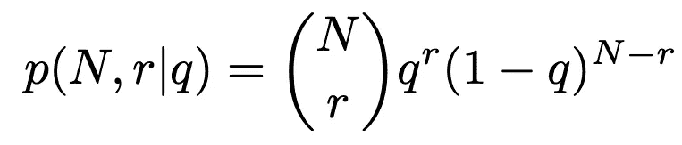
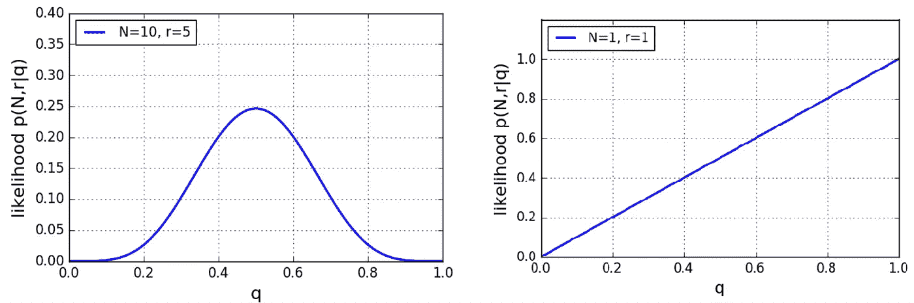
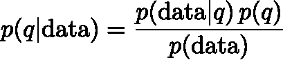

# 如何成为贝氏

> 原文：<https://towardsdatascience.com/how-to-become-a-bayesian-fcaaf6302d68?source=collection_archive---------35----------------------->

## 概率论

## 频率主义者和贝叶斯统计的根本区别

贝叶斯方法和频率主义方法的区别在于对概率的解释。照片由[上的](https://unsplash.com/@burst?utm_source=medium&utm_medium=referral)爆裂[未爆裂](https://unsplash.com?utm_source=medium&utm_medium=referral)

贝叶斯统计方法是频率主义方法的有力替代。在这篇文章中，我们将探索贝叶斯观点的基础，以及它如何与频率主义观点相区别。我们不会以纯技术的方式推导贝叶斯定理，而是试图理解其背后的原理。

一切都从概率开始。概率论是统计学和数据分析的基础。它已经是概率的定义，或者说观点，在这里，贝叶斯方法和频率主义方法分裂了。你可能会问，概率怎么会有不同的观点。毕竟概率应该是客观的，而不是主观的。这只是部分正确。假设你被要求为下面两个硬币投掷系列的结果分配一个概率(正面 H，反面 T):

*   T T T T T
*   H T T H T

这个问题没有很好的定义，可能会有歧义。如果你想计算确切序列的概率，你会得出这样的结论:每一个 *n* 次抛硬币的序列都有一个概率(1/2)^n，在这个例子中是 1/32。然而，在我们的日常生活中，我们可能会对连续 5 条尾巴的结果感到惊讶。也许我们更想回答这个问题:观察到一定数量尾部的概率是多少？这个问题可以用二项式分布来解决。第一个序列的概率是 1/32，第二个序列的概率是 10/32。突然，第二种结果的可能性增加了十倍。在这个例子中，你可以看到一个问题没有内在的概率，但是它总是必须被指定，并且可能取决于个人的观点，或者你想要回答的特定问题。在这里，我们甚至没有谈到隐含的假设，即我们正在使用一个公平的硬币，或者它可能会落在一边。

我们确定，概率的解释可能取决于你想回答的问题。这在频率主义者和贝叶斯方法之间有什么不同？

*   频率主义者将这种概率视为在大量试验中相对频率的极限。
*   贝叶斯认为概率是一个**的信任度**。

这是什么意思？假设你想推断一枚硬币出现正面的概率。一个典型的频率主义者在实验后得出的结论是:

> 在观察了 100 次抛硬币中的 58 次正面后，我估计观察到正面的概率是 58%。

贝叶斯可能会说:

> 从以前的经验来看，我们很可能有一个公平的硬币。在观察到 100 次抛硬币中有 58 次正面朝上后，我更新了先前的信念。现在最有可能的值是 54%。

为了更清楚地说明这种区别，我们将看另一个例子。

## 抽奖问题

乔·耶茨在 [Unsplash](https://unsplash.com?utm_source=medium&utm_medium=referral) 上的照片

想象一下，你参加了一个抽奖活动，人们可能会购买一定数量的彩票，其中一些将会获奖。你想观察比赛一段时间，以估计你的胜算。你观察到 10 个人买了一张票，其中 5 个人赢了。按照频率主义者的方法，合理的中奖概率估计为 50%(你将自己的数据考虑在内，用 5 张中奖彩票除以 10 张已购买的彩票得出结论)。但是如果你只观察到一个人买了一张票并且这张票赢了呢？你估计获胜的可能性有多大？很明显，以前使用的直观方法不再有效，因为你可能从经验中知道 100%的胜率是非常不可能的。

我们如何将这些先验知识融入到我们的评估中？1772 年，大卫·休谟得出结论[1]:

> 因此，如果我们忙于论证，相信过去的经验，并把它作为我们未来判断的标准，那么这些论证就只能是或然的[……]

这意味着如果我们想用先验知识更新我们的数据，我们需要一个概率观点。在下文中，我们将推导出如何在贝叶斯框架内实现这一点。为了解决我们的抽彩问题，朝着正确方向迈出的一步是提出这样一个问题:给定一个模型，观察到我们的数据的概率是多少？为了做到这一点，我们首先要建立一个模型。

## 可能性

抽彩问题可以用二项式模型来描述，我们可以将观察到从以中奖机会为条件的 *N* 张已购买彩票中 *r* 张彩票中奖的概率写成:

二项分布

给定一个模型，我们的数据的概率称为**似然**。对于上面的两种情况( *N=10* 、 *r=5* 和 *N=1* 、 *r=1* )，可能性如下:

抽彩问题两种情形的可能性

在第一种情况下，具有最高可能性的 *q* 的值是 *q=0.5* ，这也是我们根据频率估计得出的结果，而接近 0 或 1 的极值具有低值。对于第二种情况，对于 *q=1* ，可能性最高，但是 *q* 的较低值也具有非零可能性。**需要注意的是，可能性不是概率分布**。你可以很容易地看到，显示的可能性的面积小于 1。

## 贝叶斯定理

我们谈完了吗？不，在给定我们的模型 *p(* data *|q)* 的情况下，可能性给出我们数据的概率
，而不是概率分布。**我们*真正*想知道的是给定我们的数据 *p(q|* 数据 *)*** *我们的模型的概率。这两者之间的差别是巨大的。在给定数据的情况下，您希望选择概率最高的模型，而不是最能描述数据的模型。为了将可能性转换成概率分布，我们需要贝叶斯定理:*

贝叶斯定理

*p(* 数据 *)* 称为*边际似然*，或*模型证据*。而 *p(q)* 称为先验。先验正是我们可以将先验知识引入等式的地方，它将 *p(q|* data *)* 与可能性区分开来。边际可能性是正态分布。

## 结论

我们看到，频率主义者和贝叶斯统计方法之间的根本区别在于对概率的解释。为了用贝叶斯方法思考，你必须调整你解释概率的方式。频率主义者将概率定义为长期频率，而贝叶斯主义者将其视为一种信任程度。这意味着贝叶斯特别开放，可以通过先验知识将先前的知识纳入他的计算中，还可以为只发生一次的事件分配概率。我希望这些概念能帮助你成为真正的贝叶斯主义者。

你可以在这里找到贝叶斯分析的完整例子。

 [## 手动执行贝叶斯分析

### 现实生活中贝叶斯分析的逐步演练

towardsdatascience.com](/performing-a-bayesian-analysis-by-hand-c589ab992916) 

## 进一步阅读:

埃德温·t·杰恩斯*概率论*

## 参考资料:

[1]大卫·休谟，*一个关于人类理解的调查*，1772 年