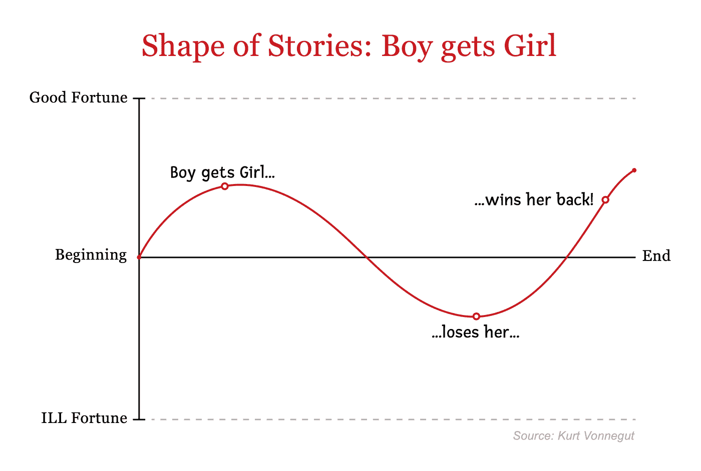
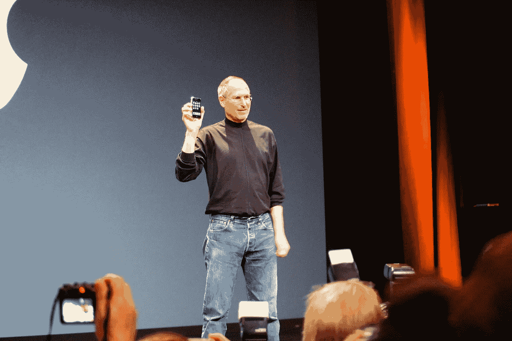

# 如何成为一个更好的讲故事者:3 个要点

> 原文：<https://towardsdatascience.com/how-to-become-a-better-storyteller-3-key-points-1a204fb3b18b?source=collection_archive---------70----------------------->

*照片由* [*农旺*](https://unsplash.com/@californong?utm_source=unsplash&utm_medium=referral&utm_content=creditCopyText) *上* [*下*](https://unsplash.com/?utm_source=unsplash&utm_medium=referral&utm_content=creditCopyText)

## 伟大的电影、演讲和商业展示都有一个共同点:情感弧线。它如何给你的故事增添趣味？

*更新:这篇文章你可以在* [*乌克兰语*](https://temy.blog/2020/11/13/як-стати-кращим-казкарем-3-ключові-моме/) *(感谢卡特琳娜·莫什科拉！)*

你在正在进行的疫情中发起了一个[数字化转型](https://enterprisersproject.com/what-is-digital-transformation)的倡议。您对这项巨额投资感到非常兴奋，它有可能解决您的组织面临的远程工作挑战。

然而，执行委员会对你的发言反应冷淡。你发现业务团队不能分享你的兴奋。您的技术团队背负着多重优先任务，担心这会导致更多的工作压力。

我们不是经常发现自己处于这样的情况吗？

即使是最好的计划也会因为无效的沟通而失败。行业报告称，糟糕的内部沟通每年会给组织造成超过 370 亿美元的损失。然而，我们并没有把太多的注意力放在解决我们的沟通问题上。

[Icons8 团队](https://unsplash.com/@icons8?utm_source=unsplash&utm_medium=referral&utm_content=creditCopyText)在 [Unsplash](https://unsplash.com/s/photos/communication?utm_source=unsplash&utm_medium=referral&utm_content=creditCopyText) 上的照片

让我们来看看大片、明星产品发布和成功的营销活动之间的相似之处。通过清晰的例子，我们将讨论技术领导者如何转变为故事讲述者。

# 技术领导者能从专业的故事讲述者身上学到什么？

想象一下你最喜欢的电影。很可能你很久以前就看过了。但我敢打赌，它对你记忆犹新，就像你几周前看到的一样。是什么让这些电影如此令人难忘？

研究人员称，伟大的电影、演讲和商业展示之间有着更深层次的联系。这是情感弧线，也称为“故事的形状”情感弧线是故事中的一系列情感起伏，像过山车一样吸引着观众。

说书大师[分析](https://www.youtube.com/watch?v=oP3c1h8v2ZQ)通俗故事的形态，构建它们的情感弧线。一个挣扎中的男孩与他的女孩重聚的情节已经是老生常谈，但它从未失败过。还记得《风月俏佳人》或者《恋恋笔记本》吗？他们玩弄久经考验的“男孩得到女孩”的情感弧线

这是它的形状:

图片重现自[库尔特·冯内古特的演讲](https://www.youtube.com/watch?v=oP3c1h8v2ZQ)

看起来很简单吧？注意情绪在 y 轴上的变化。作为观众，当事情变得消极时，我们会咬指甲。我们为英雄欢呼，因为他再次站起来夺回女孩，再次提升情绪。

冯内古特重建了许多其他有趣故事的形状，包括我们这个时代最著名的故事之一——灰姑娘！所有这些的共性是什么？他们每一个人都用不同的情感弧线带领观众经历起起落落。

# 证明情感弧线重要性的证据

麻省理工学院的社交机器实验室和麦肯锡消费者技术团队[研究了数千个 Vimeo 视频](https://www.mckinsey.com/industries/technology-media-and-telecommunications/our-insights/ai-in-storytelling)，使用高级分析建立了联系。

使用计算机视觉和音频分析的算法每秒钟为每个场景打分。在勾勒出每个故事的情感弧线后，他们使用机器学习将它们分成八个家庭。

该分析的最后一部分是引入结果——用户参与度指标，如“喜欢”和“评论”研究人员发现，由人工智能算法生成的故事情感弧线可以预测观众是否会喜欢它。

# 你如何运用情感弧线来改善领导沟通？

将讲故事融入你的沟通有三个步骤:

## 1.超越技术

想想一项技术接触到的受众。在谈论技术时，我们往往更关注它的功能。我们在涵盖“什么”和“如何”方面做得很好，但却忽略了“谁”和“为什么”

当史蒂夫·乔布斯介绍 iPod 时，他没有谈论它的酷工程或时髦的设计。相反，他告诉观众，他们现在可以在口袋里携带 1000 首歌曲。焦点完全集中在用户和他们的愿望上。

史蒂夫·乔布斯是一个讲科技故事的大师。他最大的成功来自于对客户以及为什么他们的需求没有得到满足的深刻理解。

与你的听众建立联系的旅程必须从首先想到他们开始。你的用户的需求和偏好是什么？他们是如何完成工作的，他们最糟糕的噩梦是什么？

*Photo by* [*林信行*](https://www.flickr.com/photos/nobihaya/) *on Flickr*

## 2.超越事实

让观众体验各种可能性。套用玛娅·安杰洛的话，人们可能会忘记你说过的话，但他们会记得你带给他们的感受。通常，我们的交流是对事实的枯燥背诵，这就是为什么他们没有联系。

认知心理学家杰罗姆·布鲁纳(Jerome Bruner)说，以故事形式传递的信息比事实更令人难忘 22 倍。好的故事必须生动地描述故事展开时的场景。他们必须用传达强烈情感的语言来打动人。

例如，在启动您的数字化转型时，不要仅仅量化痛点。选择一个(虚构的)用户，向我们展示她的世界。解释这些挑战不仅会导致失去商业机会，还会让用户深感沮丧。

以英雄的身份介绍你的计划，这样你就能扭转乾坤。描述结果并展示它将如何让用户摆脱痛苦。

## 3.超越传统叙事

引入变化来建立情感弧线。有了观众的清晰图片和与他们联系的体验信息，现在通过玩弄其情感弧线来使故事变得有趣。正如一个音符有高潮和低谷，你必须在你的交流中引入变化。

暂停一会儿，想想你上一次的商业演示。它有什么变化吗？你刚刚把好消息和坏消息排序了吗？你是怎么得出这个结论的？

我们大部分的报告都是信息性的，但是顺序性的，而且…无聊。这些见解在逻辑上是合理的，但在情感上却没有联系。

将你的交流视为一系列的部分，就像小说的章节一样。在每一部分，引入悬念的元素，梳理出解决方案。反复重复这个结构来吸引你的观众。

最后，以生动的行动号召结束演讲，激励听众采取下一步行动。

# 情感弧线的概念适用于各种商务交流。

每当你想抓住观众的注意力并让他们付诸行动时，这三个步骤都会很方便。

此外，记住所有的故事都是通过迭代改进的。花时间制作和评论它们。在朋友、同伴和样本观众身上测试它们。详细反馈哪些工作有效，哪些地方需要改进。然后融入变化，从头再来一遍。

祝你好运，让你的商务沟通变得生动有趣。

*这篇文章最初是由* [*发表在*](https://enterprisersproject.com/article/2020/8/how-improve-storytelling) *企业家项目上。增加了插图。*