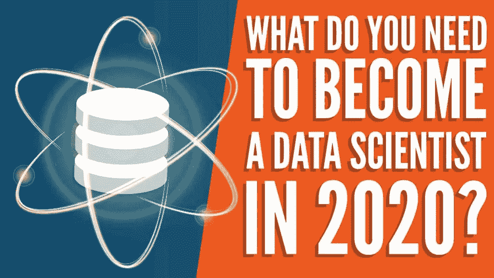
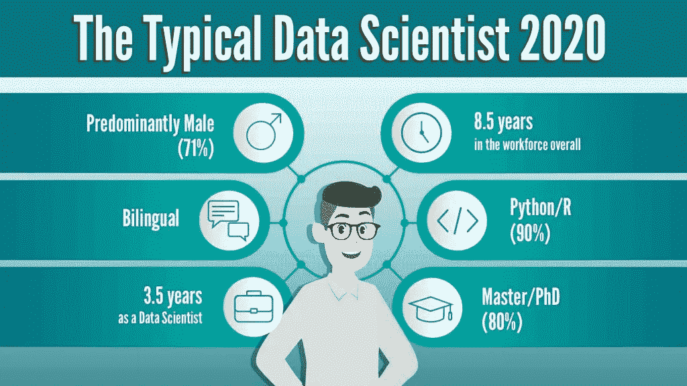
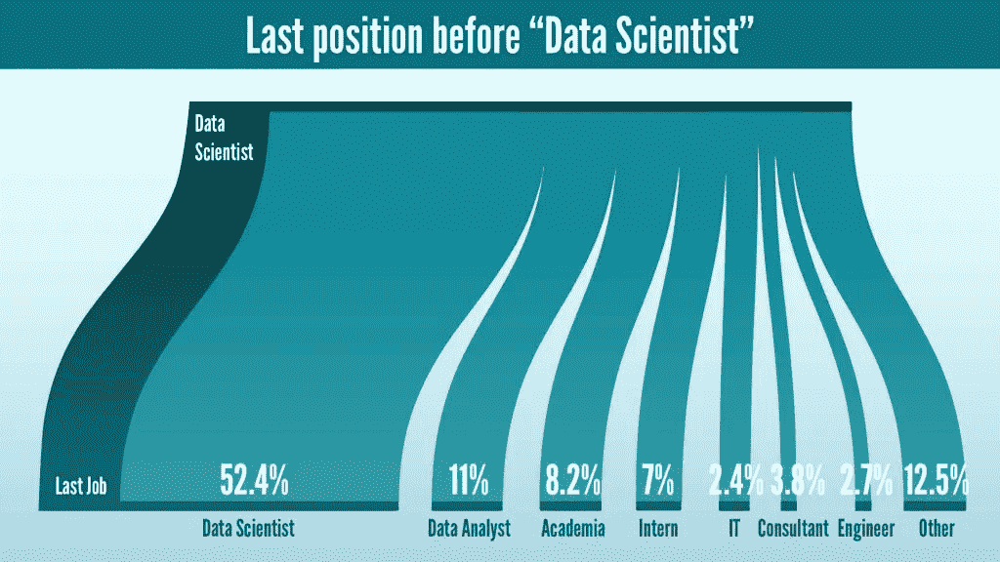
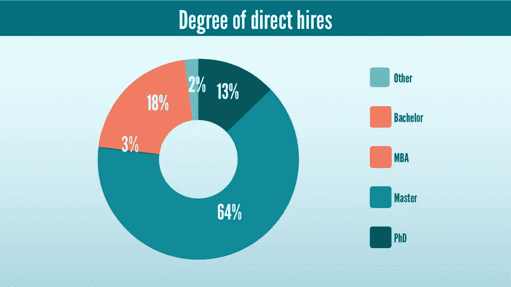
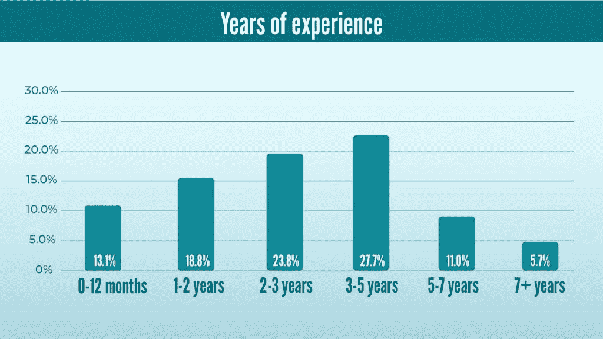
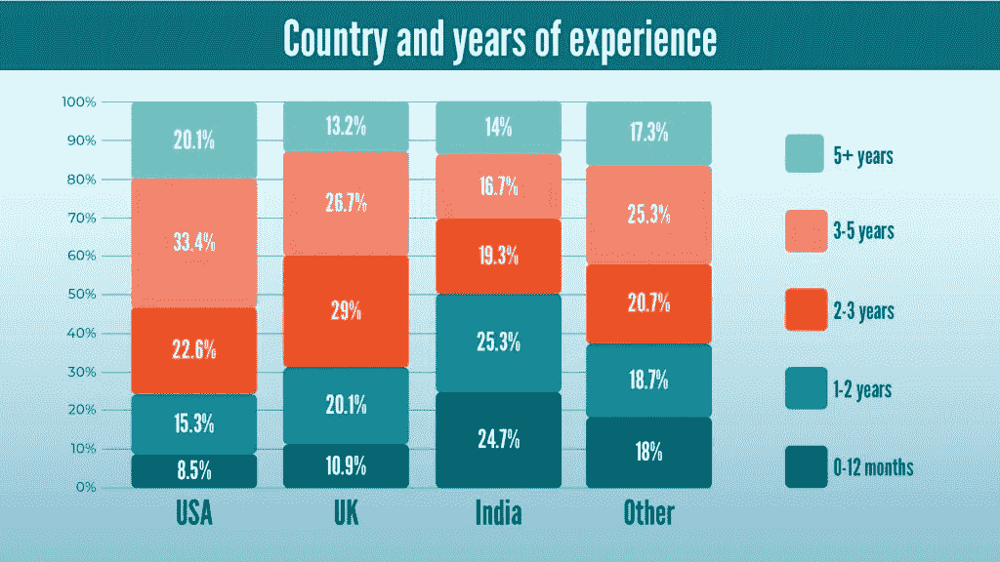
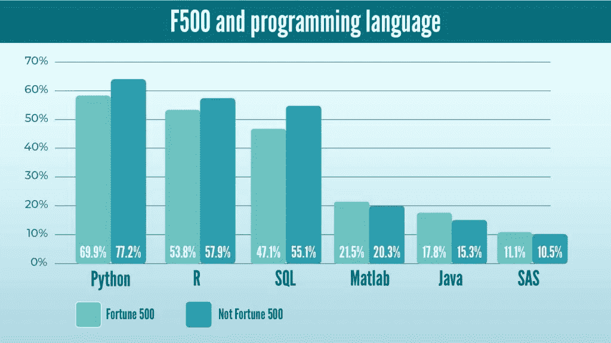

# 如何在 2020 年成为数据科学家—顶级技能、教育和经验

> 原文：<https://towardsdatascience.com/how-to-become-a-data-scientist-in-2020-top-skills-education-and-experience-afa306d3af02?source=collection_archive---------25----------------------->

# 如何成为 2020 年的数据科学家:简介

在过去几年中，数据科学一直是最时尚的话题之一。但是在 2020 年成为一名数据科学家需要具备什么条件呢？

简而言之，以下是我们发现的最新研究成果:

> 典型的数据科学家是男性，至少会说一门外语，背着他们有 8.5 年的工作经验。他们很可能拥有硕士或更高的学位，并且在日常工作中肯定会使用 Python 和/或 R。

但是这样的概括很少有帮助。不仅如此，它们可能会误导人，有时甚至令人沮丧。这就是为什么我们对数据进行了细分，以揭示许多不同的见解:

请使用上面的列表浏览文章，或者只是阅读整篇文章。为了让您尽可能地了解不同的要点，我们还将与前几年的调查进行比较。如果你首先想了解如何在 2018 年和 2019 年成为一名数据科学家，请点击这些链接:

[2019 数据科学家简介](https://365datascience.com/data-scientist-profile-2019/) [2018 数据科学家简介](https://365datascience.com/research-into-1001-data-scientist-profiles/)

# 我们如何收集和分析数据:

这份报告的数据基于 LinkedIn 个人资料中的公开信息，这些个人资料包含 1001 名专业人士，目前被聘为数据科学家。样本包括初级、专家和高级数据科学家。为了确保与前几年的可比性和有限的偏差，我们根据几个条件收集数据。

## 位置

40%的数据由目前在美国工作的数据科学家组成；30%是英国的数据科学家；15%目前在印度；15%来自不同国家的集合(“其他”)。

## 公司规模

50%的样本目前受雇于财富 500 强公司；剩下的 50%在未排名的公司工作。

这些配额是根据对数据科学最受欢迎的国家以及该行业的就业模式的初步研究而引入的。

好吧，不多说…

# 如何在 2020 年成为数据科学家:概述

连续第三年，判决结果出来了。

# 男性数据科学家的数量是女性的两倍。

这种趋势虽然不幸，但并不令人惊讶，因为数据科学领域遵循科技行业的总体趋势。

就语言而言，数据科学家通常会说两种语言——英语和一种其他语言(通常是他们的母语)。

# 说到职业经历，我们发现你不可能一夜之间真的成为数据科学家。

需要 8.5 年的整体工作经验。有趣的是，这比 2019 年的数据增加了半年。另一个有趣的观察是，数据科学家平均拥有他们享有盛誉的头衔 3.5 年。去年，这一指标为 2.3 年。虽然我们的研究不是基于面板数据，但我们可以断言，一旦你成为一名数据科学家，你很可能会一直做下去。

# 关于编程语言，2018 年，50%的数据科学家都在用 Python 或者 r。

这一数字在 2019 年增加到 73%，以彻底打破今年的所有记录。2020 年，90%的数据科学家使用 Python 或 r。不，你不是唯一一个觉得它很神奇的人。在如此短的时间内如此高的采用率对于任何行业的任何工具来说都绝对是一个惊人的壮举。

最后，当你试图成为一名数据科学家时，你的教育水平肯定会有所不同。大约 80%的学生至少拥有硕士学位。这相当于比去年增加了 6 个百分点。

# 以往的经验

每年，我们都会查看数据科学家以前的工作经历。事实证明，这部分结果对有抱负的专业人士最有用，可以找出成为数据科学家的常见职业道路。

重申一下，在 2020 年，数据科学家平均有 3.5 年的职称和 8.5 年的工作时间。

# 但是…数据科学家在成为数据科学家之前是做什么的？

根据我们的样本，他们…已经是数据科学家了！或至少一半的群体(52.4%)。如果我们将这个数值与往年进行比较，2018 年有 35.6%的此类案件，2019 年有 42%。因此，年复一年，这个职位变得越来越排外——我们可以从他们的平均工作经验中推断出这一观察结果。

# 这种观点表明，在成为数据科学家后，没有太多的职业选择。

换句话说，一次是数据科学家，永远是数据科学家。至少 2020 年是这种情况。

关于其他相关的职业道路，从数据分析师开始仍然是更可取的道路(总体 11%)，其次是学术界(8.2%)和数据科学实习生(7.0%)。这一细分是我们自 2018 年以来年度研究中最一致的部分之一。因此，你可以把你的数据科学家生涯押在这上面。

# 教育

教育是大多数简历的三个主要部分之一，这一点不太可能改变。教育背景是给你未来雇主的一个信号，尤其是当你没有太多经验的时候。那么，如果你想成为一名数据科学家，什么样的教育能给出最好的信号呢？

# 根据我们的数据，2020 年的典型数据科学家拥有硕士学位(56%)、学士学位(13%)或博士学位(27%)作为他们的最高学历。

乍一看，这些统计数据似乎并不违背直觉。然而，与 2019 年(19%)和 2018 年(15%)相比，“只有学士学位”的数据科学家实际上有相当大的下降。数据科学需要高级专业知识。这通常是通过传统教育的研究生或研究生形式获得的，或者通过独立的专业学习获得的。

虽然专业化很重要，但过多的专业化，如博士学位，并不是进入数据科学的先决条件。事实上，博士持有人的比例多年来一直保持稳定，约占我们样本的 27%。

然而，硕士学位正在巩固其作为 2020 年成为数据科学家所必需的学术成就黄金标准的地位。

# 我们观察到，与 2019 年相比，拥有硕士学位的专业人士增加了 20%(2019 年为 46%，2020 年为 56%)。

硕士学位是学士专攻某一领域的绝佳途径。

一般来说，硕士学位有两种选择:

*   增加你的**深度**(深入挖掘一个话题)
*   或者增加你的**广度**(改变你的关注点，使你的技能多样化)。

一种假设是，拥有经济学、计算机科学或其他定量学士学位的人已经攻读了一个流行的数据科学硕士学位。这在我们关于研究领域的章节中得到进一步证实。

可以说，还有另一个因素在起作用，这就是这个领域越来越受欢迎。

# Glassdoor 的 50 份最佳工作等行业报告一致将数据科学评为 2016 年、2017 年、2018 年和 2019 年的赢家。

在过去五年中，谷歌对数据科学的搜索也至少翻了两番。这无疑有助于提高人们对数据科学职业的兴趣，并因此导致某些地区的招聘流程更具选择性([参见下面的](https://365datascience.com/become-data-scientist-2020/#9)国家和工作经验年限)。

最后，虽然数据科学正在成为一个竞争更加激烈的领域，但超过 10%的数据科学家仅凭借学士学位就成功渗透到该领域(13%)。这个数字确实低于我们在过去两年中观察到的数字(2019 年为 19%，2018 年为 15%)。尽管如此，数据科学仍然对学士学位持有者开放。事实上，如果我们看看具体国家的数据，就会发现一个更加微妙的画面。

# 国家和学位

正如我们在本文开头的方法部分所述，我们根据位置配额收集数据；美国的数据科学家组成了我们 40%的数据，英国的数据科学家贡献了我们 30%的观测数据；印度和世界其他国家各占 2020 年人口的 15%。

# 也就是说，在英国和美国，拥有硕士学位的数据科学家的数量都有所增加(分别为 54%和 58%，而 2019 年为 44%)。

在印度，2020 年拥有硕士学位的数据科学家数量也比往年增长了 16%(2020 年为 57%，2019 年和 2018 年为 49%)。

有趣的是，这并不对应于印度拥有本科学位的数据科学家的相应减少(2020 年为 32%，而 2019 年为 34%)，这仍然是我们整个队列中学士学位持有者的最高比例。与前几年相比，在当前的研究中，博士毕业生和拥有“其他”学位的专业人士也越来越少出现。正如我们上面提到的，拥有“时尚”数据科学硕士学位的专业化正成为该领域许多人的首选职业道路，这似乎是合理的。

# 同样值得注意的是，在印度成为数据科学家并不需要博士学位。

事实上，拥有博士学位的研究生仅占印度数据科学家样本的 3%;这比美国的数据少 30%,也是印度代表性最少的群体。

因此，这些数据证实了两个初步结论。在学术上，硕士学位正在成为全球最受欢迎的数据科学家学位。而且，如果你只有学士学位，印度为你提供了在数据科学领域开始职业生涯的最佳机会。

# 研究领域

成为数据科学家最好的学历是什么？如果你在过去几年里一直关注这个行业(或者至少是我们的研究)，你会倾向于用“计算机科学”或者“统计和数学”来回答。毕竟，数据科学是所有这些学科的宠儿。但你可能错了。

# 2020 年，成为数据科学家的最佳学位是…数据科学与分析！

“数据科学与分析”的毕业生终于登上了我们研究的巅峰！

在我们继续分析之前，先说明一下方法论。因为在学术界有大量独特的细微差别——以及相应的命名——学位，我们将我们的数据分为七组学术研究领域:

*   **计算机科学**，其中不包括机器学习；
*   **数据科学与分析**，其中包括机器学习；
*   **统计与数学**，包括以统计和数学为中心的学位；
*   **工程**；
*   **自然科学**，包括物理、化学、生物；
*   **经济和社会科学**，包括与经济、金融、商业、政治、心理学、哲学、历史、市场营销和管理相关的研究；
*   **其他**，包括我们样本中的数据科学家追求的所有其他学位。

# 因此，数据科学和分析最终是最有可能让你进入数据科学的学位。厉害！

与 2019 年(12%)和 2018 年(13%)相比，我们看到 2020 年毕业并获得数据科学专业学位的专业人士数量大幅增加(21%)。鉴于我们之前的观察(见上文教育)，这些学位中的大多数都是硕士学位(数据科学和分析集群的 85%)并不令人惊讶。因此，数据科学似乎是任何定量学士的首选专业。

这一发现表明，传统大学开始对数据科学家的需求做出回应。与此相一致，提供培养数据科学家技能的课程。另一个明显的趋势是，数据科学和分析学位正在成为进入数据科学的公认学位，特别是如果你以前从不同的领域毕业。

# 例如，考虑数据科学家在 2019 年和 2020 年获得的前 3 个学位:

## 2019

*   计算机科学(22%)
*   经济学和社会科学(21%)
*   统计和数学(16%)

## 2020

*   数据科学与分析(21%)
*   计算机科学(18%)
*   统计和数学(16%)

# 数据科学和分析显然领先于计算机科学。

更重要的是，它的出现已经完全将经济学和社会科学从 top 3 排名中移除，即使这个专业在 2019 年是接近的第二名。

工程、自然科学和其他领域的毕业生各占我们数据的大约 11%。我们可以说，与前几年相比，这没有太大变化。

# 有趣的是，我们样本中的大多数女性很可能获得了统计学和数学相关的学位(女性群体中的 24%)。

相比之下，男性最有可能获得数据科学和分析学位(22%)，计算机科学(19%)紧随其后。

总的来说，就进入该领域的最佳学位而言，数据科学相当平衡。

如果你有量化或编程背景，或者如果你进一步专攻数据科学和分析，你可以成为一名数据科学家。要做到这一点，要么通过传统的硕士学位，要么通过完成训练营培训或专门的在线培训项目。

# 如何在 2020 年成为数据科学家:在线课程和学位

数据科学家来自如此多不同的背景，我们可能会怀疑他们的大学学位是否足以胜任他们的工作。

# 即使没有研究，答案也是——不可能。没有一个单一的学位可以让一个人为数据科学的实际工作做好准备。

事实上，数据科学家更接近于“书呆子”而不是“摇滚明星”——这与其说是天赋，不如说是努力。因此，你可以打赌，他们会慢慢地自我准备。在我们的研究中，我们使用了最接近的 LinkedIn 代理——在线课程的证书。我们的数据表明，41%的数据科学家已经包括了一门在线课程，这与过去两年几乎相同(2018 年为 40%，2019 年为 43%)。

# 学位和直接聘用

一毕业就能成为数据科学家吗？虽然并非闻所未闻，但数据表明这不太可能。在我们的团队中，只有不到 1%的人在没有经验的情况下成功成为了数据科学家。他们要么有博士学位，要么有硕士学位(80%的男性和 100%的女性)。这些直接雇员中有四分之一还表示已经获得了在线认证。

我们发现有趣的是，我们团队中的直接雇员几乎完全反映了 2020 年典型数据科学家的特征(见上文)。

*注意，并不是所有的人都贴出自己所有的证书，所以这些结果实际上是轻描淡写。*

也就是说，让我们来讨论一下，如果你不是那幸运的 1%，你需要什么样的经历才能成为一名数据科学家。

# 多年的经验

到 2020 年，典型的数据科学家已经作为数据科学家工作了至少一年(我们队列中的 70%)，人数最多的是 3-5 年的数据科学家(28%)，其次是 2-3 年的数据科学家(24%)，以及工作第二年的数据科学家(19%)。

# 工作第一年的数据科学家占我们 2020 年数据的 13%。

这些都是有趣的统计数据，特别是在考虑 2019 年和 2018 年的数据时。更具体地说，我们观察到，与 2019 年和 2018 年开始职业生涯的数据科学家人数(25%)相比，2020 年刚刚开始职业生涯的数据科学家人数减少了近 50%(13%)。鉴于作为数据科学家的[平均经验的增加，我们可以得出结论，这些专业人士留在该领域，使得初级人员更难进入。](https://365datascience.com/career-data-science-ultimate-guide/)

# 第二个有趣的趋势是，与过去两年相比，在职 3-5 年和 2-3 年的数据科学家数量有所增加。

2018 年，25%的数据科学家拥有超过 3 年的经验，而在 2020 年，这一数字将达到 44%，在这一群体中增加了 76%。这表明数据科学专家和高级数据科学家正在留在该领域，而不是转移到其他行业。

尽管如此，我们提到了一些重要的跨国差异，需要进一步探索。所以，让我们在下一节更详细地考虑这些！

# 国家和经验年限

对数据科学家在职经历的跨国分析揭示了一个奇怪的趋势。

# 就资历而言，美国队列中的数据科学家无疑是我们数据中最有经验的。

超过 50%的人至少是第三年从事数据科学家工作，20%的人已经工作了 5 年以上。对于数据科学领域的职业新手来说，美国是最不友好的环境。在我们的美国同行中，只有 8%的人第一年是数据科学家，15%的人第二年是数据科学家。

## 根据我们的数据，英国的数据科学领域更容易渗透。

11%的英国样本是以数据科学家的身份开始他们的职业生涯的，而 20%已经是他们工作的第二年。尽管如此，该群体中最大的代表群体是工作第三或第四年的专业人士(29%)。

## 如果你在寻找一个能给职场新人提供最多机会的国家，数据显示这就是印度。

在我们的样本中，超过 50%的人是工作第一年或第二年的数据科学家。对于刚刚开始接触数据科学并希望将其专业知识融入职业生涯的人来说，这是一个好消息。

当然，这一数据并不令人惊讶，一些世界上最大的公司在班加罗尔和海德拉巴开设了办事处，包括亚马逊、沃尔玛、甲骨文、IBM 和宝洁。

世界其他地方，或者说我们的“其他”国家集群显示出数据科学专业人员在多年经验方面的分布更加均衡。不到 20%的人是第一年或第二年成为数据科学家，超过 20%的人是第三年或第四年，四分之一的人是 3-5 年。也就是说，值得一提的是，在我们的“其他”国家集群中，最大的参与者是瑞士、荷兰和德国。因此，我们可以试探性地说，数据科学正在成为西欧一个更加突出的领域，由于该领域尚未充斥着数据科学人才，初级和中高级专业人员都有需求。

# 数据科学家的编程技巧

当寻找编程语言能力时，我们不得不求助于 LinkedIn 技能“货币”——背书。虽然不是一个完美的信息来源，但它们是一个人擅长什么的良好代理。如果我主要是训练 ML 算法的话，我不会被同事们认可为 Power BI 吧？

澄清之后，让我们深入研究数据。Python 在一年左右前废黜了 R，所以我们不会过多评论这场竞争。此外，知道 90%的数据科学家使用 Python 或 R，我们可以完全结束这个话题，继续前进。

但是那就有点无知了，尤其是对 SQL！

74%的人“说”Python，56%的人知道 R，51%的人使用 SQL。这里特别值得注意的是，自 2019 年以来，SQL 的受欢迎程度增长了 40%(36%)，仅次于 r，接近第三。现在，有各种因素可能导致这一数字。

一个可能的解释是，公司并不总是很好地理解数据科学家的职位。这导致他们雇佣数据科学家，并让他们承担过多的数据工程任务。例如，GDPR 的实施和数据仓库中数据源的大规模重组将一些数据科学家置于不利的位置，使他们无法领导或咨询此类项目。不可避免地，为了“完成工作”，必须将 SQL 添加到他们的工具箱中。

这种现象不仅在 SQL、[的上下文中，而且在与数据库管理相关的大数据结构中，正得到越来越多的关注。](/stop-making-data-scientists-manage-kubernetes-clusters-53c3b584cb08)因此，数据科学家获得了新的技能，代价是编写更少的机器学习算法。

# 支持 SQL 的另一个要点是，BI 工具如 Tableau 和 Power BI 严重依赖于 SQL，从而增加了它的采用。

这就是为什么 SQL 会进一步上升，甚至赶上 r。编程语言的情况是由 MATLAB (20.9%)、Java (16.5%)、C/C++ (15.0%)和 SAS (10.8%)完成的。再次，乳胶(8.3%)也在前 10 名。

为什么？

嗯，学术界不会损害你成为数据科学家[的机会，正如我们从我们这群人](https://365datascience.com/become-data-scientist-2020/#7)的背景中看到的那样。

# F500 和编码语言

我们怎么强调 Python 和 R 对于 2020 年的数据科学领域的重要性都不为过。然而，当涉及到大公司时，他们的优势就是他们的缺陷。Python 和 R 都是开源框架，不像 MATLAB 或 c 等成熟的语言，它们可能会有错误或没有很好的文档记录。

数据确实证实了这一说法。以 Python 为例，70%的 F500 数据科学家使用 Python，而 77%的非 F500 数据科学家使用 Python。这听起来像是令人不快的消息，但事实上并非如此。这些年来，Python 和 R 都在缩小差距。与 2018 年的数据相比，F500 公司似乎正在重新思考他们的组织，并更加包容新技术。

除了 Python 的不同使用率之外，编码语言的其余细分仍然保持着无趣的一致性。

# 国家和编码语言

在过去，你的就业国家将决定你的许多人生决定——学习什么语言，遵守什么规则，尊重或采纳什么习俗。但是这适用于编码语言吗？

自 2018 年以来，我们将目光投向美国、英国、印度和“世界其他地区”。我们的发现表明，在美国和印度，R 比 Python“赢得了民心”。另一方面，英国和“世界其他地方”已经在慢慢淘汰 R，转而支持 Python。

嗯，在 Python 的采用方面，美国和印度不再“落后”。换句话说，Python 现在是各国之王。因此，成为一名数据科学家的最佳选择是弯下膝盖，加入 Pythonistas 寻找数据驱动的真理。

根据记录，编码语言的细分在各国是一致的，R 和 Java 在 2020 年受到 Python 霸主地位的最大冲击。与前几年相比，SQL 没有受到影响，甚至有所增长。

# 如何在 2020 年成为数据科学家:结论

连续第三年，365 数据科学研究对 1001 名当前数据科学家的 LinkedIn 个人资料进行了研究，揭示了这是多么美好的一年！

这项研究表明，该领域正在不断发展，并适应企业的需求及其在学术界和周围越来越受欢迎。大学正在赶上需求，而硕士学位正在确立自己的黄金标准学位。

# Python 继续蚕食 R，但是 SQL 也在崛起！

与美国和英国相比，印度对初级数据科学家的需求更高，从而赢得了数据科学家最佳职业国家的称号。如果你只有学士学位，这也是你应该去的地方。

当然，我们对这些趋势在未来 2-5 年内将如何发展非常感兴趣。但同时，如果你认为我们错过了任何有趣的东西，请告诉我们！我们的使命是为数据科学家的工作以及它如何随时间而变化创建一个信息丰富且最终有帮助的账户。毕竟，做出对自己最有利的职业决定，就意味着知情！

因此，请保持好奇心，增长您的编程技能，祝您在数据科学职业生涯中好运！

**其他研究链接:** [2019 数据科学家简介](https://365datascience.com/data-scientist-profile-2019/)； [2018 数据科学家简介](https://365datascience.com/research-into-1001-data-scientist-profiles/)。

*原载于 2020 年 2 月 25 日 https://365datascience.com**[*。*](https://365datascience.com/become-data-scientist-2020/)*