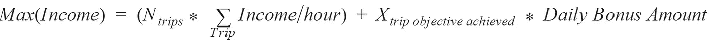
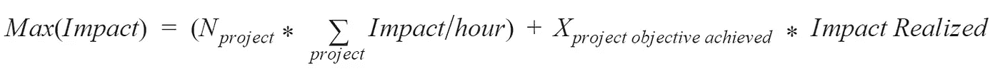
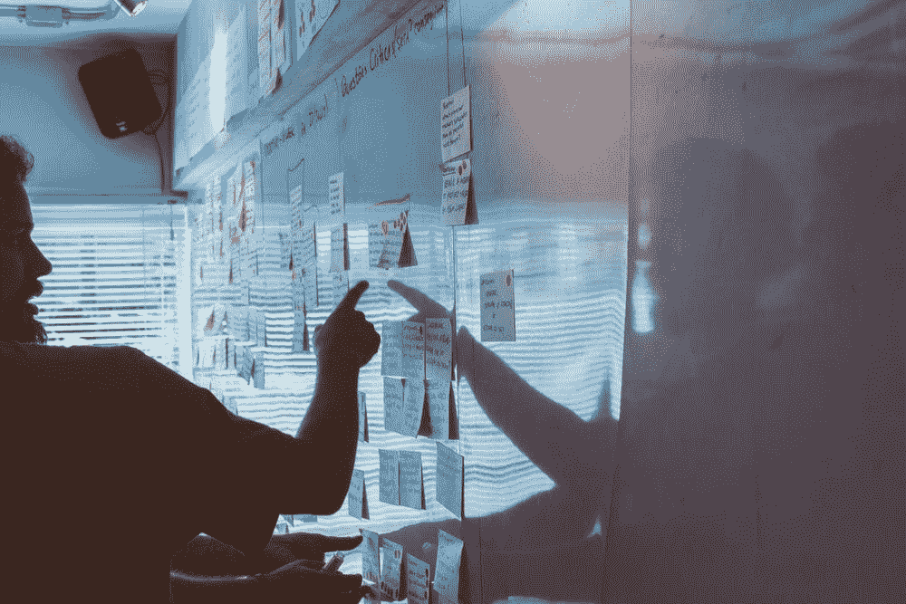
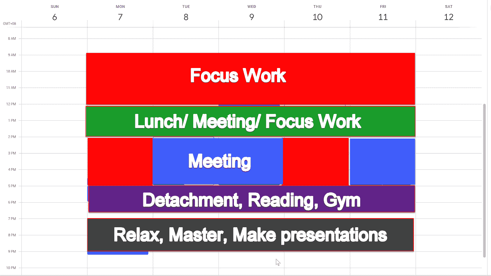

# 成为高产数据科学家的课程

> 原文：<https://towardsdatascience.com/how-to-become-a-highly-productive-data-scientist-from-online-drivers-9026331eaf9c?source=collection_archive---------42----------------------->

## 我对有抱负的数据专业人士的建议

## 您的在线驱动程序如何教会您提高工作效率，以达到您的关键指标

来源: [Unsplash](https://unsplash.com/photos/S0tm3ZYljZk)

> "作为一名 GoJek 车手，你是如何成为顶尖选手的？"
> 
> “很简单，你需要通过定位自己获得许多好的旅行来获得你的每日奖金(主要目标)(次要目标)”——[Gojek 手册](https://lelogama.go-jek.com/DRIVER_HANDBOOK_16SEPT_DigitalVersion_1.pdf)

# 与网上司机的邂逅

那是一个炎热的日子。我拿出我的 Gojek 应用程序(类似于优步的网上司机服务),准备出发去我女朋友的住处。他带着微笑，穿着整洁的衣服，开始和我闲聊，聊了一个小时，激发了我写这篇文章的灵感。作为一名数据科学家，我觉得他的分享对我作为数据专家的职业生涯很有意义，希望对你也是如此。

# GoJek 在线司机的经济

## 他换工作的原因

*   **更高的薪水:**与之前的卡车司机工作相比，他的收入翻了一番。
*   弹性工作时间表:他早上 7:30 开始工作，晚上 8:00 回家。工作时间长，却是因为他的目的是领取**奖金(收入来源)。**
*   **社区**:有针对线上司机的事件。在每个雅加达市，都有“部落”和“团体”。这增加了 Gojek 车手的归属感和友情。

## 收入来源

1.  **每次出行的收入:**据他说，司机可以获得每次出行的 80%左右，另外 20%作为 Gojek 账户服务支付。这意味着，如果我们假设一次常规旅行约 5 万印度卢比(5 美元)，司机每次旅行得到 4 万印度卢比(4 美元)。请记住，每次出行都需要考虑交通流量。如果交通状况不好，这段路程可能需要 3 个小时而不是 1 个小时。这意味着预期收入将从 4 万印度卢比/小时下降到 1.3 万印度卢比/小时。表现最好的司机将能够避免糟糕的交通，并最大限度地提高他们的收入/小时。
2.  **奖金**。这是很多网上司机长时间工作的主要原因。每天，司机需要完成至少 21 次旅行才能获得 26 万印度卢比奖金(26 美元)。这就是为什么网上司机每天可以工作 9-10 个小时(不包括休息时间)。

## 费用

1.  **油费**:Gojek 司机需要自己购买汽车燃油。这意味着每个好日子增加 20 万印度卢比(20 美元)。
2.  **租车**:他每天都需要租车。据他说，有许多在线司机的租车费用高达每天 12 万印尼盾(12 美元)。
3.  **事故**:事故偶尔发生，幸运的是，Gojek 司机可以使用租车/Gojek 保险。然而，对于小事故，由于机会成本，他会选择忽略损失:修复事故所花的时间可以用来赚取收入。

> 我为什么要修我的车？如果在一个小时内，我可以得到额外的 50K (5 美元)？

## **每天净收入**。

算上所有的收入，他每天大约有 60 万印度卢比(60 美元)的收入和 28 万印度卢比(28 美元)的净收入。最终，考虑到雅加达的平均工资是 25 万印度卢比(每天 25 美元)，这是一笔不错的收入。

# 在线驱动程序关键目标

[资料来源:Unsplash](https://unsplash.com/photos/3jBU9TbKW7o)

我很乐意把他的主要目标表述成这样。

> **用简单的英语说** : **在最短的时间内最大化旅行次数，直到达到奖金。为了做到这一点，他需要考虑许多不同的限制因素:交通堵塞、健康状况和事故。**

# 与数据科学家关键目标的相似性

同样，我希望将我的主要目标规划如下:

> **用简单的英语说** : **在最短的时间内最大化影响，直到达到某个最低目标(MVP-最低可行产品)。为了做到这一点，我需要考虑许多限制因素:团队会议、非优先任务的突发事件和不可预见的情况。**

我发现这个关键目标与我相关。在谷歌，我们有一个名为客观关键结果(OKR)的绩效系统，你的绩效完全由你的影响来衡量。以下是我用过的一些常见的 okr(伪装成不违反谷歌的博客政策)

> 利用[数据…]识别未知的网络钓鱼活动(目标)。每周撰写 X 个批准的活动，保护 X 个用户(主要结果)。在生产中推出新的 ML 模型，将其召回率提高 X%(主要结果)

简而言之，这些是影响指标(关键绩效指标)的示例:

1.  我们的滥用检测 ML 模型保护了多少用户？
2.  我们的检测质量(精确度、召回率等)有什么改进？
3.  你如何传达复杂性并让利益相关者(工程师、商业利益相关者、支持等)接受？

# 数据科学家的 3 个生产力策略:最大化您的影响

来源: [Unsplash](https://unsplash.com/photos/7tXA8xwe4W4)

## **1。了解你的优先事项**

网约车司机最大的敌人之一就是堵车。一个糟糕的司机会接受每一个请求。一个好的司机会优先考虑每次旅行每小时的收入。

同样，作为一名数据科学家，你能做的最糟糕的事情就是接受每一项任务和想法。你收到的大部分项目请求都会有未知的影响和可行性(想象项目调优 ML/做一个新的推荐者/集群多个站点组)。你需要评估每个项目。例如，您应该在现有模型的基础上进行构建吗？你应该生产或杀死它，然后继续前进吗？一旦你按影响/小时(低挂的果实)对它们进行了排序，你就要给自己定位在正确的项目中，并计划好你的一天来产生影响。

**我为什么要接这个项目？**

这个项目是否产生一个行动或支持来维持？如果没有，那就随它去吧。这个决定是你避免低效率和实现关键目标的最大资产。

我有一个朋友，他忘记了探索性数据分析(EDA)的重要性，结果浪费了几个小时来实现一个 ML 模型，否则可以用基于规则的(if-else)逻辑来代替。许多数据科学家专注于实现技术上复杂的模型，而没有很好地理解业务问题。我们经常忽视这些影响。[这不是如何建立你的投资组合](/how-to-build-your-ultimate-data-science-portfolios-ea0414d79a72)。

> 关注你所做的每件事的影响/小时。

## 2.约束和关键目标的博弈

这是 Gojek 司机的时间表。

*   05.30–10.00:市场和社区
*   10.00–16.00:城市地区
*   16.00–20.00:购物中心
*   20.00–21.30:主场

这个时间表背后有逻辑推理。首先，他最大限度地利用早上的短途旅行，将自己定位在市场上，以增加接受购物者请求的机会。由于大多数人会去他们家附近的市场，他可以在一大早积累他需要的出行量(吃大青蛙)，同时避开高峰时间。

一旦高峰时间结束，他开始接受城市的要求，并站在市中心接受长途订单。最后，晚上 8 点以后，他会寻找一条能让他轻松回家的路。

> 通过了解他的目标，他就有了在不精疲力竭的情况下实现关键结果的策略。

**数据职业游戏计划**

我在谷歌的数据专家日程概述

同样，游戏你的表现。如果你在一个开放的办公室工作，找到一个安静和隐蔽的地方进行深入的工作。寻找与你的兴趣和需求相关的项目。与利益相关者沟通，并尽早确认事实真相。如果你发现自己不堪重负，那就把任务委派出去。通过规划你的游戏计划，你可以避免不必要的浪费，并专注于提供影响

> 采取行动，最大化你达到关键目标的可能性。

## 3.投资于没有混乱的聪明关系

作为一名司机，他发现 Gojek 家族很重要，但很快发现自己被这些杂物淹没了。他退出了氏族，与一小群资深戈杰克驾驶员合作。这有助于他进行更明智的关系投资，让每个驱动因素在生产率方面互相帮助。

**投资合作**

同样，作为一名数据科学家，你的目标是在比你聪明的人中间找到自己。带着明确的目标与他们建立关系，不要让你的友谊和关系网影响你的工作效率。在你的密友和注重数据的同事身上投入时间。

我发现在像 Google 和 Visa 这样的大公司中，我们与商业利益相关者、工程师和其他数据分析师一起工作。确保你产生影响的最重要的步骤是说他们的语言，并说服他们支持你的想法。

令人惊讶的是，我有一些“数据科学家朋友”，他们连系统思维和 Dev Ops(开发运营)都不懂。他们不能很好地与同龄人合作。最终，这些项目完成了，但没有实施以产生生产影响。

因此，了解你的关键支持，并分配时间进行沟通，共同实现关键目标。记住，数据科学是团队合作。

> 寻找有动力的人来避免混乱，一起实现目标

# 结论

记住这些教训有很多好处。首先，您将使用关键目标，根据影响/小时对项目进行优先级排序。第二，你可以砍掉不重要的事情(不必要的会议、社交等)。最后，您会找到帮助实现关键目标的支持。

总之，在我们的数据分析职业生涯中，我们需要考虑三个关键因素:

1.  **优先考虑影响最大/小时的正确项目:**我们需要一个适当的策略来优先考虑我们的项目和积压的工作。
2.  **设定约束和关键目标:**给自己定位，以最大化实现关键目标的可能性。始终进行 EDA 以了解数据和业务目标。
3.  **投资于没有混乱的聪明关系:**寻找有动力的人一起实现目标。

保持专注和高效。

索利·德奥·格洛丽亚

# 最后…

[来源(Unsplash)](https://unsplash.com/photos/w7ZyuGYNpRQ)

我真的希望这是一本很棒的读物，是你发展和创新的灵感来源。

请在下面的**评论**提出建议和反馈。就像你一样，我也在学习如何成为一名更好的数据科学家和工程师。请帮助我改进，以便我可以在后续的文章发布中更好地帮助您。

谢谢大家，编码快乐:)

# 关于作者

Vincent Tatan 是一名数据和技术爱好者，拥有在 Google LLC、Visa Inc .和 Lazada 实施微服务架构、商业智能和分析管道项目的相关工作经验。

Vincent 是土生土长的印度尼西亚人，在解决问题方面成绩斐然，擅长全栈开发、数据分析和战略规划。

他一直积极咨询 SMU BI & Analytics Club，指导来自不同背景的有抱负的数据科学家和工程师，并为企业开发他们的产品开放他的专业知识。

最后，请通过[**LinkedIn**](http://www.linkedin.com/in/vincenttatan/?source=post_page---------------------------)**[**Medium**](https://medium.com/@vincentkernn?source=post_page---------------------------)**或** [**Youtube 频道**](https://www.youtube.com/user/vincelance1/videos?source=post_page---------------------------) 联系文森特**