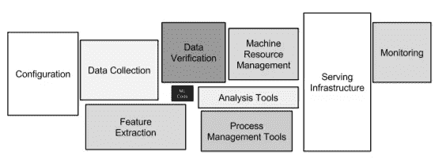
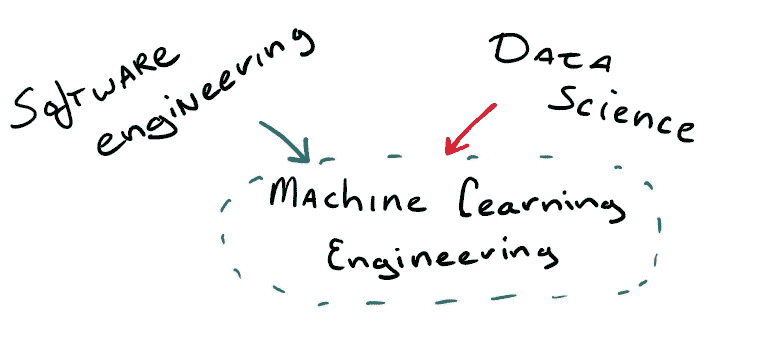
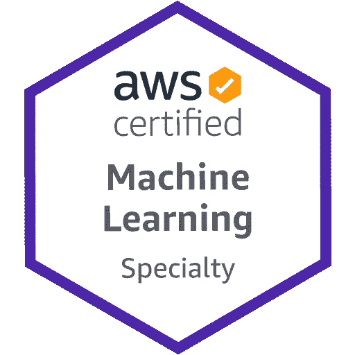
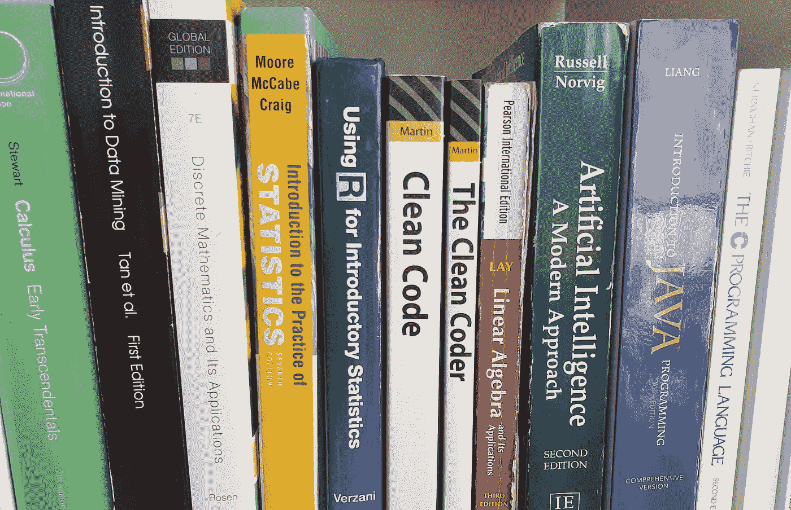

# 2020 年如何成为机器学习工程师

> 原文：<https://towardsdatascience.com/how-to-become-a-machine-learning-engineer-in-2020-1161aa29261e?source=collection_archive---------0----------------------->

## 机器学习工程

## 软件工程和数据科学的利基在于生产 ML 代码

尼克·希利尔在 [Unsplash](https://unsplash.com?utm_source=medium&utm_medium=referral) 上的照片

“机器学习工程师”的头衔正迅速变得越来越受欢迎，因此，人们对试图进入数据科学领域产生了浓厚的兴趣。**这个**是什么样的职业道路，一个机器学习工程师需要具备什么样的**技能集**？有没有可能定义成为一名 ML 工程师需要采取的步骤？你能参加在线培训并获得认证吗？我想我应该写下我对这个领域现状的想法，以及它对那些寻求在这个领域发展的人来说是多么可行。

# 机器学习工程师

让我们先解决一个问题。一些人可能会看着这个职位，期望它是一个纯粹专注于模型构建的数据科学家——仅此而已。这是一个大忌；仅仅是因为大多数 ML 工程工作是在最初的模型建立之后开始的。虽然这通常是工作的一部分，但机器学习工程师不仅仅是建立模型。老实说，这部分只占工作的 5%到 10%。

看看这张模型生态系统中所有组件的图片。中间的黑色方块？那是真正的 ML 代码。

组成 ML 系统的只有一小部分是真正的 ML 代码(黑色方块)。摘自 Scully 等人(2015)的论文《机器学习系统中隐藏的技术债务》链接[此处](https://papers.nips.cc/paper/5656-hidden-technical-debt-in-machine-learning-systems.pdf)。

那么，机器学习工程师是一种什么样的生物，它在事物的大计划中处于什么位置？**我更喜欢 2018 年托马斯·杜德克的部分定义:**

> …一个被称为机器学习工程师的人断言，所有生产任务在实际执行和调度方面都正常工作，将机器学习库滥用到极致，经常添加新功能。(他们)确保数据科学代码可维护、可扩展和可调试，自动化和抽象出大多数机器学习任务中存在的不同的可重复例程。他们为数据科学团队带来了最佳的软件开发实践，并帮助他们加快工作速度…
> 
> *—托马斯·杜德克在*[*但是这个“机器学习工程师”到底在做什么呢？*](https://medium.com/@tomaszdudek/but-what-is-this-machine-learning-engineer-actually-doing-18464d5c699)

**本质上，ML 工程师是某种向导，以合理的方式将模型引入生产，能够改进数据科学家的模型，同时也是为数据科学团队铺平道路的架构师。这听起来不可思议地像是某种高级工程角色，然而它并不一定是。**

# **普通 ML 工程背景。**

**我见过的大多数其他 ML 工程师都属于两种类型之一。第一个群体受过高等教育，大多数人拥有计算机科学、人工智能、数据科学或软件工程的硕士甚至博士学位。令人惊讶的是，许多人是相对较新的毕业生，当他们成为 ML 工程师时，已经有 1-3 年的工作经验。还有第二组，由更有经验的开发人员组成，他们从软件工程或数据工程等邻近领域过渡到这个角色，当然还有数据科学。**

**这表明有一个熟练程度需要成为一个 ML 工程师，可以来自两个方向的任何一个组成的角色。你可以成为一名伟大的软件工程师，或者一名出色的机器学习大师。也许两者都有！如果你已经是其中之一，这可能是你的领域。如果你不是，这可能是一个可行的发展方向。**

**但是不要错误地认为软件工程师或数据科学家会自动成为优秀的 ML 工程师。我本人来自软件背景，我可以保证大多数 ML 概念和 API 对于软件工程师来说是完全陌生的。我记得几年前我为了解 TensorFlow 和 Theano 而进行的激烈斗争。尽管我十几岁就开始编程，但我从未见过这样的事情。这一经历令人羞愧。**

**初级水平的 ML 工程师不是初级程序员。这是一次至少总有人经历过的旅程。那么，没有经验或培训就不可能找到一份 ML 工程工作吗？**

**当然不是。然而，情况对你不利。当你有相似的背景时，进入这个利基市场要容易得多。然而，地平线上出现了一些曙光。**

**请记住，当数据科学开始变得流行时，我们对数据科学家也说了同样的话，因为当时从事数据科学的人是世界上最聪明、受教育程度最高的一些人。从那时起，数据科学变得更加容易获得，事实上，现在你不需要博士学位也可以成为一名伟大的数据科学家。我不确定这是否完全适用于 ML 工程，但我希望随着我们领域的成熟，进入门槛会变得更低。**

****

**数据科学。软件工程。可能还有一些线性代数。这些都是被选择用来创造完美的 ML 工程师的成分。作者创建白板。**

**ML 工程师的工具带不仅仅是软件工程师的 IDE 和数据科学家 Jupyter Lab 之间紧张关系的产物。它有许多该领域固有的工具和技术。这就引出了下一部分…**

# **机器学习工程师的技能**

**技能列表在被写出来后很快就过时了，并且经常有自己的生命。然而，我在这里起草了一个非详尽的技能和研究课题清单！工具的前景是如此广阔，以至于任何一个 ML 工程师都不可能精通所有的语言、工具和概念。**请不要将此视为你在 ML 工程之旅中需要划掉的项目清单**就像许多在线资源会指导你做的那样。相反，请注意，并把这些看作是 ML 工程领域的主题。**

**我将尝试讨论概念而不是具体的工具。这样，大部分内容将在几个月或几年内保持相关性。**

## ****数据科学****

*   ****巨蟒。**研究一下编码标准和 Python 最近版本中一些很酷的东西。对 **R** 有一个基本的了解也是有用的，你的数据科学家会为此感谢你。**
*   ****统计。****
*   ****模型优化。****
*   ****模型验证。****
*   ****ML 框架**如 sci-kit learn**
*   ****深度学习**tensor flow、PyTorch 等框架**
*   ****ML 应用**如 NLP、计算机视觉、时间序列分析。**
*   ****数学**。不言而喻，你会用到大量的线性代数和微积分。**

**我选择 Python 而不是 R 或任何其他语言的原因主要是因为生产方面。虽然您可以用 R 做很多事情，但它通常不像 Python 那样受支持。这里还有时间方面的问题:通常用 Python 生产代码要比用 r 快得多。**

## ****软件工程****

*   **体验 python 之外的第二编程语言，如 Java、C++或 JavaScript。**
*   ****云祭**。稍后会详细介绍。**
*   ****分布式计算****
*   ****系统设计和软件架构****
*   ****数据结构和算法。****
*   ****数据库**及其附带的查询语言。**
*   ****集装箱化**(例如 Docker，KubeFlow)**
*   ****功能编程**概念**
*   ****设计模式****
*   ****大魔神****
*   ****API 开发****
*   **版本控制: **git****
*   ****测试****
*   ****项目管理**。可能是所有 SE 课程中最被低估的元素。**
*   ****CI/CD****
*   ****MLOps****

**那么，如果不在工作中，你是如何学习所有这些知识的呢？**课程和在线培训**可能很棒，但它们不会教你如何在现实生活中应用它们。对于像统计学这样的东西来说，这并不重要，但是对于技术学科来说，知道“关于”只是掌握的一半。只需快速浏览一下 Reddit 的 r/learnprogramming 就可以发现，有许多人正在努力从在线课程中受保护的 IDE 中编写代码过渡到在自己的机器上编写自己的项目。**

**我的经验是，最好自己着手一个项目来学习一项新技能，当你已经有了一些应用知识时，通过在线培训来补充你的知识。有许多在线教程可以帮助你，从制作你自己的时钟或计算器到一个完整的网络应用，而不是一体化的培训计划。注意任何承诺你可以在几周或几个月内从零到英雄的课程。**

****认证**也是类似的猛兽。如果你从事咨询工作，想向客户表明你的技能达到了一定的标准，那么证书会特别有价值。拥有与客户的技术组合相对应的认证会让您立即处于领先地位。然而，如果一开始就没有技能支持，证书是没有价值的。现在考虑一下，你可以获得许多认证，而不必为它们编码，你就会明白我的方向了。通常，花在获得认证上的时间最好花在构建应用程序上。**

**也就是说，对于 ML 工程师来说，有一些认证确实有一些价值，特别是对于云供应商来说。通常这些**需要几年在各自平台上部署应用的经验**，但是任何人都可以支付 100-300 美元并注册认证考试。截至 2020 年，有三家云供应商值得一提:Azure(微软)、GCP(谷歌)和 AWS(亚马逊)。这是一份他们提供的 ML 工程师感兴趣的认证清单。**

****

**通过认证考试时授予的 Microsoft Azure 协理级徽章。[来源](https://docs.microsoft.com/en-us/learn/certifications/azure-data-scientist)**

## **微软 Azure:**

**微软为数据科学家和人工智能工程师提供助理级认证，以及大约十几个其他认证。有些认证其实是需要多次考试的，但这不是(还不是？)数据科学家和人工智能工程师证书的案例。认证题目有点肤浅，但是考试不可小觑。**

*   **[微软认证:Azure AI 基础](https://docs.microsoft.com/en-us/learn/certifications/azure-ai-fundamentals)**
*   **[Azure 数据科学家助理](https://docs.microsoft.com/en-us/learn/certifications/azure-data-scientist)**
*   **[蔚蓝 AI 工程师助理](https://docs.microsoft.com/en-us/learn/certifications/azure-ai-engineer)**

****

**授予认证数据工程师的徽章。能够分享这样的徽章对个人品牌有很大的帮助。来源[这里](https://www.credential.net/a015b522-77d3-48c0-b7f7-16c9948a9ac4)。**

## ****谷歌云平台:****

**当谈到云服务时，谷歌是挑战者，他们的认证状态反映了这一点。目前 ML 工程师考试还在测试阶段，还没有颁发任何证书。考试考四(！)小时，但这是一个令人难以置信的关于 ML 工程师工作的全面列表。在这个认证推出之前，一些 ML 主题属于[数据工程师认证](https://cloud.google.com/certification/data-engineer)，所以很多 ML 工程师，包括我自己，实际上都走了数据工程认证的轨道。**

**你也可以看看[谷歌云架构师](https://cloud.google.com/certification/cloud-architect)、[开发人员](https://cloud.google.com/certification/cloud-developer)或 [DevOps](https://cloud.google.com/certification/cloud-devops-engineer) 认证，但这些几乎没有涉及到它，可能会在你的简历上增加一点点噪音，让你适应不同的工作。我是作为一名认证云架构师这样说的，我从自己的经历中学到了这一点。另一方面，这会让你的个人资料更有吸引力。**

*   **[谷歌云认证专业数据工程师](https://cloud.google.com/certification/data-engineer)**
*   **[谷歌云认证专业机器学习工程师](https://cloud.google.com/certification/machine-learning-engineer)(目前在测试中)**

****

**AWS 认证机器学习-专业的徽章。取自[这里](https://aws.amazon.com/certification/)。**

## ****AWS** :**

**Amazon 对分析角色和 ML 角色都有特定的路径。鉴于数据分析认证几乎完全专注于数据处理和报告，我认为只有 ML 专业才是 ML 工程师感兴趣的。他们的[机器学习专业的教学大纲](https://d1.awsstatic.com/training-and-certification/docs-ml/AWS-Certified-Machine-Learning-Specialty_Exam-Guide.pdf)涵盖了许多 ML 工程主题，尽管它不像谷歌认证那样详尽。**

*   **[AWS 认证机器学习—专业](https://aws.amazon.com/certification/certified-machine-learning-specialty/)**
*   **[AWS 认证开发人员助理](https://aws.amazon.com/certification/certified-developer-associate/)**

## **那么你应该买哪些呢？**

**目前，亚马逊是市场领导者，拥有大约 60%的市场份额。蓝色占 30%，GCP 占 10%。虽然整体市场增长很多，但 AWS 的市场份额正在慢慢输给谷歌和微软。谷歌可能看起来像一个失败者，但他们在人工智能创新和对 TensorFlow 的所有权方面有着非常好的记录。说到这里，[还有一个 TF 的证书。](https://www.tensorflow.org/certificate)如果你没有被雇主强迫使用一个云供应商而不是另一个，我建议用试用账户和部署一个宠物项目来测试所有三个。弄清楚你喜欢哪一个，也看看什么样的公司使用这些云供应商。**

**你到底为什么需要云技术？嗯，最终数据科学工作会进入生产阶段，并且大多数时候会部署在云平台上。你不需要比肩云工程师的技能，但你应该知道如何在你选择的平台上实现 ML 项目。他们通常不会在大学这样的正式场所教授如何操作{vendor}云控制台。**

**学习云平台也有不好的一面:**几乎没有一个星期没有这些巨头发布新的云产品**。跟上云产品的发展很难。拥有各种各样的证书也让人怀疑你是否真的符合所有的标准。**

**你可能已经注意到，到目前为止，我没有链接任何课程或教程。这方面已经有很多资源了。此外，我的主要观点是，成为 ML 工程师的道路是通过做项目和获得该领域的经验来走的，因为它不是一个入门级的工作。**

# **构成 ML 工作的变化**

**当你做了所有这些，你应该知道在小公司工作和做 ML 和在 FAANG 工作和做 ML 有天壤之别。同样，在“产品”公司工作和在咨询公司工作也有很多不同。同样，就技术适应性而言，银行和初创企业是两个不同的世界。**

**在小公司，你更有可能成为一个多面手，例如，被要求做数据工程、可视化和数据科学方面的工作，作为你日常活动的一部分。较大的公司更有可能雇佣专注于 ML 链特定部分的特定员工，甚至可能有不同类型的 ML 工程师四处奔波。如果你在一家做许多不同项目的公司，你可能永远不会深入到任何框架中，但是会经历许多种类的工具和领域。当你打算找你的第一份 ML 工作时，这些都是你要记住的具体考虑。**

# **准备失败**

**在计算机科学中有一个稍微有害的概念，即优秀的开发人员几乎不会犯错误，优秀的代码没有错误。这完全是胡说八道，它已经导致了 T2 冒名顶替综合症的流行。代码几乎从来没有一次写对，这是一个高度依赖于投入的时间和金钱的过程。你作为这个领域的工程师成长很多，但同时这个领域也会比你成长的更快。作为一名 ML 工程师，你必须不断地在工作中学习新的东西，并且由于身处一个跨学科的领域，你放弃了一些对编码的精通。**

**我定期回顾前一段时间写的代码，发现自己犯了错误。有时候，我会用我现在掌握的知识重写它，或者看看是否可以将旧模型更新为新版本的 API。一些开发人员发誓彻底扔掉密集的代码，从头开始重写。随着时间的推移，你会产生一种追溯性地检测代码气味的感觉，这就是工程的意义所在。**

**不要害怕犯错误。失败是很自然的，尤其是像 ML 这样的新生事物。**

# **机器学习工程师的阅读清单**

****

**一个机器学习工程师的书柜。注意线性代数及其应用的破旧拷贝。作者照片。**

**虽然这并不意味着是一个完整的列表，但我觉得这里有一些资源可以帮助那些想进入这个领域的人。**

****书籍:****

*   **罗伯特·c·马丁的《干净的代码》**
*   **[机器学习向往](https://www.deeplearning.ai/machine-learning-yearning/)吴恩达著**
*   **伊恩·古德菲勒、约舒阿·本吉奥和亚伦·库维尔的《深度学习》**
*   **戴维·托马斯和安德鲁·亨特的《实用程序员》**
*   **[设计数据密集型应用程序:可靠的、可伸缩的和可维护的系统背后的重要思想](https://www.amazon.com/Designing-Data-Intensive-Applications-Reliable-Maintainable/dp/1449373321)马丁·克莱普曼著**

****帖子/博客:****

*   **如何阅读 Christoph Schmidl 的科学论文**
*   **关于成为一名自学成才的 ML 工程师，你需要知道的一切。**
*   **拉胡尔·阿加文的《2020 年成为数据科学家》将吸引那些寻找在线资源列表的人。**
*   **Openai 的博客**

**论文:**

*   **[机器学习系统中隐藏的技术债务](https://papers.nips.cc/paper/5656-hidden-technical-debt-in-machine-learning-systems.pdf)**
*   **[机器学习的软件工程:案例研究](https://ieeexplore.ieee.org/abstract/document/8804457)**

# **会议、聚会和 ML 工程场景**

**有人恨他们，有人爱他们。有些人把它们作为最大限度地自我推销的方式，而其他人则分享绝对精彩的想法。我喜欢[meetups](https://www.meetup.com/),原因很简单，他们可以让你挑选你想了解的话题。你喜欢 Scala 吗？医疗保健中的人工智能？聚会。更喜欢贝叶斯优化？可能会有一个聚会。由于 Corona，大多数聚会已经完全在线，我预计这至少会持续到 2021 年上半年。**

****普罗提普**:如果你想找一份实习、工作或导师，它们非常适合社交。**

# **其他职业**

**对于那些考虑进入这个领域的人来说，还有一些其他的职业值得一提。**

*   ****数据工程**:任何涉及数据的东西都需要能够处理大规模和复杂的转换。你是专门连接数据管道的不同元素的人。对你的服务的需求通常比对机器学习工程师的需求高得多。**
*   ****数据科学家:**分析、讲故事、统计、机器学习并将其呈现给 CEO。你得到了一切。通常这份工作更加多样化，涉及的编程更少，但这真的取决于你最终在哪里工作——数据科学有如此多的风格，很难将其定义为一个单一的角色，一些数据科学家自己管理着一个完整的数据分析部门。**
*   ****云工程:**专注于集成不同的应用程序并将工作流迁移到云，你是数据和 ML 工程师的好朋友。**

# **结论**

**一个机器学习工程师需要从机器学习和软件开发中了解广泛的主题。到 2020 年，课程和证书并不能让你达到目标。该领域的正式培训或经验仍然是可取的，但我希望随着时间的推移，它会变得更容易获得，就像数据科学对新人变得更加开放一样。考虑到这一点，我觉得对于那些没有经过正式培训就想成为 ML 工程师的人来说，最好的途径是进入数据科学或软件工程，然后从那里转行，同时学习构成 ML 工程的元素。**

## **结束语**

**随着该领域的快速发展，我希望在未来的帖子中关注 ML 工程技能集和工具前景，通过收集招聘信息并对其进行一些变戏法，以便对 ML 工程师可能知道的东西进行更可靠的统计分析。想知道是否应该通过 PyTorch 学习 TensorFlow？敬请关注:)**

**通过这篇文章，我增加了越来越多的数据科学文章。希望你觉得有用。我想写一些对那些目前不在这个领域的人来说容易理解的东西，我希望我的两美分能帮助你弄清楚这个 ML 和工程的利基是否适合你。**