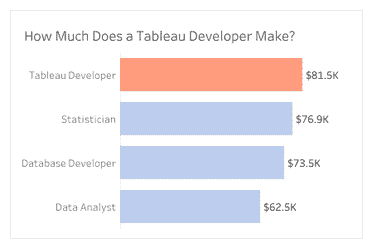

# 如何在没有任何经验的情况下成为 Tableau 开发人员

> 原文：<https://towardsdatascience.com/how-to-become-a-tableau-developer-without-any-prior-experience-ad805f765b4a?source=collection_archive---------38----------------------->

## 成为 Tableau 开发者的简单指南

*图片经由***授权给泰勒*罗杰斯。照片由[福克西·陋居](https://www.shutterstock.com/g/Foxyburow)拍摄。*

*Tableau 开发是一项伟大的事业。*

*首先，报酬丰厚。薪酬通常高于数据科学专业中其他更具技术挑战性的工作。根据 [Glassdoor](https://www.glassdoor.com/Salaries/us-tableau-developer-salary-SRCH_IL.0,2_IN1_KO3,20.htm) 的数据，Tableau 开发人员的平均工资为 81514 美元，高于数据库开发人员、统计人员和数据分析师。(更多薪资细节见脚注。)*

**

*数据取自 Glassdoor*

*工作生活平衡也不错。你可以经常远程工作，这个领域的工作很少需要加班。如果你变得非常优秀，并能有效地推销自己，你可以一份接一份地工作，从而提高灵活性和收入。*

*Tableau 开发也有很高的需求。作为 Tableau 开发人员工作一年后，你会经常接到招聘人员的电话。有时一周内会有多次电话。*

*最棒的是，这是商业智能中最具创造性的工作。在这个领域，没有其他工作比画面开发更能锻炼你的审美能力和讲故事的能力。*

## *成为 Tableau 开发人员不需要特殊的背景*

*你可能会想，如果这份工作这么好，需求量这么大，我有资格吗？做 Tableau 开发人员不需要计算机科学背景或者懂高级统计学吗？*

*这两样东西你都不需要！*

*虽然你通常需要一个大学学位，但什么学位并不重要。你有什么工作经验也不重要。*

*以下是我所知道的最有才华的 Tableau 开发人员的一些不同背景:*

*   *教育*
*   *英国文学*
*   *装帧设计艺术*
*   *营销*
*   *工商管理硕士*
*   *销售*

*如果你注意到，这些都不涉及计算机科学。*

*事实上，我认为具有传统文科背景的人在 Tableau 开发中具有优势，而许多其他数据科学学科确实需要 STEM 背景。*

## *作为 Tableau 开发者需要什么？*

*Tableau 是关于使用好的数据可视化和好的设计技术来用数据讲述故事。它包括善于与人相处，问正确的问题，以提供利益相关者真正理解并经常使用的仪表板。*

*编程方面往往很有限，也很好学。如果你能理解下面的步骤以及我是如何得出结论的，你就能学会 Tableau 所需的编程了:*

1.  *A = 3*
2.  *B = 6*
3.  *A = B*
4.  *A + B = 12*

*关于统计，Tableau 开发中涉及的计算也不先进。它通常局限于简单的概念，如平均值、最小值和最大值。*

## *我如何被聘为 Tableau 开发人员？*

*Tableau 内部人才缺口很大。这意味着许多经理不得不雇佣有能力和兴趣的人，而不能雇佣有经验的人。*

*如果你能展示出这种能力和兴趣，你将更容易找到一份 Tableau 开发人员的工作(或其他相关的角色，如报表开发人员或 BI 开发人员)。*

## *如何展示对画面开发的能力和兴趣*

*展示 Tableau 开发能力和兴趣的最佳方式是在业余时间开发 Tableau 仪表板，并参与充满活力的 Tableau 社区。*

*更具体地说，您可以执行以下操作:*

1.  *下载 Tableau Public 或 Tableau Desktop*
2.  *使用公开可用的数据构建和发布 Tableau 仪表板*
3.  *阅读关于数据可视化的好书*
4.  *上课*
5.  *获得认证*
6.  *参加 Tableau 用户组*
7.  *与 Tableau 用户组的人交谈*
8.  *邀请你在 TUG out 认识的人去喝咖啡或吃午餐*
9.  *学习(刚刚够)SQL*
10.  *了解优质工作是什么样的*

*请继续阅读，以获得对每一点的更详细的解释。*

## *#1:下载 Tableau Public 或 Tableau Desktop*

*要开始构建 Tableau 仪表盘和数据可视化，您需要下载 [Tableau Public](https://public.tableau.com/en-us/s/download) 或 [Tableau Desktop](https://www.tableau.com/products/desktop/download) 。*

*Tableau Public 免费。这是我推荐的开始。Tableau Public 不允许连接数据库，但是可以导入原始数据文件(XLSX、CSV、JSON 等。).此外，您构建和保存的任何内容都将保存在[public.tableau.com](https://public.tableau.com/)上。即使您可以更改您发布的仪表板上的设置，使其成为私有的，我仍然会避免使用任何带有机密或私有数据的内容。*

*如果你想花 840 美元，你可以购买 Tableau Desktop 的年度订阅，并使用其他类型的数据源进行练习。因此，如果你在一家拥有谷歌分析或 SQL Server 等数据源的公司工作，你可以连接到它们，并练习使用 Tableau Desktop 中的数据。*

## *#2:使用公开可用的数据构建和发布 Tableau 仪表板*

*随着您越来越擅长构建数据可视化和仪表板，您希望将它们发布到 [Tableau Public 的图库](https://public.tableau.com/en-us/gallery)上，供其他人查看。这可以让你展示你的能力和兴趣。*

*由于这个原因，你需要公开的免费的非机密数据。*

*幸运的是，你可以使用大量有趣的数据。你可以使用来自雅虎财经的金融市场数据。其他人用的是运动数据(不知道怎么找那种数据)。最好的资源是 [Kaggle](http://kaggle.com) ，它有许多免费的数据集可供数据科学专业人士练习。*

## *#3:阅读关于 Tableau 和数据可视化的好书*

*你认为你知道什么是好的仪表板或数据可视化吗？如果你不知道基本的规则(比如没有饼状图)，那么就很容易搞砸。*

*幸运的是，有很多好书可以帮助你进行有效的数据可视化，避免这些错误并提供好的见解。*

*这里有三本强烈推荐的书:*

1.  *瑞安·斯勒伯的实用场景*
2.  *阿尔贝托·开罗的功能艺术*
3.  *爱德华·塔夫特对数量信息的直观展示*

## *#4:上课*

*没有什么比在 Tableau 上一堂课更能表现出对 Tableau 的兴趣了。如果你之前没有工作经验，这对招聘经理来说是一个信号，他们不需要花时间培训你的基础知识，你足够关心这个职业来参加课程。*

*此外，课堂可以让你通过自学学到你可能会错过的东西。即使你是一个很好的自我激励者，并且通常会自学大部分新技能，一堂课也会大大缩短你学习工具的时间。*

## *#5:获得认证*

*在 Tableau 中获得[认证](https://www.tableau.com/learn/certification)证明了资质。如果您以前没有构建 Tableau 仪表板的工作经验，建议您这样做。*

*招聘经理会看到你不仅学到了材料，还能从外界得到你知道自己在做什么的证明。*

*在你被雇佣后，不要浪费时间去获得更多的认证。事实上，从来没有人要求我获得认证，因为我已经展示了工作经验和 Tableau 仪表盘组合。*

## *#6:参加 Tableau 用户组*

*这是一个大问题，对寻找工作机会有很大帮助。*

*大多数大都市都有 Tableau 用户群(我们通常称之为“TUG”)。如果你想知道下一次 TUG 活动的时间和地点，请访问此处的链接[找到社区页面。](https://public.tableau.com/shared/JK8X9ZFP2?:display_count=yes&:origin=viz_share_link&:showVizHome=no)*

## *#7:与 TUG 的人交谈*

*Tableau 用户群体(像大多数专业技术群体一样)有一个安静的人的名声，他们站在角落里，什么都不说。*

*不要成为那种人。*

*走到人们面前打招呼。向其他听众和演讲者介绍你自己(演讲者喜欢听到对他们演讲的赞美，仅供参考)。*

*当你与这些人交谈时，要求在 LinkedIn 上与他们联系。(可以在这里连接我的 LinkedIn [。)](https://www.linkedin.com/in/taylor-rodgers-4b8632127/)*

## *#8:邀请你在 TUG Out 认识的人去喝咖啡或吃午餐*

*信不信由你，你不必等到下一次 TUG 活动再去和你遇到的人说话。你也可以在这些活动之外遇到他们！*

*随着你建立更多的联系，邀请你联系过的人一起喝咖啡或吃午餐。(确保你主动付款)*

*在这些聚会中，问他们关于他们自己职业的真诚问题，以及他们如何在他们的组织中使用 Tableau。你也可以寻求找工作的建议。他们可能知道谁在招聘，以及这些人在候选人身上寻找什么。*

*无论你做什么，不要直截了当地去找工作。你可以问他们是否有职位空缺，如果有就去申请，但是不要突然提出工作要求。*

*多年来，我经常和人一起吃午餐、喝咖啡。结果很多次，我都被要求去申请工作。有一次，我未经询问、申请或面试就直接得到了一份工作。*

*但是我从来没有——从来没有——去参加过这样的会议，并打算从中获得一份工作。*

*这些会议是关于在更广泛的分析社区内建立关系。把*建立关系*作为这些聚会的目标，好事就会随之而来。*

## *#9:学习(刚刚够)SQL*

*您将使用 Tableau 连接的大多数数据都存在于 SQL 数据库中。虽然情况并非总是如此，但许多公司将数据库开发和 Tableau 开发分成两个独立的角色。因此，不懂高级 SQL 不会妨碍你在这个职业领域工作。*

*但是，即使您不想编写高级脚本来操作数据，您仍然需要学习足够的 SQL 来应付。具体来说，您需要知道如何编写 SELECT 语句以及 WHERE 子句。您还应该知道 GROUP BY 和 ORDER BY 命令。*

*你可以在这个[链接](https://www.w3schools.com/sql/)上一些关于如何编写 SQL 的免费课程。*

*如果你想学习更多的 SQL，并将其与 Tableau 开发职业相结合，你可以担任一个名为*商业智能开发人员*的角色，这包括两种技能。这些角色在不需要专业化的低容量团队中更受欢迎。*

## *#10:了解优质工作是什么样的*

*数据团队的最佳实践是一个团队成员对另一个团队成员的工作进行质量检查。不是每个团队都这样。但是这仍然是你应该发展的一项技能(它也将帮助你改进你自己的仪表板)。*

*当你开发自己的仪表板并发布在 Tableau Public 上时，要善于对自己的工作持怀疑态度。*

*向自己证明你的数据和你的工作是准确的，并按预期工作。你可以通过反复检查你的工作来做到这一点。*

*如需仪表板质量检查的免费指南，请点击此[链接。](https://www.taylorrodgers.com/quality-checking-guide.html)*

## *最后一个提示？申请 Tableau 工作！*

*上面概述的所有步骤都会增加你找到 Tableau 开发人员工作的机会，但是你不必等到完成所有十个步骤后才开始申请。*

*走出去，开始在 LinkedIn、Ziprecruiter 等网站上提交 Tableau 职位的申请。一开始你可能会很幸运。*

*如果没有马上找到工作，也不要绝望。继续向雇主展示你对这个职业领域很感兴趣，并且有能力做好它。归根结底，大多数(聪明的)雇主更愿意和对工作充满热情的人一起工作，而不是和有丰富经验却毫无热情的人一起工作。*

***脚注**
如果你没有任何专业工作经验，40-50k 美元是 Tableau 开发的合理起薪。如果你有专业工作经验，但之前没有 Tableau 经验(或其他数据分析角色)，55-65，000 美元是一个合理的起薪。
这些工资估算是基于我过去作为开发人员和经理的经验，以及来自 Glassdoor 的数据。虽然我不能保证你会赚到这些确切的数额。*

**原载于*[*https://www.taylorrodgers.com*](https://www.taylorrodgers.com/business-intelligence/how-to-become-a-tableau-developer-without-any-prior-experience)*。**