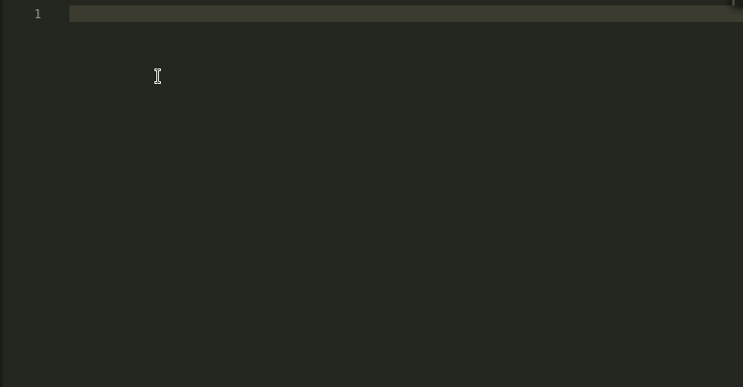
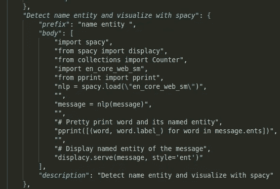

# 利用 VSCode 上的定制代码片段提高效率

> 原文：<https://towardsdatascience.com/how-to-boost-your-efficiency-with-customized-code-snippets-on-vscode-8127781788d7?source=collection_archive---------26----------------------->

## 与其为同一段代码重新生成，为什么不把它保存起来供将来使用呢？

由[罗曼·辛克维奇](https://unsplash.com/@synkevych?utm_source=medium&utm_medium=referral)在 [Unsplash](https://unsplash.com?utm_source=medium&utm_medium=referral) 上拍摄的照片

# 动机

对于数据科学从业者和程序员来说，不可能记住每一行代码来执行特定的任务。因此，忘记以前处理过的任务的代码是很常见的。

但是，与其多次搜索同一条信息，不如将代码片段保存在某个地方，然后在需要时访问它，这样不是更快吗？

我一直使用[要点](https://gist.github.com/khuyentran1401)作为占位符来保存我所有的片段

但是我要花 30 多秒才能访问网站，找到我想要的代码片段，然后将代码复制并粘贴到我的脚本上。有没有一种方法可以让这个过程更快？有多快？**在 1s。**

例如，如果我想使用代码来创建动画，如果我可以像这样在我的脚本上键入，会不会很棒

代码片段显示在屏幕上？

这可以通过 VSCode 轻松完成。我喜欢 VSCode 不仅是因为它的键盘快捷键，还因为它提供了强大的扩展。在本文中，我将向您展示我用来毫不费力地创建和访问代码片段的方法。

# 轻松创建代码片段

要创建或编辑您自己的代码段，请在“文件”>“首选项”(“代码”>“macOS 上的首选项”)下选择“用户代码段”,然后选择语言。

例如，我的 Python 代码片段将被写入文件`python.json.`中。代码片段的结构包括标题、前缀(触发代码片段的单词)、正文(代码片段)和描述。

这种创建 snippet 的方法工作得很好，但是创建一个 snippet 会花费相当多的时间，尤其是当代码很长的时候。

这就是你喜欢`Snippet Creator` 分机的原因。要启用创建代码片段扩展，请转到扩展- >键入代码片段创建器。

要创建代码片段，您需要做的就是

*   选择您想要保存的代码
*   键入 Ctrl + Shift + P，然后键入代码段创建者:创建代码段
*   为代码段键入前缀(触发代码段建议的单词)和描述

现在，您可以创建自定义代码片段，只需选择您想要保存的代码并插入描述！

# 访问代码片段

要在键入前缀时访问代码片段，请进入设置->键入`editor.tabcompletion` - >选择`on`以启用制表符补全。

现在，当您键入代码片段的前缀时，您应该能够看到代码片段的建议。选择您想要的代码片段，整个代码将内联在您的脚本中。

# 编辑代码片段

如果您在代码片段中犯了错误，您可以编辑代码片段，方法是选择“文件”->“首选项”下的“用户片段”(macOS 上的“代码”>“首选项”)，然后选择语言。

a(语言)。json 将显示该语言的所有代码片段。编辑代码片段，然后保存文件。你应该看到变化了！

# 结论

恭喜你！您刚刚学习了如何创建自己的代码片段并在 VSCode 上轻松访问它们。每个代码片段节省超过 30 秒将为您节省时间。

> 给我六个小时砍树，我会用前四个小时磨利斧头——亚伯拉罕·林肯

我喜欢写一些基本的数据科学概念，并尝试不同的算法和数据科学工具。你可以通过 [LinkedIn](https://www.linkedin.com/in/khuyen-tran-1401/) 和 [Twitter](https://twitter.com/KhuyenTran16) 与我联系。

如果你想查看我写的所有文章的代码，请点击这里。在 Medium 上关注我，了解我的最新数据科学文章，例如:

 [## 如何用 Github 组织你的数据科学文章

### 被新信息淹没？现在，您可以轻松地跟踪文章并为其创建自定义注释

towardsdatascience.com](/how-to-organize-your-data-science-articles-with-github-b5b9427dad37)  [## 如何在一行代码中跨不同环境共享 Python 对象

### 为建立与他人分享你的发现的环境而感到沮丧？以下是如何让它变得更简单

towardsdatascience.com](/how-to-share-your-python-objects-across-different-environments-in-one-line-of-code-f30a25e5f50e)  [## 如何创建可重用的命令行

### 你能把你的多个有用的命令行打包成一个文件以便快速执行吗？

towardsdatascience.com](/how-to-create-reusable-command-line-f9a2bb356bc9)  [## 如何在一行代码中跨不同环境共享 Python 对象

### 为建立与他人分享你的发现的环境而感到沮丧？以下是如何让它变得更简单

towardsdatascience.com](/how-to-share-your-python-objects-across-different-environments-in-one-line-of-code-f30a25e5f50e)  [## 当生活不给你喘息的机会，如何学习数据科学

### 我努力为数据科学贡献时间。但是发现新的策略使我能够提高我的学习速度和…

towardsdatascience.com](/how-to-learn-data-science-when-life-does-not-give-you-a-break-a26a6ea328fd)