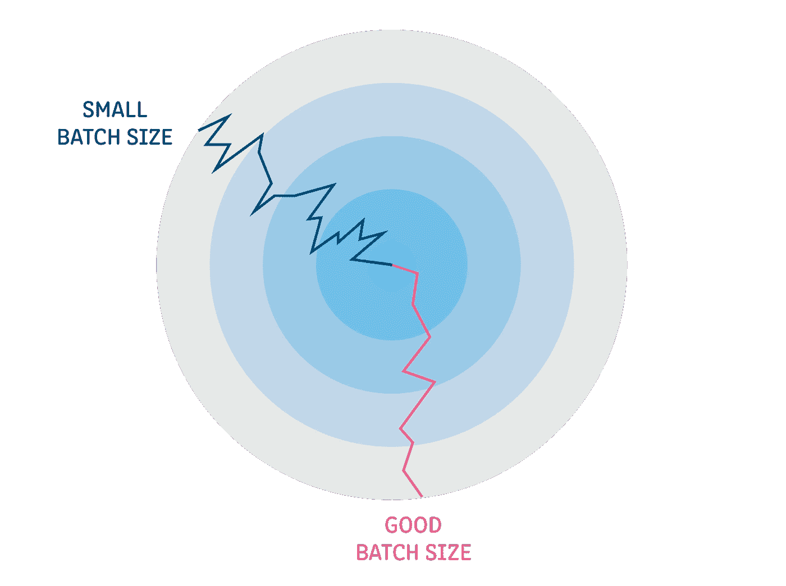
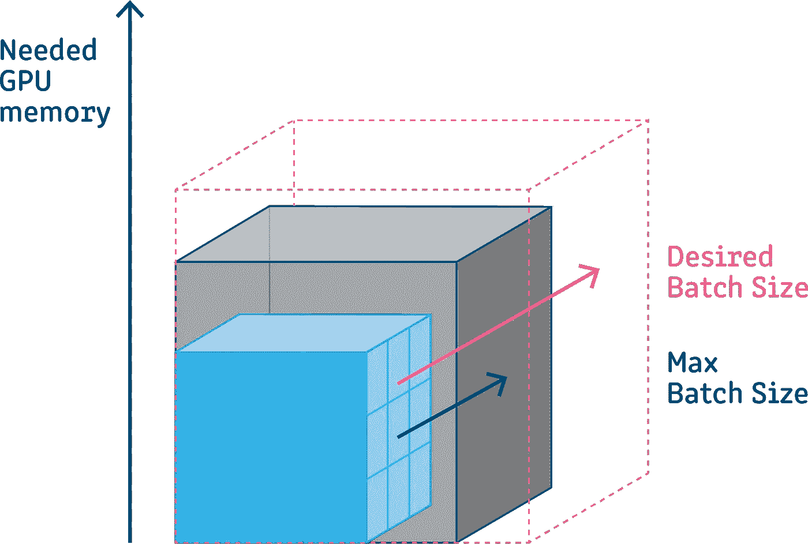
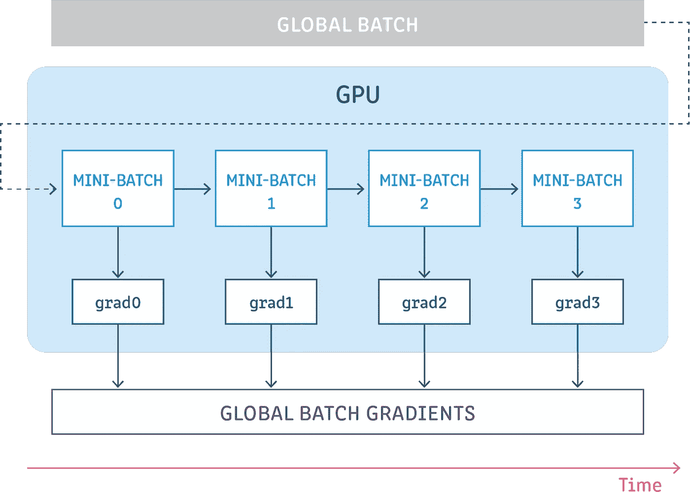

# 如何打破 GPU 内存界限，即使批量很大

> 原文：<https://towardsdatascience.com/how-to-break-gpu-memory-boundaries-even-with-large-batch-sizes-7a9c27a400ce?source=collection_archive---------4----------------------->

## 克服训练神经网络中的批量大小和可用 GPU 内存的问题

安妮·斯普拉特在 [Unsplash](https://unsplash.com/?utm_source=unsplash&utm_medium=referral&utm_content=creditCopyText) 上的照片

在本文中，我们将讨论在使用大批量训练神经网络时可能会遇到的批量问题，并且受到 GPU 内存的限制。

# 问题:批处理大小受到可用 GPU 内存的限制

W 当建立深度学习模型时，我们必须选择批量大小——以及其他超参数。批量大小在深度学习模型的训练中起着主要作用。它对模型的结果准确性以及训练过程的性能有影响。

目前，批处理大小的可能值范围受到可用 GPU 内存的限制。随着神经网络变得越来越大，单个 GPU 上可以运行的最大批处理大小变得越来越小。如今，我们发现自己运行的模型比以往任何时候都大，批量大小的可能值变得更小，可能远离最佳值。

*梯度累积*是一种以琐碎的方式运行不适合 GPU 内存的批处理大小的方法。

# 什么是批量？

批量大小是在更新模型的可训练模型变量(权重和偏差)之前，用于训练模型的样本(例如图像)数量。也就是说，在每个单独的训练步骤中，一批样本通过模型传播，然后反向传播以计算每个样本的梯度。然后，所有样本的梯度将被平均或相加，并且该值将被用作计算可训练模型变量的更新的公式(取决于所选择的优化器)的输入。只有在更新参数后，下一批样品才会经历相同的过程。

# 确定最佳批量

批量大小对训练过程的收敛性以及训练模型的最终准确性具有关键影响。通常，每个神经网络和数据集的批量大小都有一个最佳值或最佳值范围。不同的神经网络和不同的数据集可能具有不同的最佳批量大小。

当使用不同的批量时，可能会产生严重的后果，在选择批量时应该考虑到这一点。让我们来看看使用小批量或大批量的两个主要潜在后果:

*   **泛化:**批量过大可能导致泛化能力差(甚至陷入局部最小值)。泛化意味着神经网络将在训练集之外的样本上表现得相当好。因此，糟糕的泛化能力——这相当于过度拟合——意味着神经网络在训练集之外的样本上表现不佳。
*   **收敛速度:**小批量可能导致学习算法收敛缓慢。使用一批样本计算的每一步中应用的变量更新将决定下一批样本的起点。每一步都从训练集中随机抽取训练样本，因此得到的梯度是基于部分数据的噪声估计。我们在单个批次中使用的样本越少，梯度估计就越嘈杂，越不准确。也就是说，批量越小，单个样本对应用的变量更新的影响就越大。换句话说，较小的批量可能会使学习过程更加嘈杂和波动，本质上延长了算法收敛的时间。

考虑到所有这些，我们必须选择一个既不太小也不太大，但介于两者之间的批量。这里的主要思想是，我们应该尝试不同的批量大小，直到我们找到一个最适合我们正在使用的特定神经网络和数据集的批量大小。

不同的批量有不同的结果。太小的批量可能会导致收敛缓慢。

# 批量大小对所需 GPU 内存的影响

虽然传统计算机可以访问大量的 RAM，但 GPU 的 RAM 要少得多，尽管 GPU 内存的数量正在增长，并且在未来将保持增长，但有时这还不够。训练批次大小对训练神经网络所需的 GPU 内存有着巨大的影响。为了进一步理解这一点，让我们首先检查一下在训练期间 GPU 内存中存储了什么:

1.  参数-网络的权重和偏差。
2.  优化器的变量—每个算法的中间变量(例如动量)。
3.  中间计算-前向传递的值临时存储在 GPU 内存中，然后在后向传递中使用。(例如，每一层的激活输出用于反向传递以计算梯度)
4.  工作区——内核实现的局部变量的临时内存。

*注意:虽然(1)和(4)总是需要的，但(2)和(3)仅在训练模式下需要。*

因此，批量越大，正向通过神经网络传播的样本就越多。这导致需要存储在 GPU 存储器中的更大的中间计算(例如，层激活输出)。从技术上讲，激活的大小线性依赖于批量大小。

现在很明显，增加批量大小将直接导致所需 GPU 内存的增加。在许多情况下，没有足够的 GPU 内存会阻止我们增加批量大小。现在让我们看看如何打破 GPU 内存的限制，同时仍然使用更大的批处理大小。

较大的批量需要更多的 GPU 内存

# 使用更大的批量

克服 GPU 内存限制并运行大批量的一种方法是将一批样本分成更小的小批量，其中每个小批量需要一定量的 GPU 内存才能满足需求。这些小批量可以独立运行，在计算模型变量更新之前，应该对它们的梯度进行平均或求和。实现这一点有两种主要方式:

**数据并行** —使用多个 GPU 并行训练所有小批量，每个小批量在单个 GPU 上进行。来自所有小批量的梯度被累积，并且结果被用于在每一步结束时更新模型变量。

数据并行性

**梯度累积** —连续运行小批量，同时累积梯度。累积的结果用于在最后一个小批量结束时更新模型变量。

梯度累积

# 数据并行性和梯度累积之间的相似性

数据并行度梯度累积有许多共同的特征和限制:

*   它们都不支持运行需要比可用的更多 GPU 内存的模型(即使只有一个样本)。
*   批处理规范化是在每个小批处理上单独完成的，而不是在全局批处理上，这导致它们不完全等同于使用全局批处理大小运行相同的模型。(*注意:尽管全局批处理的批处理规范化可以在 DP 中实现，但通常不是这样，它是单独完成的。*)
*   它们都允许我们增加全局批处理大小，同时仍然受到 GPU 内存的限制。

***虽然这两个选项非常相似，但梯度累积可以使用单个 GPU 按顺序完成，这对于无法访问多个 GPU 的用户或希望最小化资源使用的用户来说更具吸引力。***

此外，两者可以一起使用。这样，我们将使用几个 GPU，运行几个步骤并在每个 GPU 上累积梯度，并在步骤结束时减少所有 GPU 的累积结果。

我们以这种方式进行了一些实验，并将其称为弹性。 [Run:AI 产品](http://www.run.ai)利用这一特性来提高 GPU 集群的利用率，提高数据科学团队的工作效率。我们将在以后的文章中分享这些概念的更多细节。

尽管梯度累积和数据并行之间有相似之处，但它们的实现是完全不同的。我们将在接下来的文章中关注梯度累积。

# 结论

随着深度学习模型变得越来越大，单个 GPU 上可以运行的最大批量变得越来越小。

虽然数据科学家的目标是为特定的神经网络和数据集找到最佳的批量大小，但找到正确的批量大小，然后受到 GPU 内存的限制是一个常见的现象，也是我们试图并成功克服的问题。

# 后续步骤

在[的另一篇文章](/what-is-gradient-accumulation-in-deep-learning-ec034122cfa?source=friends_link&sk=28226e1d0ffa7e450d7dffa8d5b9cff6)中，我们将讨论梯度累积的技术和算法细节，并进一步演示如何用它来解决批量限制的问题。

在 [GitHub](https://github.com/run-ai/runai/tree/master/runai/ga) 上有一个开源的渐变累积工具，以及使用示例和更多资源。