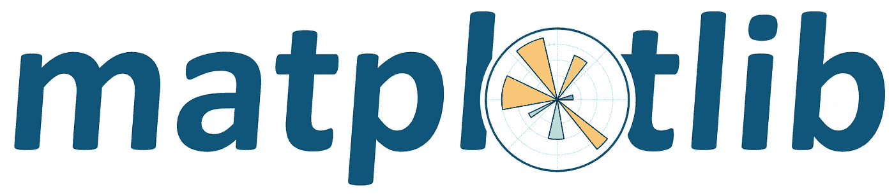

# 如何打入数据科学与技术

> 原文：<https://towardsdatascience.com/how-to-break-into-data-science-and-tech-24a34a5e6aff?source=collection_archive---------46----------------------->

## 从一个自学成才的数据科学家变成人工智能顾问的角度

在 [Unsplash](https://unsplash.com?utm_source=medium&utm_medium=referral) 上由 [Nastuh Abootalebi](https://unsplash.com/@sunday_digital?utm_source=medium&utm_medium=referral) 拍摄的照片

数据科学是近代史上最引人入胜的突破故事之一。早在 2012 年，随着《哈佛商业评论》的一篇标志性文章[1]——,这一职业首次受到关注

> **T5 数据科学家:21 世纪最性感的工作 **

作为天生谦逊的人，每个人和他们的表亲突然都成了数据科学家——包括我自己，尽管晚了几年。

对数据科学的大肆宣传是真实的，但这并没有减损这样一个事实，即成为一名数据科学家伴随着一个绝佳的机会。

据我所知，没有其他职业能让那些愿意咬紧牙关努力工作的人有机会彻底改变他们的职业生活。

这是一个报酬丰厚、启发智力、受人尊敬的职业，有大量的空缺职位，而且还在不断增加。

2015 年至 2020 年数据科学职位的空缺数量(左)和平均基本工资美元(右)。数据来源于[玻璃门](https://www.glassdoor.com/List/Best-Jobs-in-America-LST_KQ0,20.htm)。

这篇文章是写给那些有抱负的数据科学家的。那些致力于掌握一门手艺的人，正在走许多自学成才的数据科学家自己走过的路。

我们将涵盖三个主要关注领域，我认为这三个领域对任何数据科学家都至关重要。

> ***>编程*** *— CompSci、Python、SQL*
> 
> ***>统计*** *—了解我们的数据以及如何传达结果*
> 
> ***>数据科学/机器学习*** *—学科本身*

我们将数据科学家称为一个总括术语，涵盖数据科学家、机器学习工程师、人工智能工程师和许多其他“数据专家”角色。

# 编程；编排

你们中的许多人可能已经开始了这段旅程。如果你正在做的事情有效，那就继续做下去。

Python 无疑是数据科学中的首选语言。但是除此之外，对于绝大多数数据科学角色来说，很好地掌握 SQL 是必不可少的。

学习 Python 和 SQL 的基础知识——以及计算机科学的基础知识——你就可以开始了。

## 哈佛的 CS50

简单的最好的编程和计算机科学入门。 [**CS50:计算机科学导论**](https://online-learning.harvard.edu/course/cs50-introduction-computer-science) 是所有哈佛计算机科学本科生开始学习的模块。

最棒的部分是什么？这一切都可以在网上免费获得**。**

**整个课程通过 edX 提供，可以免费旁听，也可以付费 90 美元获得认证。**

**如果你不确定要不要上这门课，试试看第一堂课——太不可思议了。**

## **代码集**

**我刚开始的时候， [**Codecademy**](https://www.codecademy.com/) 是我的救星——同时提供 Python 和 SQL 课程。甚至还有一个 [**数据科学**](https://www.codecademy.com/learn/paths/data-science) 学习路径，涵盖了所有的要点。**

****

**显示 Codecademy 上“技能路径”的屏幕截图。**

**Codecademy 是学习 Python/SQL 的好地方。有一个免费版本，但大多数材料都需要付费版本——Codecademy Pro。**

## **Sentdex**

**另一个很棒的资源是哈里森·金斯利的(更广为人知的名字是**sendex**)[YouTube 频道](https://www.youtube.com/sentdex)。**

**他的旧的*“Python 简介”*系列以及 Codecademy 是我开始工作所需要的全部。在他的频道上有一个更新的版本——[**学习用 Python 3**](https://www.youtube.com/watch?v=eXBD2bB9-RA&list=PLQVvvaa0QuDeAams7fkdcwOGBpGdHpXln) 编程。**

**如果有一个地方是你学习 Python 的地方，那就是这里！**

## **项目**

**在这第一步中最重要的是好奇心。贪得无厌的好奇心和创造价值的动力。**

**为了让火继续燃烧，只要跟随你的好奇心，在那个领域做一些个人项目——即使它与最终目标有一点偏离。一些简单的例子:**

> *****>*** *时间/生产力跟踪器***
> 
> *****>*** *游戏开发(* [*这个好看*](https://www.youtube.com/watch?v=XGf2GcyHPhc) *)***
> 
> *****>****Python for finance(*[*from send ex*](https://www.youtube.com/watch?v=2BrpKpWwT2A&list=PLQVvvaa0QuDcOdF96TBtRtuQksErCEBYZ)*)***
> 
> *****>*** *树莓派发展(*[*send ex 再*](https://www.youtube.com/watch?v=RpseX2ylEuw&t=29s) *)***

**如果你不想从头开始开发一个项目，YouTube 是一个寻找视频系列的绝佳资源，我们可以用它作为“指导”项目。**

## **其他的**

**[GitHub](https://github.com/) 是一个在线软件开发平台，最终是你的作品组合。如果投资订阅的话， [Codecademy 涵盖了 GitHub](https://www.codecademy.com/articles/f1-u3-git-setup)——或者在 YouTube 上使用[这个教程。](https://www.youtube.com/watch?v=sz6zfrQpCQg)**

**无论何时你的代码有问题——这几乎总是会发生——在[堆栈溢出](https://stackoverflow.com/)上找到解决方案。如果你找不到问题的答案，你可以问！**

## **摘要**

> **CS50 是您唯一需要的 CompSci 底漆。Python 和 SQL 很重要(但更 Python)。学习这两者的最佳资源是—**
> 
> *****>Codecademy****—交互 UI，教 Python 和 SQL***
> 
> *****>send ex****—YouTube 上的免费 Python 和数据科学教程***
> 
> *****>项目****——原创想法，或跟随项目上线***
> 
> ***把你的项目留在 GitHub 上，Stack Overflow 就是你的新家。***

# **统计数字**

**统计学是驱动数据科学各个方面的引擎。掌握统计学非常重要，但你不需要成为统计学家。**

**这有两个关键部分:**

1.  **学习如何进行分析和解释结果**
2.  **学习如何通过可视化交流结果**

**当然，统计学远不止于此，但这两点是数据科学家需要很好理解的基础。**

## **使用 R-Coursera 进行统计**

**由杜克大学提供，这是迄今为止我所见过的最全面的统计学课程。**

****

**它不仅涵盖了你需要了解的所有统计学知识，而且在完成后，你将获得该课程的 Coursera 认证——它可以添加到 LinkedIn 或简历中，以证明你理解该课程涵盖的概念。**

**专业化时间长，从开始到结束建议学习时间 7 个月。对大多数人来说，即使有一份全职工作，这也很容易在短得多的时间内完成，但仍然需要很大的投入。**

> **但是这门课是“R 统计学”，而不是“Python 统计学”**

**r 是数据科学家中第二受欢迎的语言。然而，由于 Python 在该领域的主导地位，我不建议有抱负的数据科学家专注于这种语言。**

**尽管标题如此，本课程对 r 的关注却很少。本课程的大部分内容仅仅集中在统计学上，偶尔会演示 r 的统计方法的应用。**

**这是一门统计学课程，带有 R 的味道。我们的重点是统计学，但 R 仍然是相关的。对这种语言的熟悉为我们的数据科学工具包增加了另一个工具。**

**该课程的一个出色的补充指南是[面向数据科学家的实用统计学](https://amzn.to/3fokXjM)，它也关注统计学和 R (+ Python)。这当然不是本课程的必修课，但却是必不可少的。**

## **可视化库和软件**

****

**通常，我们是在学习其他东西的过程中接触到数据可视化的——在 R 的统计学课程中，或者在学习 Python 的时候。但是有一些库和软件包需要注意:**

*   **[matplotlib](https://matplotlib.org/)——Python 中数据可视化的鼻祖**
*   **[seaborn](https://seaborn.pydata.org/)——让 matplotlib 看起来很漂亮**
*   **[plotly](https://plotly.com/) —用 Python 实现更高级的可视化**
*   **[Tableau](https://www.tableau.com/) 和 [Power BI](https://powerbi.microsoft.com/en-us/) —商业智能数据可视化的领导者，两者都是数据可视化的“无代码”替代方案**

**如前所述, [Codecademy](https://www.codecademy.com/learn/data-visualization-python) 和[sendex](https://www.youtube.com/playlist?list=PLQVvvaa0QuDfefDfXb9Yf0la1fPDKluPF)也是学习 Python 数据可视化基础知识的绝佳资源。**

# **数据科学/机器学习**

**这一部分是最后一部分，因为扎实的编程和统计基础非常重要，应该是进入更具体的数据科学学习之前的重点。**

**不同的方法适用于不同的人，但这些绝对是我用来学习数据科学的最佳资源。**

## **开始**

**(1) [**安德烈·布尔科夫(Andriy Burkov)**](https://amzn.to/2APzANQ)撰写的 100 页的机器学习书籍真正击败了所有其他书籍，无论是对数据科学初学者还是更有经验的专业人士。如果你只用过一本书，那就选这本吧。**

**(2)[**Coursera**](https://www.coursera.org/learn/machine-learning)上的机器学习是大规模开放在线课程(MOOCs)中最著名的，这是有充分理由的——它成功地将极其复杂的 ML 算法简化为直观易学的概念。**

** [## 斯坦福大学机器学习认证述评

### 在快速变化的数据科学环境中，这仍然值得吗？

towardsdatascience.com](/a-review-of-stanfords-machine-learning-certification-9614ebee2b06) 

## 那就研究这些

(3) [**Kaggle** 是一个数据科学竞赛](https://www.kaggle.com/)的线上平台。现在，我们不会用它来与尖端 ML 研究人员的团队竞争，但它确实提供了一个友好的环境来练习我们在已经确定的数据科学问题上的技能。此外，我们可以向专业人士学习。

(4)

 [## IBM 高级机器学习和信号处理认证综述

### Coursera 上的高级机器学习和信号处理课程的全面可视化指南

towardsdatascience.com](/a-review-of-ibms-advanced-machine-learning-and-signal-processing-certification-371bd937bb76) 

(5)[**Coursera**](https://www.coursera.org/specializations/deep-learning)上的深度学习专业化，同样来自吴恩达——这涵盖了深度学习的基础，是对 Python 中 TensorFlow 框架的完美介绍。

## 最后

学以致用。不要只是消费知识，而是应用和分享知识。

想出令人兴奋的项目创意——即使它们毫无用处，也要去尝试！享受这个过程。

做你的项目，创造一些很酷的东西，并与世界分享。

写下项目和你学到的东西。谈论你的工作和教导他人将极大地提高你的能力。

# 一致性是关键

学习一门新学科是一个漫长而艰苦的过程。与其说是短跑，不如说是马拉松——但对于那些愿意投入工作的人来说，这是完全可能的。

在整个过程中保持一致至关重要。很像关于龟兔赛跑的伊索寓言——如果像兔子一样，我们跑在前面却变得分心或懒惰——我们将会失败。相反，我们必须保持一致和专注。

如有任何问题或建议，请联系！

感谢阅读！

# 参考

[1] T. Davenport，D. Patil，[数据科学家:21 世纪最性感的工作](https://hbr.org/2012/10/data-scientist-the-sexiest-job-of-the-21st-century) (2012)，哈佛商业评论**