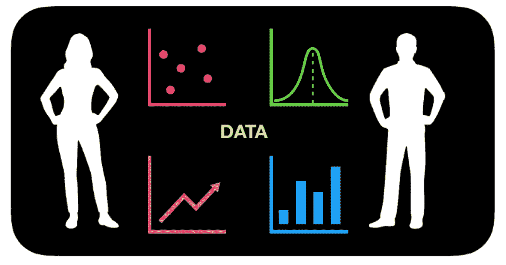
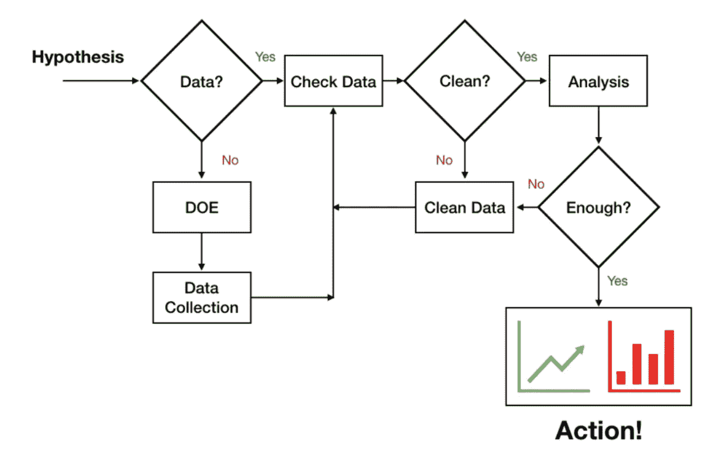
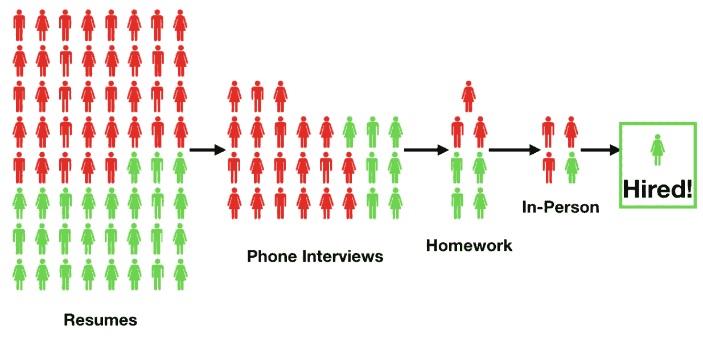
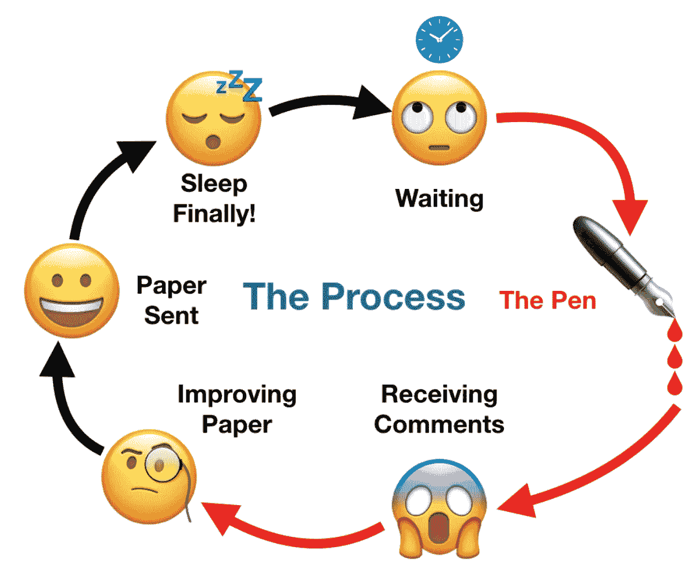

# 如何轻松进入数据科学领域

> 原文：<https://towardsdatascience.com/how-to-break-into-data-science-the-easy-way-dd498995057f?source=collection_archive---------35----------------------->

划掉那个；没有简单的方法。

在过去的几年里，数据科学已经和机器学习一起成为热门话题。机器学习的兴起让数据为王，也因此产生了对数据科学家的巨大需求。通过正规教育成为数据科学家是时代的产物，在现代进入这个行业需要一点努力。

# 传统路线

我是一名数据科学家，但是我没有数据科学的学位。由于与大量数据打交道，我成为了一名数据科学家。我拥有史前时代的博士学位，那时人们必须[阅读学术论文](https://www.linkedin.com/pulse/ode-red-ink-robert-mckeon-aloe)才能实现机器学习。[传统上](https://www.linkedin.com/pulse/farewell-computer-vision-robert-mckeon-aloe)，如果你想成为数据科学家，你就成为了科学家。然后你处理如此多的数据，以至于你成为了一名数据科学家，能够[分析所有的数据](https://www.linkedin.com/pulse/abandon-ship-robert-mckeon-aloe)。你在大学开始主修 STEM，然后你会去读研究生课程。该计划并不专注于数据科学，但由于你的研究，你处理了大量的数据。

在研究生院积累了多年的数据，然后在你的相关领域做了一些工作，你将会成为一名敏锐的数据科学家。你将学会分析数据的技巧，并对结果充满信心。这种经验来自于撰写学术论文，然后将这些技能应用到工业中。

# 现代

现在行业火热！似乎每个人都想加入，纳米学位的流行给许多新人留下了成为数据科学家的捷径的印象。

成为一名数据科学家没有更容易、更轻松的方式。试图简化过程的一个问题是，你不知道如何看待数据。即使概念可以在短时间内教授，你也需要浏览大量数据，[设计数据收集](https://www.linkedin.com/pulse/design-experiment-data-collection-robert-mckeon-aloe)，收集数据，清理数据，数据训练，分析数据，做[故障分析](https://www.linkedin.com/pulse/ml-examining-test-set-robert-mckeon-aloe)，并重复。研究生院是这个过程的一个很好的载体，因为你必须做出比现在更好的东西。

# 没有捷径

如今，玩具数据集很容易获得，甚至[机器学习算法](https://www.linkedin.com/pulse/traditional-cv-pipeline-vs-cnn-robert-mckeon-aloe)也可以从货架上获得。当谈到能够将训练轮取下并将其应用于新数据集时，这给了人们一种轻松感。

问题就在这里:有了纳米学位，你可能会觉得自己完成了一些伟大的事情，学到了很多东西，但你只是被介绍到这个领域。对于那些由于读研或日常工作已经沉浸在数据中的人来说，数据科学的纳米学位是非常好的。

许多人还获得了数据科学的硕士学位，虽然成为一名多面手很棒，但我仍然更喜欢至少在一个领域有深度知识的人。如果你想进入数据科学领域，考虑在你感兴趣并且使用大量数据的领域获得学位。你可以顺便或作为旅程的一部分学习许多数据科学的东西。

最好的[数据科学家](https://www.linkedin.com/pulse/day-life-data-scientist-robert-mckeon-aloe)是那些一生热爱数据的人。我知道这听起来像是有些人天生就有这种倾向；这是我的经历，尽管不是每个人的。我已经找到了利用数据改善生活的方法，比如做预算、[买车](https://medium.com/overthinking-life/buying-a-car-an-analysis-7bf7caf58e04)、[决定何时离开公司](https://www.linkedin.com/pulse/abandon-ship-robert-mckeon-aloe)、[制作浓缩咖啡](https://www.linkedin.com/pulse/progressive-refinement-purification-story-espresso-shot-mckeon-aloe)，以及评估我所写文章的影响。这对我来说很自然，感觉不像工作。

# 需要考虑的事情

在过去的两三年里，大多数数据科学家都拥有硕士或博士学位。对他们(对我们)来说，我们可以看到拥有肤浅专业知识的人和拥有丰富领域知识的人之间的区别。

即使是刚毕业的博士，几年内也不会被称为[学长](https://www.linkedin.com/pulse/symptoms-promotion-robert-mckeon-aloe)。所以如果你硕士或者学士出来，做个纳米，一两年内有了[高级数据科学家](https://www.linkedin.com/pulse/wisdom-learning-from-others-robert-mckeon-aloe)的头衔，我是持怀疑态度的。尽管你可能想认为自己和这个领域的其他资深成员有着同样的深度，但很可能你没有。没关系；对自己的技术水平现实一点就好。

我在 2018 年招聘数据科学家失败的原因是:[我找不到一个好的](https://www.linkedin.com/pulse/lessons-hiring-robert-mckeon-aloe)。有人可能会说我忽略了优秀的候选人，但招聘通常是委员会一致同意的。我的面试小组中的每个人都有硕士学位，一半有博士学位。他们希望与他们信任的技能可靠的人一起工作，所以他们宁可说不。在 100 名申请人、40 次电话面试和 6 次面对面面试中，我最终一无所获。

在研究生院，我的导师告诉我，他们必须小心毕业的博士，因为一个新的博士可能会在几年内毕业。所以周期短，不合格的候选人会冲淡场。数据科学也是如此:随着资历较浅的人进入这个领域，他们会很乐意让更多能力相近的人进入。

# 最后

进入数据科学的部分困难在于，在人们信任你做数据科学家的工作之前，你需要磨砺多年。没有免费的午餐，也没有捷径，所以努力解决一些有趣的问题，吸收所有的数据，总有一天，你会形成一个茧，并弹出一只数据科学蝴蝶。

如果你愿意，可以在 [Twitter](https://mobile.twitter.com/espressofun) 和 [YouTube](https://m.youtube.com/channel/UClgcmAtBMTmVVGANjtntXTw) 上关注我，我会在那里发布不同机器上的浓缩咖啡照片和浓缩咖啡相关的视频。你也可以在 [LinkedIn](https://www.linkedin.com/in/robert-mckeon-aloe-01581595) 上找到我。

[我的进一步阅读](https://www.linkedin.com/pulse/my-writing-sorted-topic-robert-mckeon-aloe/):

[数据科学:基础知识](https://www.linkedin.com/pulse/data-science-essentials-robert-mckeon-aloe/)

[弃船:一家初创公司如何倒闭](https://medium.com/overthinking-life/abandon-ship-how-a-startup-went-under-c5ca8e5bb970)

[论文遗憾](https://medium.com/overthinking-life/dissertation-regret-7109673b7437)

[团队的一部分](https://www.linkedin.com/pulse/part-team-robert-mckeon-aloe/)

如何面试一家公司

[关于离职的想法](https://www.linkedin.com/pulse/thoughts-leaving-robert-mckeon-aloe/)

[数据科学家的一天](/a-day-in-the-life-of-a-data-scientist-eb63cdd71edb)

[实验设计:数据收集](https://www.linkedin.com/pulse/design-experiment-data-collection-robert-mckeon-aloe/)