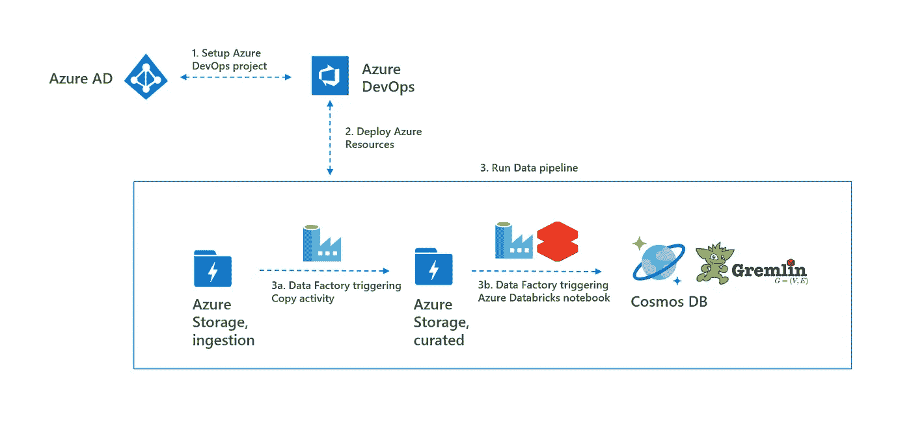
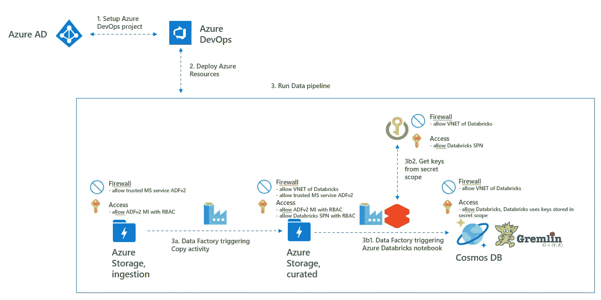
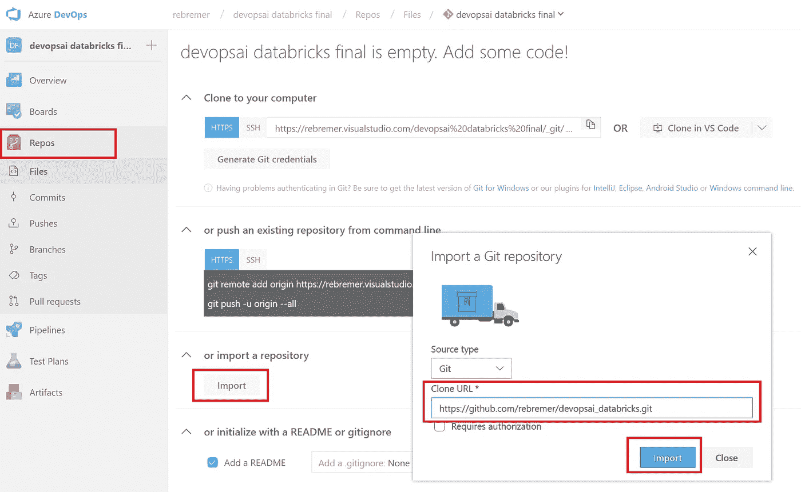
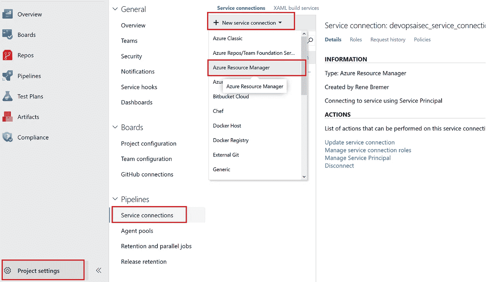
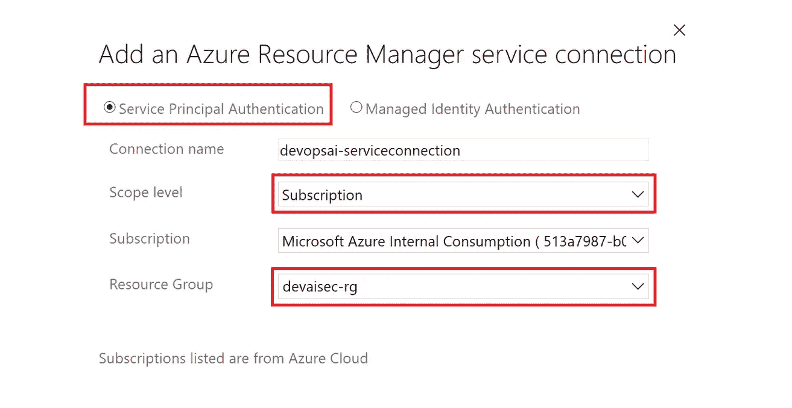
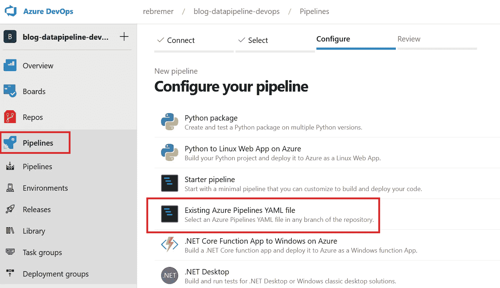
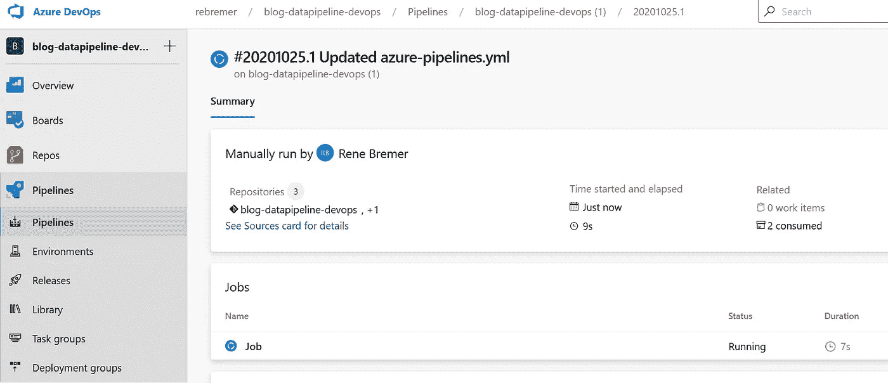
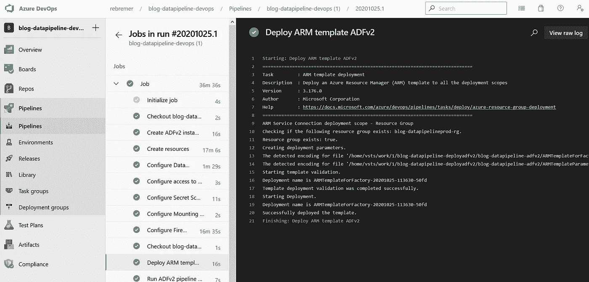
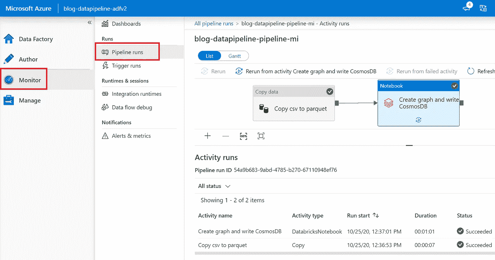
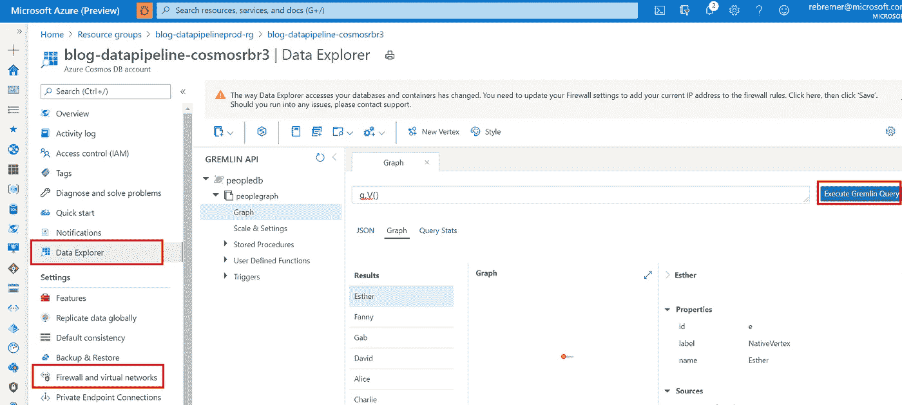

# 如何将您的现代数据管道投入生产

> 原文：<https://towardsdatascience.com/how-to-bring-your-modern-data-pipeline-to-production-2f14e42ac200?source=collection_archive---------13----------------------->

## 使用 Azure DevOps、Databricks Spark、Cosmos DB Gremlin API 和 Azure Data Factory

# A.介绍

创建数据管道是一回事；将其投入生产是另一个问题。对于使用多种服务进行高级分析的现代数据管道来说，尤其如此。例如将非结构化数据转换为结构化数据、训练 ML 模型和嵌入 OCR。多种服务的集成可能很复杂，并且必须控制生产部署。在这篇博客中，提供了一个示例项目如下:

*   1.为连续部署设置 Azure DevOps 项目
*   2.使用基础设施作为代码部署数据管道的 Azure 资源
*   3.运行和监控数据管道

项目的[代码](https://github.com/rebremer/blog-datapipeline-cicd)可以在这里找到，现代数据管道的步骤描述如下。



1.高级数据流，作者图像

这个项目的结构将在下一章讨论。随后，提供了如何部署和运行项目的教程。如果你想学习如何将数据科学项目投入生产，请参见我之前的[博客](/how-to-bring-your-data-science-project-in-production-b36ae4c02b46)。

# B.体系结构

在这个项目中，流行的 Azure 服务的功能被结合起来，以创建一个现代化的数据管道。数据管道的主要资源如下:

*   **Azure 数据工厂(ADFv2)** : ADFv2 允许你大规模移动数据。ADFv2 自带 90 个连接器，并具有许多企业就绪功能，如托管身份(MI)、自托管集成运行时(IR)以连接本地数据源、[VNET 中的 Azure IR](https://docs.microsoft.com/en-us/azure/data-factory/managed-virtual-network-private-endpoint)以及 git/Azure DevOps 集成。转换可以在 ADFv2 中使用数据流来完成，更复杂的转换可以在 ADFv2 中使用 Azure Databricks 来编排。另请参见[我的视频](https://demoignitemdwstor.blob.core.windows.net/demo30video/transforming_and_enriching_data.mp4)了解 ADFv2 的运行情况。
*   **Azure data bricks**:data bricks 是一个托管的 Spark 环境，使您能够大规模转换数据。Azure Databricks 在 Azure 中作为 PaaS 服务提供，并与 Azure AD 集成。可以从 ADFv2 协调笔记本电脑
*   **Cosmos DB Gremlin API**:Cosmos DB 是一个完全托管的多数据库服务，使您能够在全球范围内构建高度响应的应用程序。作为 Cosmos DB 的一部分，graph 数据库支持 Gremlin。
*   **Azure 存储** : ADLSgen2 可以让你以低成本存储你无限量的数据。它还支持使用 RBAC 和/或 Posix 的细粒度访问控制。

数据管道的内部工作和资源整合如下:

*   **数据流**:使用 ADFv2 将数据从 csv 转换为 ADLSgen2 中的 parquet。随后，ADFv2 触发 Databrick 笔记本，从 ADLSgen2 读取数据，并根据拼花数据创建图表。最后，Databricks 使用 Gremlin API 将数据写入 Cosmos DB
*   **访问** : ADFv2 托管身份(MI)用于访问 ADLSgen2 中的数据。ADFv2 MI 还用于 Azure 数据块来触发笔记本。Azure Databricks 使用一个 secret scope 来检索可以访问 ADLSgen2 以读取 parquet 数据的服务主体和可以访问 Cosmos DB 以写入图形数据的密钥。数据块秘密范围可以由数据块或 Azure 密钥库支持(参见下面详细架构中的步骤 3b2)
*   **防火墙:**adlsgen 2 和 AKV 防火墙中启用了可信的微软服务，这样 ADFv2 MI 就可以访问。此外，Databricks VNET 被列入 ADLSgen2 和 AKV 防火墙的白名单，所有其他流量均被拒绝。只有 VNET 的数据被列入了 Cosmos DB 防火墙的白名单。

另请参见下面的详细架构。



B.高层建筑，详细，作者图片

# C.部署和运行现代数据管道

在这一章中，项目开始运行，现代数据管道使用 b 章中描述的体系结构。

*   C0。先决条件
*   C1。设置 Azure DevOps 项目
*   C2。部署 Azure 资源
*   C3。监控数据管道

## C0。先决条件

本教程需要以下资源:

*   [Azure 账户](https://azure.microsoft.com/en-us/free/)
*   [蔚蓝 DevOps](https://visualstudio.microsoft.com/team-services/)
*   [Azure CLI](https://docs.microsoft.com/en-us/cli/azure/install-azure-cli?view=azure-cli-latest) (推荐，也用于故障排除)

最后，转到 Azure 门户并创建一个资源组，所有 Azure 资源都将部署在该资源组中。这也可以使用以下 Azure CLI 命令来完成:

```
az group create -n <<your resource group>> -l <<your location>>
```

## C1。设置 Azure DevOps 项目

Azure DevOps 是一个工具，可以持续地构建、测试和部署你的代码到任何平台和云。按照本教程[在 Azure DevOps 中创建新项目。创建新项目后，单击存储库文件夹并选择导入以下存储库:](https://docs.microsoft.com/en-us/azure/devops/organizations/projects/create-project?view=azure-devops&tabs=preview-page&viewFallbackFrom=vsts)

```
[https://github.com/rebremer/blog-datapipeline-cicd](https://github.com/rebremer/blog-datapipeline-cicd)
```

另请参见下图:



C1.1 将存储库添加到您的 Azure DevOps 项目中，图片由作者提供

从 Azure DevOps 访问资源组中的资源需要服务连接。转到项目设置，服务连接，然后选择 Azure 资源管理器，另见下图。



C1.2 按作者创建服务连接、图像

选择服务主体身份验证，并将范围限制到您之前创建的资源组，另请参见下图。



C1.3 将范围限制为资源组，按作者分类的图像

默认情况下，服务连接的服务主体(SPN)拥有资源组的参与者权限。但是，对于此管道，SPN 需要对资源组的所有者权限(或贡献者旁边的附加用户访问管理员权限)，因为 ADFv2 MI 需要获得对 ADLSgen2 帐户的 RBAC 权限。在 Azure DevOps 中点击你的服务连接上的“管理服务主体”时，可以找到应用 id。使用以下 Azure CLI 脚本向 SPN 分配所有者权限(也可以在门户中完成):

```
# get your subscriptioin id
az account list
# create role
az role assignment create --assignee "<<application id>>" --role "Owner" --scope "/subscriptions/<<your subscription Id>> /resourcegroups/<<resource group name>>"
```

最后，验证 SPN 是否在 Azure 门户中或使用下面的 CLI 命令为您的资源组分配了所有者角色。

```
az role assignment list --resource-group <<resource group name>>
```

## C2。部署 Azure 资源

转到您的 Azure DevOps 项目，选择管道，然后单击“新建管道”。转到向导，选择您之前创建的 Azure Repos Git 和 git repo。在“配置”选项卡中，选择“现有 Azure Pipelines YAML 文件”,然后选择可以在 git repo 中找到的 azure-pipelines.yml，另请参见下文。



C2.1 .在管道配置向导中，选择现有的 Azure 管道 YAML 文件，按作者排序的图像

随后，需要用您自己的值替换以下变量:

```
variables: 
  # Azure DevOps settings
  AzureServiceConnectionId: '<<your service connection name>>'
  # Change environment variables used in bash scripts with your own
  RG: 'blog-datapipelineprod-rg'  
  SUB: '<<your subscription>>' 
  AKV: 'blogdatapipelineakv123' # unique value 
  STOR: 'blogdatapipelinestor123' # unique value
  COSMOSDBNAME: 'blog-datapipeline-cosmos123' #unique value
  DBRWORKSPACE: 'blog-datapipeline-dbr123' #unique value
```

一旦变量被替换，管道就被创建并立即运行，见下文



C2.2 Azure DevOps 部署现代数据管道，作者图片

当一切都部署好了，你会看到下图:



C2.3 成功部署，作者图片

## C3。监控数据管道

azure-pipelines.yml 的最后一步是执行 ADFv2 管道。这样做是为了建立一个端到端的示例，但是，ADFv2 管道通常不是从 Azure DevOps 触发的，而是使用 ADFv2 自己的 schedular 或企业使用的另一个调度程序。Azure 数据工厂管道运行可以在 ADFv2 monitor pipelines 选项卡中进行验证，另请参见下图。



c 3.1 . ADF v2 管道成功运行，作者提供图像

Azure Databricks 笔记本向 Cosmos DB Graph API 添加数据。当您在门户中打开 Azure Cosmos DB 帐户时，在防火墙规则中启用从门户的访问，然后转到数据浏览器，这可以被验证，见下文。



c 3.2 . cosmos db gremlin API 中的图形数据，图片由作者提供

# D.结论

创建数据管道是一回事；将其投入生产是另一个问题。对于使用多种服务进行高级分析的现代数据管道来说，尤其如此。在这个博客中，提供了以下内容:

*   Azure DevOps 管道可以控制 Azure Databricks、Azure Data Factory 和 Azure Cosmos DB 的部署和集成
*   Architecute 和 [Github 项目](https://github.com/rebremer/blog-datapipeline-cicd)将 csv 文件转换为 parquet，创建图形数据并将其存储在 Cosmos DB Gremlin 中

该示例项目可用于将您的现代数据管道投入生产，参见下面的架构。


D.高层建筑，详细，作者图片