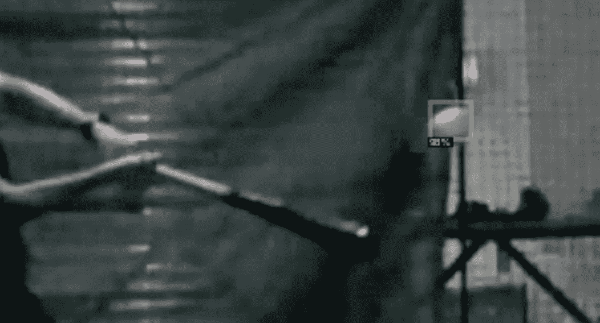
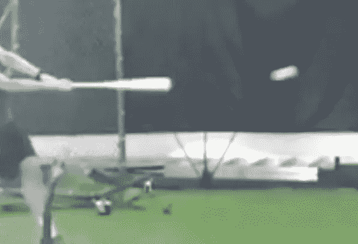
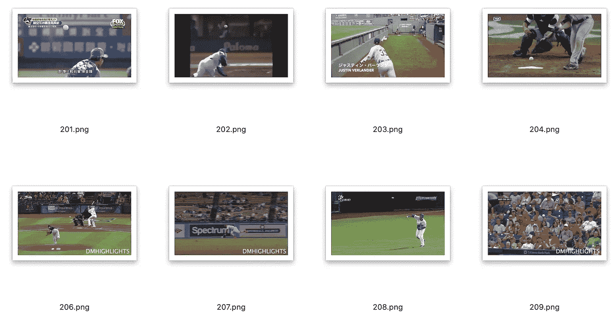
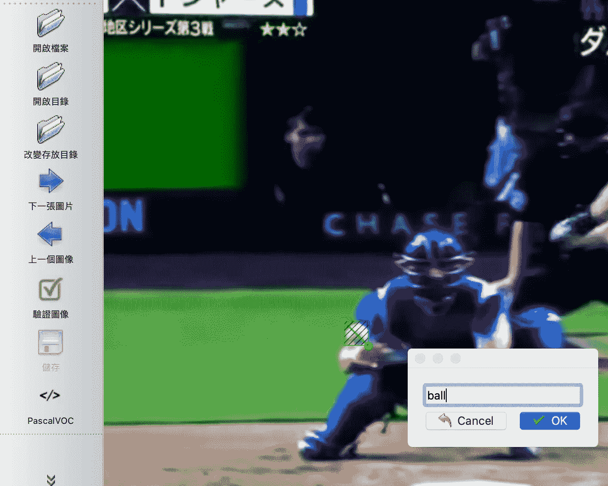
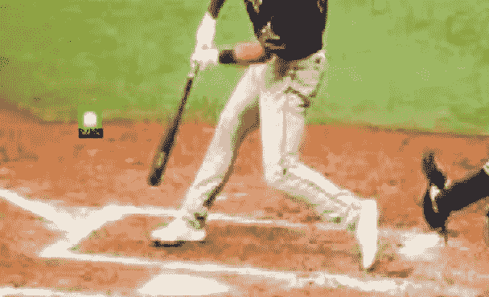

# 如何使用带有自定义数据集的 detector 2 检测图像和视频中的棒球

> 原文：<https://towardsdatascience.com/how-to-build-a-baseball-detector-using-detectron2-50b44edec6b7?source=collection_archive---------27----------------------->

## 使用自定义数据集的 Train Detectron2 对象检测。



作者图片

# 介绍

作为一个业余棒球运动员，我总是想分析我的投球和挥杆，以量化我在练习中的技能。实际上有一些应用不同技术的商业工具可以做到这一点，但是，它们中的大多数都非常昂贵，并且需要额外的设备。

我想知道我是否可以从一个简单的手机视频中分析我的运动。为此，我需要从视频中收集信息。首先，我想检测棒球并确定它的位置，然后我可以做进一步的分析，如发射速度和角度。

在这篇文章中，我将展示如何创建一个定制的棒球数据集，训练一个对象检测模型，并使用 detectron 2([https://github.com/facebookresearch/detectron2](https://github.com/facebookresearch/detectron2))将其应用于棒球视频。

棒球检测器是按照三个步骤构建的，这将在本文中详细讨论:
1 .创建 COCO 格式的自定义棒球数据集
2。玩探测器 2，并在 Colab
3 训练模型。加载视频/图像并应用训练好的模型进行检测。

# 以 COCO 格式创建自定义棒球数据集

真实视频剪辑中的棒球图像通常不是清晰和完美的。它可能有点模糊和扭曲，如下所示。因此，不使用 Detectron 2 提供的预训练模型。为了更好地检测，我决定创建一个包含视频中真实棒球图像的数据集。



来自挥动棒球的视频截图(图片由作者提供)

首先，我在 Youtube 上使用了一些棒球比赛视频，并在第一次尝试中获得了 120 张包含棒球的图像。



从视频剪辑中捕获的训练图像。

然后我用[标签](https://github.com/tzutalin/labelImg)手工给棒球贴标签。Labelimg 是一种方便的标记对象的工具。按照回购中的说明，它可以很容易地安装和使用。



使用标签标记棒球

1.  选择“PascalVOC”，这是默认的注释格式。
2.  打开包含图像的文件夹
3.  设置保存注释的文件夹
4.  标记球并保存注释

我花了大约 20 分钟来手动标记 120 张图片，然后将注释保存在您用 xml 设置的文件夹中。

然后我使用 Tony607 的 GitHub repo 中的这个 [voc2coco.py](https://github.com/Tony607/voc2coco/blob/master/voc2coco.py) 脚本将 PascalVOC xml 文件转换成一个 coco 格式的 JSON 文件。

现在，我必须用 COCO 格式的注释定制棒球数据集，为训练做好准备。

# 使用 Colab 中的 Detectron2 训练模型

我修改了 Detectron2 的好看又清晰的[教程 Colab 笔记本](https://colab.research.google.com/drive/16jcaJoc6bCFAQ96jDe2HwtXj7BMD_-m5)并训练了模型。

首先，我将我的 Google Drive 安装到笔记本上，并将我创建的数据集上传到上面。

```
from google.colab import drive
drive.mount('/content/gdrive', force_remount=True)
root_dir = 'gdrive/My Drive/Colab Notebooks/'
base_dir = root_dir + 'baseball_detection'
```

然后，我按照笔记本上的说明安装和设置 detectron2。

```
# install dependencies:
!pip install pyyaml==5.1 pycocotools>=2.0.1
import torch, torchvision
print(torch.__version__, torch.cuda.is_available())
!gcc --version
# opencv is pre-installed on colab# install detectron2: (colab has CUDA 10.1 + torch 1.5)
# See https://detectron2.readthedocs.io/tutorials/install.html for instructions
assert torch.__version__.startswith("1.5")
!pip install detectron2==0.2 -f https://dl.fbaipublicfiles.com/detectron2/wheels/cu101/torch1.5/index.html# Some basic setup:
# Setup detectron2 logger
import detectron2
from detectron2.utils.logger import setup_logger
setup_logger()
# import some common libraries
import numpy as np
import os, json, cv2, random
from google.colab.patches import cv2_imshow
# import some common detectron2 utilities
from detectron2 import model_zoo
from detectron2.engine import DefaultPredictor
from detectron2.config import get_cfg
from detectron2.utils.visualizer import Visualizer
from detectron2.data import MetadataCatalog, DatasetCatalog
```

然后我将球数据集注册到 detectron2。输入注释文件路径(COCO json)和包含训练图像的文件夹路径。

```
from detectron2.data.datasets import register_coco_instances
register_coco_instances("ball", {}, path/'image'/'output.json', path/'image')
```

然后打电话

```
ball_metadata = MetadataCatalog.get("ball")
dataset_dicts = DatasetCatalog.get("ball")
```

然后我运行这个单元来查看训练图像

```
for d in random.sample(dataset_dicts, 3):
   img = cv2.imread(d["file_name"])
   visualizer = Visualizer(img[:, :, ::-1], metadata=ball_metadata,    scale=0.5)
   out = visualizer.draw_dataset_dict(d)
   cv2_imshow(out.get_image()[:, :, ::-1])
```


标签图像。

我现在准备好训练了！

我在棒球数据集上微调了 COCO 预训练的 R50-FPN 面具 R-CNN 模型。我得到了配置和重量使用模型 _ 动物园的方法。记得换 cfg。模型。ROI_HEADS。NUM_CLASSES 设置为 1，因为我现在只有一个类。我花了几分钟在 Colab 上运行 2000 次迭代。

```
from detectron2.engine import DefaultTrainercfg = get_cfg()
cfg.merge_from_file(model_zoo.get_config_file("COCO-Detection/faster_rcnn_R_50_FPN_3x.yaml"))
cfg.DATASETS.TRAIN = ("ball",)
cfg.DATASETS.TEST = ()
cfg.DATALOADER.NUM_WORKERS = 2
cfg.MODEL.WEIGHTS = model_zoo.get_checkpoint_url("COCO-Detection/faster_rcnn_R_50_FPN_3x.yaml")   # Let training initialize from model zoo
cfg.SOLVER.IMS_PER_BATCH = 2
cfg.SOLVER.BASE_LR = 0.00025  # pick a good LR
cfg.SOLVER.MAX_ITER = 2000    # 300 iterations seems good enough for this toy dataset; you may need to train longer for a practical dataset
cfg.MODEL.ROI_HEADS.BATCH_SIZE_PER_IMAGE = 128   # faster, and good enough for this toy dataset (default: 512)
cfg.MODEL.ROI_HEADS.NUM_CLASSES = 1  # only has one class (ball)os.makedirs(cfg.OUTPUT_DIR, exist_ok=True)
trainer = DefaultTrainer(cfg)
trainer.resume_or_load(resume=False)
trainer.train()
```

我可以在 tensorboard 上看到训练表演

```
# Look at training curves in tensorboard:
%load_ext tensorboard
%tensorboard --logdir output
```

现在，我可以在球验证数据集上使用训练好的模型进行推理。首先，让我们使用我刚刚训练的模型创建一个预测器:

```
cfg.MODEL.WEIGHTS = os.path.join(cfg.OUTPUT_DIR, "model_final.pth")
cfg.MODEL.ROI_HEADS.SCORE_THRESH_TEST = 0.5   # set a custom testing threshold for this model
cfg.DATASETS.TEST = ("ball", )
predictor = DefaultPredictor(cfg)
```

选择一些测试图像来测试模型

```
im = cv2.imread('gdrive/My Drive/Colab Notebooks/baseball_detection/test/1.png')
outputs = predictor(im)
v = Visualizer(im[:, :, ::-1],
  metadata=ball_metadata,
  scale=1)
out = v.draw_instance_predictions(outputs["instances"].to("cpu"))
cv2_imshow(out.get_image()[:, :, ::-1])
```

且看结果！



被训练模型检测到的棒球。

# 加载视频/图像，应用训练好的模型进行检测

现在我有了训练好的模型，我可以加载我想要进行检测的图像/视频。

我编写了一个脚本，使用 OpenCV 逐帧读取视频，并使用每一帧的模型检测棒球。所以我现在有了检测到的棒球的信息，例如每一帧的位置，以便进一步分析。我还可以输出棒球检测视频！


# 未来工作:

1.  应用对象跟踪来跟踪球

[](/detect-and-track-baseball-using-detectron2-and-sort-6dd92a46e6f2) [## 检测和跟踪棒球使用探测器 2 和排序

### 当视频中有多个棒球时，我如何跟踪棒球。

towardsdatascience.com](/detect-and-track-baseball-using-detectron2-and-sort-6dd92a46e6f2) 

1.  计算球的速度和发射角度
2.  一些快速移动的球不能被识别，这可能有助于扩展训练数据集并包括一些快速移动的、扭曲的和模糊的球
3.  构建 web 应用程序

感谢阅读。欢迎反馈和建议！