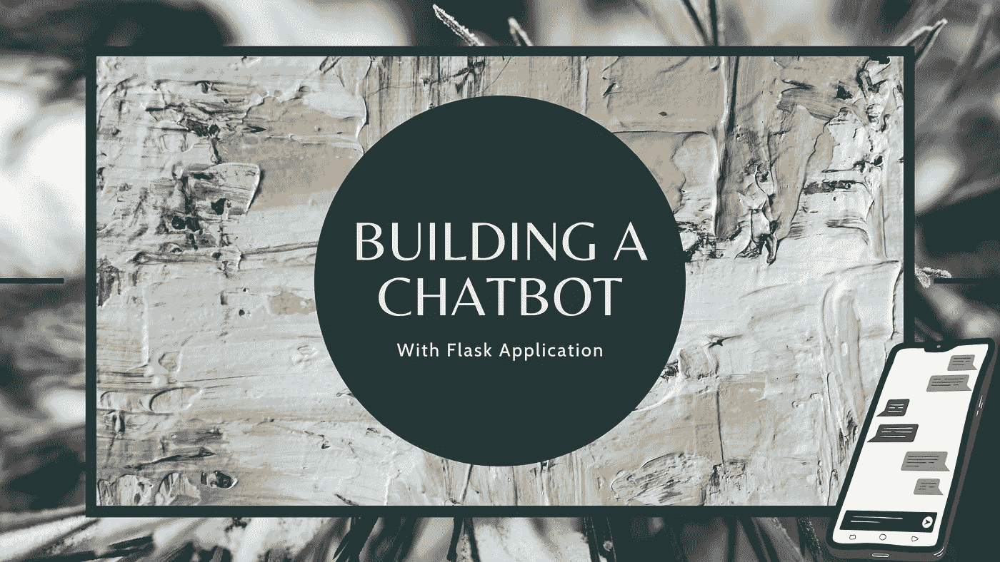
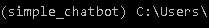
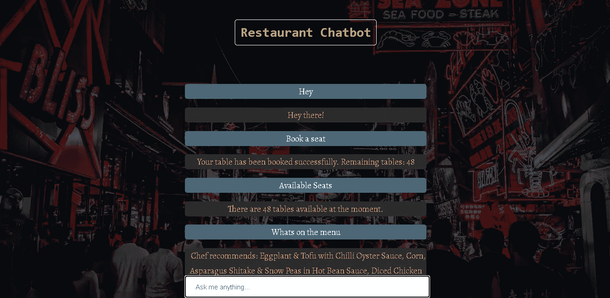

# 如何从头开始构建一个基本的聊天机器人

> 原文：<https://towardsdatascience.com/how-to-build-a-basic-chatbot-from-scratch-f63a2ccf5262?source=collection_archive---------9----------------------->

## 从文本预处理、构建模型到使用 AJAX 的成熟 Flask web 应用程序



封面图片(来源:作者)

无论是 Whatsapp 聊天、Telegram group、Slack channel 还是任何产品网站，我相信你都遇到过突然冒出来的这些机器人。你问一些问题，它会尽力解决你的疑问。今天，我们将尝试构建一个聊天机器人，它可以响应一些基本的查询并实时响应。

让我们假设我们将为一家餐馆建造一个聊天机器人。我们的客户对聊天机器人有一定的要求。

该机器人应该能够:

1.  问候网站上的访问者。
2.  预定座位。
3.  显示可用座位。
4.  显示菜单上有什么。
5.  显示工作时间。
6.  显示联系信息。
7.  显示餐馆的位置。

最终，我们的聊天机器人会是这样的:

聊天机器人演示(来源:作者)

如果你对自然语言处理(NLP)、深度学习中的全连接层和 Flask 框架有基本的了解，这个项目对你来说将是轻而易举的。即使你不熟悉这些术语，我也会尽力用简单的语言解释一切，并尽可能链接有用的资源。

话虽如此，让我们开始构建我们的聊天机器人。

# **训练数据**

现在是时候看看我们在这里处理什么样的数据了。构建聊天机器人所需的数据与我们通常看到的传统数据集略有不同。每台智能机器都需要它能看到和解释的数据。我们不会为这个项目下载任何特定的数据集。我们已经有了一小组数据。让我们来看看。

这是我们数据的一个例子。它是一个 JSON 格式的文件，通常用于存储和传输数据。这里需要注意的三个重要术语是**、【标签】、**、【模式】、**、【响应】、**。****

用户输入的让聊天机器人解释的任何查询都必须包含在**“模式”**中。

解释完用户的查询后，聊天机器人必须回复该查询，该回复将从**“响应”**中的一组预定义回复中随机选择。

**“tag”**将一组相似的模式和对特定类别的响应进行分组，以便模型更容易预测特定模式代表哪个类别。

您现在可以将下面给出的数据复制到一个文件中。我将我的文件命名为“intents.json”。

正如你所看到的，这里提供的数据符合我们客户的所有要求。我有意将标记“menu”、“book_table”和“available_tables”的响应设置为空列表。我将在我们的项目中稍后解释原因。

有了这些数据，我们现在可以训练我们自己的神经网络，它会预测并尝试将其分类到文件中的一个标签中。一旦标签已知，将从该标签中选择一个随机响应并显示给用户。您可以向该数据中添加任何其他标签。只要确保语法没有错。您提供的标签、模式和响应越多，聊天机器人就越强大。

现在您已经熟悉了数据，让我们使用 Python 将它加载到内核中。我使用的版本是 Python 3.6。

# 设置

在开始编写任何代码之前，建议设置一个虚拟环境，这样我们将要安装的任何库都不会与现有的库冲突，也不会导致任何冗余问题。

我将使用 conda 创建一个虚拟环境。([看这里](https://docs.anaconda.com/anaconda/install/windows/)关于如何安装 Anaconda。)

打开命令提示符并输入命令。

```
conda create -n simple_chatbot python=3.6
```

这里“simple_chatbot”是虚拟环境的名称。你可以给它起任何你喜欢的名字。

要激活这个虚拟环境，只需输入:

```
conda activate simple_chatbot
```

一旦激活，您的环境的名称应该显示在左侧，如下所示:



括号中的环境名称(作者截图)

我们将使用 pip 来安装以下库:

*   numpy==1.16.5
*   nltk==3.4.5
*   张量流==1.13.2
*   tflearn==0.3.2
*   烧瓶==1.1.1

为了安全起见，我还添加了库的版本。

```
pip install packagename==version //Enter packages mentioned above
```

现在我们已经准备好了，让我们开始研究代码。

# 导入库和加载数据

现在，我们将导入一些加载、处理和转换数据所需的库，然后将其输入深度学习网络。只需记住将 JSON 文件保存在 python 文件所在的目录中。我将把我的文件命名为“main.py”。

# 文本预处理

现在，我们必须将“标签”和“模式”从文件中取出，并将其存储在一个列表中。我们还将收集模式中的独特单词来创建一个单词包(弓)向量。

在上面的代码中，我们创建了四个空列表。

1.  **单词:**保存了一个独特的单词列表。
2.  **标签:**保存文件中所有唯一标签的列表。
3.  **docs_x:** 保存模式列表。
4.  **docs_y:** 保存对应于 docs_x 中模式的标签列表。

当我们遍历数据时，我们将所有模式转换成小写，标记每个模式，然后将它们添加到各自的列表中。我们还同时将模式的标签添加到 docs_y 中。

## 堵塞物

既然我们已经把单词放在了列表中，是时候对它们进行词干分析了。词干基本上是试图找到一个词的词根。它删除了一个单词的所有前缀和后缀，因此我们正在构建的模型将获得该单词的大致概念，而不是陷入同一单词不同形式的所有错综复杂的关系中。有不同类型的茎干工，如波特·斯特梅尔、斯诺鲍·斯特梅尔、兰卡斯特·斯特梅尔等。我们将在代码中使用兰开斯特·斯特梅尔。(点击了解更多关于词干分析器的信息[。)](/stemming-vs-lemmatization-8b30c1d3795a)

## …向量化…

众所周知，机器学习和深度学习模型只接受数字输入。所以我们必须把这个词干列表转换成某种数字输入，这样我们就可以把它输入到神经网络中。这就是单词包、TF-IDF、Word2vec 等矢量化方法的用武之地。

我们将在代码中使用单词包(BoW)。它基本上描述了一个单词在文档中的出现。在我们的例子中，我们将用列表“words”中收集的所有独特单词的长度列表来表示每个句子。列表中每个位置将是“单词”中的唯一单词。如果一个句子由一个特定的单词组成，它们的位置将被标记为 1，如果一个单词不在那个位置，它将被标记为 0。

但是使用这种方法，模型只能理解句子中出现的单词。句子内单词的顺序会丢失，因此得名“单词包”。其他方法如 TF-IDF、Word2Vec 试图以自己的方式捕获这些丢失的语义。我建议您也尝试一下其他矢量化方法。

类似地，对于输出，我们将创建一个列表，它是 JSON 文件中标签/标记的长度。任何这些位置中的“1”表示该特定标签/标记中的图案的归属。

我们还将把所有处理过的数据保存在一个 pickle 文件中，以便以后可以用来处理来自用户的输入。

# 建立模型

既然我们已经完成了数据预处理，那么是时候构建一个模型并将预处理后的数据输入其中了。网络架构并不太复杂。我们将使用完全连接的层(FC 层)，其中两个是隐藏层，一个给出目标概率。因此，最后一层将有一个 softmax 激活。

您可以随意摆弄架构和数字，以获得符合您需求的模型。您还可以选择在文本预处理中增加一些步骤，以便从数据中获得更多信息。试错的次数越多，你对架构的理解就越好。

我们现在要做的就是把数据输入这个模型，然后开始训练。我们将纪元设置为 200，批量设置为 8。同样，您可以试验这些数字，并为您的数据找到正确的数字。训练后，我们将把它保存在磁盘上，这样我们就可以在 Flask 应用程序中使用训练好的模型。

如果一切顺利，工作目录中应该有名为“model.tflearn.data”、“model.tflearn.index”和“model.tflearn.meta”的文件。

您的“main.py”文件应该如下所示:

# 建筑用烧瓶应用

现在我们已经训练了我们的深度学习模型，是时候将其集成到 web 应用程序中了。我们将在这里使用的框架是 Flask。现在解释如何构建 Flask 应用程序需要一系列的文章，所以我不会在这里做。然而，我将确保在下面的“参考资料”一节中包含我在构建这个应用程序时参考的所有资源。

这里有一个[链接](https://github.com/iampratheesh/Restaurant-Chatbot)到我的 GitHub 库，在这里你可以访问所有的文件来构建 Flask 应用程序。我建议您将所有文件复制到您的工作目录中，以便它可以访问已训练的模型和 pickle 文件。

我们将使用 AJAX 进行异步数据传输，也就是说，你不必每次向模型发送输入时都重新加载网页。web 应用程序将无缝地响应您的输入。让我们来看看 HTML 文件。

看看 JavaScript 部分，我们从用户那里获得输入，将其发送到“app.py”文件，在那里输入给训练好的模型，然后接收输出，在应用程序上显示它。

“app.py”文件是所有路线被提及的地方，输入数据被处理(词干和单词包)，并被馈送到模型以进行输出。让我们来看看。

我们首先导入所有需要的库，然后加载保存预处理数据的 pickle 文件。这将需要为输入数据创建 BoW 矢量。然后，我们定义一个函数“单词包”,其中我们提供用户输入，并获得一个 BoW 向量作为输出。

还记得空响应的标签“menu”、“book_table”和“available_tables”吗？我们这样做是为了在这些标签中提供对问题的定制响应。

对于与菜单上有什么相关的问题，我们首先会检查今天是星期几，然后根据这个信息，聊天机器人会推荐当天的特色菜。

当用户请求预订一张桌子时，我们将计数器“seat_count”减 1。现在，当然，这不是预订的工作方式，但演示的目的是展示我们可以使用这个聊天机器人的可能性。你可以把这个机器人连接到一个数据库，并据此进行预订。或者您可以根据自己的需求添加任何其他任务。询问可用的桌子只是显示“seat_count”的当前值。每当您重置 Flask 服务器时，计数器都会回到 50。这样做是为了说明您不必总是依赖 JSON 文件来获得响应。

一旦设置完成，只需运行“app.py”文件，Flask 服务器就可以运行了。它应该是这样的:



Flask Web 应用程序(来源:作者)

# 结论

这个项目终于完成了，并且像预期的那样工作。然而，这里有很多东西你可以调整和微调。我很想听听你能给这个聊天机器人增加什么额外的功能，或者你对这个项目做的任何其他修改。你可以将这个聊天机器人连接到一个数据库，或者将其与任何网站集成。除了使用单词包，您还可以使用其他矢量化方法，如 TF-IDF、Word2Vec 等。这些方法很有可能会提高模型预测标签的准确性。

正如承诺的那样，我还列出了我在构建这个应用程序时参考的所有博客和视频。这肯定会帮助你更深入地了解这个项目及其运作。

# 参考

1.  [带 Tensorflow 的上下文聊天机器人](https://chatbotsmagazine.com/contextual-chat-bots-with-tensorflow-4391749d0077)
2.  [烧瓶教程](http://youtube.com/playlist?list=PL-osiE80TeTs4UjLw5MM6OjgkjFeUxCYH)作者[科里·斯查费](https://www.youtube.com/user/schafer5)
3.  使用 Flask 在 Python 中构建聊天机器人
4.  [用 jQuery 和 Flask 提交 AJAX 表单](https://www.youtube.com/watch?v=IZWtHsM3Y5A)