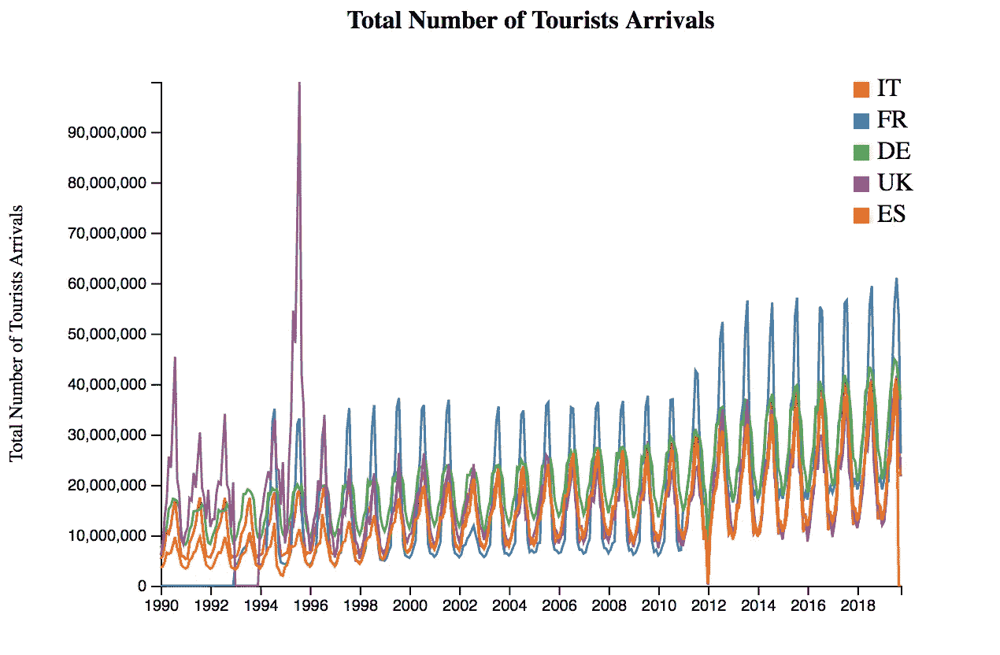
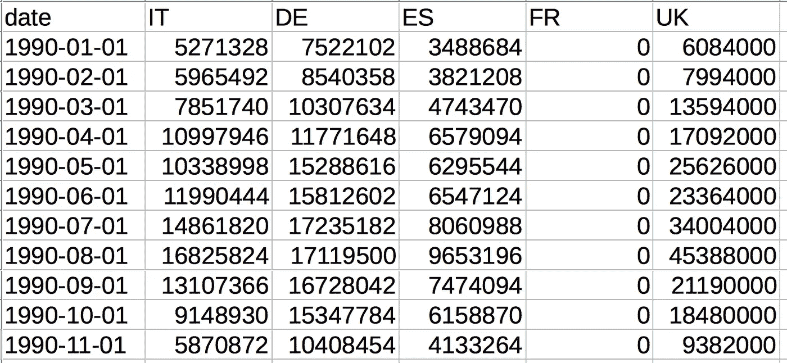

# 如何在 D3.js 中构建基本行

> 原文：<https://towardsdatascience.com/how-to-build-a-basic-line-in-d3-js-38f67055043f?source=collection_archive---------46----------------------->

## 数据可视化

## 关于如何开始使用流行的 Javascript 库进行数据可视化的一些技巧。


马库斯·温克勒在 [Unsplash](https://unsplash.com?utm_source=medium&utm_medium=referral) 上拍摄的照片

在处理数据时，最重要的一个方面是数据的表示。因此，数据可视化有不同的工具和技术。在本教程中，我将向您展示如何在 [D3.js](https://d3js.org/) 中构建一个基本行。D3.js 是 javascript 中最强大的数据可视化库之一。在[这个链接](https://observablehq.com/@d3/learn-d3)你可以找到一些学习 D3.js 的基础教程。

代码可以从[我的 Github 库](https://github.com/alod83/dj-infouma/blob/master/DataVisualization/BasicLineChart.html)下载，它是从 d3 数据图库中提取的[这个例子](https://www.d3-graph-gallery.com/graph/line_several_group.html)的自由灵感。



# 入门指南

## HTML 页面的数据描述和构建

首先，我们从数据开始。我们考虑了 1990 年至 2019 年意大利、法国、西班牙、德国和英国游客人数的相关数据。



我们有一个日期列和另外 5 个列，每个国家一个。然后我们开始构建 HTML 代码:

```
<!DOCTYPE html>
<html>
  <head>
     <meta charset="utf-8">
     <script src="[https://d3js.org/d3.v4.js](https://d3js.org/d3.v4.js)"></script>
 </head>
 <body>
     <div id="line"></div>
 </body>
</html>
```

# 绘制基本的 SVG 对象

## 定义边距并将 SVG 对象追加到 HTML div 中

注意，我们使用 d3 的版本 4。在`body`中，我们创建了一个包含该行的`div`。现在我们可以写脚本了，它将被插入到`body`中。

我们设置图形的尺寸和边距:

```
var margin = {top: 50, right: 30, bottom: 30, left: 100},
    width = 600 - margin.left - margin.right,
    height = 400 - margin.top - margin.bottom;
```

我们将一个`svg`元素添加到在 HTML 代码中创建的`div`中，并指定它们的尺寸。我们还将一个分组元素`g`添加到`svg`中，并将其转换为`margin.left`和`margin.top`:

```
var svg = d3.select("#line")
    .append("svg")
    .attr("width", width + margin.left + margin.right)
    .attr("height", height + margin.top + margin.bottom)
    .append("g")
    .attr("transform",
          "translate(" + margin.left + "," + margin.top + ")");
```

# 加载和格式化数据

## 从 CSV 加载数据，并根据应用程序的使用情况对其进行格式化

现在我们可以通过使用函数`d3.csv(data, preprocessing_function, processing_function)`读取 CSV，其中`data`表示 CSV 数据，`preprocessing_function`允许根据一些标准格式化数据，`processing_function`执行构建图形所需的操作。

我们定义了下面的`preprocessing_function`(注意我们省略了函数名，因为我们将它放在`d3.csv`函数中，不需要名字):

```
 function(d){
    return { 
      date : d3.timeParse("%Y-%m-%d")(d.date), 
      IT : d.IT , 
      FR : d.FR, 
      DE : d.DE, 
      ES : d.ES, 
      UK : d.UK}
  },
```

我们所做的唯一有用的事情是将日期解析为对象日期。其他字段保持不变。现在我们可以定义`processing_function`。此功能需要 CSV 文件中包含的输入数据。

# 向图表添加轴和标题

## 将 X 轴和 Y 轴添加到图表中，并定义它们的范围和域。也添加一个标题

我们加上 X 轴，使用时间刻度。我们定义了域和范围，域包含轴的可能值的范围，范围包含轴在 svg 图像中的维度。

```
var x = d3.scaleTime()
      .domain(d3.extent(data, function(d) { return d.date; }))
      .range([ 0, width ]);
```

我们将轴附加在 svg 对象的底部:

```
svg.append("g")
      .attr("transform", "translate(0," + height + ")")
      .call(d3.axisBottom(x));
```

类似地，我们构建 y 轴，其中域由数据中的最大值指定。在我们的例子中，最大值由英国系列给出:

```
var y = d3.scaleLinear()
      .domain([0, d3.max(data, function(d) { return +d.UK; })])
      .range([ height, 0 ]);
```

我们将 y 轴附加到 svg 对象的左侧:

```
svg.append("g")
     .call(d3.axisLeft(y));
```

现在我们为 y 轴构建一个标签，我们将它旋转 90 度，并将其附加到 svg 对象上。

```
svg.append("text")
      .attr("transform", "rotate(-90)")
      .attr("y", 0 - margin.left)
      .attr("x",0 - (height / 2))
      .attr("dy", "1em") 
      .attr("font-size", "12px")
      .style("text-anchor", "middle")
      .text("Total Number of Tourists Arrivals");
```

我们还可以添加一个标题，只需在 svg 对象的顶部添加另一个文本:

```
svg.append("text")
      .attr("y", 0 - margin.top)
      .attr("x",(width / 2))
      .attr("dy", "1em")
      .attr("font-weight", "bold")
      .attr("font-size", "16px")
      .style("text-anchor", "middle")
      .text("Total Number of Tourists Arrivals for Italy");
```

# 向图表添加线条

## 为每个国家添加一行

我们可以为每个国家定义不同的颜色。这可以通过定义调色板来实现。我们定义了一个名为`countries`的数组，包含所有的国家标识符。

```
var countries = ['IT', 'FR','DE','UK','ES'];

var color = d3.scaleOrdinal()
     .domain(countries)
     .range(['#e41a1c','#377eb8','#4daf4a','#984ea3','#ff7f00'])
```

我们可以为每个国家添加一行。我们使用名为`path`的 svg 元素，并定义它的属性。注意颜色因国家而异。

```
for(var i = 0; i < countries.length; i++)
 {
     svg.append("path")
       .datum(data)
       .attr("fill", "none")
       .attr("stroke", function(d){ return color(countries[i]) })
       .attr("stroke-width", 1.5)
       .attr("d", d3.line()

        .x(function(d) { return x(d.date) })
        .y(function(d) { return y(d[countries[i]]) })
        )
 }
```

# 向图表添加图例

## 画图例来理解线条

我们也可以画一个图例。图例由指定颜色的矩形和指定国家标识符的文本组成。

```
var lineLegend = svg.selectAll(".lineLegend").data(countries)
     .enter().append("g")
     .attr("class","lineLegend")
     .attr("transform", function (d,i) {
      position = width - margin.right
            return "translate(" + position + "," + (i*20)+")";
        });lineLegend.append("text").text(function (d) {return d;})
     .attr("transform", "translate(15,9)"); //align texts with boxeslineLegend.append("rect")
     .attr("fill", function (d, i) {return color(d); })
     .attr("width", 10).attr("height", 10);
```

# 摘要

在本教程中，我演示了用 d3.js 构建基本折线图的过程，这是一个低级 js 库，用于操作 HTML 和构建非常强大的 SVG 对象。总而言之，构建图表的步骤如下:

*   在 HTML 页面上，静态创建一个`div`标记，它将包含 JS 脚本中的图表
    :
*   例如从 CSV 文件中读取数据
*   根据数据的用途格式化数据
*   检索 div 并挂起一个`svg`对象
*   将 x 轴和 y 轴挂在`svg`对象上，并给它们分配域(一组可能的值)和范围(尺寸)
*   在`svg`对象上挂一条线、一个矩形或一个点作为每个数据
*   在`svg`物体上挂一个图例(可能)
*   在`svg`物体上挂一个标题。

# 相关文章

[](https://medium.datadriveninvestor.com/getting-started-with-d3-js-maps-e721ba6d8560) [## D3.js 地图入门

### 用流行的 Javascript 库构建交互式 Choropleth 地图的快速教程

medium.datadriveninvestor.com](https://medium.datadriveninvestor.com/getting-started-with-d3-js-maps-e721ba6d8560) [](/how-to-build-a-dynamic-bar-chart-in-observablehq-through-sqlite3-f8f8b6509ac8) [## 如何通过 sqlite3 在 Observablehq 中构建动态条形图

### 一个现成的笔记本，利用了 Observablehq 提供的最新 sqlite3 特性

towardsdatascience.com](/how-to-build-a-dynamic-bar-chart-in-observablehq-through-sqlite3-f8f8b6509ac8) [](/how-to-insert-an-observablehq-graph-into-a-html-page-57a9f4546ecf) [## 如何将 Observablehq 图形插入 HTML 页面

### 一个快速的教程，用你的观察制作精彩的 HTML 页面。

towardsdatascience.com](/how-to-insert-an-observablehq-graph-into-a-html-page-57a9f4546ecf) 

# 你知道你可以给你的 d3 图添加注释吗？

你可以使用 d3 注释库。

在这里继续阅读。

# 保持联系！

*   跟着我上[媒](https://medium.com/@alod83?source=about_page-------------------------------------)
*   注册我的[简讯](https://medium.com/subscribe?source=about_page-------------------------------------)
*   在 [LinkedIn](https://www.linkedin.com/in/angelicaloduca/?source=about_page-------------------------------------) 上连接
*   在推特上关注我
*   跟着我上[脸书](https://www.facebook.com/alod83?source=about_page-------------------------------------)
*   在 [Github](https://github.com/alod83?source=about_page-------------------------------------) 上关注我