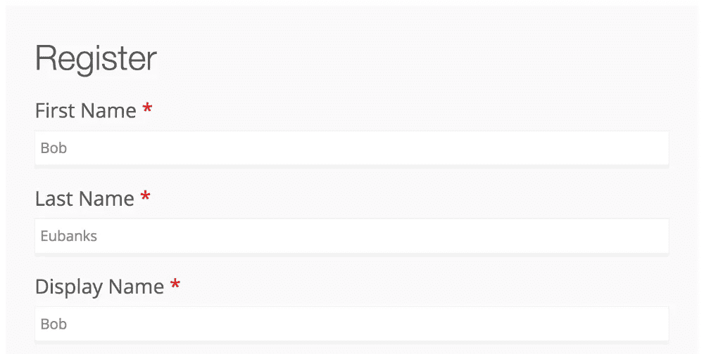
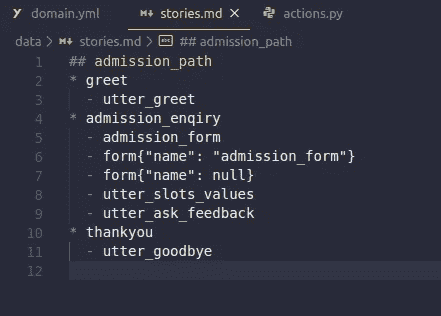
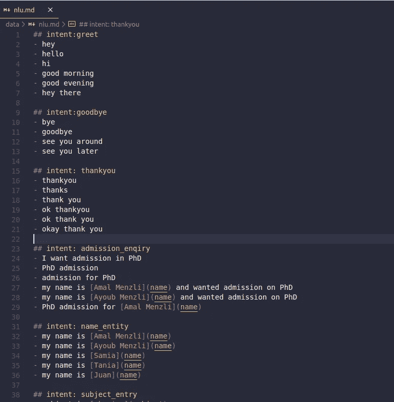
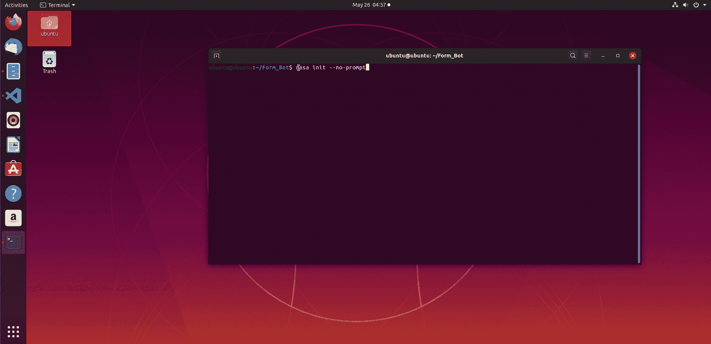
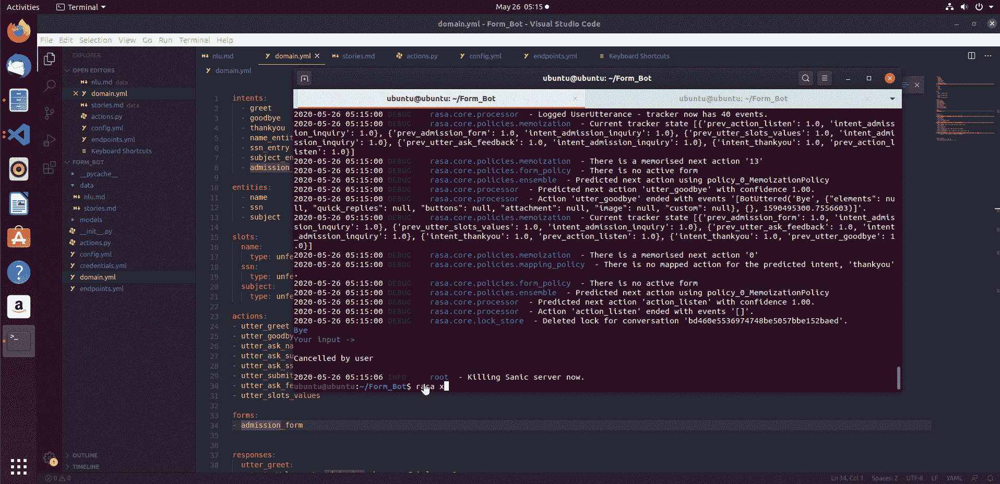

# 如何使用 RASA 表单构建上下文助手

> 原文：<https://towardsdatascience.com/how-to-build-a-contextual-assistant-using-rasa-forms-82e014a10dea?source=collection_archive---------30----------------------->

## 一个超级简单的指南，创建一个带有表单集成的信息检索聊天机器人。


我们非常清楚聊天机器人是这一代人的未来，我相信每个人都必须知道聊天机器人如何工作的基本知识。这正是我这篇文章的目的，我希望读完这篇文章后，你可以构建自己的机器人。

# 介绍

你可以在 RASA 上找到很多使用 RASA APIs 构建聊天机器人的教程。但是我最近没有发现任何详细讨论和简化我的研究的东西，比如对我来说最重要的安装问题。

在这篇文章中，我很乐意与你分享我用 Rasa 框架构建聊天机器人的旅程，在这个过程中，我们将从用户那里收集一些信息。我们将从安装部分开始，直到与机器人交谈。

# 目录

1.  信息检索聊天机器人
2.  RASA 框架概述
3.  安装 Rasa 及其依赖项
4.  构建使用表单接收用户信息的聊天机器人

# 信息检索聊天机器人

聊天机器人是一种计算机程序或人工智能，它通过听觉或文本方法进行对话。这类程序通常被设计成令人信服地模拟人类作为对话伙伴的行为。聊天机器人通常在对话系统中用于各种实际目的，包括客户服务或信息获取。一些聊天机器人使用复杂的自然语言处理系统，但许多更简单的系统会扫描输入中的关键词，然后从数据库中提取最匹配的关键词或最相似的措辞模式进行回复。关于聊天机器人定义的更多细节和更基本的理解，如*什么是意图？和实体？你可以在这个[链接](https://medium.com/analytics-vidhya/how-i-built-my-first-chatbot-for-slack-using-dialogflow-and-node-js-in-minutes-9ce7e5b81c8c) *查看我之前关于聊天机器人的文章。**

如今，大多数聊天机器人都用于一个特定的应用程序，从用户那里收集一些信息，以便提供一些东西(预订餐馆、搜索数据库等)。).这也叫**槽填充。这类机器人旨在提供类似人类的答案，无需人工干预。在这里，系统试图理解你想问什么问题。并给你这样的表格来保存你的具体信息。**



网站注册表格示例:图片[来源](https://docs.easydigitaldownloads.com/article/959-frontend-submissions-registration-form-editor)

在本文中，我们将构建一个聊天机器人来填充这样一个简单的表格，以供学习之用。所以你要跟我到最后。

# RASA 框架概述

RASA 是一个开源的对话式人工智能框架。我最喜欢这个框架的是数据隐私，在这里你不需要担心把你的数据放在别人的云中——像微软 Luis 或者亚马逊 Lex。目前，有 3 种人工智能助手:

*   **通知助手:**能够发送简单的通知，如文本消息，推送通知。
*   **常见问题助手:**当今最常见的助手类型。它可以回答简单的问题，比如常见问题。
*   **上下文助手:**能够优雅地处理任何用户目标，并帮助尽可能好地完成它。这意味着它能够理解和响应不同的和意外的输入。

RASA 框架有三个主要组件，它们协同工作来创建上下文助手:

*   **拉莎·NLU:**是自然语言理解。假设用户说“我想订一本书”。NLU 的工作就是接受这些输入，理解用户的意图，并找到输入中的实体。比如上面这句话，意图是*订购*，实体是*一本书*。Rasa NLU 内部使用词袋(BoW)算法来查找意图，使用条件随机场(CRF)来查找实体。尽管您可以使用其他算法通过 Rasa 来查找意图和实体。
*   **RASA 核心:**核心是 RASA 的对话管理组件。它根据 ***【对话状态】*** 和 ***【上下文】*** 决定助理应该如何回应。Rasa Core 通过观察用户和助手之间的对话数据模式进行学习。它不是一堆 if/else 语句，而是使用一个经过示例对话训练的机器学习模型来决定下一步该做什么。
*   RASA X: 是一个工具集，开发人员可以用它来构建、改进和部署 RASA 框架的上下文助手。Rasa X 的好处在于，你可以与真实用户分享你的助手，并收集他们与机器人的对话，让你在不中断机器人在生产中运行的情况下改进它。

**用法:**安装 Rasa 后，你会发现 3 个文件，分别是:

```
domain.yml, stories.md, nlu.md
```

它们分别定义了你的机器人生活的世界，机器人必须遵循的对话主干，以及它被训练来分类意图和实体的数据。

**域:**定义你的机器人运行的宇宙。它准确地指定了:
-你期望对
做出哪些反应-你希望跟踪哪些槽
-你的机器人可以采取哪些行动
***什么是槽？***
**时段**是你想在对话中记录的东西。

**动作:**是你的机器人可以做的事情。例如，操作可以:
-响应用户。
-进行外部 API 调用。
-查询数据库。

**故事:**对话系统的训练数据样本称为故事。这向机器人展示了如何对用户的输入做出反应。它以一个名字开头，名字前面有两个哈希`##`



我们的故事为这篇文章提供了入学查询的例子

**NLU 数据:**用来训练 NLU 的数据。这是它看起来的样子:



我们的 data/nlu.md 文件的屏幕截图

该模型根据这些示例进行训练。黄金法则是，例子越多(每个意图)，预测就越准确。

因此，根据上述 3 个文件的定义和内容，您的机器人将被训练并相应地执行。

# 安装 Rasa 及其依赖项

我在 windows 10 和 Ubuntu 19.04 中都安装了 RASA。老实说，我一直认为开始用 RASA 构建人工智能助手的最快方法是在命令行上，步骤非常简单。
你可以用一个命令同时安装 Rasa (NLU 和内核)和 Rasa X，但是你需要先 ***升级你的 pip，*** 下面是 *Ubuntu 19.04* 中的安装步骤。

```
$python3 -m pip install --user --upgrade pip
$python3 -m pip install --user rasa --default-timeout=100
```

**空间相关性:**有关空间的更多信息，请查看[空间文档](https://spacy.io/usage/models)。您可以使用以下命令安装它:

```
$python3 -m pip install --user -U spacy
$python3 --user -m spacy download en_core_web_sm
```

**恭喜你！您已经成功安装了 Rasa 开源！** 🥳

您现在可以创建新项目了。为此，您只需运行:

```
$mkdir myfirst_Bot
$cd myfirst_Bot
$rasa init --no-prompt
```

`rasa init`创建 Rasa 项目需要的所有文件，并在一些样本数据上训练一个简单的机器人。如果你忽略了`--no-prompt`标志，你将会被问到一些关于你希望你的项目如何建立的问题。

现在，是时候了解一些更高级的 RASA 特性了。

# 构建使用表单接收用户信息的聊天机器人

我们现在知道，上下文助手不仅仅是简单的 FAQ 机器人。它需要收集在正确的上下文中回答用户问题所需的重要细节。在这篇文章中，我将向你展示如何建立一个简单的演示表格机器人，关于录取过程，它会问你的名字，你的 SSN 号码，以及你想学的科目。

那么，如何实现这个聊天机器人呢？🤔很高兴你问了。👇

首先，我们需要创建一个新文件夹，您可以随意命名。然后运行`rasa init`来创建一个 RASA 项目需要的所有文件。

这些表格最棒的地方在于，助理从一个单独的培训故事中学会了如何处理入学途径。为了简化事情，避免冗长乏味的文章，gif 中总结了创建这个聊天机器人的过程，并提供了详细信息。查看下面的 gif 以获得更多说明:💡 👇👇



现在，我们可以尝试 **Rasa X** 进行深入理解，并验证我们的验证函数是否工作正常。👇



而且成功了！！🎉🎉 👏 👏

现在，你也可以创建一个简单但很好的像人一样的对话聊天机器人。😉😉

# 结论

> "一次好的谈话可以永远改变改变的方向." **—琳达·兰伯特。**

这是一个创建使用表单接收信息的对话聊天机器人的教程。现在，我认为你已经有了基本的东西，你可以添加尽可能多的交互性来创建你自己的聊天机器人，用于餐馆预订、医生预约等。

通过这篇文章，我想告诉你创建聊天机器人既不容易也不困难。我们利用 Rasa 的能力，用最少的训练数据创建了一个机器人。Rasa 是一个非常有用的库，你可以试验和修改它来创建一些真正有用的聊天机器人。不要止步于此，继续尝试更多。🤖👩‍💻

***快乐阅读，快乐学习，快乐编码。***

# 在你离开之前:

如果您有任何问题或任何不清楚的地方，请告诉我，如果您想要这个项目的源代码，可以通过我的*[*LinkedIn*](https://www.linkedin.com/in/amal-menzli-3ab655155/)联系我或给我发电子邮件。*

*您也可以查看我之前关于构建聊天机器人的文章:*

*[](https://medium.com/analytics-vidhya/how-i-built-my-first-chatbot-for-slack-using-dialogflow-and-node-js-in-minutes-9ce7e5b81c8c) [## 我如何在几分钟内使用 Dialogflow 和 Node.js 为 Slack 构建我的第一个聊天机器人

### 构建您的第一个货币转换器聊天机器人，并部署在 Slack。

medium.com](https://medium.com/analytics-vidhya/how-i-built-my-first-chatbot-for-slack-using-dialogflow-and-node-js-in-minutes-9ce7e5b81c8c) 

# 参考资料:

1.  RASA 文件( [Rasa 基础知识](https://rasa.com/docs/rasa/user-guide/rasa-tutorial/))。
2.  来自 Justina 的关于如何用 Rasa 构建上下文助手的教程[。](https://blog.rasa.com/building-contextual-assistants-with-rasa-formaction/)*