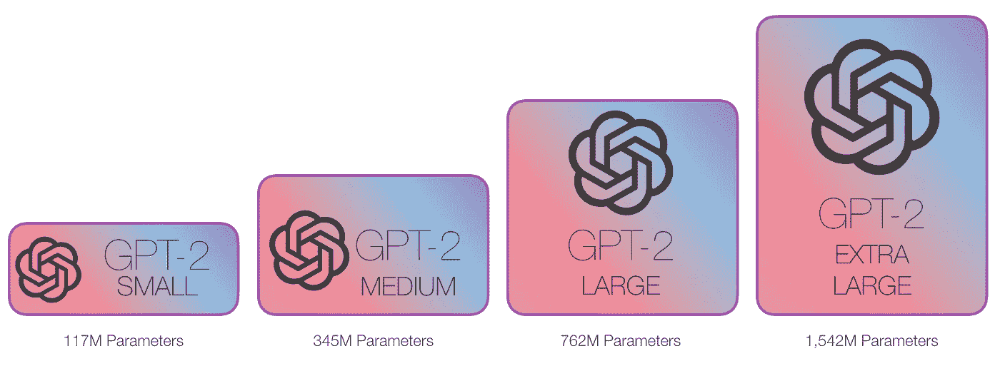
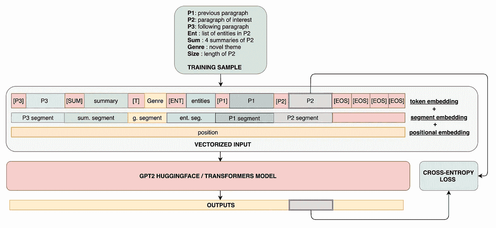
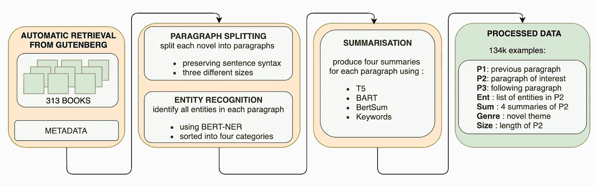
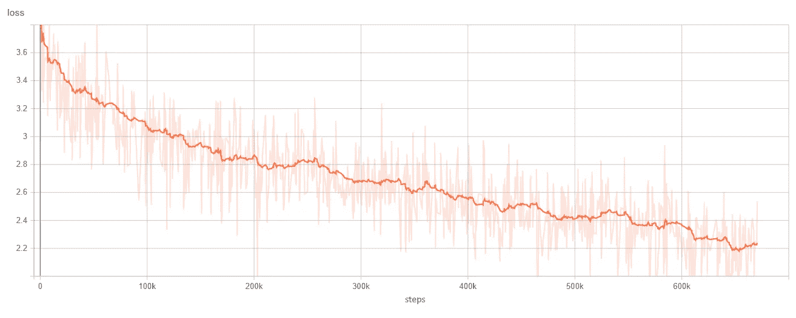
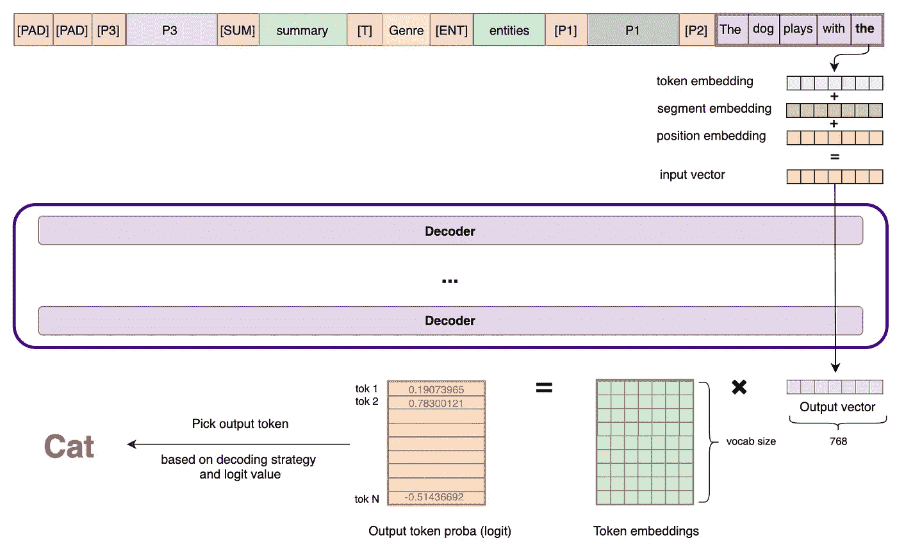
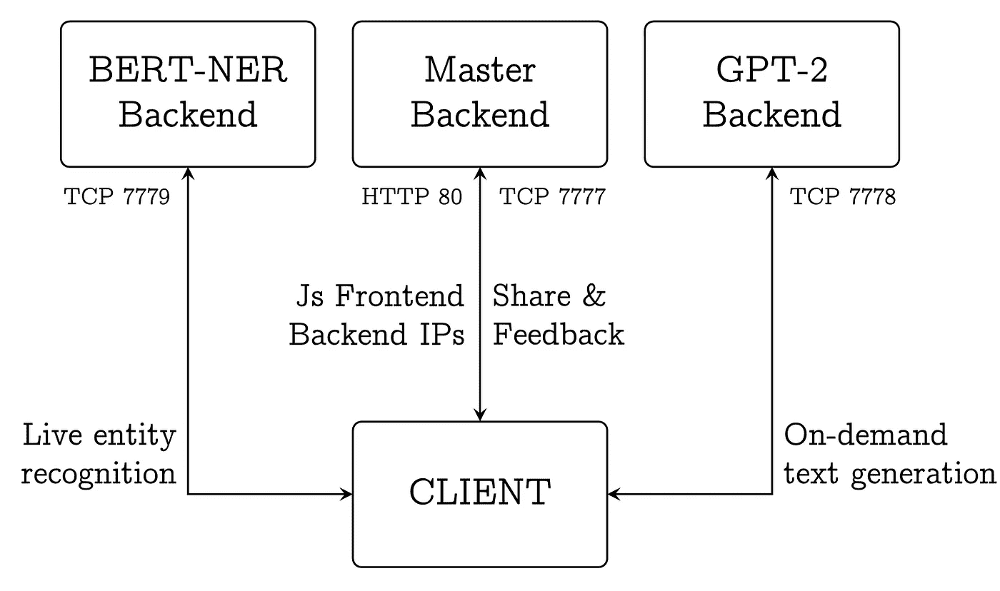
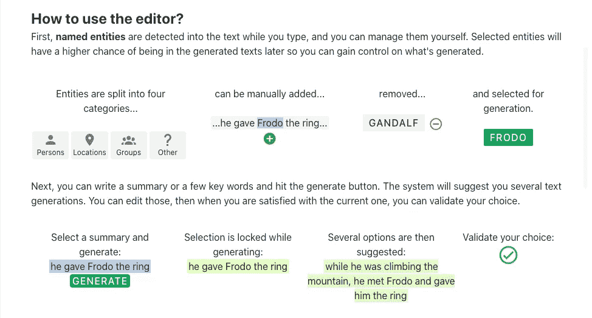

# 如何为小说作者搭建一个可控的写作助手

> 原文：<https://towardsdatascience.com/how-to-build-a-controllable-writing-assistant-for-novel-authors-a9fa15b57c6a?source=collection_archive---------35----------------------->

## [实践教程](https://towardsdatascience.com/tagged/hands-on-tutorials)

## 使用迁移学习和 OpenAI GPT2 构建一个嵌入在开源接口中的最先进的文本生成工具


AITextGenerator —根据周围环境以及指定的实体、类型和大小生成文本—图片由作者提供

**几年前**，创造了一个写作工具，包括使用简单的概率模型和精心设计的语法规则，以便在已知前一个世界的基础上选择下一个世界。除了冗长和挑剔之外，结果极其有限。

随着最近在 NLP 深度学习方面的**进展，我们现在可以摆脱这种琐碎的工作，建立更加强大的文本生成算法🌟正如您将在本教程中看到的。这一进展与**变压器**架构的出现相一致(Vaswani 等人)🏭，实现了在巨大文本语料库上训练的大规模语言模型(Devlin et al .，2018；戴等，2019)达到卓越的性能，产生接近人类会写的东西。**

> 如果你不相信我，我会建议你去看看刚刚发布的 [GPT-3](https://openai.com/blog/openai-api/) **，**，它展示了众多令人惊叹的功能。

然而，这些强大的模型呈现出⛔.的几个缺点训练他们是非常困难和昂贵的。他们仍然很难在长段落中保持连贯的上下文。最后，用户还不能操纵生成和控制所生成文本的某些特定方面。

**为了解决这些限制**，我们的秘密武器是使用大规模预训练语言模型[，开放人工智能 GPT-2](https://openai.com/blog/gpt-2-1-5b-release/) 🦄[1]，结合创新的迁移学习微调技术——用于受控和情境化的文本生成。

> 从这个角度来看，我们的工作类似于[拥抱脸的最先进的对话式人工智能](https://medium.com/huggingface/how-to-build-a-state-of-the-art-conversational-ai-with-transfer-learning-2d818ac26313) **，**在以往历史和机器人“个性”的语境化对话方面做了出色的工作。

更具体地说，我们的**目标**🏆是让用户在写小说的任何时候，能够自动生成与文章其余部分一致的新章节，尤其是前面和后面的段落。我们给他们选择实体的机会(角色、地点等)。)👤他们已经在小说中介绍了，并希望包含在新的章节中。同样，他们可以指定所需文本的大小📝，其内容通过一个小摘要或关键词💬甚至他们正在写的书的类型📗。

开源平台的缺乏促使我们将我们的工具集成到一个**用户友好的交互式开源网络服务**中，让任何作者都能从中受益——简单、直观且免费。

> 一定要去[看看](http://textgen.thomas-lamson.com/)！🎮
> *更新*:我们已经关闭了服务器，因为我们快没钱了——抱歉*😅但是你仍然可以在你的电脑上运行它。*

**最后**，我们提出了一个**易用的** **写作助手**，它自动做出几个建议，用户可以从中选择并编辑。目标是在遵守以下限制的情况下，产生为作者提供想法的创造性输出:

*   确保流利和正确的语法
*   在符合周围环境的同时，始终如一地填补作者指出的空白
*   尊重想要的长度和类型
*   使用选定的实体并反映所需内容的摘要


卢卡斯·布拉塞克的图片来自[unpalsh](https://unsplash.com)

📆以下是我们今天要学习和玩的内容:

*   如何使用**迁移学习**来构建一个基于**open ai**GPT-2transformer 语言模型的**最先进的文本生成工具**。
*   如何从头开始创建此类任务所需的复杂数据集。暗示了**多种型号的综合使用**。虽然核心代基于 OpenAI GPT-2，但我们采用了其他几个模型，如 BERT、BART、T5 等。在项目的不同阶段。
*   如何在云实例上为不到 100 美元的**培训这个模型。**
*   如何在开源 JavaScript/Python web 服务中使用我们的**创新用户界面** (UI)作为实用的创作生成工具。

> 和这篇文章一起，我们发布了我们的代码！查看 [Github](https://github.com/WeazelDev/AITextGenerator) 回购这里✈️
> 我们还写了一篇论文在 EACL，[链接](https://arxiv.org/abs/2101.03216)。

我们到了，让我们开始吧🚀

# 受控和语境化的文本生成

在深入这个过程的细节之前，让我们先弄清楚我们的方法背后的**直觉。💡**

**理想情况下**，我们希望**从头开始训练** **一个模型**来生成与上下文和用户特定输入一致的段落。在实践中，我们会教我们的模型使用前一段和后一段(P1 和 P3)以及用户提供的附加信息来重新生成每本书的段落(P2)。

当然，这意味着**使用特定的数据集**📁数百部小说被分成段落，还有关于它们的大小、它们展示的实体、它们的内容摘要以及它们所属的书的类型的信息。但是我们稍后会回到这个话题。

然而，这将是一个重大的挑战🙈！这将涉及训练一个拥有数百万参数的巨大语言模型，让它有足够的时间学习产生一致且语法正确的句子，这些句子还应该是语境化和可控的。

> [](https://grover.allenai.org/)**【3】例如，一个出色的假新闻文章生成器，拥有 15 亿个参数，需要用 256 个 TPU 进行两周的训练，花费了 35000 美元。💸**

**为了解决这个问题，我们将走一条在过去几个月/几年里引起极大兴趣的道路:**迁移学习**💯**。这种方法背后的想法很简单:****

*   **从**在一个非常大的**文本语料库**上预先训练**一个语言模型开始，以便能够生成长段连续连贯的文本。**
*   ****微调**这个语言模型，使其适应我们的最终任务:语境化和可控的文本生成。**

**由于**预训练**语言模型是一个昂贵的操作，通常最好从已经预训练和开源的模型开始。在这个项目中，我们决定使用现有的语言模型 **Open AI GPT2** ，它已经经过训练，可以生成流畅的句子，并以特定的方式对其进行微调，以产生更具情境性和可控性的输出。**

**让我们快速浏览一下🔎**

# **🦄打开人工智能 GPT-2**

**在 2018 年和 2019 年，亚历克·拉德福德、杰弗里·吴和他们在 OpenAI 的同事开源了两个语言模型，对非常大量的数据进行了训练:GPT 和 GPT-2(其中 GPT 代表生成式预训练变压器)。它们是两个非常相似的基于语言模型的转换器，被称为 T2 解码器，因为它们使用左上下文来预测下一个单词。**

****

**图片来源:[图文并茂的 GPT-2(可视化变压器语言模型](http://jalammar.github.io/illustrated-gpt2/)**

**许多论文和博客帖子描述了**变形金刚**模型以及它们如何使用注意力机制来处理顺序输入，所以我不会花时间详细介绍它们。如果你对这些模型不熟悉，可以指点一下: [Emma Strubell 的 EMNLP 幻灯片](https://people.cs.umass.edu/~strubell/doc/lisa-final.key)是我个人最喜欢的，Jay Alammar 的“ [Illustrated Transformer](https://jalammar.github.io/illustrated-transformer/) ”是非常详细的介绍。**

**出于我们的目的，语言模型将只是一个模型，它将一系列标记作为输入，并且**为输入序列**之后的下一个标记生成词汇表上的概率分布。语言模型通常以并行方式训练，即预测长输入序列中每个标记后面的标记。**

# **🎯调整语言模型**

**一个经典的语言模型是用一个单一的输入来训练的:一个单词序列。但是正如我们之前看到的，我们的模型将不得不使用**上下文*的几种类型***来生成输出序列:**

*   **所需段落的*长度***
*   **所需段落的*风格/主题***
*   **要包括的*实体*列表**
*   **(各种形式的)内容的简短总结**
*   ***过去的*和*后面的*段**

> **我们如何从这些不同的上下文中为我们的模型构建输入呢？**

**一个简单的答案就是**将**上下文片段连接成一个序列，将真正的段落放在最后。然后，我们可以**通过继续该序列来逐词生成段落的完成**。因此，每个数据点将具有以下形式:**

```
[P3] P3 [Sum] Sum [T] Theme [Ent] Entities [Size] [P1] P1 [P2] P2 <|endoftext|>
```

**其中[P 1]、[P 2]、[P 3]、[Sum]、[T]和[Ent]表示模型接收到的输入类型(特殊标记)。请注意，输入的顺序并不重要。你只需要坚持下去。我们只是把 P1 放在最后，这样 GPT-2 就可以从那里继续，因为它已经被训练这样做了。更具体地说，我们有这样的东西:**

```
[P3] And he decided to join the guild... [Sum] Josh thinks about his application to the guild [T] Fantasy [Ent] Josh, the guild, Ella [Size-Large] [P1] Ella has asked Josh to join the guild long before... [P2] ... <|endoftext|>
```

> ****技术说明:**通常，在训练期间，GPT-2 将一个完整的文本文件作为输入，对其进行标记化并分成大小=块大小的块，这是小型 GPT-2 模型的最大输入大小，1024 个标记。然后，它将它们保存在 torch 数据集中的内存中，并通过数据加载器加载它们。很明显，我们在这方面必须有所不同。我们不想给 GPT-2 提供一个连续的文本，这个文本将根据它的最大输入容量被分割，而是我们上面指定的块，一次一个。因为它们很可能不会完全填满 GPT-2 的输入空间，所以我们在必要时在右边填充。当输入样本太大时，我们截断左边的 P1 和右边的 P3，以便留在 P2 周围。这并不平均，因为我们将剩余空间的 2/3 分配给 P1，1/3 分配给 P3，因为我们认为 P1 比 P3 *更重要。***

****

**我们训练一个模型，使用前一个和后一个段落(P1 和 P3)以及关于 P2 的信息，重新生成每本书的段落(称为 P2):它的大小，它所属的书的流派，它展示的实体和它的内容摘要。如前所述，我们不是从零开始训练模型，而是微调预训练的 GPT-2 模型，教导它使用上述上下文信息和已经生成的单词来预测下一个单词。这有助于我们的模型学习如何生成与提供的上下文一致的段落。因为它是在许多书籍上训练的，所以希望它能够概括并满足引言中提到的目标——作者的图像**

**这个简单的设置有两个**问题**:**

*   ***我们的变压器是色盲*🎨*！分隔符标记只能给它一个每个单词属于哪个片段的微弱的概念。我们应该添加更多关于段的信息，这意味着我们应该指定这个标记说明生成的段落的大小，以及要包含的实体。***
*   ***我们的变压器是位置盲的*👣*！*注意力是对称的点积，所以**我们应该为每个标记添加位置信息。****

****添加此信息**的一个简单方法是为*字*、*位置*和*段*构建三个并行输入序列，并将它们融合在一个序列中，将三种类型的嵌入相加:**

1.  ***单词嵌入*:单词的矢量表示，在训练中学习。**
2.  ***位置嵌入*:向量表示(固定的或学习的),包含输入的顺序性质，告诉模型单词具有时间属性。它们对单词在输入句子中的位置进行编码。**
3.  ***片段嵌入*:帮助模型区分不同输入片段的向量表示。它们标记每个令牌所属的段。在这种情况下，P1，P2，P3，主题，大小，摘要和实体。**

> **我们如何实现这一点？**

**F 首先，我们将添加**特殊令牌** 💥分隔符和段指示符([P1]、[S]、[T])。这些令牌不是我们模型预训练的一部分，所以我们需要**为它们创建**和**训练新的嵌入**。**

> **这些特殊标记方法分别将我们的特殊标记添加到标记器的词汇表中，并在模型中创建五个额外的嵌入。**

**总的来说，我们使用**GPT 2 字节对编码(BPE)标记器**【4】对传递给模型的整个输入进行标记。因此，这个长度为 n 的符号化输入具有三个不同的表示/嵌入，都是形状(1，n，768)，其中 768 是小 GPT-2 的嵌入维度，我们将它们加在一起以创建单个输入嵌入。**

**我们现在已经初始化了我们的预训练模型👻并且建立了我们的培训投入，剩下的就是选择一个**损失**到**优化**🎯在微调期间。**

**为此，请注意，我们还给网络一个维度为(1，n，768)的**标签向量**，除了属于 P2 的令牌，它在任何地方都等于-100。这最终用于逐个令牌地计算仅在生成的和原始的 P2 之间的*交叉熵损失*函数。实际上，我们并不训练模型来重现全部输入，而是只训练我们感兴趣的段落 P2，如上图所示。想法是该模型利用所提供的上下文信息来学习感兴趣段落 P2 的正确重建。**

# **在新数据集上训练**

**既然我们已经描述了框架，我们需要训练我们的模型🏋🏻‍♂️.因此，让我们回到项目的关键部分:数据集。事实上，如上所述，我们需要创建一个非常具体的数据集来以这种方式调优模型。**

> **让我们强调充分数据生成阶段的一些关键方面，因为预训练的 GPT 新协议的情境化强烈依赖于它。**

****

**数据预处理管道-按作者分类的图像**

****小说数据**:我们使用著名的开放图书图书馆[项目古腾堡](https://www.gutenberg.org/)来训练模型。对于 Gutenberg 上现有的每本书，我们创建一个 json 文件，其中包含干净的文本内容及其相关元数据:作者、标题、主题和流派。注意，每本书的独特流派是从非结构化主题信息中手动定义的。然后，我们将每本书的正文分成不同长度的段落，有最小和最大的界限，小心不要在中间切掉一个句子，也不要将核心部分如章节分开，甚至将大段分成不均匀的片段。我们将每个段落的大小存储为一些字符，然后将用于将它们分类为*小*、*中*或*大*。**

****实体提取**:一旦每本书都按照上面的细节进行了处理，我们就使用一个预先训练好的[伯特 NER 大型模型](https://github.com/kamalkraj/BERT-NER)【5】来检测每个段落的实体。分为四类:*人员*、*地点*、*机构*和*其他*。用此数据训练模型使其能够生成包含已建立实体的文本。它允许作者指定他们想要合并到生成中的内容。**

****摘要**:类似地，为了让作者能够通过给出想要的内容的信息来指导生成，我们使用最先进的摘要器为每个段落导出了四个非常不同的摘要:**

*   **如果作者对他们的想法提供了一个详细或简要的总结。[6, 7]**
*   ***BertSum* ( *摘录摘要)*如果用户给出所需段落的第一句话或关键句。[8]**
*   ***KW* 如果用户提供一个非结构化的单词序列作为内容的摘要。更多详情[此处](https://medium.com/analytics-vidhya/automated-keyword-extraction-from-articles-using-nlp-bfd864f41b34)。[9]**

****使用各种汇总类型**有助于使我们的模型对作者提供这种类型信息的可能方式更加稳健。参见 r [资源](http://nlpprogress.com/english/summarization.html)了解不同类型的总结。**

**O 数据集建立后，我们**进行微调**🏋🏻来自[拥抱脸](https://huggingface.co/transformers/)的预训练 *GPT2LMHeadModel* (小-117 米)——一个顶部带有语言建模头部的 GPT-2 模型转换器，这是一个线性层，权重与输入嵌入相关联——使用他们的训练脚本的定制版本。**

****

**训练期间损失函数的演变——作者图片**

**我们在 313 本预处理过的书上训练它，使用拥抱脸的所有**训练设置** ⚙️.如前所述，我们受到资源的限制，无法真正大规模地运行这个项目。使用 CUDA 在一个 *AWS 的 p 3.2x 大型实例*(包含一个 NVidia Tesla V100 GPU)上进行训练，花费约 100 美元。总的来说，该模型每个时期接收 134k 个样本，并且有 10 个时期。然而，我们使用的其他指标表明，更少的时期可能足以达到良好的性能。💯**

# **与模特交谈**

**文本生成模型的神奇之处在于你可以使用它🤗**

**为了与我们的模型进行交互，我们需要添加一个东西:一个**解码器**，它将从我们模型的下一个令牌预测中构建完整的序列。**

> ****技术说明**:与培训不同，我们不输入 P2。然而，我们需要为它的生成留出足够的空间，因为模型的输出等于模型的输入加上生成的序列。因此，输入不能超过小于 1024 个令牌的特定限制，这是我们基于置信区间确定的。如果输入太大，我们截断它，类似于在训练中所做的。**

****

**在这种模式下，在对输入进行编码之后，我们使用嵌入在 transformers 生成函数中的精心选择的解码策略来生成适当的新段落 P2。更准确地说，为了生成新单词(或令牌)，该模型输出单个向量，并将其乘以所学习的嵌入矩阵。它为词汇表中的每个单词产生一个唯一的分数，这个分数最终决定了每个单词被生成的概率。参见图 4。选择最佳的解码策略和超参数是获得好的生成文本的关键步骤，因为它对作者生成图像有很大的影响**

**在过去的几个月里，解码器有了非常有趣的发展，我想在这里快速展示一下，让你了解最新情况。**

**用于语言生成的两个最常见的解码器曾经是**贪婪解码**和**波束搜索**。⚜️⚜️⚜️**

***贪婪解码(Greedy-decoding)是生成句子最简单的方法:在每个时间步，我们根据模型选择最有可能的下一个记号，直到我们到达序列结束记号。贪婪解码的一个风险是*高概率*令牌可能隐藏在*低概率*令牌之后而被错过。***

******波束搜索*** 试图通过保持我们逐字构建的几个可能序列的波束来缓解这个问题[10]。在这个过程的最后，我们从这些句子中选出最好的句子。在过去的几年里，beam-search 已经成为几乎所有语言生成任务的标准解码算法。总的来说，它会产生更流畅的输出，但经常会重复，这在故事生成中是特别不理想的。***

***除此之外，Ari Holtzman 等人[11]最近发表的研究表明，使用*波束搜索*和*贪婪解码*生成的文本中的单词分布与人类生成的文本中的单词分布非常不同。显然，*波束搜索*和*贪婪解码*无法再现人类文本的某些分布方面，因此被当前最有前途的两种方法 ***top-k*** 和 ***细胞核(或 top-p)采样*** *、*所取代。这两种方法的一般原理是在过滤下一个记号分布以仅保留前 k 个记号( *top-k* )或累积概率刚好高于阈值的前 k 个记号( *nucleus/top-p* )之后，从该分布中采样。***

***换句话说， **top-k sampling** 建立在采样的基础上，它简单地选择 k 个最可能的单词，并跨 k 个所选单词重新调整概率质量分布。这种方法产生了非常好的结果(拉德福德等人，2019)。它的唯一限制是，无论是窄分布还是宽分布，k 都是固定的，而我们可能希望区分这两种情况。***

***这就是为什么**核心采样**被创建为单词集的大小(也称为集合中的单词数)可以根据下一个单词的概率分布动态增加和减少。***

***注意降低**温度**🌡️使提高概率质量分布成为可能。增加它促进了多样性，更适合我们，因为我们想要创造性的输出，给作者提供想法，即使有些错误。***

***我们现在可以开始玩我们的模型了🚀***

# ***网络服务***

***对于这个项目，我们也想创新，并给出一个关于人工智能增强界面在用户体验方面看起来会是什么样子的建议。因此，我们设计了一个接口，并将其链接到后端的弹性实例。然后，我们向一小部分公众开放，以测试我们的模型。*🎬****

> ***由于资源有限，我们现在**关闭了它**——是的，它很贵。但是你仍然可以在你的本地计算机上运行并使用它。***

******

***建筑——作者的图像***

> *****技术说明**:为了在选择执行繁重计算的实例时获得灵活性，并允许在几个实例上实现负载平衡，我们将*主*实例(服务于 javascript 前端和一般数据)与计算实例(按需执行 NER 和文本生成)分离。客户端也可以在本地运行服务器，以避免延迟和服务器过载。下图给出了我们服务的总体架构。***

*****在这个界面**，🏝️ ️users 被邀请在一个简单的编辑器中写一些文本。命名的实体，如人物，地点，组织和其他被 NER 后端即时检测，并显示在左边的面板上。如果需要，用户可以很容易地手动编辑它们。***

***用户有**的可能性**来选择几个选项:所需段落的长度、他们写作的风格以及他们希望在这一代中看到的实体列表。他们还可以突出显示文本的一小部分，作为摘要(或关键字列表)。当他们准备好了，他们只需要按下*生成*按钮，让奇迹发生。***

******

***AITextGenerator 菜单指南快照—作者图片***

# ***进一步发展和结论***

***在总结中，我们展示了一个来自古登堡计划库的原始文本文件的**端到端管道**📚给写书人的网络服务。后者嵌入了一个可控的和情境化的 GPT-2，用于特定于小说的文本生成，这是根据我们在十个时代期间数百部小说的管道进行微调的🎳。总的来说，尽管计算资源有限，我们还是设法建立了一个最终模型，它能够考虑用户指定的上下文。***

***随着计算能力的不断提高和最近旨在减少模型大小而不损害生成能力的研究趋势，我们坚信这种可控的生成框架将在未来的**中很容易实现，并将大大增强作者的创造力。*****

***一些**曲目甚至更进一步**:***

*   ***在我们微调过的 GPT-2 模型的基础上增加一个 PPLM 模型,进一步引导这一代人，例如控制段落的主题和情绪。***
*   *****改变损失**来惩罚一个实体的缺席***
*   ***使用一个**大 GPT-2** 模型来提高生成文本的质量。***

***W 我们已经到了这篇文章的**结尾**描述了如何使用迁移学习和 OpenAI GPT2 这样的大规模语言模型，为小说作者构建一个最先进的受控和情境化的写作工具。***

***务必检查相关的**演示**和**代码**:***

*   ***这里的接口是*(你现在需要在本地运行它，因为我们剪切了我们的实例)****
*   ***开源代码和预训练模型在这里是。***

> ***与托马斯·拉姆森和盖尔·德·莱塞勒一起写的***

# ***参考***

***[1] *语言模型是无监督的多任务学习器，*亚历克·拉德福德等人(2019)*[https://D4 mucfpksywv . cloudfront . net/better-Language-models/Language-models . pdf](https://d4mucfpksywv.cloudfront.net/better-language-models/language-models.pdf)****

****[2] *关注是你所需要的一切，*作者 A 瓦斯瓦尼等人(2017)[https://arxiv.org/pdf/1706.03762.pdf](https://arxiv.org/pdf/1706.03762.pdf)****

****[3] *防御神经性假新闻，*罗文·泽勒斯、阿里·霍尔茨曼等人(2019)[https://grover.allenai.org/](https://grover.allenai.org/)****

****[4] *具有子词单元的罕见词的神经机器翻译，*作者森里奇(Sennrich，r .)，哈道(Haddow，b .)，&伯奇(Birch，a .)(2015)[https://arxiv.org/pdf/1508.07909.pdf](https://arxiv.org/pdf/1508.07909.pdf)****

****[5] *伯特:语言理解的深度双向变压器预训练，*作者雅各布·德夫林等人 2018[https://arxiv.org/abs/1810.04805](https://arxiv.org/abs/1810.04805)****

****[6] *Bart:自然语言生成、翻译和理解的去噪序列间预训练，*https://arxiv.org/abs/1910.13461 迈克·刘易斯等 2019****

****[7] *用统一的文本到文本转换器探索迁移学习的极限*科林·拉弗尔等人 2019 年【https://arxiv.org/abs/1910.10683 ****

****[8] *微调伯特进行提炼总结*作者刘洋。2019.[https://arxiv.org/abs/1903.10318](https://arxiv.org/abs/1903.10318)****

****[9] *Textrank:将秩序带入文本*作者拉达·米哈尔恰和保罗·塔劳。2004.[https://www.aclweb.org/anthology/W04-3252/](https://www.aclweb.org/anthology/W04-3252/)****

****[10] *神经对话建模中搜索和评估策略的重要性*，伊利亚·库利科夫等人 2019。[https://arxiv.org/abs/1811.00907](https://arxiv.org/abs/1811.00907)****

****【11】*阿里·霍尔茨曼、简·布伊斯、麦斯威尔·福布斯、叶筋·崔([https://arxiv.org/abs/1904.09751](https://arxiv.org/abs/1904.09751))撰写的《神经文本退化的奇特案例》*****