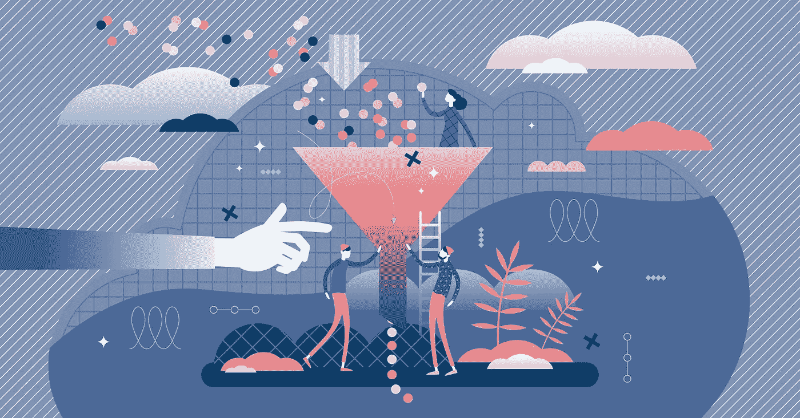
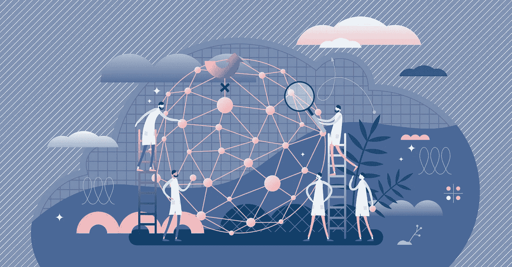
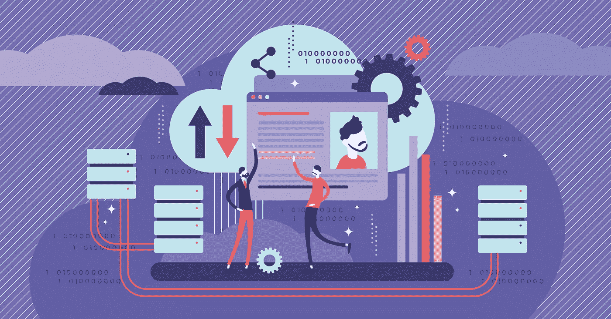
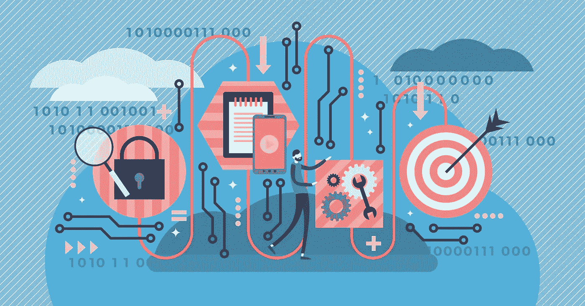

# 如何推动有效人工智能/人工智能的实验文化

> 原文：<https://towardsdatascience.com/how-to-build-a-culture-of-experimentation-for-effective-ai-ml-de843752dae9?source=collection_archive---------57----------------------->

实验产生持续的改进(图片来自 [Adobe](https://stock.adobe.com/) 的 [VectorMine](https://stock.adobe.com/contributor/201457013/vectormine?load_type=author&prev_url=detail)

据[哈佛商业评论](https://hbr.org/2020/03/productive-innovation)报道，许多创新公司的一个众所周知的秘密是他们能够每天使用数据科学进行成千上万次实验，以了解他们客户的需求。仅举几个例子，Expedia，Spotify，Bookings.com，扩大了他们的数据科学管道，进行将影响他们底线的测试。然而，仅仅建立一个数据科学管道是不够的；你需要将实验文化融入其中才能成功。

实验文化的瓶颈

为什么实验这么难？(图片由 [Adobe](https://stock.adobe.com/) 的 [VectorMine](https://stock.adobe.com/contributor/201457013/vectormine?load_type=author&prev_url=detail) 提供)

在大型组织中，大量的工作流、应用程序和数据平台可能会垄断您的所有开发资源。简单的修补-修补-发布项目不会产生长期收入。在不稳定的整合工作基础上构建数据科学管道可能会对数据治理造成严重破坏。当将数据从管道的一部分移动到另一部分时，延迟甚至会阻碍最好的数据科学成果。

即使在拥有高效团队的组织中，数据科学的努力也取得了回报，但在运营系统和分析系统之间往往存在隔阂。例如，设想一家保险公司，其中一个小组开发和维护核保应用程序，另一个小组开发模型来确定客户在保单应用程序上是否诚实。运营和分析工作负载的分离只是传统文化的一个例子，它阻止了新的实验文化在整个组织中蔓延。

数据科学团队经常无意中在独立于组织内所有其他团队的专用孤岛中工作。应用程序开发人员和业务部门专家没有在项目中与基层的数据科学团队合作。相反，他们只有在需要彼此的东西(通常是数据)时才会一起工作。最终结果是，当数据科学家获得实时数据时，这些数据往往已经过时。通过多层计算，数据经常在混乱中丢失。

**数据科学民主化**

打破数据科学孤岛(图片来自 [Adobe](https://stock.adobe.com/) 的 [VectorMine](https://stock.adobe.com/contributor/201457013/vectormine?load_type=author&prev_url=detail)

公司真正收获创新时代回报的唯一方式是发展一种实验文化，从组织内的数据工程和数据科学团队民主化开始。数据科学必须集成到业务部门专家和应用程序开发团队的工作中，数据科学项目应该从一开始就优先考虑扩大规模。应用程序开发人员、数据科学家、数据工程师和业务部门专家应该在数据科学管道中协同工作，以确保持续改进业务成果。如果数据不能自由共享，并且数据科学家在应用程序的生命周期中没有积极参与，数据管道就会受到损害。

数据科学民主化可以解决三个问题:

1)整合数据源以消除延迟，并采取更准确的业务行动

2)创造值得信赖的数据科学，通过持续创新对底线产生积极影响

3)维护数据血统以改善 AI/ML 的共享治理。

我们相信一个集成的数据库和机器学习平台是在整个组织内实现数据科学民主化所必需的。借助这一新框架，数据科学家、业务部门专家、操作员和应用程序开发人员从数据科学研究的一开始就协同工作，并持续协作。

*   应用程序开发人员可以利用更多数据并提供实时分析，而无需 ETL。
*   数据工程师可以轻松地为数据科学家提供实时特征管道。
*   数据科学家可以自由试验，以优化预测准确性，从而带来更好的业务成果。

每个人都可以访问与生产同步的数据。对算法如何处理实时数据没有限制，也没有在机器之间来回传输数据集。通过与应用程序开发人员合作，数据科学家可以实现治理和部署，以确保数据和算法的完整性。

应用程序开发人员拥有生产基础架构的很大一部分，并成为与其支持的业务部门相关的数据科学项目的真正利益相关者。他们的角色越来越成为治理者。随着时间的推移，随着应用程序开发人员扩大其数据科学知识，他们可以使用一组透明的测试和流程来监控和治理模型。

独立运行的团队，如 DevOps、DBOps 和 MLOps，也可以聚合在实验和治理的保护伞下。应用程序开发人员可以与基础设施团队紧密合作，消除沟通障碍，实现更顺畅的部署、监控和生产管理。

**利用精选数据—特征商店**

重复使用费力的数据管理，无需重复劳动(图片由来自 [Adobe](https://stock.adobe.com/) 的 [VectorMine](https://stock.adobe.com/contributor/201457013/vectormine?load_type=author&prev_url=detail) 提供)

一个释放实验文化的新创新是采用特色商店。正如在之前的[博客](https://medium.com/swlh/5-minimum-requirements-of-an-operational-feature-store-ab1436ca1a2c?source=friends_link&sk=11eb65fa5d460cd663040d69c451fe52)中所总结的那样，功能库使数据科学家能够共享从原始数据转换而来的精选数据。人们常说，数据科学家 80%的时间花在特性工程上，只有 20%的时间花在模型实验上。要素存储使数据科学家能够重复使用数据工程师和数据科学家执行的繁重任务，以创建提供预测信号的要素。最佳要素存储使要素能够通过复杂的分析管道基于事件进行更新，从而创建强大的预测模型。它还使数据科学家能够创建从模型实验到特征实验的明确谱系。

有了聚合 SQL 数据平台上的功能存储，数据科学家可以在过去所需时间的一小部分内运行数百或数千次测试。通过与业务单位专家的紧密合作，以及与 it 组织的合作，测试可以在许多模型上连续地、跨功能地运行。例如，销售模型可以通过测试消费者群体的总体消费行为来优化。类似地，为了实现企业内的最佳财务目标，测试风险或欺诈模型可能是必要的，但同时测试消费者情绪的变化也可能是必要的。当使用特征库时，所有这些组都能够重用特征，使得实验更有效率。在这个框架中，数据科学家更接近管理层，使用最新的创新技术来分析数据，这些数据用于支持组织级别的“宏观”决策。如果没有功能存储，数据科学家必须花费宝贵的时间和资源来集成计算元素和处理数据。

实验文化最终允许你的组织从一个 ***使用*** 技术的组织转变为一个 ***通过技术授权*** 的组织。它成为进一步创新的基石，尤其是在需要企业人工智能的时候。

**遍布整个企业—易于供应、管理和操作**

在任何地方创建实验沙盒(图片由来自 Adobe 的 VectorMine 提供)

创建实验文化的最大挑战之一是计算资源的无摩擦供应和管理。但现在有了 Kubernetes，可以轻松地调配和编排自我修复的计算和存储资源，根据工作负载的需求扩展和缩小平台，甚至在不使用时暂停平台。例如，我们的新拼接机 Kubernetes [Ops Center](https://splicemachine.com/product/ops-center/) ，这是一套 Kubernetes 操作员和掌舵图表，一个小型 DevOps 团队可以供应、管理和操作许多不同的 SQL 和 ML 平台，每个平台甚至支持数百个小型到大型分布式 SQL 数据库。借助 OpCenter，运营商可以轻松搜索日志和监控指标，以保持平台健康。团队可以快速高效地在整个企业以及开发、测试和生产集群中构建沙盒。这消除了创造实验环境的摩擦。

**结论**

大多数组织仍然停留在专家孤岛的思维模式中。应用程序开发人员、数据工程师和数据科学家都需要计算资源，如今他们在他们之间移动数据并执行重复的工作。如果这些孤岛能够在预集成和优化的基础架构上共享数据以消除延迟，会怎么样？如果团队可以重用彼此策划的特性和模型来消除不必要的重复工作，会怎么样？如果每个团队都可以利用真正敏捷的计算资源，会怎么样？你可以打破这些壁垒，将人工智能/人工智能有效地注入到流程中，真正将现有的基础设施升级为智能平台。通过这一过程，您正在构建一个融合了实验文化的数据科学管道。这种文化不仅能让您的数据科学项目获得回报，还能不断让您的组织更快地创新，适应业务环境的变化，并根据预测将要发生的事情而不是对已经发生的事情做出反应来采取行动。

要观看 Kubernetes 架构数据和 ML 平台如何通过功能商店形成实验文化的基础的演示，请点击[此处](https://info.splicemachine.com/machine-learning-feature-store-webinar-recording.html)。