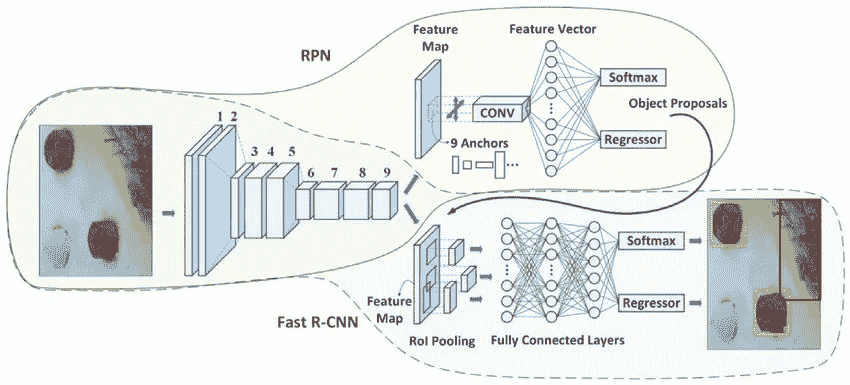

# 如何使用 TensorFlow 对象检测 API 构建和部署自定义对象检测器和分类器？

> 原文：<https://towardsdatascience.com/how-to-build-a-custom-object-detector-classifier-using-tensorflow-object-detection-api-811b7bcd31c4?source=collection_archive---------16----------------------->

## 了解如何构建交通灯检测器和分类器，用于对真正的自动驾驶汽车进行编程。


交通灯分类器:现场(左)和模拟器(右)

# 动机:

使用 [TensorFlow 对象检测 API](https://github.com/tensorflow/models/tree/master/research/object_detection) 实现一个交通灯分类器——这可以用于使用边界框检测图像和/或视频中的对象，使用一些可用的预训练模型或通过您可以自己训练的模型。

# 应用:

编程一辆真正的自动驾驶汽车。解决自主车辆视觉和感知问题的尝试。

# 代码和实现:

请在我的 [**GitHub 库**](https://github.com/SandeepAswathnarayana/traffic-light-classifier_faster-r-cnn) 中找到与这篇博文相关的所有必要文件、代码、模块和结果。

这个交通灯分类器是 Udacity 的自动驾驶汽车工程师 Nanodegree 的关键部分。我带领一个 4 人团队(合作的有 w/ [阿伦·萨加尔](https://medium.com/u/c1d76c218ce6?source=post_page-----811b7bcd31c4--------------------------------)、[马里斯·p·拉纳维拉](https://www.linkedin.com/in/prasanga-ranaweera/)和李爽)，每个成员都有着不同的背景和经验，来编写一辆真正的自动驾驶汽车。请在 [**GitHub**](https://github.com/SandeepAswathnarayana/Udacity-SDCND-Programming-a-Real-Self-Driving-Car) 上找到这个项目资源库。

# 为什么选择 TensorFlow 物体检测 API？

TensorFlow 的对象检测 API 是一个强大的工具，可以轻松构建、训练和部署对象检测模型。在大多数情况下，从头开始训练整个卷积网络非常耗时，并且需要大型数据集。这个问题可以通过使用 TensorFlow API 的预训练模型利用迁移学习的优势来解决。

# 构建分类器:

安装入门:找到 [TensorFlow 对象检测 API 库](https://github.com/tensorflow/models/tree/master/research/object_detection)上的说明，转到路径:`tensorflow/models/object_detection/g3doc/installation.md`。

*   克隆或下载 [TensorFlow 模型](https://github.com/tensorflow/models)库。在终端/cmd.exe 中导航到该目录
*   转到`[https://github.com/protocolbuffers/protobuf/releases/tag/v3.4.0](https://github.com/protocolbuffers/protobuf/releases/tag/v3.4.0)`并下载 protocol-3 . 4 . 0-win32 . zip(根据您的操作系统和要求选择合适的版本)
*   从上面的连续步骤中提取两个下载的文件。现在，在`models`(或`models-master`)目录中，您可以使用`protoc`命令:

**在 Windows 上:**

```
"C:/Program Files/protoc/bin/protoc"object_detection/protos/*.proto --python_out=.
```

**在 Ubuntu 上:**

```
protoc object_detection/protos/*.proto --python_out=.export PYTHONPATH=$PYTHONPATH:`pwd`:`pwd`/slim
```

*   运行朱庇特笔记本`[object_detection_tutorial.ipynb](https://github.com/tensorflow/models/blob/master/research/object_detection/colab_tutorials/object_detection_tutorial.ipynb)`。这会为您下载一个预先训练好的模型。这里的预训练模型是 COCO(上下文中的公共对象)。在笔记本上，注释掉`get_ipython().magic('matplotlib inline')`行。
*   接下来，使用`import cv2`引入 Python Open CV 包装器
*   实际的检测过程发生在“for”循环中(在最后一个单元格中)，我们需要根据我们的需要相应地修改它。当然，我们还可以做更多的代码清理工作，比如去掉 Matplotlib 导入，如果你愿意，可以随意清理。
*   加载您的自定义图像:在 jupyter 笔记本中，进行必要的导入以从目录中加载您的图像，修改笔记本以满足您的需要，然后运行它。

# 如何使用 TensorFlow 对象检测 API 建立红绿灯检测模型？

将您感兴趣的对象添加到预训练的模型中，或者使用该模型的权重来给自己一个训练这些新对象的良好开端。Tensorflow 对象检测 API 基本上是准确性和速度之间的折衷。考虑到我正在处理的数据集，我选择使用`*faster_rcnn_inception_v2_coco*`。请查看 [TensorFlow 检测模型动物园](https://github.com/tensorflow/models/blob/master/research/object_detection/g3doc/detection_model_zoo.md)下可用模型的完整列表。

步骤:

1.  收集大约 500 张(或者更多，如果你愿意)自定义交通灯图像。对于这个项目，我选择的图片来自——Udacity 模拟器、uda city 的卡拉测试网站和网络
2.  使用“labelImg”注释自定义图像
3.  将它们分成训练测试集
4.  为列车测试分割生成 TFRecord
5.  设置配置文件
6.  训练实际模型
7.  从新训练的模型中导出图表
8.  引入冻结推理图对交通灯进行实时分类

# 步骤 1:收集自定义交通灯图像

*   模拟器:在相机打开的情况下运行模拟器，并按照指示从模拟器中收集交通灯图像


从 Udacity 模拟器中收集的一些示例图像

*   站点:从 Udacity 提供的 ROS 包中下载卡拉站点的红绿灯图像


从 Udacity 的卡拉网站收集的一些样本图像

# 步骤 2:注释自定义交通灯图像

使用[‘label img’](https://github.com/tzutalin/labelImg)手工标记交通灯数据集图像。
步骤:

*   克隆 [labelImg](https://github.com/tzutalin/labelImg) 库
*   遵循符合您的 python 版本要求的安装步骤。但是，对于 Ubuntu 上的 Python3:

```
sudo apt-get install pyqt5-dev-toolssudo pip3 install lxmlmake qt5py3python3 labelImg.py
```

*   运行`python labelImg.py`
*   打开保存了所有交通灯图像的目录
*   对于每个图像，在您想要检测的交通灯周围创建一个矩形框，并相应地添加标签(在我们的例子中是红色、绿色、黄色)
*   将它们保存在您选择的目录中。按照以下步骤定制所有图像的标签


“labelImg GUI ”,其中示例交通灯被标注为“红色”

# 步骤 3:训练-测试分割

进行 90-10 分割:将带注释的图像及其匹配的 XML 注释文件添加到两个独立的文件夹中，分别命名为“train”(90%的图像)和“test”(10%的图像)。

# 步骤 4:为训练测试分割生成 TFRecords

我们需要一些来自 GitHub 的 Dat Tran 的[浣熊数据集](https://github.com/datitran/raccoon_dataset)仓库的帮助器代码。我们只需要从这个回购 2 脚本:`xml_to_csv.py`和`generate_tfrecord.py`。

**(1) xml_to_csv.py** :

*   对该文件的 main 函数进行必要的修改。这将遍历训练和测试，以创建那些单独的 CSV，然后从这些 CSV 中，我们创建 TFRecord

在`xml_to_csv.py`脚本中，我替换了:

```
def main():
    image_path = os.path.join(os.getcwd(), 'annotations')
    xml_df = xml_to_csv(image_path)
    xml_df.to_csv('raccoon_labels.csv', index=None)
    print('Successfully converted xml to csv.')
```

使用:

```
def main():
    for directory in ['train','test']:
        image_path = os.path.join(os.getcwd(), 'images/{}'.format(directory))
        xml_df = xml_to_csv(image_path)
        xml_df.to_csv('data/{}_labels.csv'.format(directory), index=None)
        print('Successfully converted xml to csv.')
```

*   运行`python3 xml_to_csv.py`命令。现在，您已经准备好了 CSV 文件:`train_labels.csv`和`test_labels.csv`

**(2)generate _ TF record . py**:

*   接下来，我们需要抓取 TFRecord:转到`[datitran/raccoon_dataset/blob/master/generate_tfrecord.py](https://github.com/datitran/raccoon_dataset/blob/master/generate_tfrecord.py)`
*   这里您需要做的唯一修改是在`class_text_to_int`函数中。您需要将此更改为您的特定类。在这种情况下，在 if-elif-else 语句中为红色、绿色和黄色各添加三个“row_label”值

```
# TO-DO replace this with label map
def class_text_to_int(row_label):
    if row_label == 'Red':
        return 1
    elif row_label == 'Yellow':
        return 2
    elif row_label == 'Green':
        return 3
    else:
        None
```

记得使用相同的 id 值

```
%%writefile training/labelmap.pbtxt
item {
  id: 1
  name: 'Red'
}
item {
  id: 2
  name: 'Yellow'
}
item {
  id: 3
  name: 'Green'
}
```

*   确保已经安装了 Object Detection(GitHub 上的 installation.md)。运行`generate_tfrecord.py`的“使用”部分中的两个命令，分别用于训练和测试。

对于列车 TFRecord:

```
python3 generate_tfrecord.py --csv_input=data/train_labels.csv --output_path=data/train.record --image_dir=images/
```

对于测试 TFRecord:

```
python3 generate_tfrecord.py --csv_input=data/test_labels.csv --output_path=data/test.record --image_dir=images/
```

现在我们已经准备好了训练和测试记录文件。我们需要 TFRecord 文件的原因是将任何会生成数据的文件(比如 PASCAL VOC 格式)转换成 TFRecord，这样我们就可以在对象检测 API 中使用它们。

# 步骤 5:设置配置文件

为了训练我们的模型，我们需要设置一个配置文件(连同 TFRecord 和一个预训练的模型)。请在 [Tensorflow 对象检测 API](https://github.com/tensorflow/models/tree/master/research/object_detection) 上找到所有相关文件、安装信息、预训练模型等。

步骤:

*   去 GitHub 上的`[https://github.com/tensorflow/models/tree/master/research/object_detection/samples/configs](https://github.com/tensorflow/models/tree/master/research/object_detection/samples/configs)`
*   从 TF 模型检测动物园下载 faster _ rcnn _ inception _ v2 _ coco 模型的配置文件(`[faster_rcnn_inception_v2_coco.config](https://github.com/tensorflow/models/blob/master/research/object_detection/samples/configs/faster_rcnn_inception_v2_coco.config)`)和检查点(. tar.gz 文件)
*   运行两个命令，分别下载配置文件和更快的 R-CNN 模型(同时提取下载的模型)。将配置文件放在`training`目录下，提取`models/object_detection`目录下的`faster_rcnn_inception_v2_coco`
*   修改配置文件以满足您的要求，包括但不限于`PATH_TO_BE_CONFIGURED`、`num_classes`、`batch_size`、`checkpoint name`、到`fine_tune_checkpoint`、`label_map_path: “training/object-detect.pbtxt”`的路径
*   添加带有红色、黄色和绿色的项目和 id 值的标签映射文件(如步骤 4 所示)

# 步骤 6:训练实际模型

*   在`models/object_detection` 中，使用 python 命令运行您的模型，同时包含保存模型的路径，配置文件的管道

```
python3 train.py --logtostderr --train_dir=training/ --pipeline_config_path=training/faster_rcnn_inception_v2_coco.config
```

*   此时，除非出现错误，否则您应该会看到模型摘要，其中包含步骤及其相应的损失值，如下所示

```
INFO:tensorflow:global step 11788: loss = 0.6717 (0.398 sec/step)
INFO:tensorflow:global step 11789: loss = 0.5310 (0.436 sec/step)
INFO:tensorflow:global step 11790: loss = 0.6614 (0.405 sec/step)
INFO:tensorflow:global step 11791: loss = 0.7758 (0.460 sec/step)
INFO:tensorflow:global step 11792: loss = 0.7164 (0.378 sec/step)
INFO:tensorflow:global step 11793: loss = 0.8096 (0.393 sec/step)
```

你的步骤从 1 开始，亏损会高很多。根据你的 GPU 和你有多少训练数据，这个过程将需要不同的时间。你希望平均损失约为 1 英镑(或更低)。

*   您可以加载 Tensorboard 来可视化这些值，包括损耗、准确度、步数和训练时间
*   现在，您已经准备好了经过训练的模型。接下来，通过检查点加载模型

**更快的 R-CNN 模型架构:**
更快的 R-CNN 最初发表于 [NIPS 2015](https://arxiv.org/abs/1506.01497) 。它的结构很复杂，因为它有几个移动的部分。

这是该模型的高级概述。这一切都始于一幅图像，我们希望从中获得:

*   边界框列表
*   分配给每个边界框的标签
*   每个标签和边界框的概率



[特色图片致谢](https://www.mdpi.com/2076-3417/10/1/83) : [阿塔坎·科雷兹](https://sciprofiles.com/profile/862933)和[内卡阿丁酒吧](https://sciprofiles.com/profile/358417)

由[哈维尔·雷](https://tryolabs.com/blog/authors/javier-rey/)撰写的博客很好地解释了物体检测如何在更快的 R-CNN 上工作，这可以在 [Tryolabs](https://tryolabs.com/blog/2018/01/18/faster-r-cnn-down-the-rabbit-hole-of-modern-object-detection/) 上找到。
要快速了解更快的 R-CNN 及其地区提案网络，请参考[高昊](https://medium.com/u/8b44cbadef3a?source=post_page-----811b7bcd31c4--------------------------------)在[媒体](https://medium.com/@smallfishbigsea/faster-r-cnn-explained-864d4fb7e3f8)上的博文。

*注*:

*   在尝试了包括 SSD Inception V2、更快的 R-CNN 和 Nvidia 的卷积神经网络在内的不同模型后，我们最终决定使用更快的 R-CNN，因为我们发现它的性能对于我们的交通灯数据集来说非常有吸引力。归根结底，选择合适的型号是在“准确性”和“速度”之间进行权衡，以满足您的要求。
*   请在代码为的[纸上找到对象检测的最新模型。我决定选择更快的 R-CNN，因为它的性能满足目标检测过程中“准确性”而不是“速度”的要求。此外，TensorFlow 没有通过将 SOTA 模型添加到其 TensorFlow 对象检测 API 存储库中来与它们保持同步。](https://paperswithcode.com/task/object-detection)

# 步骤 7:从新训练的模型中导出图表

*   在这一步，我们将测试我们的模型，看看它是否如我们所愿。为了做到这一点，我们需要导出推理图。在`models/object_detection`目录中，有一个脚本为我们完成了这项工作:`export_inference_graph.py`
*   转到`installation.md`([https://github . com/tensor flow/models/blob/master/research/object _ detection/g3doc/installation . MD](https://github.com/tensorflow/models/blob/master/research/object_detection/g3doc/installation.md))中的“Protobuf 编译”部分，按照给出的说明导出路径。这就加载了 TensorFlow，然后制作图表并保存
*   使用 API 附带的笔记本`object_detection_tutorial.ipynb`进行物体检测

# 第八步:引入冻结推理图对交通灯进行实时分类

*   修改`export_inference_graph.py`来满足你的要求。要运行这个，您只需要传入您的检查点和您的管道配置，然后在任何您想要放置推理图的地方。例如:

```
python3 export_inference_graph.py \
    --input_type image_tensor \
    --pipeline_config_path training/faster_rcnn_inception_v2_coco.config \
    --trained_checkpoint_prefix training/model.ckpt-10856 \
    --output_directory traffic_lights_inference_graph
```

*   运行安装命令导出推理图([https://github . com/tensor flow/models/blob/master/research/object _ detection/g3doc/installation . MD](https://github.com/tensorflow/models/blob/master/research/object_detection/g3doc/installation.md))。现在，您已经准备好了`frozen_inference_graph.pb`和检查点文件
*   您的检查点文件应该在`training`目录中。只要找一个步长最大的(破折号后最大的数字)，那就是你要用的。接下来，确保将`pipeline_config_path`设置为您选择的任何配置文件，然后最后选择输出目录的名称，比如说`traffic_lights_inference_graph`

从`models/object_detection`运行上述命令。如果您得到一个关于没有名为“nets”的模块的错误，那么您需要重新运行:

```
# From tensorflow/models/
export PYTHONPATH=$PYTHONPATH:`pwd`:`pwd`/slim
# switch back to object_detection after this and re run the above command
```

*   打开`object_detection_tutorial.ipynb`笔记本。在笔记本上进行必要的修改，包括但不限于`MODEL_NAME`、`PATH_TO_CKPT`、`PATH_TO_LABELS`、`NUM_CLASSES`、`TEST_IMAGE_PATHS`。运行笔记本以查看带有边界框的交通灯及其预测精度

**结果:**


来自模拟器的图像用边界框和预测精度分类


使用边界框和预测精度分类的站点图像

**限制:**

*   鉴于这个项目的范围，除了模拟器和 CARLA 网站上的图片，我只使用了网上的一些图片。而且，这个模型还没有在一个新的未知网站上测试过。
*   该模型在独特的光照和天气条件下的表现尚不清楚，因为这里使用的大多数图像都是在典型的晴朗天气拍摄的。
*   随着该领域的不断研究，还有其他[最先进的物体检测模型](https://paperswithcode.com/task/object-detection)可能具有相对更好的性能精度。

**致谢:**

感谢巴斯蒂安·特龙和大卫·斯塔文斯(创始人， [Udacity](https://medium.com/u/2929690a28fb?source=post_page-----811b7bcd31c4--------------------------------) )、[大卫·西尔弗](https://medium.com/u/8190c86ea791?source=post_page-----811b7bcd31c4--------------------------------)、[瑞安·基南](https://medium.com/u/a878b47f7040?source=post_page-----811b7bcd31c4--------------------------------)、[塞尚·卡马乔](https://medium.com/u/14fba6c89ce?source=post_page-----811b7bcd31c4--------------------------------)对课程材料和指导的帮助，以及官方合作伙伴的演讲嘉宾，包括[英伟达 AI](https://medium.com/u/ab69c39a85e1?source=post_page-----811b7bcd31c4--------------------------------) 、 [UberATG](https://medium.com/u/4275c7808cea?source=post_page-----811b7bcd31c4--------------------------------) 、梅赛德斯-奔驰、宝马、迈凯轮、滴滴出行，他们提供的专业知识极大地帮助了研究。

如果你有任何意见想与我分享(或)对我的写作或想法提供任何相关的反馈，我会很高兴收到你的来信。请随时在[***Twitter***](http://twitter.com/ThisIsSandeepA)*[***LinkedIn***](https://www.linkedin.com/in/sandeep-a/)*上与我联系，或者在*[***GitHub***](https://github.com/SandeepAswathnarayana)*上关注我。**