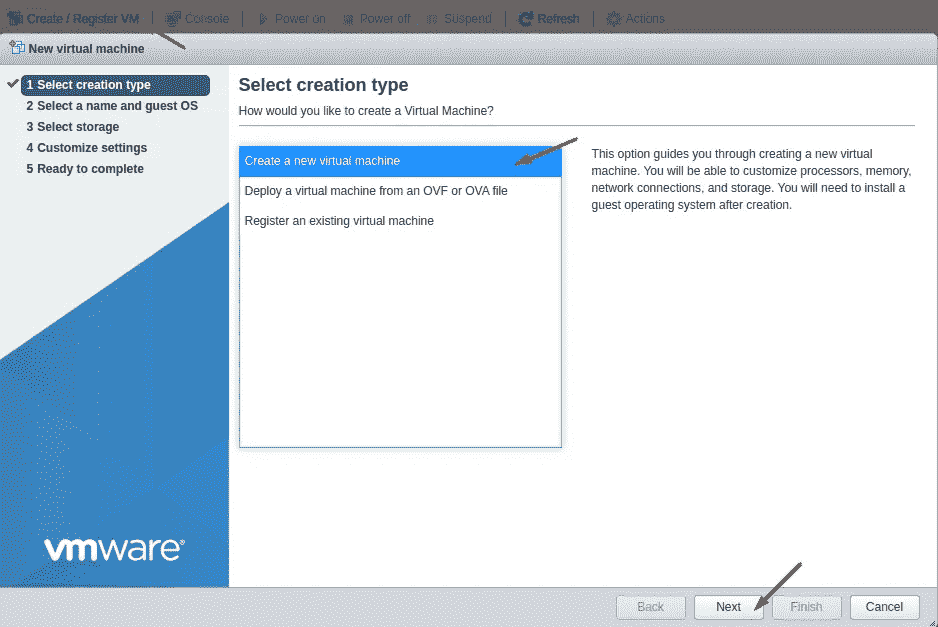
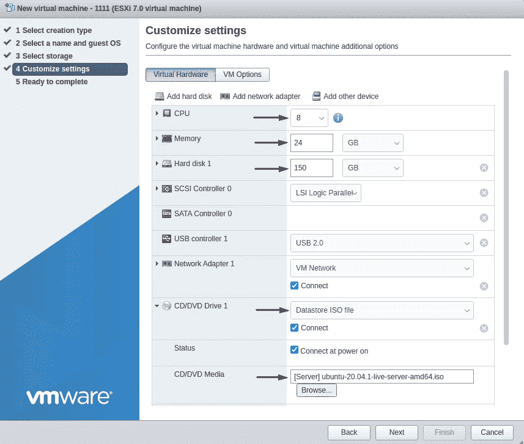
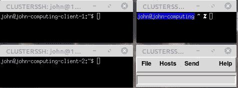
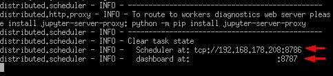
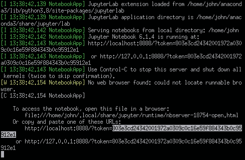
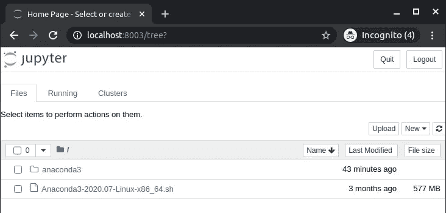
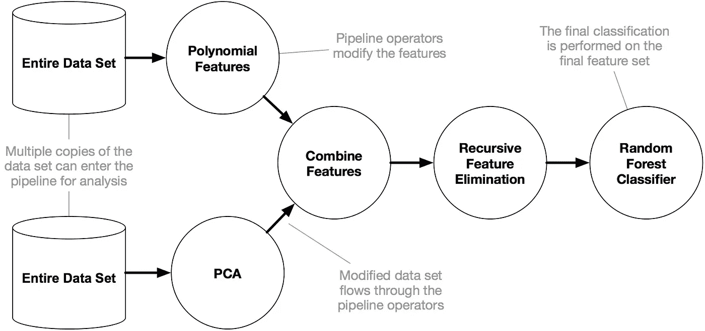
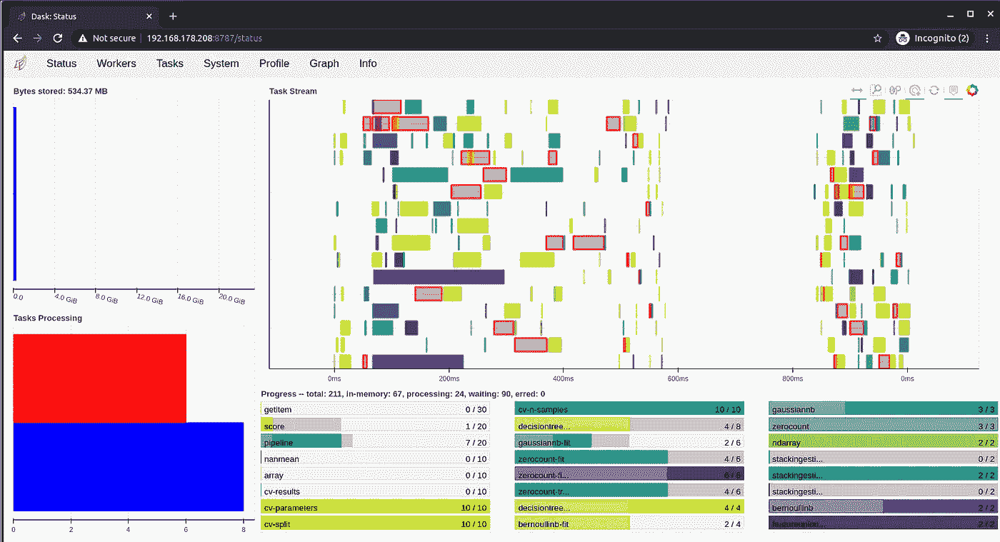

# 如何使用 TPOT 构建 Dask 分布式集群进行自动管道搜索

> 原文：<https://towardsdatascience.com/how-to-build-a-dask-distributed-cluster-for-automl-pipeline-search-with-tpot-34ab6cf6bf65?source=collection_archive---------18----------------------->

## [实践教程](https://towardsdatascience.com/tagged/hands-on-tutorials)

## 这是一个深入的教程，指导您通过开源 python 库(即 Dask 和 TPOT)建立可扩展的自动化机器学习模型管道搜索所需的所有步骤。


[法比奥](https://unsplash.com/@fabioha?utm_source=medium&utm_medium=referral)在 [Unsplash](https://unsplash.com?utm_source=medium&utm_medium=referral) 上的照片

您是否曾经遇到过这样的情况:您知道自己已经尽了最大努力清理数据集，但却无法选择最佳模型？你有很多 CPU，但是它们在不同的主机上吗？那么这就是给你的指南！我们将探索 [Dask](https://dask.org/) ，特别是 Dask 的分布式[库](https://distributed.dask.org/en/latest/)，不仅并行化我们的 TPOT 管道搜索，而且将它们分布在不同的机器上。

# Dask 是什么？

[Dask](https://github.com/dask/dask-tutorial) 是一个开源并行计算库，可以扩展现有的 Python 生态系统。它与通用数据科学堆栈集成良好； [NumPy](https://numpy.org/) 、[熊猫](https://pandas.pydata.org/)和 [scikit-learn](https://scikit-learn.org/) 。有了 Dask，我们可以从笔记本电脑到整个集群进行大规模计算。我们将关注后者。

# Dask 分布式是什么？

**Dask.distributed** :是一个轻量级的开源 Python 分布式计算库。

架构: Dask.distributed 是一个集中管理的、分布式的、动态的任务调度器。它有三个主要过程:

1.  **dask-scheduler:***中央 dask-scheduler 进程协调分布在多台机器上的多个 dask-worker 进程的动作以及多个客户端的并发请求。*
2.  ***dask-worker:***dask-worker 分布在多台机器上，处理多个客户端的并发请求。**
3.  ****dask-client:**dask-client 是 dask.distributed 用户的主要入口点**

****设置调度程序和工人的步骤:****

**在本例中，我们将使用 [VMware ESXi](https://www.vmware.com/products/esxi-and-esx.html) 在一台主机上创建 3 台虚拟机。一个是调度程序，同时运行 [jupyter 笔记本](https://jupyter.org/)，另外两个是工人。这只是一个概念验证设置。不可否认，这不是启动集群工作者的最有效的方法。尽管如此，这将提出一个更通用的流程，然后可以采用云解决方案和/或 [Dask Kubernetes](https://kubernetes.dask.org/en/latest/) 。**

**我们将从调度程序实例开始。首先点击**创建/注册虚拟机>创建新的虚拟机>然后****

****

**您可以选择任何名称，但我建议指定一个容易识别的名称，如 cluster-master。对于这个例子，我在所有机器上都使用了 Ubuntu 20.04.1 live server 。这不是强制性的，但强烈建议*在所有机器中使用相同的分布。这些机器将用于对大型数据集进行计算。因此，*强烈建议*为每台机器分配大量 RAM，如果不可能，至少[设置交换内存](https://linuxize.com/post/how-to-add-swap-space-on-ubuntu-18-04/)。对于本例，我们将在每台机器上使用 24 Gb 的 RAM 和 8 个 vCPUs。***

> *在本教程中，我们将使用熊猫数据帧。对于特别大的数据集，我们可以使用 Dask 的[数据框架](https://docs.dask.org/en/latest/dataframe.html#dataframe)对象。达斯克。数据帧是一个大型并行数据帧，由许多较小的数据帧组成，沿着索引分割。这些 Pandas 数据帧可能存在于磁盘上，用于单台机器或集群中许多不同机器上的大内存计算。*

*这是我们虚拟机规格的快照。你可以根据你的需要改变这些。*

**

*对工作机器重复该过程。我们选择相同的规格，但这不是强制性的。在每台机器上安装操作系统后，我们将通过 SSH 安装必要的软件。对于这样的小集群，我们选择 [ClusterSSH](https://github.com/duncs/clusterssh) 。ClusterSSH 是围绕 XTerm 和 SSH 等标准 Linux 工具的 Tk/Perl 包装器。我们将使用它同时向所有机器复制命令。事不宜迟，言归正传。*

*运行以下命令在本地机器上安装 ClusterSSH。在本教程中，我们将通过 SSH 从我们的个人计算机管理集群。我们将不配置集群。我们将通过在 CLI 中传递用户名和 IP 地址来连接到机器。对于更大或多个集群，建议编辑位于`~/.csshrc`的配置文件。*

```
*sudo apt-get install clusterssh
clusterssh cluster-master-name@cluster-master-ip cluster-worker1-name@cluster-worker1-ip cluster-worker2-name@cluster-worker2-ip*
```

**

*在上图中，您在 CLUSTERSSH 灰色窗口中键入的任何内容都将被复制到所有机器上。您也可以在每个窗口上分别键入单独的 shell 命令。我们希望将以下命令复制到所有计算机上:*

```
*sudo apt-get update
sudo apt-get upgrade -y
wget [https://repo.anaconda.com/archive/Anaconda3-2020.07-Linux-x86_64.sh](https://repo.anaconda.com/archive/Anaconda3-2020.07-Linux-x86_64.sh)
chmod 755 Anaconda3-2020.07-Linux-x86_64.sh
bash Anaconda3-2020.07-Linux-x86_64.sh
conda init*
```

*然后我们必须重启 shell，这非常简单，我们可以通过 ClusterSSH 断开连接并重新连接。如果您将 [Anaconda3](https://www.anaconda.com/) 安装到不同的位置，只需导出路径并运行`./anaconda3/condabin/conda init`。重新连接后，运行以下命令来安装 [TPOT](https://github.com/EpistasisLab/tpot) 和 Dask 的必要先决条件。请注意，除了 [PyTorch](https://pytorch.org/) 之外，我们还为 TPOT 的额外功能安装了所有可选的依赖项。*

```
*conda install -c conda-forge tpot xgboost dask distributed dask-ml scikit-mdr skrebate -y
conda update conda
conda update --all*
```

***建立分布式集群的步骤:***

*首先，我们需要设置调度程序，这样我们可以稍后连接其余的机器。尽管所有这些机器都驻留在同一个主机中，但为了涵盖一般情况，我们不会通过 LAN 连接它们。我们开始吧！我们将使用一个名为 [screen](https://linux.die.net/man/1/screen) 的终端复用器来管理一个 ssh 会话中的多个 shells。这里有一个你需要的选项的快速备忘单:*

```
*screen -S session_name #Starts a new screen named session_name
screen -r #Resumes a screen session
screen -ls #Returns the session IDs of running screens
screen -X -S <id or name> kill #Kills the specified screen
While inside an attached screen: Ctrl+a d #Detaches the current screen*
```

*太好了！现在我们准备在屏幕中设置调度程序！单击主/调度程序虚拟机实例 SSH 窗口，并键入以下内容:*

```
*screen -S schedulerdask-scheduler*
```

**

*您应该会看到这个输出！*

*当然，调度程序的 IP 地址会有所不同。调度程序本身位于`8786`港口，这是我们将所有工人指向的地方。`8787`端口托管 dask [仪表板](https://docs.dask.org/en/latest/diagnostics-distributed.html)。在我们连接所有的工人之后，我们将稍后回到这一点。现在，按下`Ctrl+a d`分离屏幕。现在让我们设置我们的 jupyter 笔记本:*

```
*screen -S notebookjupyter notebook --no-browser --port=8888*
```

**

*保存令牌！你以后会需要它的。*

*保存令牌，分离屏幕并关闭 SSH 连接。不要关闭到其他机器的 SSH 连接。我们现在必须将主虚拟机实例中远程笔记本的端口转发到本地端口，以便我们可以从浏览器访问它。我们可以使用以下命令来实现这一点:*

```
*ssh **-**N **-**f **-**L localhost**:**8003**:**localhost**:**8888 remoteuser**@**remotehost#Forwards the port 8888 of our remote machine to port 8003 of our local machine. We can now access it in our browser at localhost:8003*
```

*在指定的端口(我们选择 8003)上转到您的本地主机，输入您保存的令牌，瞧！笔记本在远程机器上运行，而我们在本地机器上编辑它。*

**

*现在，我们可以继续设置所有工作线程来指向调度程序。这很简单。我们通过灰色的 ClusterSSH 终端创建一个屏幕，这次是在所有的 workers 中，并将它们指向主 VM 实例中的调度程序。*

```
*screen -S workerdask-worker IP-of-the-scheduler:8786 --nprocs 1 --nthreads 8*
```

*拆下屏幕，一切就绪。客户端已连接，调度程序已启动并正在运行，您还有一个仪表板来检查一切！使用 nprocs 和 nthreads 参数分别选择每个工作线程的进程数和线程数。这个选择取决于工作量。Dask 的主要撰稿人 Matthew Rocklin 建议如下:*

> *如果您主要处理数字工作负载，比如 Numpy、Pandas 和 Scikit-Learn 代码中常见的，每个进程使用几个进程和多个线程是很好的，这不受 Python 的[全局解释器锁](https://wiki.python.org/moin/GlobalInterpreterLock) (GIL)的影响。但是，如果您将大部分计算时间花在处理纯 Python 对象(如字符串或字典)上，那么您可能希望通过用更少的线程处理更多的进程来避免 GIL 问题。使用更多的进程避免了 GIL 问题，但是由于进程间的通信而增加了成本。如果您的计算需要大量的内部通信，您可能希望避免许多进程。来源:MRocklin - [StackOverflow](https://stackoverflow.com/questions/49406987/how-do-we-choose-nthreads-and-nprocs-per-worker-in-dask-distributed/49407253)*

***什么是 TPOT？***

*[TPOT](http://epistasislab.github.io/tpot/) 是一个 Python 自动机器学习(AutoML)工具，它使用遗传编程来优化机器学习管道。TPOT 构建在 scikit-learn 库之上，就像 Dask 一样，它使用现有的 Python APIs 和数据结构。这意味着对于 scikit-learn 用户来说，它的用法应该非常直观。它还可以很好地与 Dask 集成！*

**

***机器学习管道示例** —来源:[文档](http://epistasislab.github.io/tpot/)*

***TPOT 快速概览:***

*TPOT 使用进化算法来寻找最佳管道。但是*什么是管道*？在机器学习项目中，你很少有理想的数据格式来创建一个性能模型。您可以执行多种转换，如[输入](https://en.wikipedia.org/wiki/Imputation_(statistics))，特征缩放和标准化或分类变量编码——其本身有多种实施方式，即一键编码或目标编码。然后你可以通过装袋、助推或堆叠模型来创造一个整体。最终的模型将使用上述部分或全部的组合。这叫做管道。TPOT 尝试了各种管道，让它们“随机变异”，就像活的有机体一样(或者病毒和染色体外 DNA，如果你想卖弄学问的话)，直到它找到一个性能更好的管道。你可以在这里阅读完整的 TPOT 论文。*

**

***TPOT 管道**的一个例子——来源:[文档](http://epistasislab.github.io/tpot/)*

*最后，让我们使用我们的集群来寻找数据集的最佳管道。下面的笔记本大部分摘自文档，有一些细微的改动。*

*当 TPOT 运行时，你可以在调度器的`localhost:8787`查看仪表盘。如果您不在远程调度器中，您可以在本地机器的`IP-of-scheduler:8787`处检查它。仪表板提供了对每一代进程的洞察、对工作人员和整个集群的基本系统监控、每个工作人员的日志和调用堆栈，以及一个非常，*非常*酷的图表。以下是 dask 仪表板运行时的外观:*

**

*最后，我想提一下，Dask 的主要贡献者成立了一家名为 [coiled](https://coiled.io/) 的公司，为托管 Dask 集群和 python 扩展提供云和企业解决方案。他们目前处于测试阶段，并在云中提供多达 100 个免费 CPU 来演示他们的平台。*