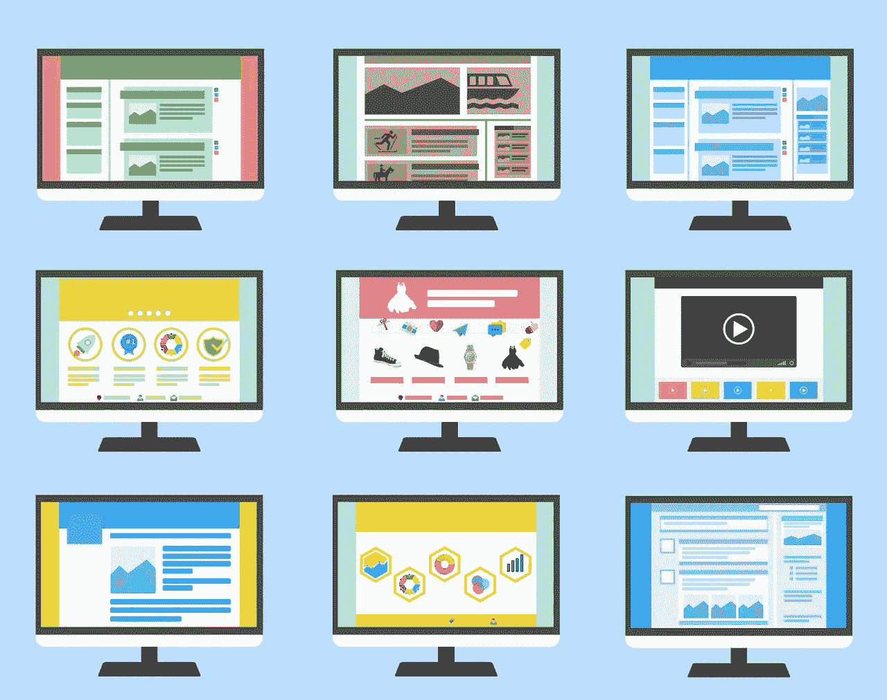
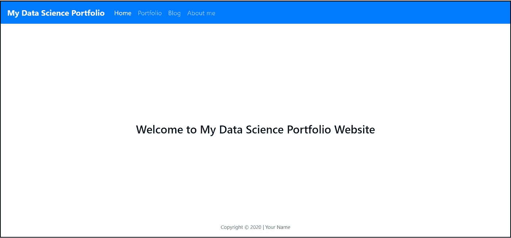

# 如何建立数据科学作品集网站

> 原文：<https://towardsdatascience.com/how-to-build-a-data-science-portfolio-website-335b0f253822?source=collection_archive---------6----------------------->

来源: [200 度](https://pixabay.com/users/200degrees-2051452/?utm_source=link-attribution&amp;utm_medium=referral&amp;utm_campaign=image&amp;utm_content=1624028)来自 [Pixabay](https://pixabay.com/?utm_source=link-attribution&amp;utm_medium=referral&amp;utm_campaign=image&amp;utm_content=1624028) 。

## 展示您的作品——从零开始创建网站

你的代码在 GitHub 上，你的博客文章在 Medium 上，你的比赛结果在 Kaggle 上，你的职业简介在 LinkedIn 上。然而，在你的简历上添加四个甚至更多的链接，让潜在雇主不得不逐个查找，这是浪费时间和空间。一个月前，我决定从头开始创建一个网站——没有 WordPress 或 Squarespace 或任何其他模板——在一个地方展示我的项目和我的个人资料。我不确定从哪里或如何开始，特别是因为作为数据科学家，我们不经常使用 HTML、CSS、JavaScript 或 Flask。所以我想给**提供一个指南，希望也能帮助你创建自己的数据科学组合网站**。

# 从哪里开始

在你开始编码之前，你应该有一个大致的结构，并且对你的网站应该是什么样子有一个想法。考虑你的受众:潜在雇主可能有兴趣了解你和你的数据科学职业的哪些方面？我发现有用的一点是看看其他人的投资组合网站。显然，你想确保没有他们的允许你不会复制他们。但是看看他们如何展示他们的工作和他们自己可以给你一个想法从哪里开始。一些伟大的网站是由

*   大卫·文丘里
*   [哈里森·詹斯马](https://harrisonjansma.com/)
*   布兰登·沃克

你也可以看看[我的网站](https://julianikulski.com)寻找灵感(*编辑:我给网站增加了双语功能，所以现在除了德语*还有英语。

# 包括什么

根据上面的研究，一个好的开始是在你的网站上包括以下页面/部分:

*   一个**登陆页面**，上面有一些关于你的简要信息和你网站其他部分的参考。
*   一个**投资组合页面**，提供你的项目的概述。给你的代码、博客文章和网站添加简短的描述和链接。
*   一个**关于页面**，在这里你可以谈论你的资历、教育背景、技能或者任何你想让你的观众了解你的事情。
*   例如，**博客区/页面**，包含你网站上的博客文章或者链接到你的媒体简介。
*   关于联系方式和您在线状态的**部分**。在你的 GitHub、LinkedIn、Kaggle、Twitter 或任何其他可能与你网站的受众相关的在线个人资料中添加链接。

你还记得其他章节或页面吗？太好了！包括他们。这只是一个起点，只有最少的信息。你也可以使用你的网站来托管你的实际项目，无论是[机器学习模型](/deploying-a-deep-learning-model-on-heroku-using-flask-and-python-769431335f66)还是 [Plotly Dash](/how-to-create-your-first-web-app-using-python-plotly-dash-and-google-sheets-api-7a2fe3f5d256) 实现。

来源:[咖啡豆](https://pixabay.com/users/coffeebeanworks-558718/?utm_source=link-attribution&amp;utm_medium=referral&amp;utm_campaign=image&amp;utm_content=2017980)来自 [Pixabay](https://pixabay.com/?utm_source=link-attribution&amp;utm_medium=referral&amp;utm_campaign=image&amp;utm_content=2017980) 。

# 如何构建它

## 需要考虑的事项

你想从头开始。这是否意味着一个空白的 HTML 文件，空白的 CSS 文件和空白的 Python 文件？其实不需要从 0 开始。

*   [**Bootstrap**](https://getbootstrap.com/) 是一个集成了 JavaScript 的 CSS 框架，让你的网站反应灵敏、美观，无需太多手工 CSS 工作。您可以使用这个 [Bootstrap](https://getbootstrap.com/docs/4.4/getting-started/introduction/) starter 模板，并向其中添加您自己的 HTML 代码。
*   使用[**Jinja**](https://jinja.palletsprojects.com/en/2.11.x/)——一种模板语言——它允许你动态地向你的 HTML 文件添加内容(而不是硬编码)并创建你的其他页面可以引用的模板(在下一个要点中有更多内容)。关于 Jinja 是什么以及我们为什么需要它，有一个很好的 5 分钟总结。
*   使用一个**layout.html 文件**，它在你的其他 HTML 页面中被引用。这将是您的父模板。在你的其他 HTML 文件(子模板)中，你可以[引用 layout.html](https://jinja.palletsprojects.com/en/2.11.x/templates/)，比如你的导航条会显示在每一页上，但是你只需要实现一次。
*   看看你喜欢的网站的**源代码(关于如何做这件事的指导，检查一下 [Chrome](https://www.lifewire.com/view-html-source-in-chrome-3466725) 、 [Firefox](https://developer.mozilla.org/en-US/docs/Tools/View_source) 和 [Safari](https://www.lifewire.com/view-html-source-in-safari-3469315) )。记住，没有网站创建者的许可，不要复制任何东西，但看看其他人是如何实现某些东西并从中获得灵感是没问题的。**
*   使用一个**微型 web 框架**来帮你完成服务器通信的重担。我更喜欢 Flask，因为它易于实现，有丰富的文档和强大的社区，但是你也可以使用你选择的另一个 Python 框架。

请随意查看我的网站的[代码，以了解如何实现上述要点。](https://github.com/julianikulski/portfolio-website)

## 起始文件

为了给您一个实际的起点，您可以创建以下文件，然后在此基础上进行构建:

*   **layout.html**→这包含了引导启动模板、导航栏和页面页脚。所有这些都摘自[引导文档](https://getbootstrap.com/docs/4.1/components/navbar/)。

*   **index.html**→这是你的登陆页面，扩展了 layout.html 模板。

*   **styles.css** →在这里你可以添加额外的 css 样式来调整你正在使用的引导内容或者创建你自己的样式。

*   **app.py** →你需要[用 pip](https://flask.palletsprojects.com/en/1.1.x/installation/) 安装烧瓶，这个代码才能工作。这个文件将呈现你的 html 模板。

## 测试它

确保您的*网站项目有一个本地文件夹。在里面，创建一个文件夹*模板*来包含 layout.html 和 index.html 的文件。为 styles.css 文件创建另一个文件夹 *static* 。app.py 文件需要直接在*项目文件夹*中。在你的 shell 中(我用的是 Git Bash)，移动到网站项目文件夹，输入`flask run`。这将输出一个 http 地址，您可以在浏览器中输入，它将显示您的基本网站。从那里，你可以添加内容，功能，调整设计和布局；它应该让你开始。基于上面的代码，它看起来应该是这样的:*

上述代码片段的第一个实现。资料来源:朱莉娅·尼库尔斯基。

# 如何部署它

当您对您的网站满意时，您可以部署它并使其可在线访问。请遵循以下步骤:

*   **选择一个平台来托管你的网站**。我在所有的项目中使用 Heroku，因为它们可以从 GitHub repos 中方便地部署。你可以免费主持你的前 5 个项目。然而，需要考虑的是，30 分钟没有流量之后，他们会让你的网站进入睡眠状态。如果有人访问您的网站，它会在短暂的延迟后再次唤醒。为了避免这段睡眠期，你可以升级到 Heroku 的爱好计划，或者使用一种变通方法，定期 ping 你的网站来保持清醒。
*   **创建一个** `**requirements.txt**` **文件。如果你已经为你的项目创建了一个虚拟环境，你可以运行`$ pip freeze > requirements.txt`,或者你可以使用`[pipreqs](https://pypi.org/project/pipreqs/)`来获得托管平台需要为你的网站正常运行安装的软件包列表。**
*   **创造出** `**Procfile**` **。**这个文件应该只包含`web: gunicorn app:app`。注意，您需要安装`[gunicorn](https://docs.gunicorn.org/en/stable/install.html)`包，它也应该包含在您上面的`requirements.txt`文件中。
*   **创建一个** [**Heroku 账号**](https://signup.heroku.com/) **并部署你的网站。**你需要在 GitHub repo 中有上面提到的所有文件。关于 Heroku 上部署过程的更多细节，查看他们的文档[这里](https://devcenter.heroku.com/articles/github-integration)和[这里](https://devcenter.heroku.com/articles/git)。我也在[这篇中帖](https://medium.com/@julia.nikulski/building-a-job-listings-web-scraper-that-sends-out-telegram-notifications-830763890a92)中描述了这个过程(文章末尾的第 5 点)。

来源: [200 度](https://pixabay.com/users/200degrees-2051452/?utm_source=link-attribution&amp;utm_medium=referral&amp;utm_campaign=image&amp;utm_content=1606951)来自 [Pixabay](https://pixabay.com/?utm_source=link-attribution&amp;utm_medium=referral&amp;utm_campaign=image&amp;utm_content=1606951) 。

# 如何改善呢

一旦你创建了你的 MVP，考虑一下你可以添加什么功能来传达额外的信息或者使你的网站更加用户友好。

*   为什么不加一个 [**时间线**](https://www.w3schools.com/howto/howto_css_timeline.asp) 展示你的学习历程呢？
*   添加一个[**技能部分**](https://www.w3schools.com/howto/howto_css_skill_bar.asp) 显示你的专业领域。
*   创建一个**内容管理系统**，这样你就不必在 HTML 模板或 Python 文件中添加你的网站上显示的所有内容/文本。我在 Heroku 上创建了一个 [PostgreSQL 数据库](https://devcenter.heroku.com/articles/heroku-postgresql)，这个数据库是由[输入我的内容的 Excel 文件](https://github.com/julianikulski/portfolio-website/blob/master/database_feeder.py)。

我希望这个指南对你有用。它应该可以帮助你开始建立自己的网站，这在一开始可能看起来有点吓人。我不是 web 开发人员，但我的重点是数据科学，所以我欢迎对上述指南的任何反馈！

你想在媒体上阅读更多高质量的故事吗？考虑注册一个支持我和其他媒体作者的会员。

 [## 通过我的推荐链接加入 Medium-Julia Nikulski

### 作为一个媒体会员，你的会员费的一部分会给你阅读的作家，你可以完全接触到每一个故事…

medium.com](https://medium.com/@julia.nikulski/membership) 

如果您正在寻找一个新的项目创意来添加到您的投资组合中，请查看**我的指南，了解如何开发新的独特的数据科学项目创意。**

 [## 开发独特数据科学项目创意的 5 个步骤

### 帮助您识别值得一试的新颖独特的数据项目的指南

towardsdatascience.com](/5-steps-to-develop-unique-data-science-project-ideas-6c2b3a0014b)