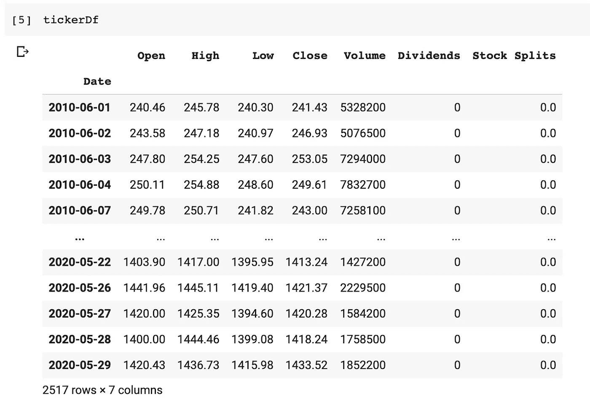
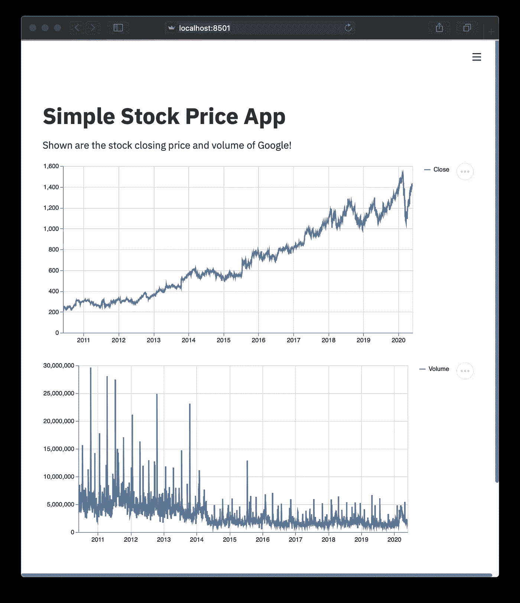
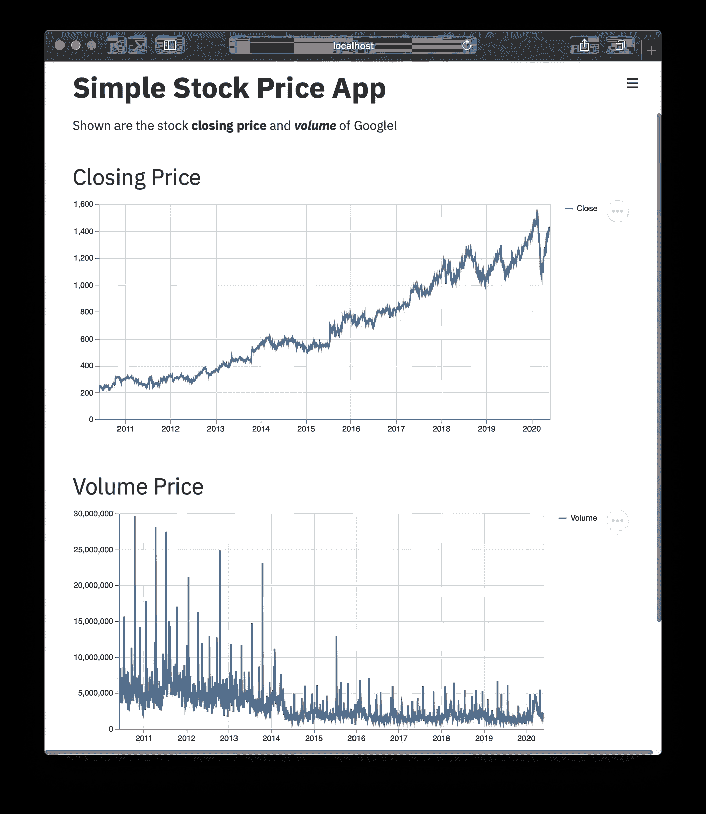

# 如何用 Python 构建数据科学 Web 应用程序

> 原文：<https://towardsdatascience.com/how-to-build-a-data-science-web-app-in-python-61d1bed65020?source=collection_archive---------7----------------------->


由 [YummyDs](https://elements.envato.com/user/YummyDs) 从 [Envato 元素](https://elements.envato.com/)使用许可图像创建

## [数据科学](https://towardsdatascience.com/tagged/data-science/)

## 第 1 部分:您的第一个 Web 应用程序，只有几行代码

在本文中，我将向您展示如何使用 streamlit Python 库，只用几行代码，快速构建一个简单的数据驱动的 web 应用程序。

作为一名数据科学家或机器学习工程师，能够部署我们的数据科学项目非常重要。使用 Django 或 Flask 等已建立框架的机器学习模型的传统部署可能是一项艰巨和/或耗时的任务。

这篇文章基于我在 YouTube 上制作的同一主题的视频(T21，如何用 Python 构建你的第一个数据科学 Web 应用，你可以边看边读这篇文章)。

# 我们正在构建的股票 web 应用程序概述

今天，我们将构建一个简单的 web 应用程序来显示股票价格和交易量。这将需要使用两个 Python 库，即`streamlit`和`yfinance`。从概念上讲，该应用程序将从雅虎检索历史市场数据。来自`yfinance`图书馆的资金。该数据被保存到一个数据帧中，并且`streamlit`将使用该数据作为输入参数，将其显示为一个折线图。

# 安装必备库

在本教程中，我们将使用两个需要安装的 Python 库。其中包括`streamlit`和`yfinance`。您可以通过如下的`pip install`命令轻松安装`streamlit`:

```
pip install streamlit
```

对`yfinance`也进行如下操作:

```
pip install yfinance
```

# web 应用程序的代码

让我们来看看我们今天正在构建的 web 应用程序的代码。您将会看到少于 20 行的代码(*即*如果不计算注释，那么它将减少到 14 行代码，其中 3 行是出于美观目的的空行)。

# 对代码的逐行解释

让我们花点时间对上面的代码做一些了解。

*   ***第 1 行和第 2 行*** 导入`yfinance`并赋予其别名`yf`以及导入`streamlit`并赋予其别名`st`。
*   ***第 4–7 行***
    使用`st.write()`功能打印出文本。这些打印出来的文本是以减价的形式写的。
*   ***第 9–16 行***
    使用`yfinance`库从 Yahoo！金融。
    * *第 11 行—* 将股票代码定义为`GOOGL`。
    * *第 13 行* —使用`yf.Ticker()`函数创建`tickerData`变量，顾名思义，该函数允许访问股票行情自动收录器数据。应该注意，tickerData 是一个 *Ticker 对象*，如果我们将 tickerData 作为一个命令运行，我们会得到下面的输出`yfinance.Ticker object <GOOGL>`。
    * *第 15 行* —创建`tickerDf`数据帧并定义日期范围(从 2010 年 5 月 31 日至 2020 年 5 月 31 日)和时间段(1 天)。



*   ***第 18 行和第 19 行***
    使用`st.line_chart()`函数绘制折线图(使用第 15 行定义的`tickerDf`数据框中的*收盘价*和*成交量*列)。

# 运行 web 应用程序

将代码保存到名为 myapp.py 的文件中后，启动命令提示符(或 Microsoft Windows 中的 Power Shell)并运行以下命令:

```
streamlit run myapp.py
```

接下来，我们应该会看到以下消息:

```
> streamlit run myapp.pyYou can now view your Streamlit app in your browser.Local URL: [http://localhost:8501](http://localhost:8501)
Network URL: http://10.0.0.11:8501
```

很快，一个互联网浏览器窗口将弹出，引导您进入创建的 web 应用程序，如下图所示的`[http://localhost:8501](http://localhost:8501.)`。



股票价格 web 应用程序的屏幕截图。

# 恭喜你！您已经用 Python 创建了您的第一个 web 应用程序！

# 自定义 web 应用程序

好吧，所以你可能想加点料，定制 web 应用程序。

让我们花点时间对上面的代码做一些了解。

*   ***第 6 行*** 注意，我们加粗了*【收盘价】*，在短语前后使用了两个星号，如下:`**closing price**`。还要注意的是，我们通过在单词前后使用三个星号，使单词“volume”变成了粗体和斜体形式，如下所示:`***volume***`。
*   ***第 18–20 行和第 22–25 行*** 这里我们在*收盘价*和*成交量*图之前添加了一个降价格式的标题。



更新后的 web 应用程序的屏幕截图。

# 瞧吧！

现在，我们有了一个更新的 web 应用程序，它会在你眼前自动更新。

## 订阅我的邮件列表，获取我在数据科学方面的最佳更新(偶尔还有免费赠品)!

# 关于我

我是泰国一所研究型大学的生物信息学副教授和数据挖掘和生物医学信息学负责人。在我下班后的时间里，我是一名 YouTuber(又名[数据教授](http://bit.ly/dataprofessor/))制作关于数据科学的在线视频。在我做的所有教程视频中，我也在 GitHub 上分享 Jupyter 笔记本([数据教授 GitHub page](https://github.com/dataprofessor/) )。

[](https://www.youtube.com/dataprofessor?sub_confirmation=1) [## 数据教授

### 数据科学、机器学习、生物信息学、研究和教学是我的激情所在。数据教授 YouTube…

www.youtube.com](https://www.youtube.com/dataprofessor?sub_confirmation=1) 

## 在社交网络上与我联系

YouTube: [http://youtube.com/dataprofessor/](http://youtube.com/dataprofessor/)

[LinkedIn:](https://www.linkedin.com/company/dataprofessor/)[https://www.linkedin.com/company/dataprofessor/](https://www.linkedin.com/company/dataprofessor/)

[https://www.linkedin.com/company/dataprofessor/](https://twitter.com/thedataprof)

[【HTTP://facebook.com/dataprofessor/】](https://www.youtube.com/redirect?redir_token=w4MajL6v6Oi_kOAZNbMprRRJrvJ8MTU5MjI5NjQzN0AxNTkyMjEwMDM3&q=http%3A%2F%2Ffacebook.com%2Fdataprofessor%2F&event=video_description&v=ZZ4B0QUHuNc)
【GitHub:[【HTTPS://github.com/dataprofessor/】](https://github.com/dataprofessor/)
[Instagram:【HTTPS://www.instagram.com/data](https://www.instagram.com/data.professor/)