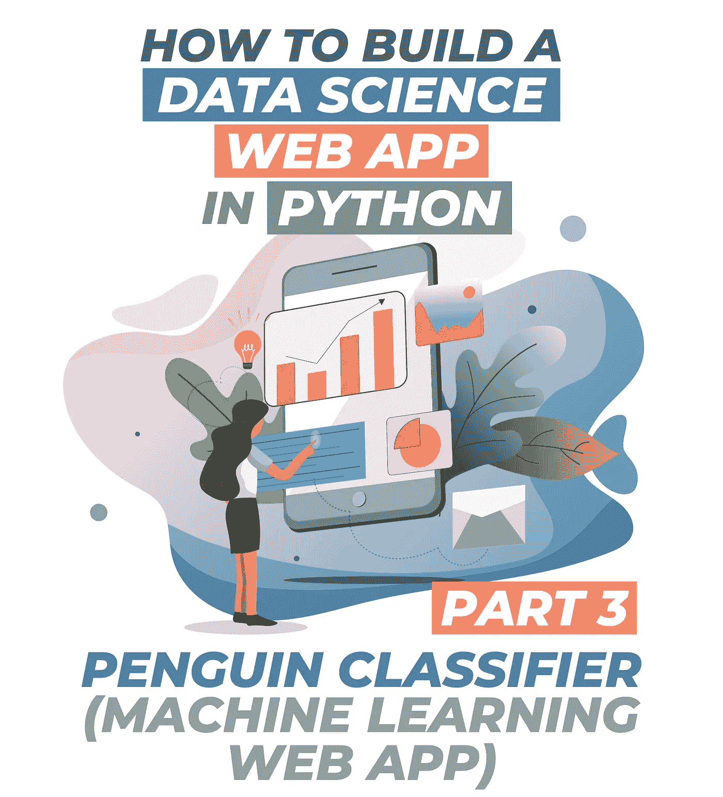
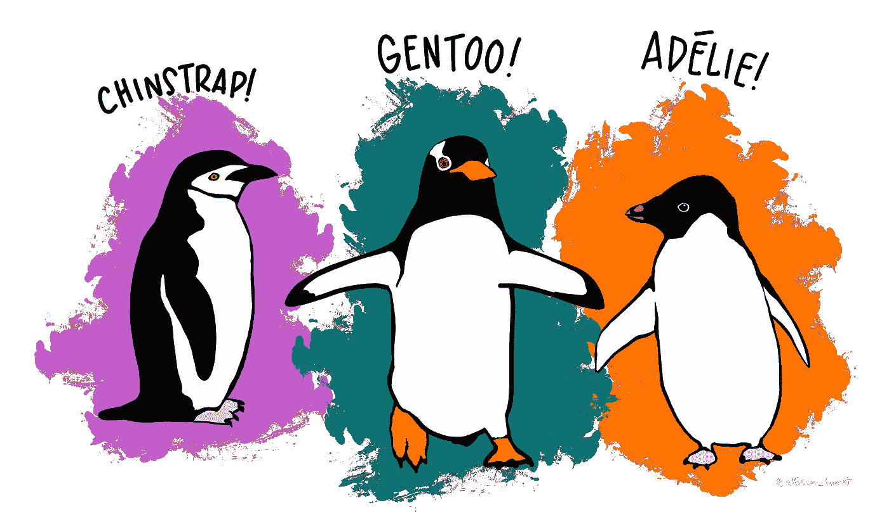
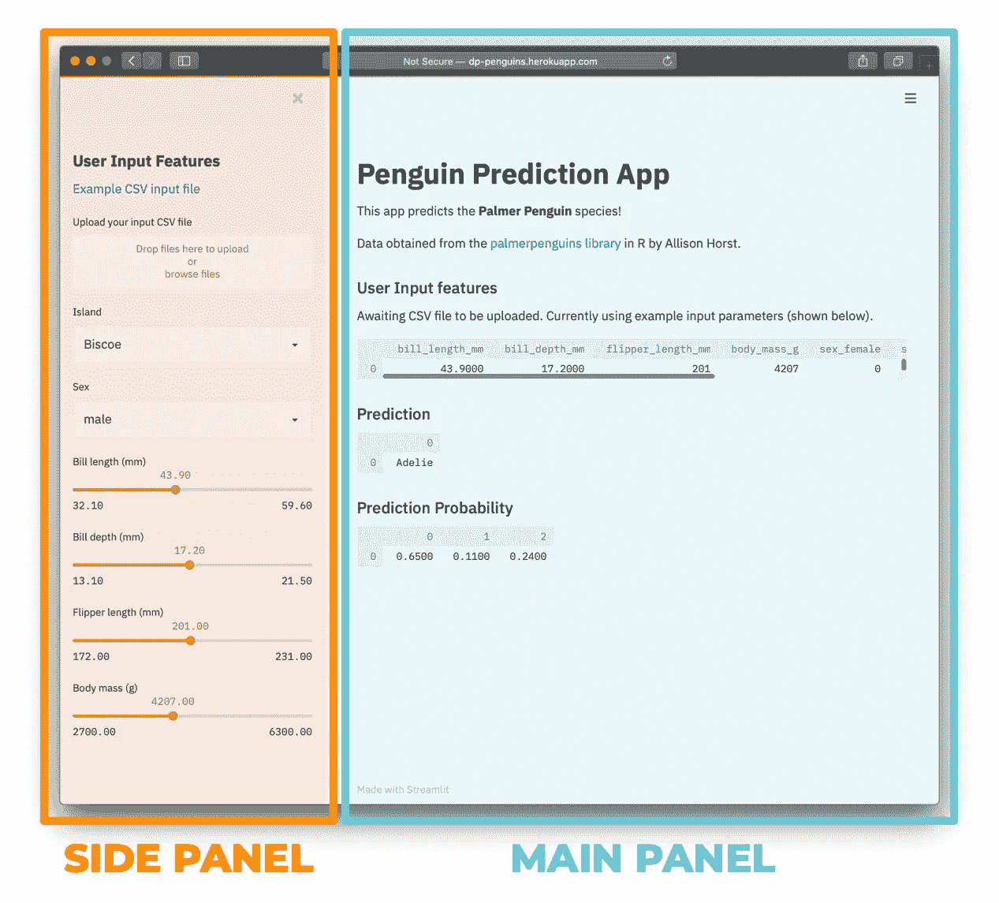
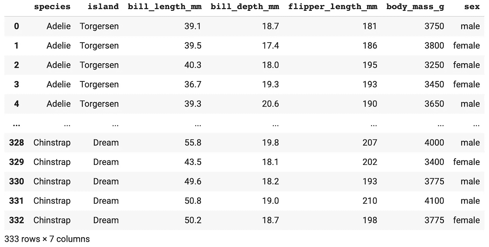
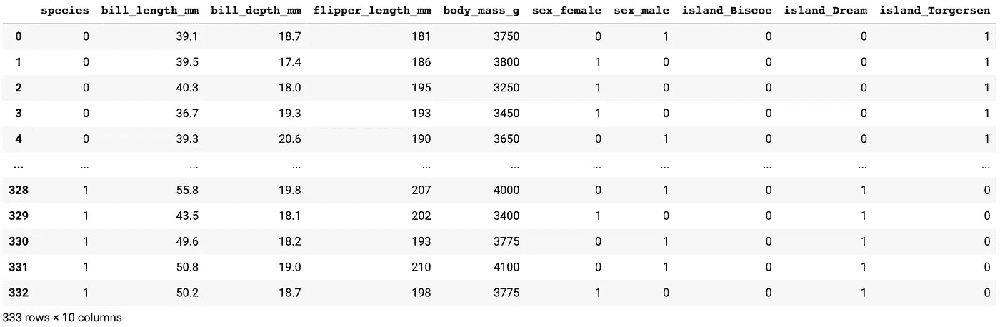
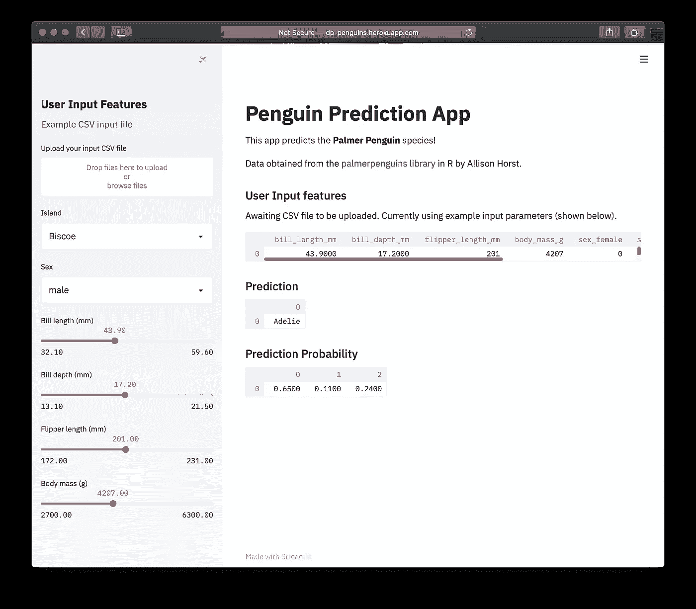

# 如何用 Python(企鹅分类器)构建数据科学 Web 应用

> 原文：<https://towardsdatascience.com/how-to-build-a-data-science-web-app-in-python-penguin-classifier-2f101ac389f3?source=collection_archive---------8----------------------->



## [数据科学](https://towardsdatascience.com/tagged/data-science/)

## 第 3 部分:ML 支持的 Web 应用程序，代码 100 多行

T 这是**第三部分**和**我将向您展示如何使用 Streamlit 库用 Python 构建一个机器学习驱动的数据科学 web 应用程序，代码只有 100 多行。**

我们今天要构建的 web 应用程序是企鹅分类器。我们正在构建的这个[企鹅分类器网络应用](http://dp-penguins.herokuapp.com/)的演示可以在[http://dp-penguins.herokuapp.com/](http://dp-penguins.herokuapp.com/)获得。

之前，在本 Streamlit 教程系列的第 1 部分 中，我已经向您展示了如何用 Python 构建您的第一个数据科学 web 应用程序，它能够从 Yahoo！财务，然后显示一个简单的折线图。在 [**第二部分**](/how-to-build-a-simple-machine-learning-web-app-in-python-68a45a0e0291) 中，我已经向你展示了如何使用 Iris 数据集构建一个机器学习 web 应用。

正如本 *Streamlit 教程系列*的前几篇文章中所解释的，模型部署是数据科学生命周期的基本和最终组成部分，有助于将数据驱动的洞察力的力量带给最终用户，无论是业务利益相关者、经理还是客户。


数据科学生命周期。由 Chanin Nantasenamat 绘制。

这篇文章基于我在[数据教授 YouTube 频道](https://www.youtube.com/dataprofessor?sub_confirmation=1) ( [如何用 Python](https://youtu.be/Eai1jaZrRDs) 构建企鹅分类 Web 应用)上制作的同一主题的视频，你可以边看边看这篇文章。

# 企鹅分类网络应用概述

在本文中，我们将构建一个*企鹅分类器* web 应用程序，作为 4 个定量变量和 2 个定性变量的函数，预测企鹅物种的分类标签是阿德利企鹅、下巴颏企鹅还是巴布亚企鹅。



艺术作品 [@allison_horst](http://twitter.com/allison_horst)

## 企鹅数据集

这个机器学习驱动的网络应用程序中使用的数据被称为 [*帕尔默企鹅*数据集](https://github.com/allisonhorst/palmerpenguins)，它是由艾利森·霍斯特作为 R 包发布的。特别地，该数据来源于 Kristen Gorman 博士及其同事发表的题为 [*南极企鹅(Pygoscelis 属)*](https://doi.org/10.1371/journal.pone.0090081) 群落内的生态性二态性和环境可变性的工作。

数据集由 **4 个定量变量**组成:

*   票据长度(毫米)
*   票据深度(毫米)
*   脚蹼长度(毫米)
*   体重(克)

和 **2 个定性变量**:

*   性别(男性/女性)
*   岛屿(比斯科/梦幻/托格森)

让我们来看看企鹅数据集(下面显示的是一个截短的版本，只显示了 3 种企鹅中每一种的前 3 行条目):

`*(Note: The full version of the* [*Penguins dataset is available on the Data Professor GitHub*](https://github.com/dataprofessor/data/blob/master/penguins_cleaned.csv)*)*`

## 企鹅分类器 web 应用程序的组件

*企鹅分类器 web app* 由**前端**和**后端**组成:

***前端*** —这是我们加载 web app 时看到的。前端可进一步分解为**侧面板**和**主面板**。web 应用程序的截图如下所示。

**侧面板**位于左侧，标签标题为*“用户输入特性”*。在这里，用户可以上传包含输入特征(2 个定性变量和 4 个定量变量)的 CSV 文件。对于 4 个定量变量，用户可以通过调节滑动条手动输入这些输入特征的输入值。对于 2 个定性变量，用户可以通过下拉菜单选择输入值。

这些用户输入特征用作将在后端讨论的机器学习模型的输入。一旦做出预测，产生的类别标签(企鹅种类)连同预测概率值被发送回前端，以显示在**主面板**上。

***后端*** —用户输入的特征将被转换成数据帧，并发送给机器学习模型进行预测。在这里，我们将使用一个预先训练的模型，该模型之前被保存为一个名为`penguins_clf.pkl`的 pickle 对象，该对象可以由 web 应用程序快速加载(无需在用户每次加载 web 应用程序时构建机器学习模型)。



企鹅分类器 web 应用程序的屏幕截图。

# 安装必备库

对于本教程，我们将使用 5 个 Python 库:`streamlit`、`pandas`、`numpy`、`scikit-learn`和`pickle`。如果您的计算机中尚未安装前 4 个库，则必须安装前 4 个库，而最后一个库是内置库。

要安装这些库，您可以通过如下的`pip install`命令轻松完成:

```
pip install streamlit
```

然后，重复上述命令，首先将`streamlit`替换为其他库的名称，如`pandas`，使其变成`pip install pandas`，依此类推。

或者，您可以使用这个一行程序一次性安装它们:

```
pip install streamlit pandas numpy scikit-learn
```

# web 应用程序的代码

现在，让我们看看 web 应用程序的内部。您将看到 web 应用程序由两个文件组成:`penguins-model-building.py`和`penguins-app.py`。

第一个文件(`penguins-model-building.py`)用于构建机器学习模型，保存为 pickle 文件，`penguins_clf.pkl`。

随后，第二个文件(`penguins-app.py`)将应用经过训练的模型(`penguins_clf.pkl`)通过使用来自 web 应用前端的侧边栏面板的输入参数来预测类别标签(企鹅的种类是阿德利企鹅、下巴颏企鹅还是巴布亚企鹅)。

# 对代码的逐行解释

## 企鹅-建模. py

让我们从第一个文件的解释开始，它本质上允许我们在运行 web 应用程序之前预先构建一个经过训练的机器学习模型。我们为什么要这么做？从长远来看，这是为了节省计算资源，因为我们最初只构建一次模型，然后应用它对 web 应用程序侧边栏面板上的用户输入参数进行不确定的预测(或至少直到我们重新训练模型)。

企鹅-建模. py

*   ***行 1***
    导入别名为`pd`的`pandas`库
*   ***第 2 行***
    从 CSV 文件中读取清理后的企鹅数据集，并将其赋给`penguins`变量
*   ***第 4-19 行***
    对目标 **Y** 变量(`species`)和 2 个 **X** 变量(`sex`和`island`)组成的 3 个定性变量进行顺序特征编码。



在执行序数特征编码之前。



执行顺序特征编码后。

*   ***第 21–23 行***
    将`df`数据帧分隔成`X`和`Y`矩阵。
*   ***第 25–28 行***
    训练一个随机森林模型
*   ***第 30–32 行***
    将训练好的随机森林模型保存到一个名为`penguins_clf.pkl`的酸洗文件中。

## 企鹅-app.py

第二个文件将服务于 web 应用程序，该应用程序将允许使用从 pickled 文件加载的机器学习模型进行预测。如上所述，web 应用程序接受来自两个来源的 inout 值:

1.  滑动条中的特征值。
2.  上传的 CSV 文件中的特征值。

企鹅-app.py

*   ***行 1–5***
    分别导入别名为`st`、`pd`和`np`的`streamlit`、`pandas`和`numpy`库。接下来，导入`pickle`库，最后从`sklearn.ensemble`导入`RandomForestClassifier()`函数。
*   ***第 7–13 行***
    编写 web 应用程序标题和介绍文本。

**侧边栏面板**

*   ***第 15 行***
    侧边栏面板的页眉标题。
*   ***第 17–19 行***
    链接下载一个示例 CSV 文件。
*   ***第 21–41 行***
    采集特征值并放入数据帧。我们将使用条件语句 if 和 else 来确定用户是否上传了 CSV 文件(如果是，则读取 CSV 文件并将其转换为 dataframe ),或者通过滑动其值也将被转换为 dataframe 的滑动条来输入特征值。
*   ***第 43–47 行***
    将用户输入特征(来自 CSV 文件或滑动条)与整个企鹅数据集相结合。这样做的原因是为了确保所有变量包含最大数量的可能值。例如，如果用户输入包含 1 只企鹅的数据，那么序数特征编码将不起作用。原因是因为代码将只检测定性变量的 1 个可能值。为了使序数特征编码起作用，每个定性变量都需要有所有可能的值。

**情况一**

在第一个场景中，定性变量`island`只有一个可能的值，即`Biscoe`。

上述输入特征在编码后将产生以下序数特征。

**情况 B**

上述输入特征将产生以下序数特征。

*   ***第 49–56 行***
    以与上述模型构建阶段(`penguins-model-building.py`)类似的方式执行序数特征编码。
*   ***第 58–65 行***
    显示用户输入特征的数据帧。条件语句将允许代码自动决定是显示 CSV 文件中的数据帧，还是显示滑动条中的数据帧。
*   ***第 67–68 行***
    从酸洗文件中加载预测模型，`penguins_clf.pkl`。
*   ***第 70–72 行***
    应用加载的模型对 df 变量进行预测，该变量对应于来自 CSV 文件或滑动条的输入。
*   ***第 74–76 行***
    预测的企鹅种类的类标签显示在这里。
*   ***第 78–79 行***
    这里显示了 3 种企鹅中每一种的预测概率值。

# 运行 web 应用程序

现在我们已经完成了 web 应用程序的编码，让我们首先启动您的命令提示符(终端窗口)并键入以下命令来启动它:

```
streamlit run penguins-app.py
```

然后，命令提示符中应该会显示以下消息:

```
> streamlit run penguins-app.pyYou can now view your Streamlit app in your browser.Local URL: http://localhost:8501
Network URL: http://10.0.0.11:8501
```

企鹅分类器 web 应用程序的屏幕截图如下所示:



在 Heroku 上部署企鹅分类器 web 应用程序。

# 部署和展示 web 应用程序

干得好！您现在已经创建了一个基于机器学习的 web 应用程序。让我们将 web 应用程序部署到互联网上，以便您可以与朋友和家人分享。本 *Streamlit 教程系列*的下一部分将深入介绍如何在 Heroku 上部署 web 应用程序。与此同时，请观看以下视频:

*   [如何将数据科学 Web App 部署到 Heroku](https://www.youtube.com/watch?v=zK4Ch6e1zq8)

与此同时，您可以将它纳入您的数据科学投资组合。

*   [使用 GitHub 构建您的数据科学组合](https://www.youtube.com/watch?v=fCXBaEnPzgo)
*   [如何用 Hugo & Github Pages 建立数据科学作品集网站【壮举。【数据教授】](https://www.youtube.com/watch?v=mEZ1Hj5yQ-8))。

## [订阅我的邮件列表，获取我在数据科学方面的最佳更新(偶尔还有免费内容)!](http://newsletter.dataprofessor.org/)

# 关于我

我是泰国一所研究型大学的生物信息学副教授和数据挖掘和生物医学信息学负责人。在我下班后的时间里，我是一名 YouTuber(又名[数据教授](http://bit.ly/dataprofessor/))制作关于数据科学的在线视频。在我做的所有教程视频里，我也分享 GitHub 上的 Jupyter 笔记本([数据教授 GitHub page](https://github.com/dataprofessor/) )。

[](https://www.youtube.com/dataprofessor?sub_confirmation=1) [## 数据教授

### 数据科学、机器学习、生物信息学、研究和教学是我的激情所在。数据教授 YouTube…

www.youtube.com](https://www.youtube.com/dataprofessor?sub_confirmation=1) 

## 在社交网络上与我联系

YouTube: [http://youtube.com/dataprofessor/](http://youtube.com/dataprofessor/)

[LinkedIn:](https://www.linkedin.com/company/dataprofessor/)[https://www.linkedin.com/company/dataprofessor/](https://www.linkedin.com/company/dataprofessor/)

[https://www.linkedin.com/company/dataprofessor/](https://twitter.com/thedataprof)

[【HTTP://facebook.com/dataprofessor/】](https://www.youtube.com/redirect?redir_token=w4MajL6v6Oi_kOAZNbMprRRJrvJ8MTU5MjI5NjQzN0AxNTkyMjEwMDM3&q=http%3A%2F%2Ffacebook.com%2Fdataprofessor%2F&event=video_description&v=ZZ4B0QUHuNc)
【GitHub:[【HTTPS://github.com/dataprofessor/】](https://github.com/dataprofessor/)
[Instagram:【HTTPS://www.instagram.com/data](https://www.instagram.com/data.professor/)