# 如何从头开始为图像分类器构建数据集(与汽车相关)

> 原文：<https://towardsdatascience.com/how-to-build-a-dataset-for-an-image-classifier-from-scratch-d2506e30468d?source=collection_archive---------15----------------------->

## 设计一个过程来收集网络上的数据，并使其可用于图像分类项目(使用 Beautifulsoup，Selenium)

乔纳森·加莱戈斯在 [Unsplash](https://unsplash.com?utm_source=medium&utm_medium=referral) 上拍摄的照片

在这篇文章中，我将介绍我几周前构建的从网站 [Turo](https://turo.com/fr-ca) 收集数据(文本和图片)的管道，以及清理收集的数据以在图像分类器项目中使用它的过程。

**免责声明:这些数据是供我使用的(我不拥有它)，所以我不会分享它。**

# 项目的概念

几周前，我开始思考在深度学习中更详细地潜水，我想围绕图像分类启动一个项目。

我在这个主题中阅读的大多数文章都使用了与 [mnist](http://yann.lecun.com/exdb/mnist/) 数据集(手写数字)、 [deepfashion](http://yann.lecun.com/exdb/mnist/) (贴有标签的衣服集合)或[狗品种分类器](https://medium.com/@paul.stancliffe/udacity-dog-breed-classifier-project-walkthrough-e03c1baf5501)相同的数据集。

这些数据集是合适的，但此时此刻我想研究一些不同的东西:

*   我同时发现了 [Turo platform](https://turo.com/) 这是一个人们可以从北美其他人那里租车的平台(它似乎运行得很好)。
*   我开始从[游乐场游戏](https://www.playground-games.com/)在 PC 上玩《极限纵横 4》。

[https://compass-SSL . Xbox . com/assets/2c/D7/2cd 7061 a-3d3b-4319-9d 75-8ac 4628 CBC 77 . jpg？n = 8888888884 _ Gallery _ 1154 x649 _ 09 . jpg](https://compass-ssl.xbox.com/assets/2c/d7/2cd7061a-3d3b-4319-9d75-8ac4628cbc77.jpg?n=8888888884_Gallery_1154x649_09.jpg)

几周前，我发现了两个相同主题的数据集

*   [斯坦福的一张](https://ai.stanford.edu/~jkrause/cars/car_dataset.html)通过阅读[巴努耶拉](https://towardsdatascience.com/@bhanuyerra?source=post_page-----39692e445a14----------------------)的这篇[文章](/classifying-car-images-using-features-extracted-from-pre-trained-neural-networks-39692e445a14)与汽车图片相关
*   Nicolas Gervais 的 GitHub 知识库

但是我想在抓取方面增加我的游戏，所以我决定建立我的 Turo 网站的抓取器。

在一份 Turo 的报价中，我才意识到有标注了车型的图片。

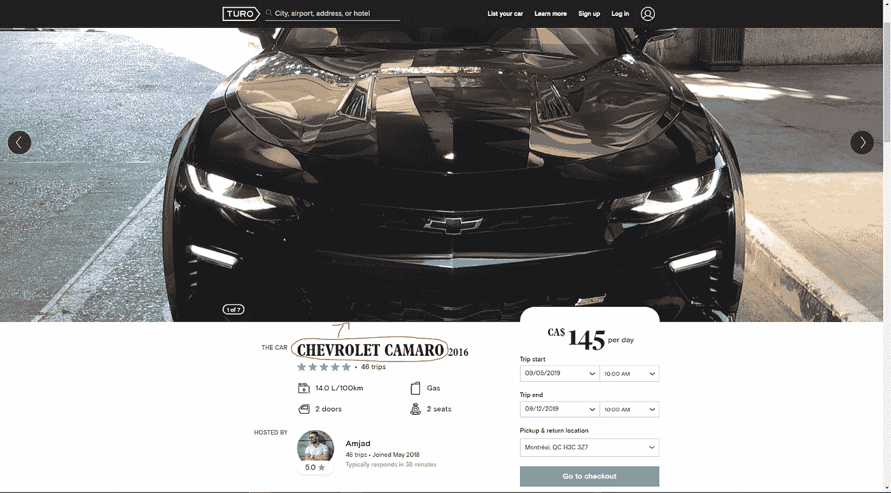

Turo 网站

因此，为什么不使用该网站作为图像分类数据集的来源来构建汽车检测系统呢？

为了执行从网站中提取数据，我不能使用与我在 Crossfit open 上的[文章](http://the-odd-dataguy.com/crossfitopen)中的[美汤](https://www.crummy.com/software/BeautifulSoup/)相同的方法，因为:

*   URL 不是很容易填充，所以我需要自动完成我的 Turo 研究
*   要让所有广告都显示在结果页面上，需要进行一些滚动操作

我仍然可以使用 Beautiful Soup 从源页面获取数据，但是我需要将这个包与另一个名为 Selenium 的包关联起来，以自动化对 Turo 的研究。

# 包装的展示

在这一部分，我将简单介绍一下我一直在 Turo 上爬行的库。

# 美味的汤

[美汤](https://www.crummy.com/software/BeautifulSoup/)是一个从 HTML 和 XML 文件中提取数据的包*。它与您喜欢的解析器一起工作，提供导航、搜索和修改解析树的惯用方式。它通常为程序员节省数小时或数天的工作。*

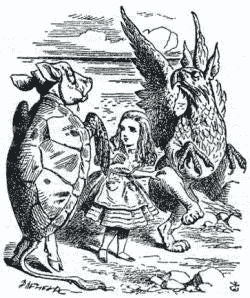

[https://info python . files . WordPress . com/2007/03/beautiful soup . jpg](https://infopython.files.wordpress.com/2007/03/beautifulsoup.jpg)

有了这个包之后，收集网页在线的源码，你就可以分段所有的 HTML 标签，并在里面研究收集你需要的信息。在我看来，这个包是开始使用 Python 进行 web 抓取的一个很好的开端，在这个主题上有很多有用的资源。

# 硒

这个包可以看作是一个 web 浏览器自动化包。

[https://huddle . eurostarsoftware testing . com/WP-content/uploads/2017/02/selenium . png](https://huddle.eurostarsoftwaretesting.com/wp-content/uploads/2017/02/Selenium.png)

这个包允许 Python 脚本打开像 Firefox 这样的网络浏览器，在网页上填充字段，在网页上滚动，像人类一样点击按钮。
让我们深入了解数据管道。

# 数据管道的介绍

# 概观

在数据收集方面，我决定将我的数据收集集中在北美最重要的城市，所以我选择了:

*   美国各州的中心城镇，至少有一百万人口
*   加拿大人口最多的 15 个城市

有一张我正在搜集数据的城市面板地图。

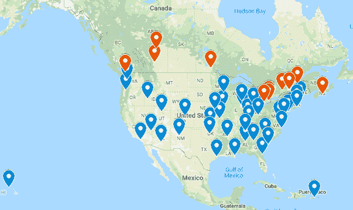

谷歌地图

它代表了 60 个城市(蓝色的美国和红色的加拿大)，就像我有多种类型的环境(山，海)和不同的天气可以诱导各种类型的车辆。

这个想法是每 6 个小时收集一次从城市列表中随机挑选的 5 个城市的新报价。接收数据的存储是这样进行的:

*   在本地，所有的图片都保存在刮板机上
*   在 [AWS](http://the-odd-dataguy.com/p/9d736496-0ed3-4a92-bd04-6e7fa03bcb41/Build%20a%20webscraper%20with%20Selenium%20and%20BeautifulSoup) 中，我使用了一个 [dynamodb](https://aws.amazon.com/dynamodb/?sc_channel=PS&sc_campaign=acquisition_CA&sc_publisher=google&sc_medium=dynamodb_hv_b&sc_content=dynamodb_e&sc_detail=dynamodb&sc_category=dynamodb&sc_segment=73324893176&sc_matchtype=e&sc_country=CA&s_kwcid=AL!4422!3!73324893176!e!!g!!dynamodb&ef_id=Cj0KCQjw9fntBRCGARIsAGjFq5GS7soTVsB8NP__REd9JX7GRF7S_zjDYZW-Swn0ik_5shVH39KzOCsaAnOOEALw_wcB:G:s) 表来存储从搜索到的报价信息(id，报价的详细信息),以便总是保存报价的可用信息

我用了大约两周的时间运行这个管道，下载了大约 164000 张图片。

[https://media.giphy.com/media/3NtY188QaxDdC/giphy.gif](https://media.giphy.com/media/3NtY188QaxDdC/giphy.gif)

现在让我们更详细地看看用 Selenium 和 Beautiful Soup 进行数据收集的脚本。

# 收集报价

首先，为了收集这些数据，我需要有一种方法来给出一个城市，并获得当前可用的优惠。
有一个代码可以收集蒙特利尔市的报价。

我们可以看到:

*   Selenium 的用法是通过一个驱动程序的声明，该驱动程序可以控制 web 浏览器在网站上进行导航
*   使用对象驱动程序，我可以设置我的脚本来填充由 id 定义的特定字段(在本例中为“js-searchformexpandlocationinput ”),并将键发送到该特定输入(在本例中为城市字段中的位置)

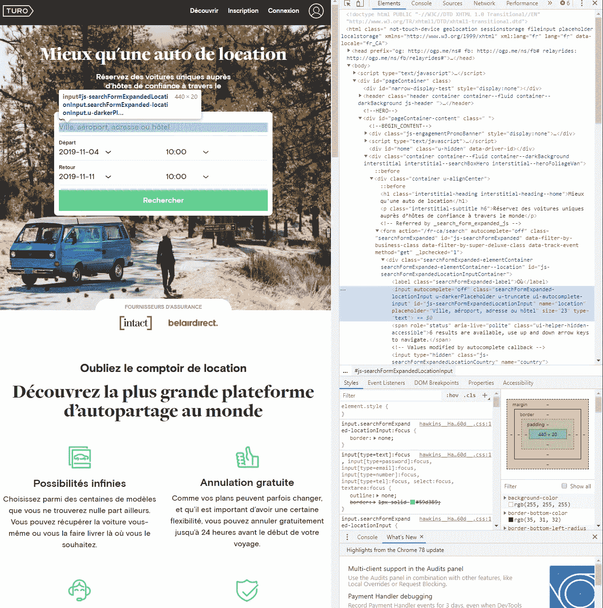

turo 首页检查

*   Selenium 的另一部分是与页面上的按钮的直接交互(需要找到页面上的按钮并激活它)。

对于页面上的滚动，这有点棘手；我用[迈克尔·J·桑德斯](https://michaeljsanders.com/2017/05/12/scrapin-and-scrollin.html)的方法在“无限页”上滚动。

在每一次滚动之间，我都使用 Beautiful Soup 来收集页面上的所有报价。

有一个脚本的动画。

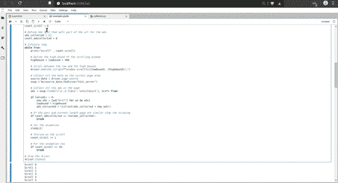

之后，我只是对以前从未见过的报价(不在我的 dynamodb 表中)进行过滤，并使用一个新的流程从一个特定的报价中收集数据。

# 收集图片

有一个为要约收集数据的脚本。

这个脚本的棘手部分是收集报价上图片的 URL。下面的屏幕截图说明了图片存储在一个转盘中。

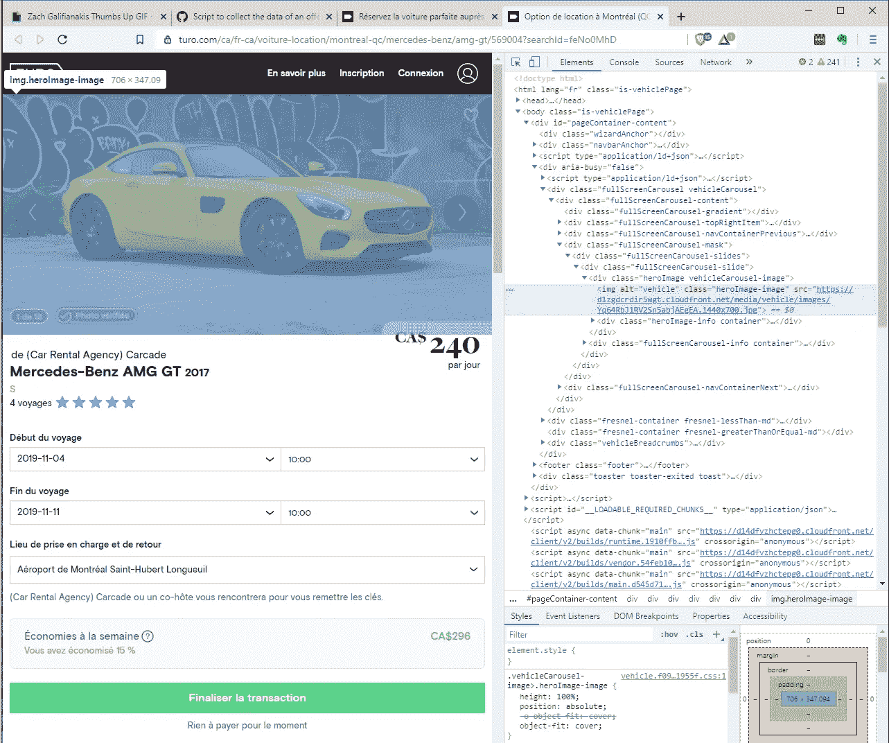

我使用同样的技巧，然后在首页上使用验证按钮，这样，我可以很容易地收集所有图片的 URL，并通过 GET 请求，将它们下载到我的机器上。有一个先前脚本的动画在运行。

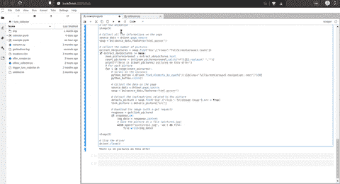

如果你想运行脚本，我邀请你用 Github 库(在一台 Linux 机器上)上的[配置设置一个 python 环境。](https://github.com/jeanmidevacc/example_webscraper)

现在让我们看一下数据集的数据准备。

# 从 ze(原始)数据集到图像分类器的 hero 数据集

用我的刮刀，我在 Turo 网站上收集了很多(164000 左右)与他们的汽车报价相关的图片。这是一个很好的开始，但所有这些图片都是不可用的，例如，汽车的内部。

Turo 广告图片

有很多这样的图片，所以我需要对这个原始数据集做一些清理。

# 清洗管道的描述

该管道背后的流程是:

*   检测原始数据集图像上的所有对象
*   根据图片中检测到的对象应用一些规则来选择正确的图像
*   裁剪图像上的车辆，并将其存储在新文件中

有一个过程的简要说明

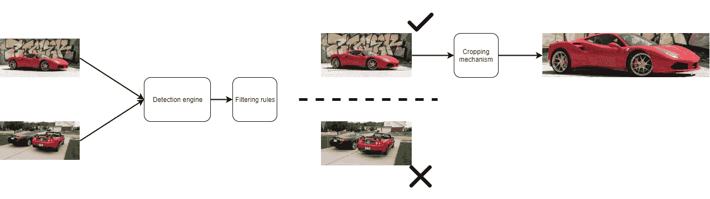

这个管道中最棘手的部分是检测引擎；对于管道的这一部分，我决定我可以使用一个预先制作的模型。可以在线找到大量的模型来执行检测图像上的对象的任务。

看起来最有效的实现是由[克里斯·福塔什](https://towardsdatascience.com/@chrisfotache)在 [Pytorch](/object-detection-and-tracking-in-pytorch-b3cf1a696a98) 上实现的。

对于过滤规则，这很简单；一幅好的汽车图片可以定义为:

*   图像上只有一辆车(汽车或卡车)
*   车辆检测的置信指数应高于 90%

过滤规则后，碰巧只有 57000 张图片可用。

让我们看看这些图片的标签。

# 最后一步:调整大小和标签

完成数据集的最后一步是调整图片的大小，并为分类添加标签。

# 调整大小

从所有这些被选中的照片中，有两件事是值得注意的

*   它们有不同的尺寸(就高度和长度而言)
*   它们是彩色的(因此有 3 个原色通道)

下图显示了图片的高度和长度。

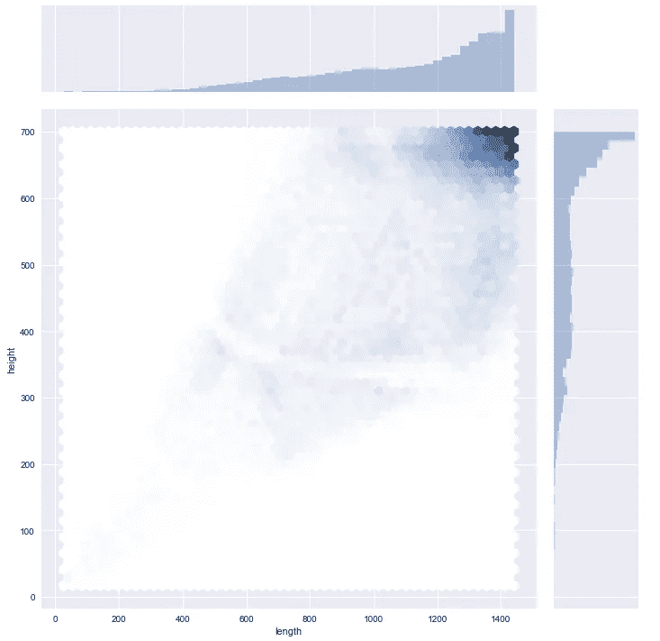

这些图片有适当的分辨率，但我需要使它们一致，以便每个管道都可以用于分类。我构建了下面这段代码来调整图片的大小(这个函数可以将图片变成黑白的)。

我根据高度和长度的像素尝试了数据集的多种大小配置。

现在让我们看看标签。

# 贴标签于

该数据集有两个明显的标签:

*   有 51 种可能标签的制造商
*   有 526 个可能标签的模型

下图显示了每个制造商的型号数量。

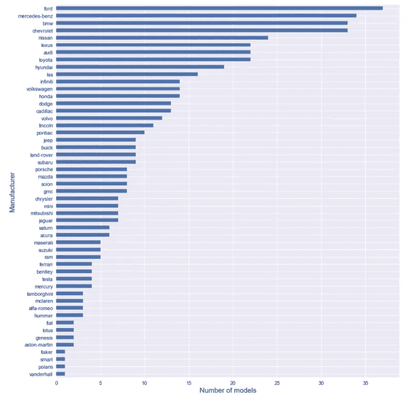

我们可以看到，有很多厂商和型号，有这么多标签(我觉得)是一个很难的开始。我决定建立我的“标签机制”

我建立了两种标签:

*   一个用于二元分类器
*   一个用于多类分类器

对于二元分类器，我选择一个特定的制造商和一个特定的型号。对于厂商，我决定选择特斯拉；第一个原因是它在网上很流行，第二个原因是特斯拉的图片数量与可用车型数量之间的比例不同寻常，如下图所示。

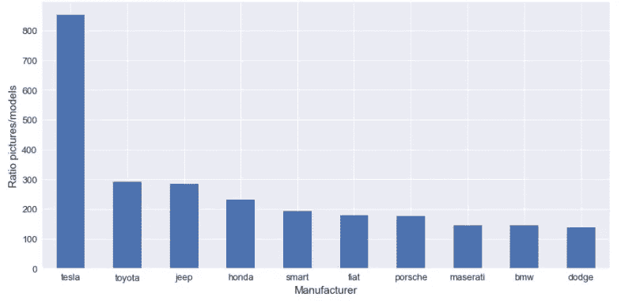

对于车型，我决定选择福特野马，是因为我喜欢福特野马，不是别的。但老实说，这是数据集中最受欢迎的模型之一，正如我们在下图中看到的 10 大最受欢迎的模型。

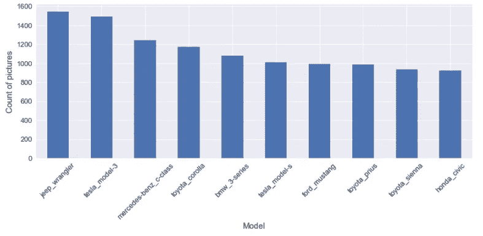

让我们谈谈多类分类器；在这种情况下，我使用一种简单的方法来标记。这个想法就是取前 X 个最受欢迎的厂商/型号，如果图片的厂商/型号不在前 X，那么他分配的标签就是 other。我为以下产品创建标签:

*   十大制造商/型号
*   前 25 名制造商/型号
*   前 50 名制造商/型号
*   前 100/200/400 型号

现在有很多不同的图片标签。尽管如此，对于我在图像分类器上的第一个工作，我将把我的测试集中在二进制标签和前 10 名制造商/型号上。

为了完成这篇文章，我只想谈一些事情，它是关于数据集的平衡。对于我选择的标签，我可以告诉你，要预测的类根本不是平衡的。下图显示了数据集的不平衡。

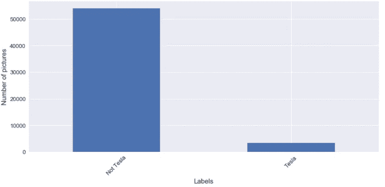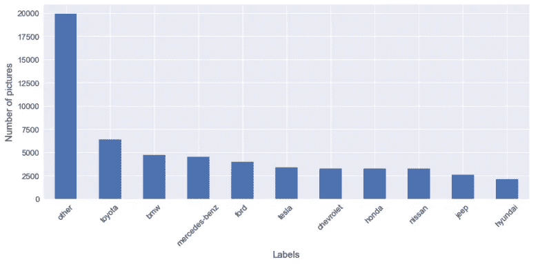

当我使用这些标签进行图像分类时，我将测试影响以平衡训练的类别。

请继续关注，不要犹豫，请给我们一些反馈。

*原载于 2020 年 1 月 18 日***。**