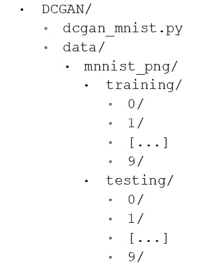
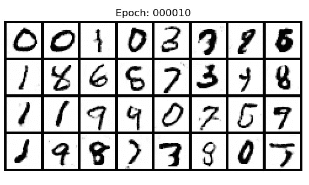
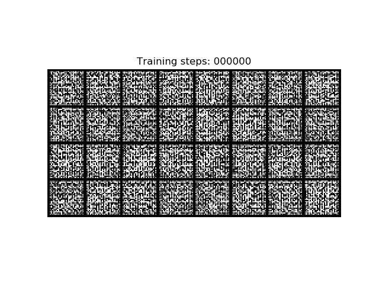
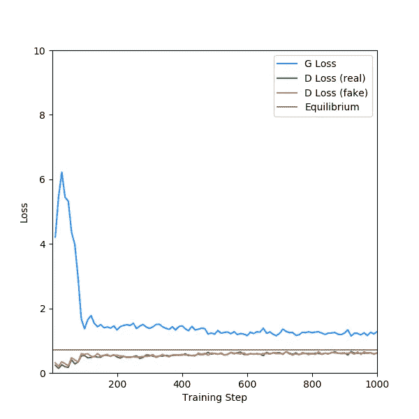

# 如何用 PyTorch 构建 DCGAN

> 原文：<https://towardsdatascience.com/how-to-build-a-dcgan-with-pytorch-31bfbf2ad96a?source=collection_archive---------16----------------------->

## GAN 入门教程


图片来源: [Pixabay](https://pixabay.com/photos/light-lamp-warm-kind-mellow-focus-4297386/)

在本教程中，我们将在 PyTorch 中构建一个简单的 [DCGAN](https://arxiv.org/abs/1511.06434) ，并训练它生成手写数字。作为本教程的一部分，我们将讨论 PyTorch 数据加载器，以及如何使用它将真实图像数据输入 PyTorch 神经网络进行训练。PyTorch 是本教程的重点，所以我假设您熟悉 GANs 的工作方式。

# 要求

1.  Python 3.7 以上版本。再低的话，你就要重构 f 弦了。
2.  PyTorch 1.5 不确定怎么安装？这可能会有所帮助。
3.  Matplotlib 3.1 或更高版本
4.  大约 22 分钟。

这不是必需的，但我建议先阅读我的[香草甘教程](/pytorch-and-gans-a-micro-tutorial-804855817a6b)；它解释了一些本教程认为理所当然的事情。我还建议你在配有 CUDA GPU 的电脑上完成本教程，或者准备一本厚厚的数独书。

# 手头的任务

> *创建一个函数 G: Z → X 其中 Z~N₁* ₆ *(0，1)和 X~MNIST。*

也就是说，训练一个 GAN，它采用 16 维随机噪声并产生看起来像来自 [MNIST](https://en.wikipedia.org/wiki/MNIST_database) 数据集的真实样本的图像。


来自 MNIST 数据集的数字样本(来源:[约瑟夫·斯特潘](https://commons.wikimedia.org/wiki/File:MnistExamples.png)

# 但是在我们开始之前…

…让我们做一点家务。如果您还没有，请安装所需版本的 Python 和上述库。然后，创建您的项目目录。我把我的叫做`DCGAN`。在该目录中，创建一个名为`data`的目录。然后，导航到[这个 GitHub repo](https://github.com/myleott/mnist_png) 并下载`mnist_png.tar.gz`。这个压缩文件包含 70000 个独立的 png 文件形式的 MNIST 数据集。当然，我们可以使用 PyTorch 的内置 MNIST 数据集，但这样你就不会知道如何实际加载图像数据进行训练。解压文件并将`mnist_png`目录放到你的`data`目录中。创建一个名为`dcgan_mnist.py`的文件，并将其放在您的 DCGAN 目录中。您的项目目录应该如下所示:



我们的项目目录，包括图像文件和 Python 脚本。0/、1/等中的数千个图像文件。未示出。

最后，将以下内容添加到您的`dcgan_mnist.py`脚本中:

```
import osimport torch
from torch import nn
from torch import optim
import torchvision as tv
from torchvision.datasets import ImageFolder
from torch.utils.data import DataLoader
```

好了，现在我们准备开始了。

# 发电机

将以下内容添加到您的`dcgan_mnist.py`脚本中:

生成器继承了`nn.Module`，它是 PyTorch 神经网络的基类。生成器有三种方法:

## 发电机。__init__

构造函数，存储实例变量并调用`_init_layers`。这里不多说了。

## 发电机。`_init_modules`

这个方法实例化 PyTorch 模块(或者其他框架中称为“层”)。其中包括:

*   线性(“全连通”)模块，用于将潜在空间映射到 7*×*7*×*256 = 12544 维空间。正如我们将在`forward`方法中看到的，这个 12544 长度的张量被整形为(256，7，7)“图像”张量(通道 *×* 高度×宽度)。在 PyTorch 中，与 TensorFlow 不同，通道出现在空间维度之前。
*   一维批处理规范化模块(如果指定)。
*   泄漏的 ReLU 模块。
*   二维卷积层。
*   两个 2 维转置卷积层；这些用于放大图像。请注意，一个卷积层的输出通道是下一个卷积层的输入通道。
*   两个二维批处理规范化层(如果指定)。
*   一个 Tanh 模块作为输出激活。我们将重新调整我们的图像到范围[-1，1]，所以我们的发生器输出激活应该反映这一点。

这些可以在`__init__`方法中实例化，但是我喜欢将模块实例化与构造函数分开。对于这么简单的模型来说，这是微不足道的，但是随着模型变得越来越复杂，这有助于保持代码的简单。

## 发电机。`forward`

这是我们的生成器用来从随机噪声中生成样本的方法。输入张量传递给第一个模块，其输出传递给下一个模块，*的输出传递给下一个模块，依此类推。这相当简单，但我想提醒您注意两个有趣的特性:*

1.  注意线`intermediate = intermediate.view((-1, 256, 7, 7))`。与 Keras 不同，PyTorch 不使用显式的“整形”模块；相反，我们使用 PyTorch 操作“视图”手动重塑张量。其他简单的 PyTorch 操作也可以在向前传递的过程中应用，比如将一个张量乘以 2，PyTorch 不会眨一下眼睛。
2.  注意在`forward`方法中有多少`if`语句。PyTorch 使用运行定义策略，这意味着计算图是在向前传递的过程中动态构建的。这使得 PyTorch 极其灵活；没有什么可以阻止你向前传球添加循环，或者随机选择几个模块中的一个来使用。

# 鉴别器

将以下内容添加到您的`dcgan_mnist.py`脚本中:

我不会对这个做太多的描述，因为它和发生器非常相似，但方向相反。通读一遍，确保你明白它在做什么。

# DCGAN

将以下内容添加到您的`dcgan_mnist.py`脚本中:

## DCGAN。__init__

让我们一行一行地检查构造函数:

```
self.generator = Generator(latent_dim).to(device)
self.discriminator = Discriminator().to(device)
```

构造函数的前两行(非 docstring)实例化生成器和鉴别器，将它们移动到指定的设备，并将它们存储为实例变量。该设备通常是“cpu”，或者“cuda”，如果你想使用 gpu。

```
self.noise_fn = noise_fn
```

接下来，我们将`noise_fn`存储为一个实例变量；`noise_fn`是一个以整数`num`作为输入，以 PyTorch 张量的形式返回`num`潜在向量作为 shape (num，latent_dim)输出的函数。这个 PyTorch 张量必须在指定的设备上。

```
self.dataloader = dataloader
```

我们将一个 torch.utils.data.DataLoader 对象 dataloader 存储为实例变量；稍后将详细介绍。

```
self.batch_size = batch_size
self.device = device
```

将批次大小和设备存储为实例变量。简单。

```
self.criterion = nn.BCELoss()
self.optim_d = optim.Adam(self.discriminator.parameters(), lr=lr_d, betas=(0.5, 0.999))
self.optim_g = optim.Adam(self.generator.parameters(), lr=lr_g, betas=(0.5, 0.999))
```

将损失函数设置为[二进制交叉熵](/understanding-binary-cross-entropy-log-loss-a-visual-explanation-a3ac6025181a)，并为生成器和鉴别器实例化 Adam 优化器。PyTorch 优化器需要知道他们在优化什么。对于鉴别器，这意味着鉴别器网络内的所有可训练参数。因为我们的 Discriminator 类继承自 nn。模块中，它有`parameters()`方法，该方法返回所有实例变量中的所有可训练参数，这些变量也是 PyTorch 模块。发电机也是如此。

```
self.target_ones = torch.ones((batch_size, 1), device=device)
self.target_zeros = torch.zeros((batch_size, 1), device=device)
```

训练目标，设置到指定的设备。记住，鉴别器试图将真实样本分类为 1，将生成的样本分类为 0，而生成器试图让鉴别器将生成的样本错误分类为 1。我们在这里定义并存储它们，这样我们就不必在每个训练步骤中重新创建它们。

## DCGAN.generate_samples

生成样本的辅助方法。注意，使用了`no_grad`上下文管理器，它告诉 PyTorch 不要跟踪梯度，因为这种方法不用于训练网络。还要注意，不管指定的设备是什么，返回的张量都被设置为 cpu，这是进一步使用所必需的，比如显示样本或将样本保存到磁盘。

## DCGAN.train_step_generator

该方法执行生成器的一个训练步骤，并以浮点形式返回损失。让我们一步一步来:

```
self.generator.zero_grad()
```

清除发生器的渐变。这是必要的，因为 PyTorch 自动跟踪梯度和计算网络。我们不希望一个训练步骤影响下一个。

```
latent_vec = self.noise_fn(self.batch_size)
generated = self.generator(latent_vec)
classifications = self.discriminator(generated)
loss = self.criterion(classifications, self.target_ones)
```

获得一批潜在向量，用它们生成样本，区分每个样本的真实程度，然后使用二进制交叉熵准则计算损失。请注意，通过将这些网络链接在一起，我们创建了一个单一的计算图，从潜在向量开始，包括发生器和鉴别器网络，并在损耗处结束。

```
loss.backward()
self.optim_g.step()
```

PyTorch 的主要优点之一是它自动跟踪计算图形及其梯度。通过对损失调用`backward`方法，PyTorch 应用反向传播并计算损失相对于计算图中每个参数的梯度。然后通过调用生成器的优化器的`step`方法，生成器的参数(只有*和*生成器的参数)在梯度的负方向上被轻微推动。

```
return loss.item()
```

最后，我们归还损失。使用`item`方法很重要，这样我们将返回一个浮点数而不是 PyTorch 张量。如果我们返回张量，Python 垃圾收集器将无法清理底层的计算图形，我们将很快耗尽内存。

## DCGAN.train_step_discriminator

这种方法与`train_step_generator`非常相似，但是有两个显著的不同。首先:

```
with torch.no_grad():
    fake_samples = self.generator(latent_vec)
```

上下文管理器`no_grad`在这里用来告诉 PyTorch 不要担心跟踪渐变。这是不必要的，但减少了不必要的计算。第二:

```
loss = (loss_real + loss_fake) / 2
```

这条线真的很酷。`loss_real`是鉴别器对真实样本的损耗(并附上其计算图)，而`loss_fake`是对假样本的损耗(及图)。PyTorch 能够使用`+`操作符将这些组合成一个计算图。然后，我们将反向传播和参数更新应用于该组合计算图。如果你不认为这非常简单，尝试在另一个框架中重写。

## DCGAN.train_epoch

该函数为一个时期训练发生器和鉴别器，这是对整个数据集的一次遍历。在短暂的迂回之后，我们将回到这个问题上。

# 主要的

将以下代码添加到您的脚本中:

该功能构建、训练和展示 GAN。

```
import matplotlib.pyplot as plt
from time import time
batch_size = 32
epochs = 100
latent_dim = 16
```

导入`pyplot`(用于可视化生成的数字)和`time`(用于训练计时)。将训练批次大小设置为 32，将时期数设置为 100，将潜在维度设置为 16。

```
device = torch.device("cuda" if torch.cuda.is_available() else "cpu")
```

该行检查 cuda 设备是否可用。如果是，`device`被指定为该设备；否则，`device`被分配 cpu。

```
transform = tv.transforms.Compose([
            tv.transforms.Grayscale(num_output_channels=1),
            tv.transforms.ToTensor(),
            tv.transforms.Normalize((0.5,), (0.5,))
            ])
```

数据加载器使用这种复合转换来预处理图像。我们之前下载的 MNIST 数据集是。png 文件；当 PyTorch 从磁盘加载它们时，它们必须经过处理，以便我们的神经网络可以正确使用它们。这些转换依次为:

*   `Grayscale(num_output_channels=1)`:将图像转换成灰度。加载时，MNIST 数字为三通道 RGB 格式。`Greyscale`把这三个减为一个。
*   `ToTensor()`:将图像转换为 PyTorch 张量，尺寸为 channels × height × width。这也会重新调整像素值，从 0 到 255 之间的整数到 0.0 到 1.0 之间的浮点数。
*   `Normalize((0.5,), (0.5,))`:从范围[0.0，1.0]到[-1.0，1.0]缩放和平移像素值。第一个参数为μ，第二个参数为σ，应用于每个像素的函数为:


μ和σ是一元组的原因是这种变换是针对每个通道应用的。到 RGB 图像的等效变换将是`Normalize((0.5, 0.5, 0.5), (0.5, 0.5, 0.5))`

```
dataset = ImageFolder(
            root=os.path.join("data", "mnist_png", "training"),
            transform=transform
            )
```

在这里，我们通过指定它的根和要应用的转换来创建数据集。这用于创建数据加载器:

```
dataloader = DataLoader(dataset,
            batch_size=batch_size,
            shuffle=True,
            num_workers=2
            )
```

DataLoader 是一个对象，它从数据集中加载数据。在这里，我们指定我们的批处理大小，告诉数据加载器在不同的时期之间混洗数据集，并使用两个工作进程的多处理(如果您使用的是 Windows，这会导致问题，请将`num_workers`设置为 0)。您可以遍历这个数据加载器，每次迭代都会返回一个元组，其中包含:

1.  形状为(32，1，28，28)的 PyTorch 张量，对应于一批(32 个样本)灰度(1 通道)MNIST 图像(28×28 像素)。
2.  数字 0 到 9 的形状(32)py torch 张量，对应于该图像的标签(数字)。这些类标签取自目录结构，因为所有的 0 都在目录`0`中，所有的 1 都在`1`中，等等。

```
noise_fn = lambda x: torch.rand((x, latent_dim), device=device)
```

产生随机正态分布噪声的函数。

```
gan = DCGAN(latent_dim, noise_fn, dataloader, device=device)
start = time()
for i in range(10):
    print(f"Epoch {i+1}; Elapsed time = {int(time() - start)}s")
    gan.train_epoch()
```

建立和训练 GAN。

## DCGAN.train_epoch，再来一遍:

既然我们已经讨论了什么是数据加载器，让我们再来看看这个。该方法非常简单明了，尽管有些冗长，但我想重点介绍两行代码:

```
for batch, (real_samples, _) in enumerate(self.dataloader):
   real_samples = real_samples.to(self.device)
```

这里，我们遍历数据加载器。我们将数据加载器包装在一个枚举器中，这样我们就可以跟踪批号，但是正如您所看到的，数据加载器确实像承诺的那样返回了一个元组。我们将一批图像张量分配给`real_samples`，并忽略标签，因为我们不需要它们。然后，在循环中，我们将`real_samples`移动到指定的设备。模型的输入和模型本身在同一个设备上是很重要的；如果你忘记这样做，不要担心，PyTorch 一定会让你知道的！此外，不要担心数据加载器“耗尽”。一旦我们遍历了整个数据集，循环将会结束，但是如果我们再次尝试遍历它，它将会从头开始(首先洗牌，因为我们在制作数据加载器时指定了这一点)。

# 让我们试着运行它？

如果复制和粘贴正确，运行脚本应该会显示几分钟的训练统计数据，然后是一些生成的数字。希望它看起来像这样:



如果它们看起来很糟糕，你的损失暴增，试着再跑一次(甘的不稳定性是出了名的)。如果它*仍然*不工作，请在下面留下评论，我们看看是否能调试它。

只是为了好玩，我修改了脚本，看看在每 10 个训练步骤之后，生成器能够做什么。这是结果。



我觉得只走 1000 步就已经很不错了。这是那些训练步骤的损失，分成 10 步“时期”。



# 结束语

*   本教程中描述的 DCGAN 显然非常简单，但应该足以让您开始在 PyTorch 中实现更复杂的 GAN。
*   在我制作一个教程之前，你能修改这个脚本来制作一个[条件句](https://arxiv.org/abs/1411.1784)吗？
*   完整的脚本可在[这里](https://github.com/ConorLazarou/pytorch-generative-models/blob/master/GAN/DCGAN/dcgan_mnist.py)获得。
*   所有未引用的图片都是我自己的。请随意使用它们，但请引用❤的这篇文章

[](https://github.com/ConorLazarou/pytorch-generative-models/blob/master/GAN/DCGAN/dcgan_mnist.py) [## ConorLazarou/py torch-生成模型

### 产生 MNIST 数字的简单 DCGAN 实现。

github.com](https://github.com/ConorLazarou/pytorch-generative-models/blob/master/GAN/DCGAN/dcgan_mnist.py)