# 如何用 10 行构建深度学习模型

> 原文：<https://towardsdatascience.com/how-to-build-a-deep-learning-model-in-10-lines-4f4c351d5da?source=collection_archive---------13----------------------->

# 快速沉浸在深度学习中的指南


Alex Kotliarskyi 在 [Unsplash](https://unsplash.com/s/photos/%22deep-learning%22?utm_source=unsplash&utm_medium=referral&utm_content=creditCopyText) 上的照片

本文将通过一个案例研究向读者介绍神经网络的基础知识，该案例研究仅使用 10 行 Python 代码创建并训练了一个神经网络，该网络通过 3 个基本步骤识别手写数字:

**1-加载并预处理数据**

**2-定义模型**

**3-训练模型**

为此，我们将使用目前深度学习社区中最流行的库 [TensorFlow Keras API](https://www.tensorflow.org/guide/keras/overview) 。让我们去吧！

# 手写数字

作为一个案例研究，我们将创建一个允许我们识别手写数字的模型，例如下列数字:

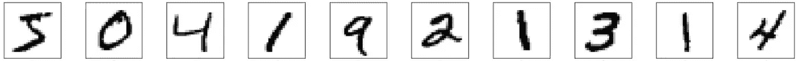

目标是创建一个数学模型，给定一幅图像，该模型识别它所代表的数字。例如，如果我们向模型输入第一张图片，我们会期望它回答这是一张 5。下一个是 0，下一个是 4，以此类推。

## 分类问题

实际上，我们正在处理一个分类问题，给定一幅图像，模型将其分类在 0 到 9 之间。但有时，甚至我们会发现自己有某些疑问，例如，第一个图像代表 5 还是 3？

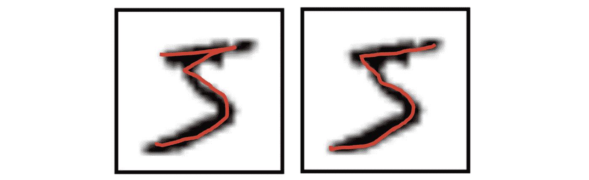

为此，我们将创建的神经网络返回一个具有 10 个位置的向量，指示 10 个可能数字中每一个的可能性:

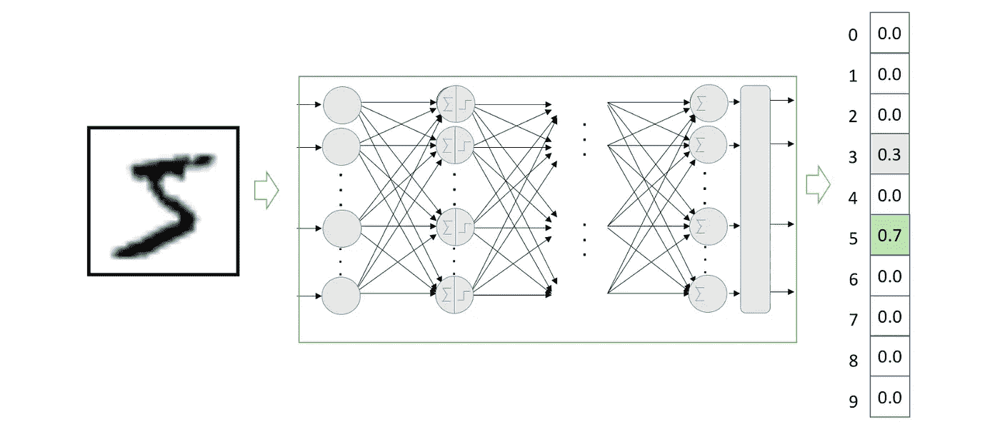

## 只有 10 行代码

是的，只需 10 行 python 代码，您就可以创建并训练一个对手写数字进行分类的神经网络模型:

```
**1:** import tensorflow as tf
**2:** from tensorflow.keras.utils import to_categorical**3:**(x_train, y_train), _ = tf.keras.datasets.mnist.load_data()**4:** x_train = x_train.reshape(60000, 784).astype('float32')/255
**5:** y_train = to_categorical(y_train, num_classes=10)**6:** model = tf.keras.Sequential()
**7:** model.add(tf.keras.layers.Dense(10, activation='sigmoid', 
            input_shape=(784,)))
**8:** model.add(tf.keras.layers.Dense(10, activation='softmax'))**9:** model.compile(loss="categorical_crossentropy", optimizer="sgd", 
                 metrics = ['accuracy'])**10:** model.fit(x_train, y_train, epochs=10, verbose=0)
```

我们使用了 TensorFlow **的 [API Keras。](https://www.tensorflow.org/guide/keras)**它是推荐给初学者的库，因为它的学习曲线与其他库相比非常平滑，并且目前它是实现神经网络的流行中间件之一。Keras 由来自谷歌的工程师[Fran ois Chollet](https://twitter.com/fchollet)开发和维护，目前收录在 Tensorflow 库中。

## 环境设置

如果你想执行这篇文章中描述的代码，我建议使用谷歌提供的[](https://colab.research.google.com/)**。**

****

**这是谷歌的一个研究项目，旨在帮助传播机器学习教育和研究。这是一个 Jupyter 笔记本环境，不需要任何配置，完全在云中运行，允许使用不同的深度学习库，如 [TensorFlow 和 PyTorch](/tensorflow-vs-pytorch-the-battle-continues-9dcd34bb47d4) 。Colab 区别于其他免费云服务的最重要的特点是；Colab 提供 GPU(或 TPU)并且完全免费。关于这项服务的详细信息可以在 [faq 页面](https://research.google.com/colaboratory/faq.html)找到。**

**默认情况下，Colab 笔记本运行在 CPU 上。你可以切换你的笔记本电脑运行与 GPU(或 TPU)。为了访问一个 GPU，我们需要选择标签运行时间，然后选择“更改运行时间类型”，如下图所示:**

**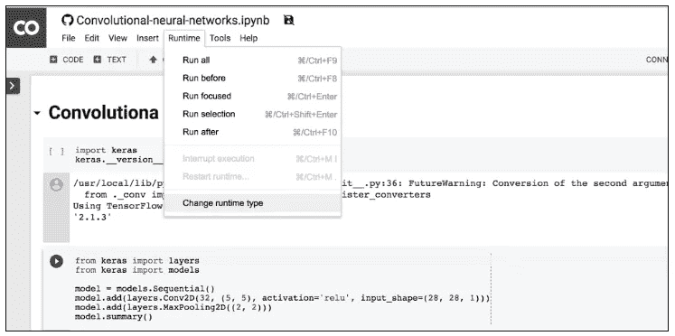**

**当弹出窗口出现时，选择 GPU。确保“硬件加速器”设置为 GPU(默认为 CPU)。**

**然后，确保您已连接到运行时(在菜单功能区中“已连接”旁边有一个绿色复选标记):**

****

**现在你可以运行这篇文章中的代码了。我建议将这篇文章的代码复制粘贴到一个 colab 笔记本上，以便在你阅读这篇文章的同时看到执行过程。**

**准备好了吗？我们开始吧！**

> **[该帖子的代码可从 GitHub 获得](https://colab.research.google.com/github/jorditorresBCN/Medium/blob/master/How-to-DL-model-10lines.ipynb)**

# **1.加载和预处理数据**

**首先，我们需要导入一些 Python 库，以便在 TensorFlow 中对我们的神经网络进行编程:**

```
**import tensorflow as tf
from tensorflow.keras.utils import to_categorical**
```

**下一步是加载将用于训练我们的神经网络的数据。我们将使用 MNIST 数据集，该数据集可以从*[*MNIST 数据库*页面](http://yann.lecun.com/exdb/mnist)下载。该数据集包含 60，000 个手工制作的数字图像来训练模型，对于首次进入模式识别技术来说是理想的，无需花费大量时间预处理和格式化数据，这在数据分析中是非常重要和昂贵的步骤，并且在处理图像时具有特殊的复杂性。***

**在 TensorFlow 中，这可以通过下面这行代码来实现(第 3 行):**

```
**(x_train, y_train), _ = tf.keras.datasets.mnist.load_data()**
```

****可选步骤:**如果需要，您可以使用以下代码验证加载的数据:**

```
**import numpy as np
import matplotlib.pyplot as pltfig = plt.figure(figsize=(25, 4))
for idx in np.arange(20):
   ax = fig.add_subplot(2, 20/2, idx+1, xticks=[], yticks=[])
   ax.imshow(x_train[idx], cmap=plt.cm.binary)
   ax.set_title(str(y_train[idx]))**
```

**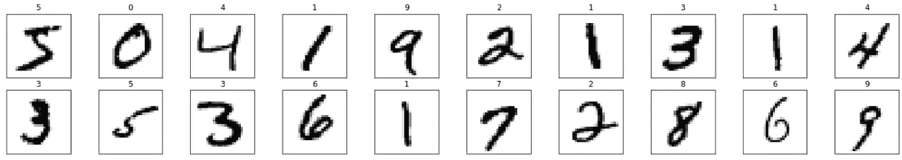**

**这个黑白图像(包含灰度级的图像)的数据集已经归一化为 20×20 像素，同时保留了它们的纵横比。随后，将图像居中，计算这些图像的质心并移动图像，以便将该点定位在 28×28 视场的中心。**

**这些 28×28 像素的 MNIST 图像被表示为一个数字数组，其值的范围从类型`uint8`的[0，255]开始。但是通常将神经网络的输入值调整到一定的范围。在这篇文章的例子中，输入值应该在区间[0，1]内换算成类型为`float32`的值。**

**另一方面，为了便于将数据输入到我们的神经网络中，我们必须将输入(图像)从二维(2D)转换为一维(1D)向量。也就是说，28×28 个数字的矩阵可以由 784 个数字(逐行连接)的向量(数组)表示，这种格式接受密集连接的神经网络作为输入，就像我们将在本文中看到的那样。**

**我们可以用下面的代码行(第 4 行)实现这些转换:**

```
**x_train = x_train.reshape(60000, 784).astype('float32')/255**
```

**此外，数据集对每张图像都有一个标签，表明它代表什么数字(在`y_train)`下载)。在我们的例子中，0 到 9 之间的数字表示图像代表哪个数字，也就是说，它与哪个类相关联。**

**如前所述，我们需要用 10 个位置的向量来表示每个标签，其中对应于表示图像的数字的位置包含 1，其余的包含 0。这个将标签转换成与不同标签的数量一样多的零的向量，并将 1 放入对应于标签的索引中的过程被称为*一键编码*。例如，数字 7 将被编码为:**

****

**我们可以用下面的代码行(第 5 行)实现这种转换:**

```
**y_train = to_categorical(y_train, num_classes=10)**
```

# **2.定义模型**

**为了用 Keras 的 API 定义模型，我们只需要这些代码行(第 6–8 行):**

```
**model = tf.keras.Sequential()
model.add(tf.keras.layers.Dense(10,activation='sigmoid',
          input_shape=(784,)))
model.add(tf.keras.layers.Dense(10,activation='softmax'))**
```

**然而，在解释这些代码行之前，让我先介绍一些基本的神经网络概念。**

## **普通的人工神经元**

**为了展示基本神经元是怎样的，让我们假设一个简单的例子，其中我们在二维平面中有一组点，并且每个点已经被标记为“正方形”或“圆形”:**

**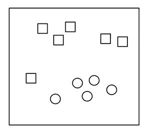**

**给定一个新的点“ *X* ”，我们想知道它对应什么标号:**

****

**一种常见的方法是画一条线将两个组分开，并使用这条线作为分类器:**

****

**在这种情况下，输入数据将由( *x1，x2* )形式的向量表示，这些向量表示它们在这个二维空间中的坐标，我们的函数将返回‘0’或‘1’(在线的上方或下方)，以知道它应该被分类为“正方形”还是“圆形”。它可以定义为:**

****

**更一般地说，我们可以将这条线表示为:**

****

**为了对输入元素 X(在我们的例子中是二维的)进行分类，我们必须学习一个与输入向量维数相同的权重向量 W，即向量( *w1，w2* )和一个 *b* 偏差。**

**有了这些计算值，我们现在可以构建一个人工神经元来对新元素 *X* 进行分类。基本上，神经元将计算出的权重的向量 *W* 应用于输入元素 *X* 的每个维度中的值，并在最后添加偏差 *b.* ，其结果将通过非线性“激活”函数来产生结果“0”或“1”。我们刚刚定义的这种人工神经元的功能可以用更正式的方式来表达，例如:**

****

**现在，我们将需要一个函数，它对变量 *z* 进行转换，使其变成‘0’或‘1’。虽然有几个函数(“激活函数”)，但在本例中，我们将使用一个称为 *sigmoid* 函数的函数，该函数针对任何输入值返回 0 到 1 之间的实际输出值:**

****

**如果我们分析前面的公式，我们可以看到它总是倾向于给出接近 0 或 1 的值。如果输入 z 相当大且为正，则在负 *z* 处的“e”为零，因此 *y* 取值为 1。如果 *z* 具有大的负值，那么对于“e”的大正数，公式的分母将是一个大的数字，因此 *y* 的值将接近 0。从图形上看，sigmoid 函数呈现如下形式:**

****

**到目前为止，我们已经介绍了如何定义人工神经元，这是神经网络可以拥有的最简单的架构。具体来说，这种架构在本主题的文献中被命名为感知器(也称为*线性阈值单元* (LTU))，由 Frank Rosenblatt 于 1957 年发明，并在视觉上概括为以下方案:**

****

## **多层感知器**

**但是在继续讨论这个例子之前，我们将简要介绍当神经网络是由我们刚刚介绍过的感知器构造而成时，它们通常采用的形式。**

**在该领域的文献中，当我们发现神经网络具有一个*输入层*，一个或多个由感知器组成的层，称为*隐藏层*，以及具有几个感知器的最后一层，称为*输出层*时，我们称之为多层感知器(MLP)。一般来说，当基于神经网络的模型由多个隐藏层组成时，我们称之为*深度学习*。在视觉上，它可以用以下方案来表示:**

****

**MLP 通常用于分类，特别是当类别是排他性的时，如在数字图像分类的情况下(从 0 到 9 的类别)。在这种情况下，由于一个名为 softmax 的函数，输出图层返回属于每个类的概率。视觉上，我们可以用以下方式表示它:**

**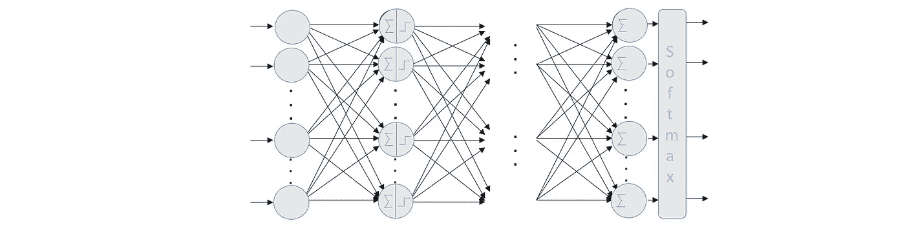**

**正如我们提到的，除了 *sigmoid* 之外，还有几个激活函数，每个都有不同的属性。其中一个是我们刚刚提到的 *softmax* 激活函数，它将有助于提供一个简单的神经网络的例子来分类两个以上的类。目前，我们可以把 *softmax* 函数看作是 *sigmoid* 函数的推广，它允许我们对两个以上的类进行分类。**

## **Softmax 激活功能**

**我们将以这样的方式来解决这个问题:给定一个输入图像，我们将获得它是 10 个可能数字中的每一个的概率。这样，我们将有一个模型，例如，可以预测图像中的 5，但只有 70%的把握是 5。由于这幅图中数字上半部分的笔画，看起来它有 20%的几率变成 3，甚至有一定的概率变成其他数字。虽然在这种特殊情况下，我们会认为我们的模型的预测是 5，因为它是概率最高的一个，但这种使用概率分布的方法可以让我们更好地了解我们对预测的信心程度。这在这种情况下很好，因为数字是手工制作的，当然在很多情况下，我们不能 100%确定地识别数字。**

**因此，对于这个分类示例，我们将为每个输入示例获得一个输出向量，该输出向量具有在一组互斥标签上的概率分布。也就是说，10 个概率的向量(每个概率对应于一个数字)以及所有这 10 个概率的总和导致值 1(概率将在 0 和 1 之间表示)。**

**正如我们已经提出的，这是通过在我们的神经网络中使用具有 *softmax* 激活函数的输出层来实现的，其中该 *softmax* 层中的每个神经元取决于该层中所有其他神经元的输出，因为所有这些神经元的输出之和必须为 1。**

**但是 *softmax* 激活功能是如何工作的呢？ *softmax* 函数基于计算某一图像属于特定类别的“证据”,然后将这些证据转换为它属于每个可能类别的概率。**

**一种测量某一图像属于特定类别的证据的方法是对属于该类别的每个像素的证据进行加权求和。为了解释这个想法，我将使用一个可视化的例子。**

**假设我们已经学习了数字 0 的模型。目前，我们可以把模型看作是“某种东西”,它包含了知道一个数是否属于某一类的信息。在这种情况下，对于数字 0，假设我们有一个如下所示的模型:**

**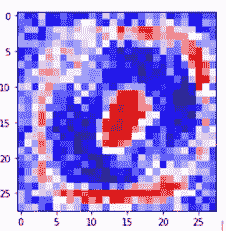**

**在这种情况下，具有 28×28 像素的矩阵，其中红色像素表示负权重(即，减少其所属的证据)，而蓝色像素表示正权重(其证据是更大的增加)。白色代表中性值。**

**假设我们在上面画了一个零。一般来说，零点的轨迹会落在蓝色区域(请记住，我们讨论的是归一化为 20×20 像素的图像，后来以 28×28 的图像为中心)。很明显，如果我们的笔画越过红色区域，很可能我们写的不是零；因此，使用基于如果我们通过蓝色区域则相加，如果我们通过红色区域则相减的度量标准似乎是合理的。**

**为了确认它是一个好的度量，现在让我们想象我们画了一个三；很明显，我们用于零的前一个模型中心的红色区域会影响前面提到的指标，因为，正如我们在下图的左部看到的，当我们写 3 时，我们忽略了:**

**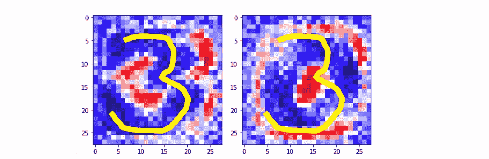**

**但另一方面，如果参考模型是对应于数字 3 的模型，如上图右侧所示，我们可以看到，一般来说，代表数字 3 的不同可能走线大多位于蓝色区域。**

**我希望读者看到这个直观的例子后，已经直觉地知道上面提到的权重的近似值是如何让我们估计出它是多少的。**

**一旦属于 10 个类别中的每一个的证据被计算出来，这些必须被转换成概率，其所有成分的总和加 1。为此，softmax 使用计算证据的指数值，然后将它们归一化，使总和等于 1，形成概率分布。属于类别 *i* 的概率为:**

****

**直观地说，使用指数得到的效果是，多一个单位的证据具有乘数效应，少一个单位的证据具有反效应。关于这个函数有趣的事情是，一个好的预测在向量中有一个接近 1 的值，而其余的值接近 0。在弱预测中，将有几个可能的标签，它们将具有或多或少相同的概率。**

## **Keras 中的顺序类**

**Keras 中的主要数据结构是*序列*类，它允许创建一个基本的神经网络。Keras [还提供了一个 API](https://keras.io/getting-started/functional-api-guide/) ，允许以图形的形式实现更复杂的模型，可以有多个输入，多个输出，中间有任意连接，但这超出了本文的范围。**

**Keras 库的 [*序列*类](https://keras.io/models/sequential/)是 Keras 提供的序列神经网络模型的包装器，可以通过以下方式创建:**

```
**model = tf.keras.Sequential()
model.add(tf.keras.layers.Dense(10,activation='sigmoid',
          input_shape=(784,)))
model.add(tf.keras.layers.Dense(10,activation='softmax'))**
```

**在这种情况下，Keras 中的模型被视为一系列层，每一层都逐渐“提取”输入数据以获得所需的输出。在 Keras 中，我们可以找到所有需要的层类型，这些层可以通过`add()`方法轻松添加到模型中。**

**在这里，神经网络已经被定义为密集连接(或完全连接)的两层序列，意味着每层中的所有神经元都连接到下一层中的所有神经元。视觉上，我们可以用以下方式表示它:**

**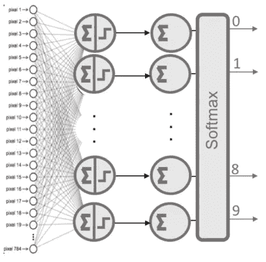**

**在前面的代码中，我们在第一层的 *input_shape* 参数中明确表达了输入数据是什么样的:一个张量，表示我们有 784 个模型特征。**

**Keras 库的一个非常有趣的特点是，它会在第一个张量之后自动推导出层间张量的形状。这意味着程序员只需要为其中的第一个建立这些信息。此外，对于每一层，我们指出它所具有的节点数量以及我们将在其中应用的激活函数(在本例中， *sigmoid* )。**

**本例中的第二层是由 10 个神经元组成的 *softmax* 层，这意味着它将返回代表 10 个可能数字的 10 个概率值的矩阵(通常，分类网络的输出层将具有与类一样多的神经元，除了在二元分类中，只需要一个神经元)。每个值将是当前数字的图像属于它们中的每一个的概率。**

****可选步骤:**Keras 提供的一个非常有用的方法是`summary()`:**

```
**model.summary()_________________________________________________________________
Layer (type) Output Shape Param #
=================================================================
dense_1 (Dense) (None, 10) 7850
_________________________________________________________________
dense_2 (Dense) (None, 10) 110
=================================================================
Total params: 7,960
Trainable params: 7,960
Non-trainable params: 0**
```

**对于我们的简单示例，我们看到它指示需要 7960 个参数(列 *Param #* )，这对应于第一层的 7850 个参数和第二层的 110 个参数。**

**在第一层中，对于每个神经元 *i* (在 0 和 9 之间)，我们需要 784 个参数作为权重 *wij* ，因此需要 10×784 个参数来存储 10 个神经元的权重。此外还有 10 个附加参数，分别对应于 10 个 *bj* 偏置。在第二层中，作为 *softmax* 函数，需要将所有 10 个神经元与前一层的 10 个神经元连接。因此，需要 10×10 个 *wi* 参数，另外还需要 10 个 *bj* 偏置对应于每个节点。**

**我们可以为`dense` [层](https://keras.io/layers/core/#dense)指出的参数细节可以在 Keras 手册中找到。在我们的例子中，最相关的出现在例子中。第一个参数表示层中神经元的数量；下面是我们将在其中使用的激活函数。在[这篇文章](/learning-process-of-a-deep-neural-network-5a9768d7a651)中，我们将更详细地讨论除了这里介绍的两个激活功能之外的其他可能的激活功能: *sigmoid* 和 *softmax* 。**

# **3.训练模型**

**我们差不多完成了，我们只需要解释最后两行代码:**

```
**model.compile(loss="categorical_crossentropy", optimizer="sgd", 
                 metrics = ['accuracy'])model.fit(x_train, y_train, epochs=10, verbose=0)**
```

## **学习过程**

**神经网络如何学习神经元的权重 *W* 和偏差 *b* 的方式是对所有已知标记输入示例的迭代过程，将通过模型估计的其标记值与每个元素的标记的期望值进行比较。在每次迭代之后，以这样的方式调整参数值，使得图像的估计值和实际值之间的不一致(误差)变得更小。下面的方案希望以一种通用的方式直观地总结一个感知器的学习过程:**

**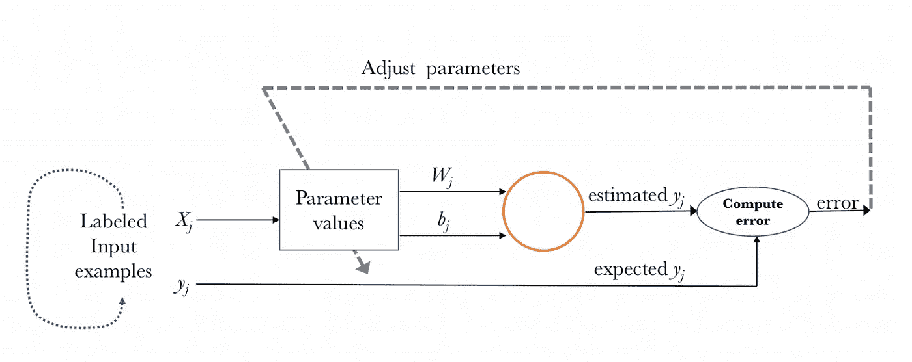**

## **学习过程的配置**

**我们可以用`compile()`方法配置这个学习过程，使用它我们可以通过方法参数指定一些属性。**

**第一个参数是*损失函数*，我们将使用它来评估训练数据的计算输出和期望输出之间的误差程度。另一方面，我们指定一个*优化器*，这是我们必须指定的优化算法，允许神经网络根据输入数据和定义的损失函数计算参数的权重。**

**最后，我们必须指出我们将用来监控神经网络学习过程的度量标准。在第一个例子中，我们将只考虑*准确度*(被正确分类的图像的比例)。例如，在我们的例子中我们可以在 *compile()* 方法中指定以下参数来测试它:**

```
**model.compile(loss="categorical_crossentropy", 
              optimizer="sgd", 
              metrics = ['accuracy'])**
```

**在本例中，我们指定损失函数为*分类 _ 交叉熵*，使用的优化器为*随机梯度下降(sgd)* ，度量标准为*准确度*，我们将使用它来评估正确猜测的百分比**

**在一篇新文章中，读者可以了解学习过程的更多细节。**

## **模特培训**

**一旦我们的模型被定义，学习方法被配置，它就可以被训练了。为此，我们可以通过调用模型的 *fit()* 方法，将模型训练或“调整”为可用的训练数据:**

```
**model.fit(x_train, y_train, epochs=10, verbose=0)**
```

**在前两个参数中，我们已经以 Numpy 数组的形式指出了用于训练模型的数据。 *batch_size* 参数表示我们将在每次更新模型参数时使用的数据数量，而 *epochs* 表示我们将在学习过程中使用所有数据的次数。**

**这种方法通过我们提到的迭代训练算法找到网络的参数值。大致来说，在该算法的每次迭代中，该算法从 *x_train* 中获取训练数据，将它们通过神经网络(具有它们的参数在该时刻的值)，将获得的结果与预期的结果(在 *y_train* 中指示)进行比较，并计算*损失*以指导模型参数的调整过程。 其直观地包括应用上面在 *compile()* 方法中指定的优化器，以减少损失的方式计算每次迭代中每个模型参数(权重和偏差)的新值。**

**正如我们将看到的，这种方法可能需要更长时间，Keras 允许我们使用*冗长的*参数(默认情况下等于 1)来查看其进度，此外还指示每个*时期*花费的估计时间:**

```
**Epoch 1/5
60000/60000 [========] — 1s 15us/step — loss: 2.1822 — acc: 0.2916
Epoch 2/5
60000/60000 [========] — 1s 12us/step — loss: 1.9180 — acc: 0.5283
Epoch 3/5
60000/60000 [========] — 1s 13us/step — loss: 1.6978 — acc: 0.5937
Epoch 4/5
60000/60000 [========] — 1s 14us/step — loss: 1.5102 — acc: 0.6537
Epoch 5/5
60000/60000 [========] — 1s 13us/step — loss: 1.3526 — acc: 0.7034
10000/10000 [========] — 0s 22us/step**
```

# **使用模型**

**为了使用该模型，我们可以使用以下代码下载另一组图像(不同于训练图像):**

```
**_, (x_test_, y_test_)= tf.keras.datasets.mnist.load_data()
x_test = x_test_.reshape(10000, 784).astype('float32')/255
y_test = to_categorical(y_test_, num_classes=10)**
```

## **可选步骤:模型评估**

**此时，神经网络已经完成训练，现在可以使用`evaluation()`方法评估其在新测试数据下的行为。此方法返回两个值:**

```
**test_loss, test_acc = model.evaluate(x_test, y_test)**
```

**这些值表明我们的模型在处理从未见过的新数据时表现得如何。当我们执行了 *mnist.load_data()* 时，这些数据已经存储在 *x_test* 和 *y_test* 中，我们将它们作为参数传递给方法。在本帖的范围内，我们将只关注其中之一，准确性:**

```
**print(‘Test accuracy:’, test_acc)
Test accuracy: 0.9018**
```

**准确性告诉我们，我们在这篇文章中创建的模型，应用于该模型从未见过的数据，正确分类了 90%。**

## **生成预测**

**最后，读者需要知道我们如何使用上一节中训练的模型进行预测。在我们的例子中，它包括预测哪个数字代表一幅图像。为了做到这一点，Keras 提供了`predict()`方法。**

**让我们选择一个图像(并绘制它)来预测数字:**

```
**image = 5_ = plt.imshow(x_test_[image], cmap=plt.cm.binary)**
```

**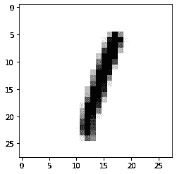**

**为了预测这个数字，我们可以使用下面的代码:**

```
**import numpy as np
prediction = model.predict(x_test_)
print("Model prediction: ", np.argmax(prediction[image]) )**
```

**仅此而已！**

# **下一步？**

**现在你已经准备好学习如何编程一个更高级的神经网络(本文中的):卷积神经网络。准备好了吗？**

**[](/convolutional-neural-networks-for-beginners-using-keras-and-tensorflow-2-c578f7b3bf25) [## 卷积神经网络初学者使用 Keras 和 TensorFlow 2

### 边做边学:包含 GitHub 代码的实用指南

towardsdatascience.com](/convolutional-neural-networks-for-beginners-using-keras-and-tensorflow-2-c578f7b3bf25) 

> [GitHub](https://colab.research.google.com/github/jorditorresBCN/Medium/blob/master/How-to-DL-model-10lines.ipynb)上有这个帖子的代码

*于 2020 年 5 月 02 日*[*https://Torres . ai*](https://torres.ai/como-construir-un-modelo-deep-learning-en-10-lineas/)*以西班牙语原文发表。***