# 我如何建立一个动态定价系统

> 原文：<https://towardsdatascience.com/how-to-build-a-dynamic-pricing-model-5544151e8bce?source=collection_archive---------2----------------------->

## [现实世界中的 DS](https://towardsdatascience.com/data-science-in-the-real-world/home)

## 众所周知，在商业中有这样一条真理:价格高，数量少。高容量，低价格。或者是？

由[本杰明·夏普](https://unsplash.com/@benjaminsharpe?utm_source=medium&utm_medium=referral)在 [Unsplash](https://unsplash.com?utm_source=medium&utm_medium=referral) 上拍摄的照片

在本文中，我将与您分享我为一家长途火车公司构建动态定价系统的经验，以及我们如何通过应用非常基本的微观经济学原理，在不改变我们的时间表，也不降低每个座位的平均价格的情况下，增加售出座位的数量。

这种实现也适用于其销售的服务与火车座位共享一些特征的任何商业，也就是说:

*   多卖一个单位的成本，或者说边际成本，接近于零。
*   如果一个可用的单元在提供服务时没有卖出去(例如，一列火车离开车站)，那么它就不能保存在库存中，它的潜在价值就永远失去了。

酒店房间、航空公司、长途汽车票、电影院、剧院、音乐会、动物园、游轮、体育赛事等都是如此。

为了建立模型，我们首先需要回答以下问题:

*   顾客购买多少商品或服务？
*   顾客付多少钱？
*   客户什么时候购买？

# 顾客买了多少

让我们先来看看一个典型的需求函数:

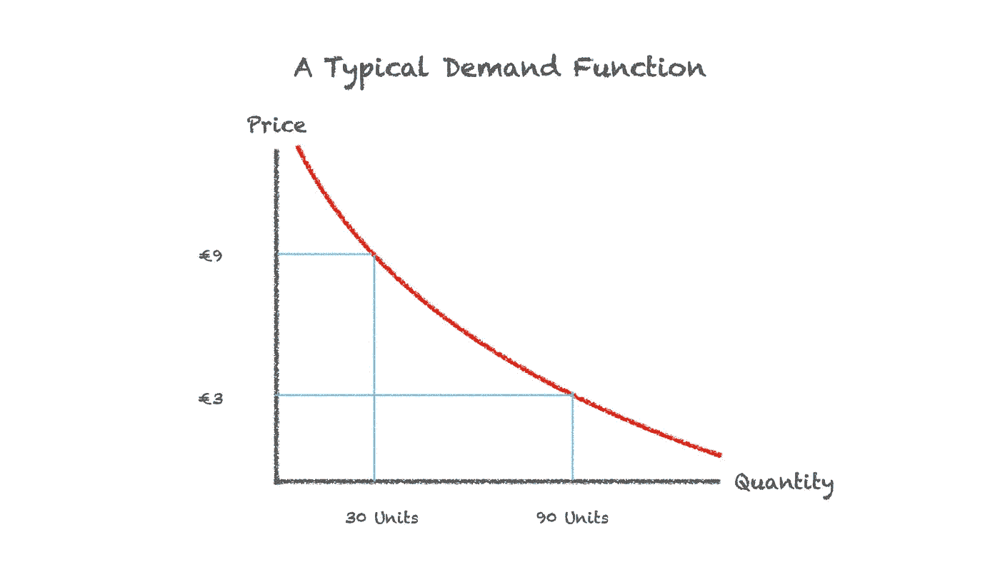

需求函数是商品或服务的价格与你能以给定价格出售的所述商品或服务的数量之间关系的数学表达式。如前所述，对于正常商品，价格越高，售出的商品数量越少。这导致需求函数向下倾斜。当你在水平轴上向右移动时，你增加了你要销售的产品的数量，那么你需要降低你的价格来达到销售的数量。

所以，顾客想买多少商品或服务将取决于价格。在其他条件不变的情况下，你降低价格，就会有更多的顾客愿意为服务付费。

# 顾客愿意付多少钱

上面的图表也能告诉我们，在给定你想要出售的单位数量的情况下，我们可以收取多少费用。

为了简化，让我们假设一个客户只能购买一个单位的服务(在这种情况下是一张火车票)。那么如果你把票的价格定在€9，那么就有 30 个人愿意买票。如果你把价格定在€3，那么有 90 个人愿意买票(30 个人愿意在€9 买，另外 60 个人愿意在€3 买)。

# 收入最大化

如果一个公司只能向所有顾客收取同一个价格，因为收入等于价格乘以数量，那么如果公司每张票收费 6 欧元，那么它将出售 60 张票，总收入为€360。

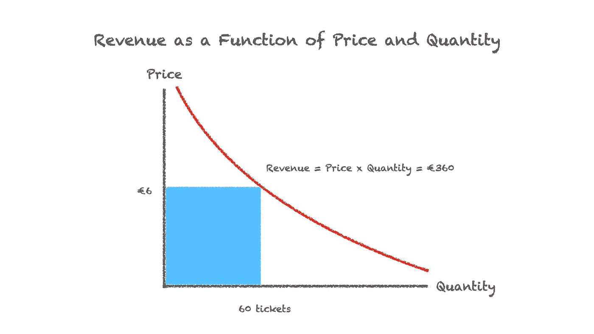

尽管有时公司有能力对不同的顾客收取不同的价格。经济学家称这种能力为*价格歧视，*，这使得公司能够通过获取需求曲线函数下的更多价值来增加收入。

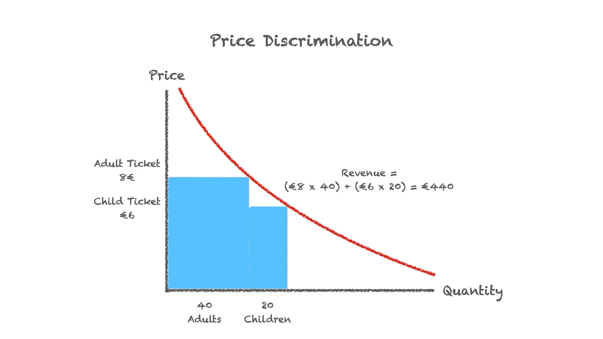

在上面的例子中，如果我们的火车公司可以对成人和儿童乘客收取不同的价格，那么他们可能会增加收入，从他们可以以单一价格达到的最高€360 到€440(每个成人 40 张€8 的票，加上每个儿童 20 张€6 的票)。

需求曲线下的面积代表特定商品或服务交付给客户的价值。因此，如果你不仅可以对两种不同类型的客户收取两种不同的价格，而且可以对几种不同类型的客户收取几种不同的价格，那么你就可以抓住需求曲线下的大部分区域，并完全从你的定价策略中大幅增加收入，而不必承担增加航班、改变座位安排、增加广告或在飞机上提供额外服务的成本。

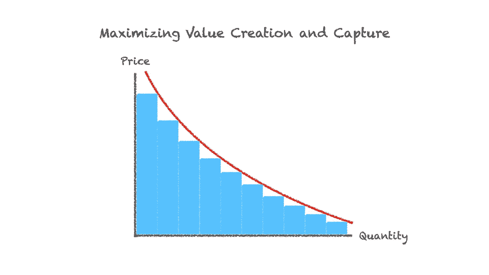

正如我们已经确定的那样，在一列无论如何都将空着的火车上出售一个座位几乎没有额外的成本，并且未出售的座位的价值将永远失去，只要你有空座位，以高于零的任何价格出售任何空座位都是有意义的。

要是我们知道如何根据客户对价格的敏感度来对他们进行细分就好了。

# 顾客什么时候购买

我们都会拖延，消费者也一样。人们通常会尽可能推迟购买决定。在火车票的例子中，我们发现这种行为创造了一种模式，即在很久以后才零星地购买火车票。然后，在出发前一个月左右，购买变得更加频繁，在出发前一周加速，并且在出发前一天达到购买机票的高峰。

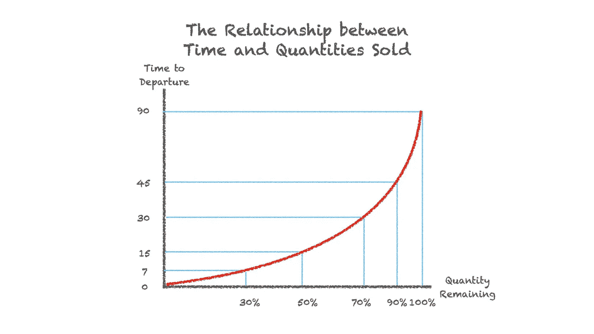

如果我们在横轴上画出剩余待售车票的百分比，在纵轴上画出火车离站的剩余天数，那么我们得到一个向下倾斜的函数。随着离出发时间越来越近，售票速度加快，因此剩余的待售票数量也相应减少。

我们还发现，越晚购票的乘客对价格越不敏感。因此，我们找到了允许我们进行价格歧视的变量:时间。

# 把它放在一起

现在，我们需要找到在特定时间需要收取的特定价格，因为我们有特定数量的门票要出售。幸运的是，我们有两个共享两个变量的方程，可以同时求解:

*   *价格需求函数:P = g(Q)
    其中价格(P)是数量(Q)的函数(g)。*
*   *和剩余的票数:Q = h(T)
    其中数量(Q)是时间(T)的函数(h)。*

这给了我们一个新的函数，价格是时间的函数。

*   *P = f(T) = g(h(T))*

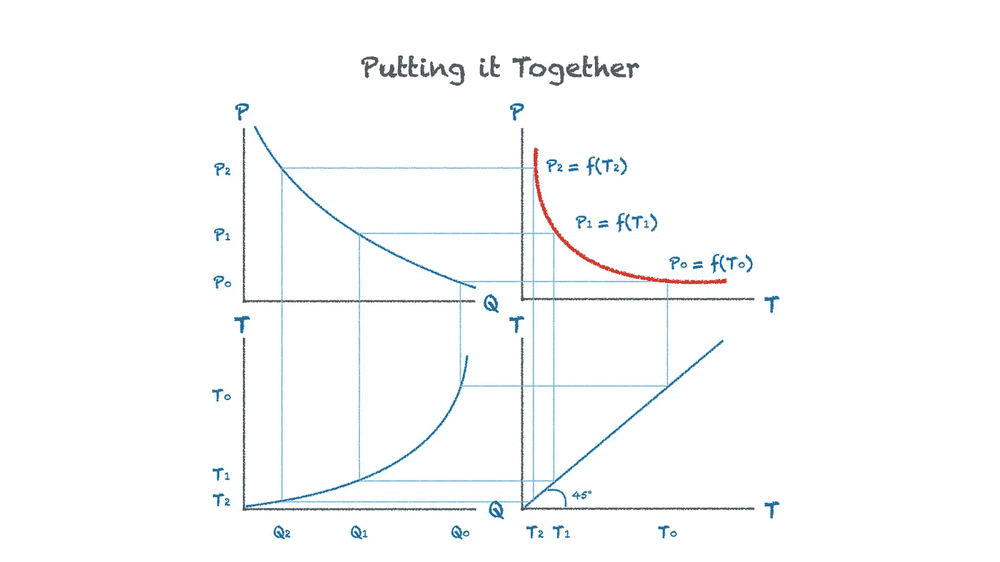

在上图的右上象限中以图形方式显示。这个函数告诉我们在任何特定时间每张票的价格，给定我们还有多少票要卖。

使用这个函数，我们还可以计算时间 T 和数量 Q 的任何给定值的预期价格 P，以填充一个矩阵，并以表格形式显示这个函数。

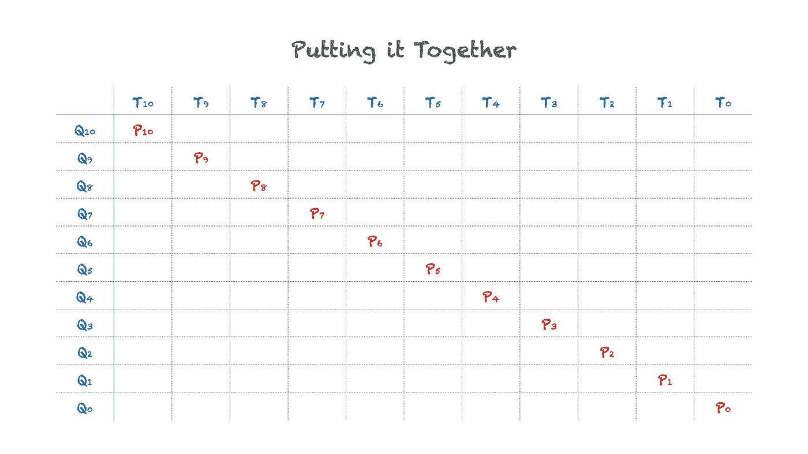

# 当事情不按计划进行时

有时事情不会像预期的那样发生，例如，与我们的功能预测相反，我们卖出了更多或更少的票。

如果在任何给定的时间(T)和价格(P)，售出的商品数量高于预期，那么这意味着更多的人愿意在当时的时间和价格购买一张票。

我们可以把这种变化表示为需求函数的上移。

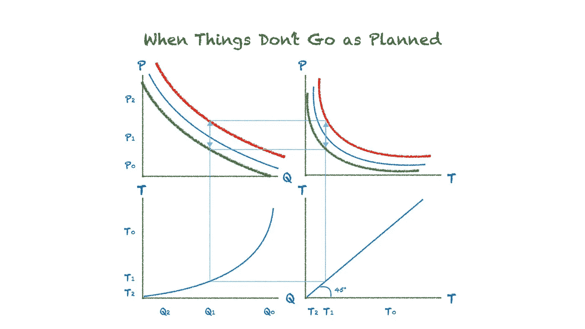

如果需求函数在上图的左上象限向上移动。然后，为了有剩余的票在以后出售，当我们可以收取更高的价格时，价格现在就需要上涨。这导致在右上象限中代表作为时间函数的价格的曲线中类似的平行上移。都用红色表示。

同样，如果我们卖出的票比预期的少，那么这意味着在给定的时间和价格下，售出的数量比预期的少。这导致向下移动的曲线为绿色。为了填满火车，价格需要下降。

如果随着时间的推移，我们发现预期售出的门票数量与实际售出的门票数量之间存在进一步的差异，我们可以将它们视为需求函数的进一步变化。

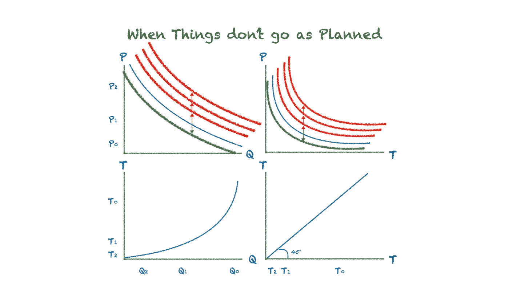

想象一下，我们一直发现我们卖出的票比预期的多。这些可以被视为门票价格需求函数的连续向上移动，以及价格/时间函数的匹配平行向上移动，如上图中向上移动的红色曲线所示。

计算这些向上和向下移动的需求函数给我们的所有价格 P 的所有值，给定时间 T 和数量 Q 的组合，以填充我们假设的火车出发的全部价格矩阵，向我们显示我们在出发前*时间*和出售离开的座位的*的任何给定组合下需要收取的价格，这将最大化该出发的收入。*

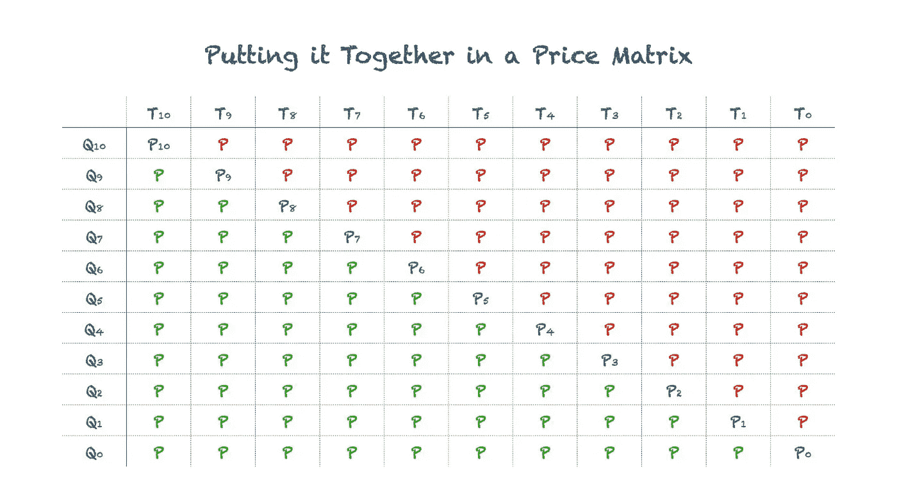

# 履行

在实施过程中，我们必须做出一些政策决定，以简化向新系统的过渡。

考虑到对铁路网络中的不同旅行段进行定价是一项相当复杂的工作，我们没有对现有的定价模型进行太大的修改，而是在现有模型的基础上实施了价格矩阵，以标价的百分比表示。

我们现在有两种定价等级(不要与运输等级混淆):新的、动态定价的折扣票，不可退款；和全价票，全价票可以作为可全额退款的机票在任何时候以相同的固定全价购买。

需要做的第一个决定是将每次出发的座位分配给这两种机票等级，这最初是手动完成的，但后来是自动完成的，使用历史数据作为参考。

为了简化营销沟通，我们决定不收取高于所列全价票的费用，有效地限制了我们可以收取的最高价格，即使火车会非常满。同样，我们也决定永远不收取低于全价 20%的费用。

我们还必须对不同的偏离进行分组，并为不同的分组实现不同的矩阵。下面是我们实现的一个矩阵的例子。

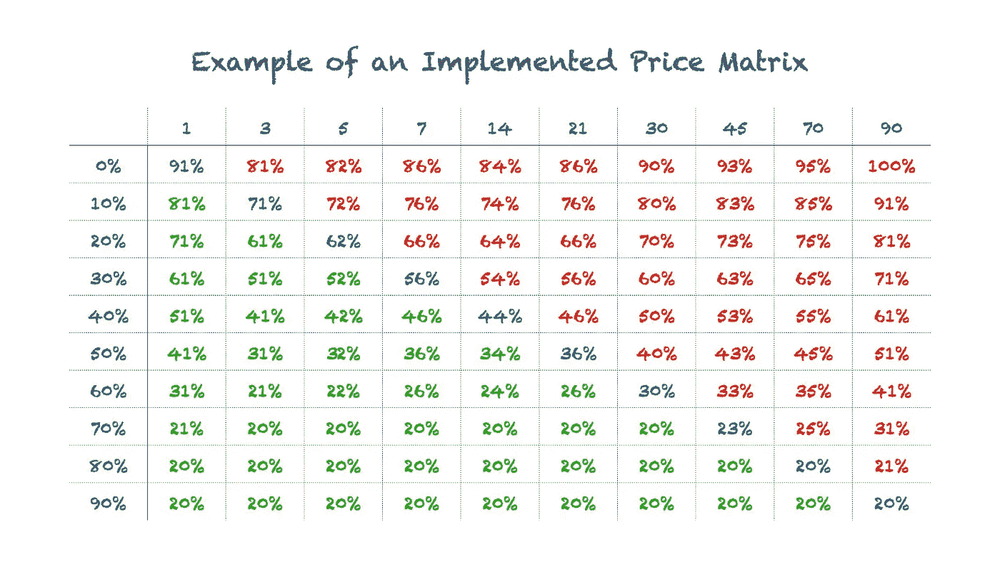

# 最后的想法

这种定价系统的引入使我们能够淘汰依赖于更多变量、需要大量手动输入和昂贵的软件许可费用的更老、更复杂的系统。取而代之的是一个更简单、更稳健、更便宜的模型，它需要更少的、事实上只有两个输入:(1)出发时间和(2)售出的座位数量。

经济学家通常说，所有的信息最终都会反映在价格中。在这种情况下，结果就是这样。我们实际上用更少的输入做出了更准确的预测，所以模型需要更少的维护。简单性的维护成本更低。

我们还取消了几个复杂的折扣机票等级。这种单一的、与时间相关的定价允许我们更换它们，同时获得更广泛的价格范围，不仅在较低的价格点(如果您较早购买了机票)，而且在较高的价格点，通过引入更细微的定价，随着出发时间的临近，更接近需求函数。实际上，它大大提高了我们辨别价格的能力。

在我们使用这些价格矩阵后，我们看到售出的门票数量增加了 5%。不仅是因为打折票的额外销售，有趣的是，还因为全价票的增加，因为该系统允许我们更准确地预测我们可以销售的全价票的数量。

由于售出的额外门票的边际成本接近零，所有相关的收入增长都直接进入了底线，因为在我们的票务系统中实施矩阵后，不会产生额外的可变成本，从而导致利润率的纯增长。

[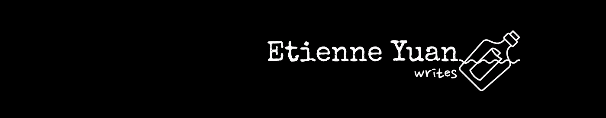](https://eyuan.org/membership)

[支持](https://eyuan.org/membership)艾蒂安和其他数千名作家的作品