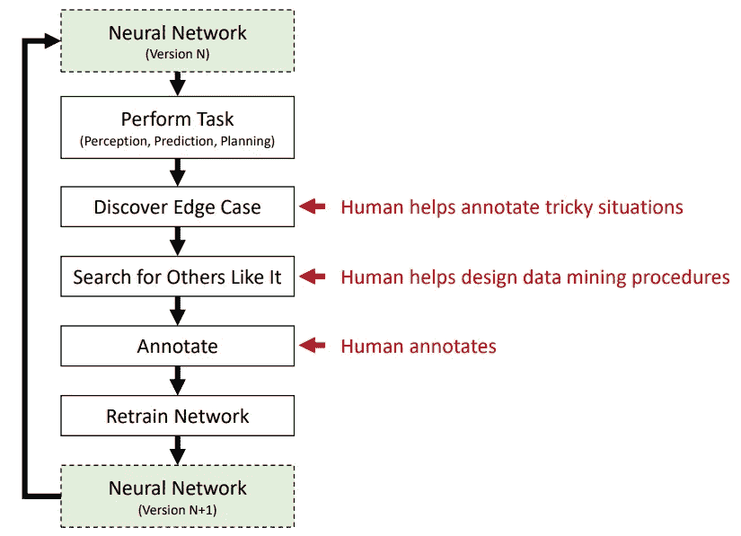
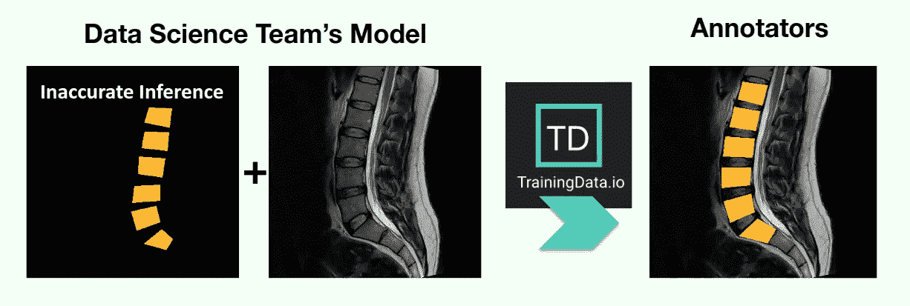
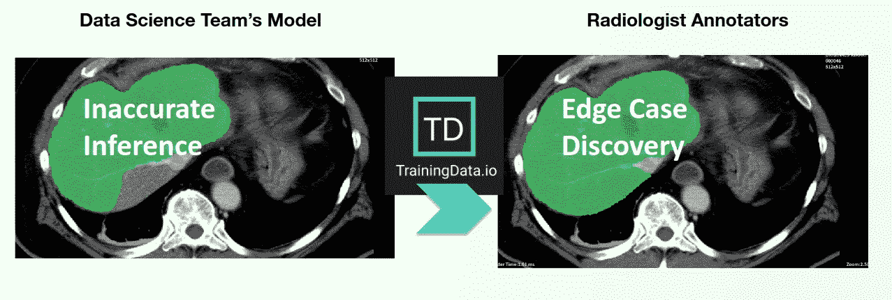

# 如何构建快速迭代的主动学习数据管道

> 原文：<https://towardsdatascience.com/how-to-build-a-fast-iterative-active-learning-data-pipeline-3c83a8838a5a?source=collection_archive---------52----------------------->

在计算机视觉的深度学习领域，有效利用主动学习可以显著提高构建 ML 模型的速度。还可以降低建立 ML 模型的成本。

# **主动学习数据管道**

主动学习数据管道有四个主要部分:

1.  在第一部分中，使用神经网络(NN)版本 n 对新的训练数据进行推理
2.  主题专家评估在步骤 1 中执行的推理的结果。基于这个评估，由主题专家团队发现边缘案例(就像放射学 AI 中的放射科医生)。
3.  人们使用标注工具标注边缘案例。
4.  包括在步骤 2 中发现的边缘情况的新训练数据用于训练 NN 版本 N+1。

[**图片来源:AI 最先进**](https://lexfridman.com/files/slides/2020_01_06_deep_learning_state_of_the_art.pdf)

**主动学习数据管道(** [**来源:人工智能最新技术**](https://lexfridman.com/files/slides/2020_01_06_deep_learning_state_of_the_art.pdf) **)**

# 标记工具在边缘案例发现中的作用

创建地面实况(标注数据集)的过程包括标注专家使用标注工具创建精确的标注。除了提供标注功能，标注工具还可以通过提供其他功能在构建主动学习数据管道中发挥非常重要的作用，例如:

*   允许主题专家查看新训练数据的推断结果。
*   允许主题专家识别和标记当前神经网络版本(版本 N)失败的边缘案例。

标注工具可以通过两种不同的方式提供此功能:

## 选项 1:上传由神经网络版本 N 生成的预注释(PNG 掩码)

数据科学家可以上传显示神经网络版本 N 对新数据推断结果的 PNG 掩码。

上传 PNG 蒙版

## 选项 2:导入神经网络版本 N

导入神经网络版本 N，并允许使用神经网络版本 N 对新的定型数据运行推理。

标记工具允许边缘案例发现

# 利用 TrainingData.io 构建您的主动学习数据管道

[TrainingData.io](https://www.trainingdata.io) 有一个 SaaS 解决方案，允许主题专家以两种方式查看神经网络的结果:

1.  SaaS 解决方案能够导入您的神经网络，并使用导入的神经网络对新的训练数据进行推理。一旦推理的结果可用，主题专家可以评估结果。
2.  SaaS 解决方案可以导入由神经网络推理生成的 PNG 蒙版。这允许主题专家评估神经网络的结果。

一个好的注释平台不仅能满足注释者的需求，还能帮助人工智能团队与组织中的以下角色协作:

1.  数据科学家
2.  数据经理
3.  注释者(内部和外部)
4.  主题专家(审核者)

[TrainingData.io 使用 NVIDIA Clara 为放射学(DICOM / NIFTI)提供主动学习数据管道。](https://www.trainingdata.io/blog/active-learning-with-nvidia-clara/)