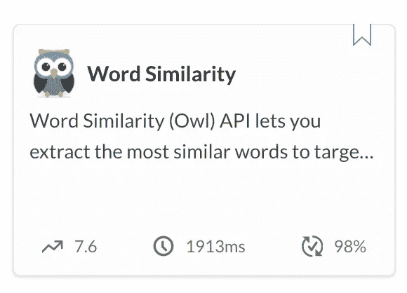

# 如何在 SpaCy 中建立快速的“最相似词”方法

> 原文：<https://towardsdatascience.com/how-to-build-a-fast-most-similar-words-method-in-spacy-32ed104fe498?source=collection_archive---------6----------------------->

## [NLP-in-Production](https://pedram-ataee.medium.com/list/nlpinproduction-98dbb687a868)

## 以及对新发布的名为 Owl 的单词相似性 API 的介绍


[哈雷戴维森](https://unsplash.com/@harleydavidson?utm_source=medium&utm_medium=referral)在 [Unsplash](https://unsplash.com?utm_source=medium&utm_medium=referral) 上的照片

自然语言处理(NLP)的最新发展引入了在生产中必须谨慎使用的语言模型。例如 spaCy 大型英文模型，[*en-core-we b-LG*](https://spacy.io/models/en#en_core_web_lg)**包含 60 多万个 300-d 向量。或者说，预先训练好的[*word 2 vec-Google-news-300*](https://code.google.com/archive/p/word2vec/)模型包含 300 万个 300-d 的单词和短语向量。当您想要计算这些高维向量的度量时，解决方案可能很容易受到计算能力的影响。**

**在这篇文章中，我想分享我是如何加速 spaCy 库以用于单词相似性 API 的。与 Gensim 相反，spaCy 不支持高效的最相似方法。我最近发布了一个单词相似度 API，名为 Owl。这个 API 允许您使用包括 spaCy 在内的各种 word2vec 模型提取与目标单词最相似的单词。给定一个单词，这个 API 返回一个单词组列表，这些单词组与预定义上下文中的原始单词相似，比如 News 或 General。一般语境使用 spaCy 大英语模式。**

**如果您不熟悉 Word2Vec 模型，我推荐您先阅读下面的文章。**你会发现为什么 Word2Vec 模型在机器学习中既简单又具有革命性。****

**[](/word2vec-models-are-simple-yet-revolutionary-de1fef544b87) [## Word2Vec 模型简单而具有革命性

### Gensim 还是 spaCy？不了解 Word2Vec 机型的基础知识也没关系。

towardsdatascience.com](/word2vec-models-are-simple-yet-revolutionary-de1fef544b87) 

## —如何使用 spaCy 提取最相似的单词？

没有捷径可走。我必须计算目标单词的向量与 word2vec 模型中存储的大量向量之间的距离。然而，我可以用过滤器**细化搜索空间**，用优化的计算库**加速计算**。

我不需要恢复所有向量。我可以使用 spaCy 提供的`.prob` 属性来修剪向量(即细化搜索空间)。该属性有助于选择英语中最常用的单词`w.prob >= -15`。在这里，您可以使用任何适合您的问题的过滤器。例如，您可能想要使用代表一个单词的阳性或阴性的`.sentiment`属性来过滤向量池。下面的代码展示了如何为 spaCy 构建一个最相似的方法。不过，这段代码并没有进行快速运行的优化。

[来源:**堆栈溢出**](https://stackoverflow.com/questions/57697374/list-most-similar-words-in-spacy-in-pretrained-model)

## —如何使用 spaCy 加速最相似的单词？

延迟是 API 服务中的一个重要因素。我负担不起哪怕 1 秒钟的额外计算时间。因此，我优化了上面解释的最相似的方法，以满足我希望我的 API 满足的需求。

我进行了大量实验，以确定实现中哪些部分最耗时。首先，我怀疑`sort`方法必须修改。对代码进行分析后，我发现`.similarity`方法是延迟的主要来源，必须进行优化。

SpaCy 使用后端的余弦相似度来计算`.similarity`。因此，我决定在上面的`most_similar`方法中，用它的优化的对应物替换`word.similarity(w)`。优化的方法`cosine_similarity_numba(w.vector, word.vector)`使用 Numba 库来加速计算。结果得到了显著改善，即延迟从约 5 秒(API 不可接受)降至约 1.5 秒(API 可接受)。您应该用下面的行替换`most_similar`方法中的第 12 行。

```
by_similarity = *sorted*(queries, key=*lambda* w: **cosine_similarity_numba(w.vector, word.vector)**, reverse=*True*)
```

下面，您可以使用 Numba 库找到余弦相似性的优化实现。根据其文档介绍， [Numba](https://numba.pydata.org/) 是一个开源的 JIT (Just In Time)编译器，可以将 Python 和 NumPy 代码翻译成快速机器码。**这个功能对于以最小的改动加速一个人的代码是至关重要的。**

[来源-媒介](https://medium.com/analytics-vidhya/speed-up-cosine-similarity-computations-in-python-using-numba-c04bc0741750)

## —最好的最相似单词服务是什么？

必须根据结果的上下文和粒度来选择最相似的单词服务。**上下文**由 word2vec 模型表示**，而**粒度**由聚类质量**决定。

[spaCy 大型英语模型](https://spacy.io/models/en#en_core_web_lg)包含在斯坦福大学手套项目培训的[手套普通爬行 word2vec 模型](https://nlp.stanford.edu/projects/glove/)。人们可能希望使用在特定数据语料库上训练的上下文化 word2vec 模型。所以，根据项目需求，必须选择 word2vec 模型。Owl API 让您有机会使用各种 word2vec 模型。

结果的粒度是最相似服务的一个重要特征。在下面，我想比较我在上面介绍的最相似方法和 Owl API 的最终结果。您将看到后一种方法的结果更加细化，因此更加有用。

```
"Owl (en-core-web-lg)": **{** 
0: **[**"seattle", "portland", "washington"**]**,
1: **[**"denver", "chicago", "nashville"**]**,
2: **[**"toronto", "montreal", "ontario", "sydney"**]**  
**}**"spaCy (en-core-web-lg)": **[**
"toronto","seattle","montreal","portland","ontario","denver",
"washington","chicago","sydney","nashville"
**]**
```

[Owl API](https://rapidapi.com/pedram.ataee/api/word-similarity) 建立在一系列 word2vec 模型之上，包括 spaCy *en-core-web-lg* 和高级聚类技术，以创建革命性的单词相似性服务。这个 API 可以用于各种项目，包括语言理解或推荐系统。你可以在这里找到更多关于 Owl API [的信息](https://rapidapi.com/pedram.ataee/api/word-similarity)。



[词语相似度 API (Owl)](https://rapidapi.com/pedram.ataee/api/word-similarity)

[](https://www.amazon.com/gp/product/B08D2M2KV1/ref=dbs_a_def_rwt_hsch_vapi_tkin_p1_i0) [## 人工智能:非正统的教训:如何获得洞察力和建立创新的解决方案

### 亚马逊网站:人工智能:非正统课程:如何获得洞察力和建立创新的解决方案电子书…

www.amazon.com](https://www.amazon.com/gp/product/B08D2M2KV1/ref=dbs_a_def_rwt_hsch_vapi_tkin_p1_i0) 

## 临终遗言

当您想要在生产中使用 NLP 模型时，您必须使用子例程的优化实现来加速计算。例如，在自然语言处理中，余弦相似度经常为各种任务计算。因此，您必须确保它被有效地实现和编译，例如使用 Numba 库。另外，我强烈推荐使用 Owl API。根据需要，您可以从上下文化和粒度化的结果中受益。

# 感谢阅读！

如果你喜欢这个帖子，想支持我…

*   *跟我上* [*中*](https://medium.com/@pedram-ataee) *！*
*   *在* [*亚马逊*](https://www.amazon.com/Pedram-Ataee/e/B08D6J3WNW) *上查看我的书！*
*   *成为* [*中的一员*](https://pedram-ataee.medium.com/membership) *！*
*   *连接上*[*Linkedin*](https://www.linkedin.com/in/pedrama/)*！*
*   *关注我* [*推特*](https://twitter.com/pedram_ataee) *！*

[](https://pedram-ataee.medium.com/membership) [## 通过我的推荐链接加入 Medium—Pedram Ataee 博士

### 作为一个媒体会员，你的会员费的一部分会给你阅读的作家，你可以完全接触到每一个故事…

pedram-ataee.medium.com](https://pedram-ataee.medium.com/membership)**