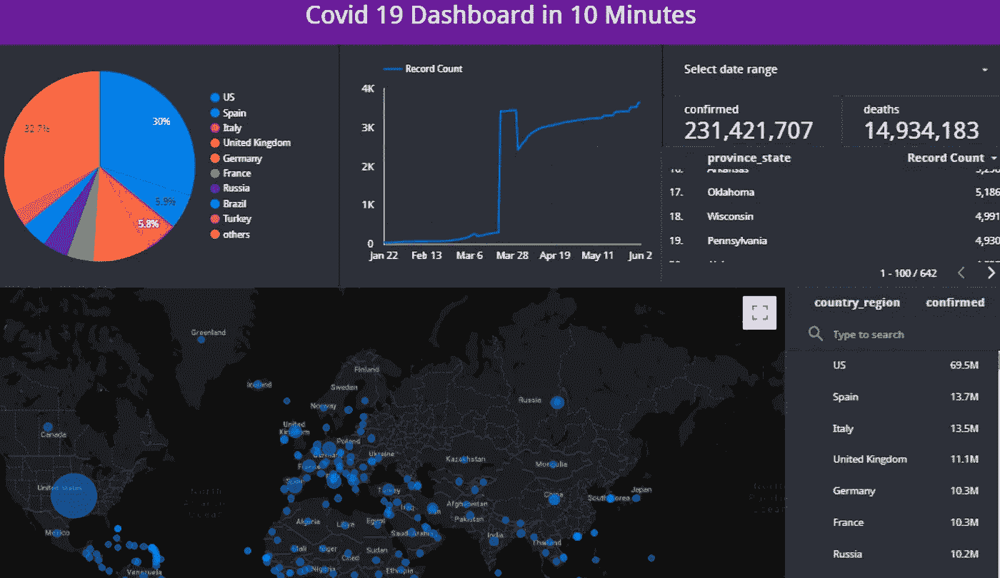
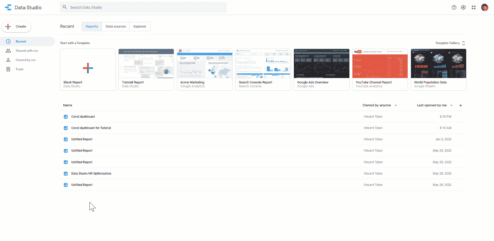
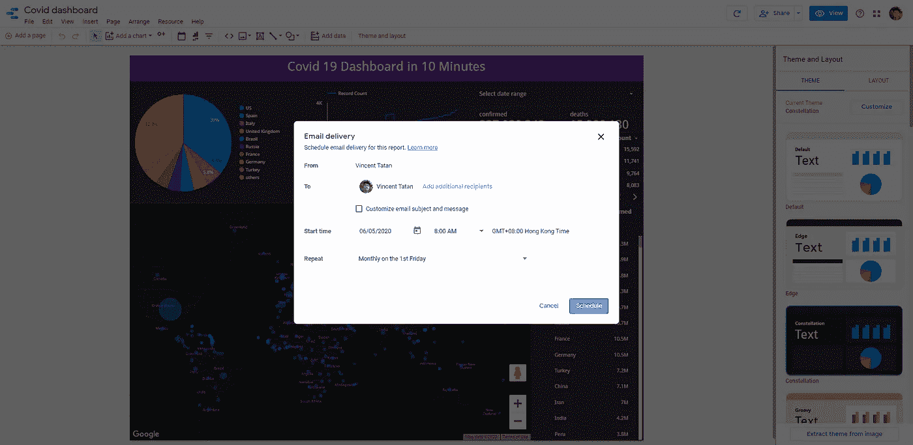
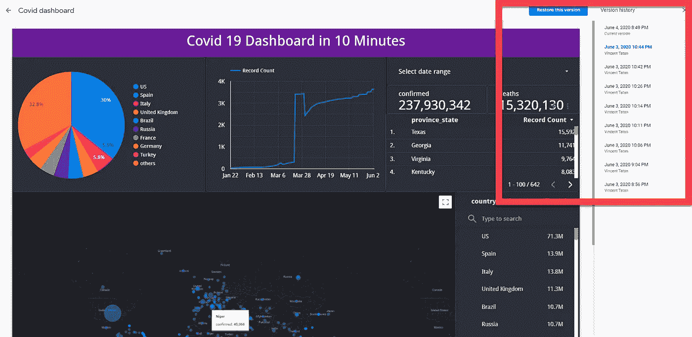

# 如何在 10 分钟内构建一个令人惊叹的交互式仪表盘

> 原文：<https://towardsdatascience.com/how-to-build-a-great-dashboard-ee0518c3d3f7?source=collection_archive---------3----------------------->

## 我给有抱负的数据科学家和数据分析师的建议

## 谷歌数据工作室免费提供快速和惊人的可视化！

使用 Google Data Studio 构建您的交互式仪表盘

> 获得交互式仪表盘的会员资格非常昂贵
> 
> 我在与同事合作我的本地变更时遇到困难
> 
> 仪表盘版本太多，不知道分享哪个

对于数据科学家和分析师来说，将我们的数据和结果传达给非技术用户非常重要。我们需要制作和分享令人惊叹的仪表板，使其易于交互。

虽然 Tableau 和 Qlikview 等 BI 产品有一个简单的界面来产生这种可视化效果，但技术许可费用很高。他们要求会员在你的同事之间私下分享。对于 Tableau，每月花费 50 美元。

> 现在，改变游戏规则的是
> 
> 如果我告诉你，你可以在你的 Google Drive 中使用一个免费的、直观的、可共享的交互式仪表盘工具。
> 
> 欢迎来到谷歌数据工作室

# 谷歌数据工作室是什么？

Google Data Studio 是一个数据可视化工具，用于生成交互式仪表板。借助 Data Studio，您可以:

1.  **导入—可靠地提供实时数据** : JSON/CSV、BigQuery、Sheets 等。
2.  **互动——产生洞察力**:使用拖放方法开发交互式仪表盘。
3.  **分享——提升您的技能**:通过 Google Drive 私下存储、协作和推广您的仪表盘。

> 全部免费。

本教程将帮助您准备使用实时数据开发仪表板。请随意跟随本教程或直接访问[仪表板，在这里](https://datastudio.google.com/reporting/9f6b7856-aa66-4ae0-8864-8abef1e77f6a)您可以复制并亲自尝试..

**附言:**如果您想要一种简单的方式来开发和部署您的仪表板即服务。[我也为 Dash & Plotly 提供一个教程。它们是构建在 Matplotlib 和 Flask 之上的 python 库，是构建 web 的有用框架。](/build-your-own-data-dashboard-93e4848a0dcf)

> 就这样，让我们开始吧。

# 导入:使用 BigQuery 可靠地提供实时数据

使用大查询导入实时 JHU 数据

Google BigQuery 提供了一个无服务器的、免费的、高度可扩展的数据仓库系统，可以在几秒钟内分析万亿字节的数据。它易于使用，可扩展，并准备好扫描数据。Google Data Studio 将您的数据连接到许多不同的来源。

在本教程中，我们将导入 JHU(约翰·霍普斯金大学)的 Covid 数据表到我们的仪表板。方便的是，谷歌已经为我们准备好了 JHU 实时数据连接。

在私有设置中，您希望为 BigQuery 设置有限的访问权限，以防止泄漏给您的用户。但是，一旦发布了仪表板，您的用户就可以访问您的报告和见解中的聚合数据。

# 互动:快速产生见解

构建 Data Studio 仪表板

在 Google Data Studio 中，您可以插入图表并用相关数据(日期/地区)自动填充图表。很多时候，除了滤镜和风格，你不会需要接触规格。

交互分配是自动的。默认情况下，每个日期/组件选择器已经将交互分配给其他可视化。这允许您在一个仪表板中进行切片和切块。

您还可以通过将组件分组来配置交互。

# 分享:跟踪和推广您的惊人仪表板！

共享定期电子邮件报告

共享 Google Data Studio 仪表板与共享 Google Drive 链接是一样的。您不再需要为您的同事和经理创建本地工作版本。

有了 Google Drive Storage，你将拥有一个私人的真相来源。您可以轻松链接到板载合作者或审阅者。这是通过指定收件人访问的访问链接来实现的，就像使用 Google Docs 一样。

此外，Google Data Studio 使得向您的利益相关者发送重复的电子邮件报告变得更加容易。您可以自由设置定期报告调度和发送您的生活数据给他们。

跟踪所有更改的版本历史

云中另一个有用的功能是**版本历史**。在协作中，您可能会忘记我们随着时间的推移所做的更改。版本历史通过为您提供一个统一的版本历史功能来跟踪所有更改，从而防止了这种情况。

有了这个，您可以轻松地审计和恢复到一个稳定的版本，并像往常一样协作。

# 最后的想法

在本教程中，我们了解了 Google Data Studio 的三大优势:

1.  **导入:使用 BigQuery 提供可靠的实时数据**
2.  **互动:快速产生见解**
3.  **分享:跟踪和推广您令人惊艳的仪表盘！**

有了它，您可以将实时数据导入 dashboard，拖放交互式可视化和令人惊叹的样式，并与您的同事和经理轻松分享。

一如既往，如有任何问题，请通过 Linkedin[联系我。如果时间允许，我很乐意回答你的问题。](http://www.linkedin.com/in/vincenttatan/?source=post_page---------------------------)

索利·德奥·格洛丽亚

# 关于作者

文森特用 ML @ Google 对抗网络滥用。文森特使用高级数据分析、机器学习和软件工程来保护 Chrome 和 Gmail 用户。

除了在谷歌的工作，Vincent 还是《走向数据科学媒体》的特约撰稿人，为全球 50 万以上的观众提供有抱负的 ML 和数据从业者的指导。

在空闲时间，文森特在佐治亚理工学院攻读硕士学位，并为铁人三项/自行车旅行进行训练。

最后，请通过 [**LinkedIn**](http://www.linkedin.com/in/vincenttatan/?source=post_page---------------------------) **，** [**Medium**](https://medium.com/@vincentkernn?source=post_page---------------------------) **或** [**Youtube 频道**](https://www.youtube.com/user/vincelance1/videos?source=post_page---------------------------) 联系文森特