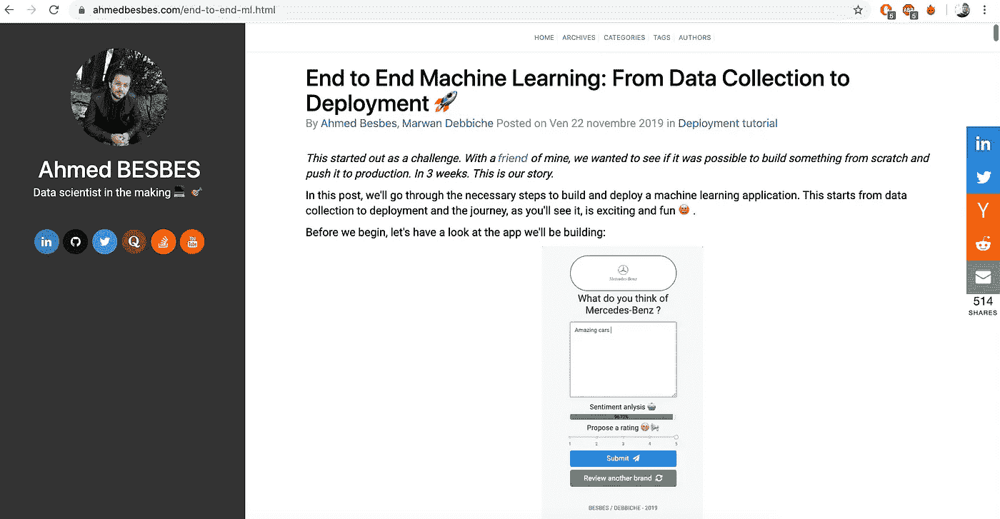
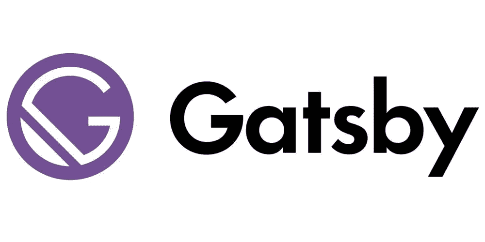
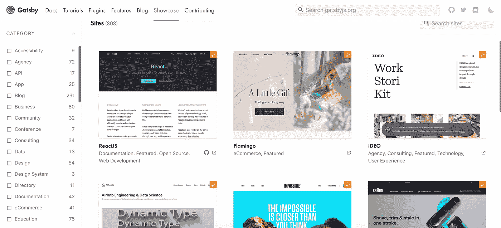
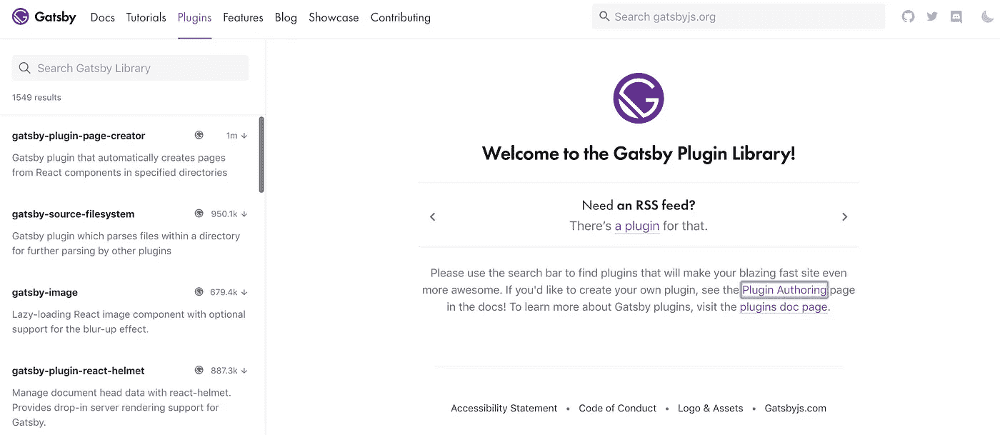
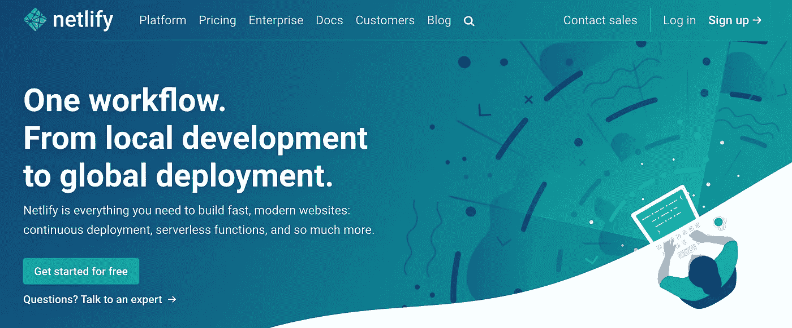
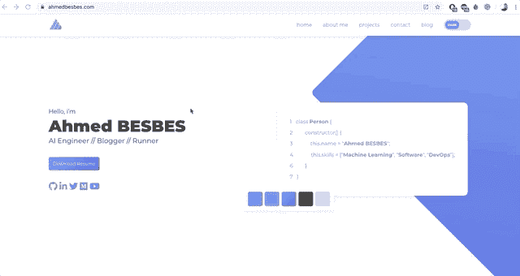

# 与 GatsbyJS 和 Netlify 一起构建一个超棒、超快的数据科学组合

> 原文：<https://towardsdatascience.com/how-to-build-a-kickass-blazing-fast-portfolio-with-gatsbyjs-and-netlify-d1a06cb66712?source=collection_archive---------20----------------------->

## 我如何将我的旧博客转移到一个新的现代网络堆栈


今年我想完成的第一件事就是完全重新设计我的博客。这一个是使用基于 Python 的静态站点生成器结合 Flex 主题构建的。

总而言之，它包含了有趣的功能——比如移动响应和 Disqus、AddThis 和 Google Analytics 的插件。而且，最重要的是，它很容易与 Markdown 文件集成，这对于文章写作来说很方便。



我以前的博客

一切正常，直到我注意到一些问题:

## **慢速加载页面**

随着我的帖子越来越长，加载时间也在不断增加。虽然这在桌面上通常不是问题，但移动设备却深受其害。这影响了我的大部分观众——他们主要使用移动设备。

## 有限的主题模板

我使用的模板不允许我展示个人项目和我正在开发的开源工作。添加新页面也不容易。事实上，我不得不深入主题的 HTML 代码，并对其进行调整以满足我的需求。我发现将主题的逻辑从博客的引擎中分离出来是很乏味的。

## 一些代码突出显示问题

嵌入代码片段是我的帖子的重要部分。不幸的是，我注意到一个令人沮丧的呈现问题出现在移动设备上，比如长行代码的换行。说真的，谁愿意读那种代码？

## 一组有限的插件

Pelican 有各种各样的插件，但是其中一些已经过时或者只适用于 Pelican 的特定版本——还有一些功能缺失了。

# 寻找替代方案

所以我开始寻找鹈鹕的替代品。我想的是一个框架，它允许我构建快速加载和响应的页面，同时保持高度的定制化。

那时我听说了盖茨比。



盖茨比

> “Gatsby 是一个基于 React 的免费开源框架，可以帮助开发人员构建速度极快的网站和应用。”—gatsbyjs.org

我觉得官方的描述总结的很好。除此之外，让我转而看盖茨比的原因是:

*   它建立在最新的 web 技术之上，比如 React 和 webpack:因此，建立一个新的组合是学习新的前端框架的一个机会
*   Gatsby 可以连接到各种数据源，包括 Markdown 文件、API、数据库等。
*   Gatsby 通过在`public`文件夹中以静态文件的形式构建您的站点，使站点部署变得非常容易，这些文件随后可以被推送到 GitHub、Netlify 或 Amazon Amplify
*   它只加载渲染网站内容所需的关键 HTML、CSS 和 JS，所以点击速度非常快

我们可以继续下去，但说服你自己的唯一方法是尝试，对吗？

# 盖茨比入门

我的目标不是给你一个如何使用 Gatsby 的完整教程:事实上，互联网上有大量的资源。你可以查一下[的官方文件，比如](https://www.gatsbyjs.org/docs/)。

但是这里有一些快速开始的步骤:

## 准备您的环境

*   安装节点和 npm。例如，如果你使用的是 Mac，假设你有自制软件，你可以启动这个命令。

```
brew install node
```

如果你使用的是 Windows 或 Linux 发行版，你可以查看[文档](https://www.gatsbyjs.org/tutorial/part-zero/#-install-nodejs-and-npm)。这很简单。

*   安装 Git
*   通过启动以下命令安装 Gatbsy CLI

```
npm install -g gatsby-cli
```

以下部分借用自[文档](https://www.gatsbyjs.org/tutorial/part-zero/#create-a-gatsby-site):

> 现在您已经准备好使用 Gatsby CLI 工具来创建您的第一个 Gatsby 站点。使用该工具，您可以下载“启动者”(带有一些默认配置的部分构建的站点)，以帮助您更快地创建某种类型的站点。您将在这里使用的“Hello World”启动程序是一个启动程序，具有 Gatsby 站点所需的基本要素。
> 
> 打开你的终端。
> 
> 经营盖茨比新 hello-world[https://github.com/gatsbyjs/gatsby-starter-hello-world](https://github.com/gatsbyjs/gatsby-starter-hello-world)。(注意:根据您的下载速度，所需的时间会有所不同。为了简洁起见，下面的 gif 在安装过程中暂停了)。
> 
> 运行`cd hello-world`。
> 
> 运行`gatsby develop`。

差不多就是这样。现在，您有了一个在本地运行的静态网站。尝试修改它的内容，你会看到(保存后)你的修改被实时更新。

## 使用预先存在的模板

如果你不是我这样的前端忍者，可以在官网的 [Showcase 标签](https://www.gatsbyjs.org/showcase/)中查找自己喜欢的模板。

有大量的开源网站和作品集都是使用 Gatsby 构建的。



使用 Gatsby 建立的网站和作品集示例

## 盖茨比插件

现在盖茨比框架中最有趣的部分:[盖茨比插件库](https://www.gatsbyjs.org/plugins/)。

如果你想扩展网站的功能，比如添加图像响应、搜索引擎优化、谷歌分析、离线支持、网站地图、robot.txt 等等，你可以在这里找到你需要的一切。

社区充满活力，插件得到了很好的支持。您可以在搜索栏中搜索它们。



盖茨比插件

如果你想让你的博客或作品集有很好的 SEO，我发现了这个 [repo](https://github.com/garrynsk/gatsby-seo-starter) 列举了一系列有用的 Gatsby 插件。

## 部署

一旦您对您的网站满意了，您就可以通过运行项目根目录下的 build 命令来生成准备部署的静态文件。

```
gatsby build
```

这个命令创建一个静态版本的网站，它可以在互联网上运行，并驻留在`public`文件夹中。你既可以把它复制到你的服务器，推送到 GitHub 页面，也可以使用部署服务(比如 [Netlify](https://www.netlify.com/) )。我个人选择 Netlify 是因为我发现它很容易使我的工作流程自动化。



网络生活主页

文档很棒，您可以找到许多博客文章，带您完成在 Netlify 上部署 Gatsby 站点的过程。这里有一个来自 gatsbyjs.org 的很棒的[和一个来自 netlify.com 的](https://www.gatsbyjs.org/docs/deploying-to-netlify/)[和一个](https://www.netlify.com/blog/2016/02/24/a-step-by-step-guide-gatsby-on-netlify/)。

## **您可能会有的几个问题**

**那么你以前的帖子会怎么样？**

我的博客从 2016 年就开始直播了，所以我肯定不会把以前的帖子扔掉。幸运的是，在《盖茨比》中把它们改写成减价文件很容易，所以我这样做了。这甚至是一个更好地重组文件夹结构的机会。

**新博客的 URL 结构不同。如果用户点击一个旧的链接会发生什么？**

我使用`gatsby-plugin-netlify`通过指定新旧 URL 之间的映射来创建永久的 URL 重定向(使用 301 HTTP 代码)。当执行构建命令时，这个插件在`public`文件夹的根目录下生成一个`_redirects`文本文件，该文件写下这个映射并告诉 Netlify 正确执行这些重定向。我发现这个解决方案非常方便。

下面是一个`_redirects`文件的例子:

新旧 URL 之间的映射

**你以前的 Disqus 评论怎么了？他们会迷路吗？**

希望不会。Disqus 提供名为 URL Mapper 的迁移服务，需要手动输入新旧 URL 之间的 CSV 映射。

这里有一个[教程](https://help.disqus.com/en/articles/1717129-url-mapper)带你完成这个过程。

**谷歌分析怎么样？你是创建一个新账户还是保留旧账户？**

我搜索了一下这个问题的答案，发现一个堆栈溢出[线程](https://stackoverflow.com/questions/21351113/how-to-keep-stats-of-changed-urls-structure-in-google-analytics)在谈论这个问题。

推荐的解决方案是…什么都不做。你只需要在你的新网站上重复使用你的旧账户。

你的 AddThis 账户怎么样？你会失去之前在社交分享上的统计数据吗？

很遗憾，是的。AddThis 以不同的方式处理每个 URL，它无法判断新的 URL 应该被视为旧的 URL。

# 那么新网站看起来怎么样呢？

可以在 GIF 中查看。



如果你想建立自己的网站，你知道你现在要做什么。

感谢阅读！

📝将这个故事保存在[期刊](https://usejournal.com/?utm_source=medium.com&utm_medium=noteworthy_blog&utm_campaign=tech&utm_content=guest_post_read_later_text)中。

👩‍💻每周日早上醒来，你的收件箱里会有本周最值得关注的科技新闻。[阅读科技简讯](https://usejournal.com/newsletter/noteworthy-in-tech/?utm_source=medium.com&utm_medium=noteworthy_blog&utm_campaign=tech&utm_content=guest_post_text)中值得注意的内容。