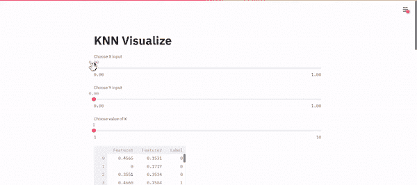
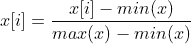
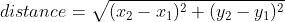
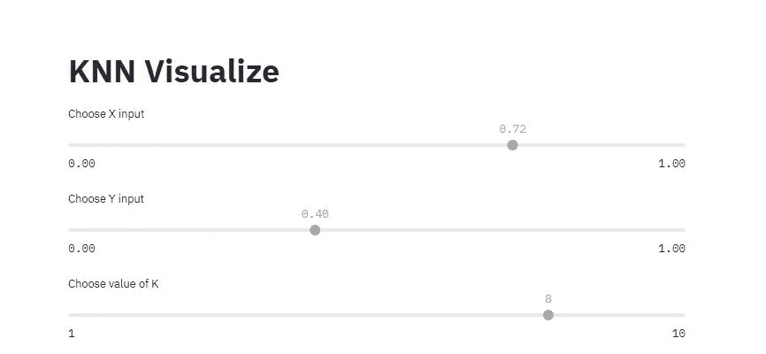
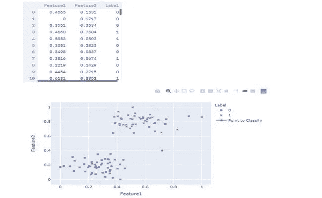
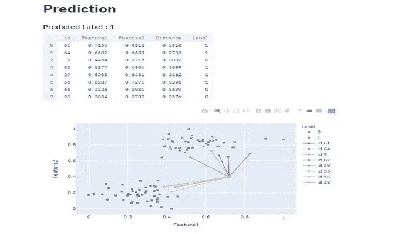

# 如何从头开始构建 KNN 分类模型，并使用 Streamlit 对其进行可视化

> 原文：<https://towardsdatascience.com/how-to-build-a-knn-classification-model-from-scratch-and-visualize-it-using-streamlit-9fe8059cc418?source=collection_archive---------29----------------------->

## 虽然像 sklearn 这样的图书馆让我们的生活变得更加容易，但是从头开始制作一个模型总是一个好的实践。在本教程中，我们将从头构建一个 KNN 分类模型，并使用 Streamlit 构建一个 web 应用程序对其进行可视化。下面是最终应用程序的演示。



最终 Streamlit 应用的截屏

# KNN 概述

KNN 或 K 近邻用于分类和回归。在本教程中，我们将使用它进行分类。由于目标标签是已知的，所以这是一种有监督的算法。它本质上接受一个输入，并找到 K 个最接近它的点。然后检查最近点的标注，并将输入分类为出现次数最多的标注。假设我们想要建立一个模型，根据输入的体重、身高将动物分类为狗或猫。如果 K = 3，我们找到离输入最近的 3 个点并检查它们的标签。如果 3 个最近点中的 2 个有标签“狗”，我们的模型将输入分类为“狗”。如果 3 个最近的点中的 2 个有标签“猫”，我们的模型将输入分类为“猫”

## 步伐

*   标准化数据集并存储它，即确保所有值都在 0 和 1 之间。
*   取一个输入数据点，并从数据集中的所有记录中找出距离。将距离存储在列表中。
*   对包含距离的列表进行排序，并检查排序列表中前 K 条记录的标签
*   将输入分类为在前 K 条记录中出现次数最多的标签

> 首先，我们将创建所有我们需要的助手函数。然后我们再把它们结合起来，加入一些 streamlit 函数，构建一个 web app。

为了便于理解和可视化，我们将使用具有 2 个要素和二进制标签(即“0”和“1”)的数据集。

# **助手功能**

## 标准化数据的函数

为了规范化一个值列表，我们迭代每个值，并找到列表中的值和最小值之间的差。然后我们将它除以列表中最大值和最小值的差。



标准化数据的方程式

```
*def* **min_max_normalize(*lst*)**:
    minimum = min(lst)
    maximum = max(lst)
    normalized = [(val - minimum)/(maximum - minimum) for val in 
    lst]                               
    return normalized
```

该函数接受一个值列表，并返回规范化的值

## 计算欧几里德距离的函数

该函数将用于计算两个给定点之间的距离。我们将使用欧几里德公式来计算距离。



计算欧几里德距离的公式

```
*def* **distance(*element1* , *element2*):**
    x_distance = (element1[0] - element2[0])**2
    y_distance = (element1[1] - element2[1])**2
    return (x_distance + y_distance)**0.5
```

该函数接受两个 2D 点，并返回它们之间的欧几里得距离。由于我们考虑的数据集只有两个要素，因此我们只考虑 x 和 y 坐标。随着特征数量的增加，该函数将需要改变以找到所有指数之间的平方差。

## **查找输入点和数据集中所有点之间距离的函数**

我们迭代数据集中的每个值，并使用上面的 ***距离*** 函数来计算两点之间的距离。然后，我们存储距离并进行排序。

```
*def* **find_nearest(*x* , *y* , *input* , *k*):** distances = []
    for id,element in enumerate(x):
        distances.append([distance(input , element),id])
    distances = sorted(distances)
    predicted_label = get_label(distances[0:k] , y)
    return predicted_label, distances[0:k] , distances[k:]
```

该函数将以下参数作为输入:

*   **x:** 这是包含这两个特征的数据集
*   **y:** 这包含了 **x** 中每一行的标签。它们是分别映射的，即 **x[i]** 的标签是 **y[i]**
*   **输入:**这是一个 2D 数组，包含我们想要分类的点的特征
*   k: 我们希望模型考虑的最近邻的数量

首先，我们创建一个空数组来存储距离。我们需要在数据集中存储记录的距离和索引。该索引可以在 **y** 数组中使用，以找到该记录的标签。

然后我们对距离进行排序。接下来，我们使用 **get_label** 函数(将在下面讨论)来获取最常出现的标签。

由于**距离**数组被排序，前 k 个元素，即**距离【0:k】**是我们输入的 k 个最近邻。我们返回输入的预测标签、k 个最近的邻居和其余的邻居。

## **查找最常出现的标签的功能**

我们基本上得到 k 个最近的邻居，检查每个邻居的标签。在我们的例子中，我们只有两个标签“0”和“1”。如果邻居的标签是“0 ”,我们对“0”的出现增加计数，并对“1”进行同样的操作。我们比较两个标签出现的次数，并返回计数较高的标签。

```
*def* **get_label(*neighbours*, *y*):** zero_count , one_count = 0,0
    for element in neighbours:
      if y[element[1]] == 0:
         zero_count +=1
      elif y[element[1]] == 1:
         one_count +=1
    if zero_count == one_count:
         return y[neighbours[0][1]]
    return 1 if one_count > zero_count else 0
```

该函数将 k 个最近邻作为输入。**邻居**中的每条记录都包含距输入点的距离及其原始 id。我们使用 id 和 y 数组来获取记录的标签。然后我们检查标签并返回预测的标签。

> 我们已经创建了所需的助手函数。现在我们将它们与一些 streamlit 函数结合起来。令人兴奋的东西！😎

# 必需的库

我们将使用 Plotly 来绘制我们的图形，因为 Plotly 绘制交互式图形。对于我们的数据集，我们将从 sklearn.datasets 导入一个数据集。

```
import streamlit as st
import pandas as pd
from sklearn.datasets import make_blobs
import plotly.express as px
import plotly.graph_objects as go
```

我将把教程的剩余部分分成三个部分

1.  用户输入
2.  导入数据集并将其可视化
3.  可视化预测

# 用户输入



App 截图

我们将使用 streamlit 的 **title** 方法显示一个标题，使用 **slider** 方法创建一个数字滑块来获取用户的输入。由于我们的数据是标准化的，我们希望输入也是标准化的。因此，我们限制用户输入 0 到 1 之间的值。我们还可以从用户那里获取输入，并使用数据集中的最小和最大值来规范化输入。

```
st.title("KNN Visualize")x_input = st.slider("Choose X input", *min_value*=0.0, *max_value*=1.0,*key*='x')y_input = st.slider("Choose Y input", *min_value*=0.0, *max_value*=1.0,*key*='y')k = st.slider("Choose value of K", *min_value*=1, *max_value*=10,*key*='k')input = (x_input,y_input)
```

每次滑块值更改时，整个 python 脚本都会重新运行，变量将根据滑块包含新值。

# 导入数据集并将其可视化



App 截图

```
x , y = make_blobs(*n_samples* = 100 , *n_features* = 2 , *centers* = 2, *random_state*= 2)
```

**make_blobs** 函数为我们创建了一个数据集，它看起来类似于上图中的分布。在现实世界中，数据集不会如此合作，但这个数据集现在已经足够了。我建议你使用 **matplotlib** 绘制一个散点图，看看数据的分布情况。

**x** 包含特性， **y** 包含各自的标签

```
# Normalizing Data
x[:,0] = min_max_normalize(x[:,0])
x[:,1] = min_max_normalize(x[:,1])# Dataframe
df = pd.DataFrame(x , *columns* = ['Feature1' , 'Feature2'] )
df['Label'] = yst.dataframe(df)
```

首先，我们使用之前创建的规范化辅助函数来规范化我们的数据。然后我们结合 x 和 y 数组来创建一个数据帧。我们使用 streamlit 的**数据帧**方法来查看数据帧。

```
# Initial Data Plotfig = px.scatter(df, *x* = 'Feature1' , *y*='Feature2', *symbol*='Label',*symbol_map*={'0':'square-dot' , '1':'circle'})fig.add_trace(
    go.Scatter(*x*= [input[0]], *y*=[input[1]], *name* = "Point to  Classify", )
)st.plotly_chart(fig)
```

你可以阅读 [Plotly 的文档](https://plotly.com/python/line-and-scatter/)来更好的理解上面的代码。我们用刚刚创建的数据帧的散点图创建一个图形。我们还添加了输入点，以便更好地理解它相对于数据集中其他点的位置。Streamlit 的 **plotly_chart** 方法以 plotly 图形为参数，在我们的 app 上绘制交互图形。

# **预测并可视化它**



App 截图

```
#Finding Nearest Neighbourspredicted_label , nearest_neighbours, far_neighbours = find_nearest(x ,y , input ,k)st.title('Prediction')st.subheader('Predicted Label : {}'.format(predicted_label))
```

我们使用我们之前创建的 find_nearest 函数来获得预测的标签和 id、k 个最近邻居和远邻居的距离。

我们显示预测的标签 us streamlit 的**子标题**方法

```
nearest_neighbours = [[neighbour[1],x[neighbour[1],0],x[neighbour[1],1],neighbour[0],y[neighbour[1]]] for neighbour in nearest_neighbours]nearest_neighbours = pd.DataFrame(nearest_neighbours , *columns* = ['id','Feature1','Feature2','Distance','Label'])st.dataframe(nearest_neighbours)
```

上述代码基本上使用最近邻的 id，并将 id、距离与记录及其标注的 feature1、feature2 值相结合。我们使用组合列表来创建包含最近邻居信息的数据帧。然后我们使用 streamlit 的 dataframe 方法来显示它。这个数据框架将帮助我们理解下面的图表。

```
far_neighbours = [[neighbour[1],x[neighbour[1],0],x[neighbour[1],1],neighbour[0],y[neighbour[1]]] for neighbour in far_neighbours]far_neighbours = pd.DataFrame(far_neighbours , *columns* = ['id','Feature1','Feature2','Distance','Label'])fig2 = px.scatter(far_neighbours,*x*='Feature1',*y*='Feature2',*symbol*='Label',*symbol_map*={'0':'square-dot' , '1':'circle'})
```

我们为远邻居创建一个类似的数据帧。我们使用 Plotly 来绘制散点图。我们现在将添加输入和将输入连接到其 k 个最近邻居的线。

```
for index,neighbour in nearest_neighbours.iterrows():
    fig2.add_trace(
       go.Scatter( *x*=[input[0], neighbour['Feature1']], *y*=[input[1],
       neighbour['Feature2']],*mode*='lines+markers' , *name* = 'id
       {}'.format(*int*(neighbour['id'])) )
    )st.plotly_chart(fig2)
```

我们迭代每个邻居，并在邻居和我们创建的图形的输入点之间添加一条线。最后，我们使用 **plotly_chart** 方法绘制图形。

> 就这样👏我们从头开始创建了一个 KNN 分类器，并创建了一个 Streamlit 应用程序来可视化它

如果您有兴趣部署您的 streamlit 应用程序，请查看我的教程。

你可以在这里找到 GitHub 回购[。](https://github.com/rahulbanerjee26/KNN-Streamlit)

**我对机器学习的世界还是相当陌生的，如果你发现任何错误或任何可以优化的代码，请让我知道！我总是乐于接受反馈😃**

我最近用 WordPress 创建了一个博客，如果你能看看的话，我会很高兴的😃

 [## Python 项目教程-使用这些 Python 项目教程改进您的简历/作品集。

### 使用 Streamlit 共享部署您的机器学习 Web 应用程序在我以前的文章中，我谈到过构建一个…

realpythonproject.com](https://realpythonproject.com/) 

在 LinkedIn 上与我联系

[](https://www.linkedin.com/in/rahulbanerjee2699/) [## Rahul baner JEE——产品工程实习生——EY | LinkedIn

### 查看 Rahul Banerjee 在世界上最大的职业社区 LinkedIn 上的个人资料。拉胡尔有 4 个工作列在他们的…

www.linkedin.com](https://www.linkedin.com/in/rahulbanerjee2699/) 

在 Twitter 上与我联系