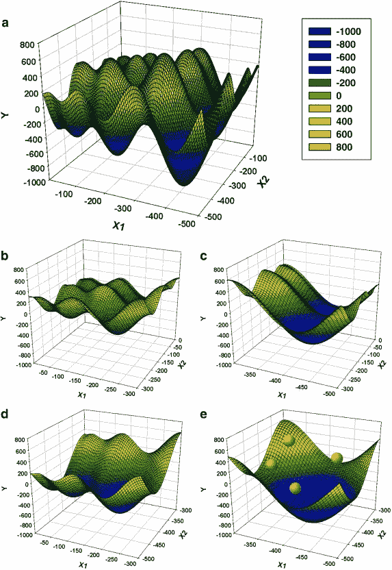

# 如何建立机器学习模型

> 原文：<https://towardsdatascience.com/how-to-build-a-machine-learning-model-439ab8fb3fb1?source=collection_archive---------4----------------------->

**关于建立机器学习模型的卡通信息图。**(由 Chanin Nantasenamat 绘制)

## [数据科学](https://medium.com/tag/data-science) | [机器学习](https://medium.com/tag/machine-learning)

## 学习数据科学的可视化指南

学习数据科学可能看起来令人生畏，但事实并非如此。让我们让学习数据科学变得有趣而简单。因此，挑战在于我们如何让学习数据科学变得既有趣又简单？

漫画很有趣，既然“*一张图胜过千言万语”*，那么为什么不制作一部关于数据科学的漫画呢？带着这个目标，我开始在我的 iPad 上涂鸦构建机器学习模型所需的元素。过了几天，上面显示的信息图是我想出来的，也发表在了 LinkedIn 和[数据教授 GitHub](https://github.com/dataprofessor/infographic) 上。

# 资料组

数据集是您构建机器学习模型之旅的起点。简单地说，数据集本质上是一个 **M** × **N** 矩阵，其中 **M** 表示列(特征),而 **N** 表示行(样本)。

列可以分解为 **X** 和 **Y** 。首先， **X** 是特征、自变量、输入变量等几个相似术语的同义词。其次， **Y** 也是类标、因变量、输出变量几个术语的同义词。

**一个数据集的卡通插图。**(由 Chanin Nantasenamat 绘制)

应当注意，可用于*(可执行回归或分类)的数据集将包含 **X** 和 **Y** ，而可用于 ***无监督学习*** 的数据集将只有 **X** 。*

*此外，如果 **Y** 包含定量值，则数据集(由 **X** 和 **Y** 组成)可用于*任务，而如果 **Y** 包含定性值，则数据集(由 **X** 和 **Y** 组成)可用于 ***分类任务*****

# **探索性数据分析**

**进行探索性数据分析(EDA)是为了获得初步的理解，并让我们熟悉数据集。在一个典型的数据科学项目中，我首先要做的事情之一就是**执行 EDA 来“目测数据”*，以便更好地理解数据。***

**我通常使用的三种主要 EDA 方法包括:**

*   ****描述性统计** —均值、中位数、众数、标准差**
*   ****数据可视化** —热图(识别特征内部相关性)、箱线图(可视化组差异)、散点图(可视化特征之间的相关性)、主成分分析(可视化数据集中呈现的聚类分布)等。**
*   ****数据整形** —透视数据、分组数据、过滤数据等。**

****

****NBA 球员统计数据的示例方框图。**从 [Jupyter 笔记本上获得的关于 GitHub 教授的数据](https://github.com/dataprofessor/code/blob/master/python/pandas_exploratory_data_analysis.ipynb)。**

****

****NBA 球员统计数据的示例关联热图。**从 [Jupyter 笔记本上获得的剧情数据 GitHub 教授](https://github.com/dataprofessor/code/blob/master/python/pandas_exploratory_data_analysis.ipynb)。**

****

****NBA 球员统计数据的柱状图示例。**从 [Jupyter 笔记本上获得的剧情资料 GitHub](https://github.com/dataprofessor/code/blob/master/python/pandas_exploratory_data_analysis.ipynb) 教授。**

****

****NBA 球员统计数据散点图示例。**从 [Jupyter 笔记本上获得的剧情资料 GitHub 教授](https://github.com/dataprofessor/code/blob/master/python/pandas_exploratory_data_analysis.ipynb)。**

**要获得更多关于用 Python 执行这些[探索性数据分析的分步教程，请查看我在](https://www.youtube.com/watch?v=9m4n2xVzk9o) [Data Professor YouTube 频道](https://www.youtube.com/dataprofessor/)上制作的视频。**

# **数据预处理**

**数据预处理(也称为数据清理、数据争论或数据篡改)是对数据进行各种检查和审查的过程，以便纠正缺失值、拼写错误、标准化/标准化值以使其具有可比性、转换数据(如对数转换)等问题。**

> **“垃圾进，垃圾出。”
> —乔治·富希塞尔**

**正如上面的引用所表明的，数据的质量将对生成的模型的质量产生很大的影响。因此，为了实现最高的模型质量，应在数据预处理阶段投入大量精力。据说，数据预处理很容易占据数据科学项目所用时间的 80%,而实际的模型构建阶段和随后的模型后分析占据了剩余的 20%。**

# **数据分割**

## **列车测试分离**

**在机器学习模型的开发中，希望经过训练的模型在新的、看不见的数据上表现良好。为了模拟新的、看不见的数据，可用数据经受*数据分割，由此它被分割成 2 部分(有时称为 ***训练测试分割*** )。特别地，第一部分是较大的数据子集，用作*(例如占原始数据的 80%)，第二部分通常是较小的子集，用作*(剩余的 20%数据)。应当注意，这种数据分割被执行一次。*****

***接下来，训练集用于建立预测模型，然后将这样的*训练模型*应用于测试集(*即*用作新的、未见过的数据)以进行预测。最佳模型的选择是基于模型在测试集上的性能做出的，并且在努力获得最佳可能模型的过程中，也可以执行超参数优化。***

****

## **训练-验证-测试分割**

*****数据拆分*** 的另一种常用方法是将数据拆分成 3 部分:(1)训练集，(2)验证集，(3)测试集。与上文所述类似，训练集用于构建预测模型，也在*验证集上进行评估，从而进行预测、模型调整(例如超参数优化)并根据验证集的结果选择最佳性能模型。正如我们所看到的，类似于上面对测试集执行的操作，这里我们对验证集执行相同的过程。注意 ***测试集*** 不涉及任何模型的建立和准备。因此，测试集可以真正充当新的、看不见的数据。谷歌的机器学习速成班对这个话题进行了更深入的探讨。***

****

## **交叉验证**

**为了最经济地使用可用数据，通常使用*N 重交叉验证(CV)，从而将数据集划分为 *N 重*(*即*通常使用 5 重或 10 重 CV)。在这样的 *N* 褶皱 CV 中，其中一个褶皱被遗漏作为测试数据，而剩余的褶皱被用作建模的训练数据。***

**例如，在一个 5 折 CV 中，1 折被遗漏并用作测试数据，而剩余的 4 折被汇集在一起并用作建模的训练数据。然后将训练的模型应用于前述的遗漏折叠(*即*测试数据)。这个过程反复进行，直到所有的折叠都有机会作为测试数据被忽略。因此，我们将构建 5 个模型(即，5 个折叠中的每一个都作为测试集被排除)，其中 5 个模型中的每一个都包含相关的性能指标(我们将在接下来的部分中讨论)。最后，指标值基于从 5 个模型中计算出的平均性能。**

****

**在 *N* 等于数据样本数的情况下，我们称之为 ***留一交叉验证*** 。在这种类型的 CV 中，每个数据样本代表一个折叠。例如，如果 *N* 等于 30，则有 30 个折叠(每个折叠 1 个样本)。与任何其他 *N* 折叠 CV 一样，1 个折叠被排除作为测试集，而剩余的 29 个折叠用于构建模型。接下来，应用建立的模型对遗漏褶皱进行预测。如前所述，该过程迭代执行总共 30 次；并且计算 30 个模型的平均性能并用作 CV 性能度量。**

# **模型结构**

**现在，有趣的部分来了，我们终于可以使用精心准备的数据来建立模型了。根据目标变量(通常称为 **Y** 变量)的数据类型(定性或定量),我们将建立一个分类(如果 **Y** 是定性的)或回归(如果 **Y** 是定量的)模型。**

## **学习算法**

**机器学习算法可以大致分为三种类型:**

1.  ***监督学习* —是一个机器学习任务，它在输入 **X** 和输出 **Y** 变量之间建立数学关系。这样的 **X** ， **Y** 对构成了用于建模的标记数据，以学习如何从输入预测输出。**
2.  ***无监督学习* —是一项机器学习任务，仅利用输入的 **X** 变量。这种 **X** 变量是学习算法在建模数据的固有结构时使用的未标记数据。**
3.  ***强化学习* —是一种机器学习任务，它决定下一步的行动，并通过试错学习来实现这一点，以努力实现回报的最大化。**

## **超参数优化**

**超参数本质上是直接影响学习过程和预测性能的机器学习算法的参数。由于不存在适用于所有数据集的“一刀切”的超参数设置，因此需要执行 ***超参数优化*** (也称为*超参数调整*或*模型调整*)。**

**我们以随机森林为例。在使用 **randomForest** R 包时，通常需要进行优化的两个常见超参数包括`mtry`和`ntree`参数(这对应于`RandomForestClassifier()`中的`n_estimators`和`max_features`以及 **scikit-learn** Python 库中的`RandomForestRegressor()`函数)。`mtry` ( `max_features`)表示在每次分割时随机抽样作为候选的变量的数量，而`ntree` ( `n_estimators`)表示要生长的树的数量。**

**另一种流行的机器学习算法是支持向量机。要优化的超参数是径向基函数(RBF)核的`C`和`gamma`参数(即，线性核只有`C`参数；多项式内核的`C`和`exponential number`)。`C`参数是限制过拟合的惩罚项，而`gamma`参数控制 RBF 核的宽度。如上所述，通常进行调整以达到用于超参数的最佳值集，尽管如此，仍有研究致力于寻找`C`和`gamma`参数的良好初始值( [Alvarsson 等人，2014 年](https://pubs.acs.org/doi/10.1021/ci500344v))。**

## **特征选择**

**顾名思义，特征选择就是从最初的大量特征中选择特征子集的过程。除了实现高度准确的模型之外，机器学习模型构建的一个最重要的方面是获得可操作的见解，为了实现这一点，能够从大量特征中选择重要特征的子集是很重要的。**

**特征选择的任务本身可以构成一个全新的研究领域，在这个领域中，人们正在努力设计新的算法和方法。在众多可用的特征选择算法中，一些经典方法基于*模拟退火*和*遗传算法*。除此之外，还有大量基于*进化算法*的方法(如粒子群优化、蚁群优化等)。)和*随机方法*(如蒙特卡洛)。**

**我们自己的研究小组也探索了在醛糖还原酶抑制剂的定量结构活性关系建模研究中使用蒙特卡罗模拟进行特征选择( [Nantasenamat 等人，2014](https://doi.org/10.1016/j.ejmech.2014.02.043) )。在我们的课题 [*遗传算法搜索空间拼接粒子群算法作为通用优化器*](https://doi.org/10.1016/j.chemolab.2013.08.009) ( [李*等* 2013](https://doi.org/10.1016/j.chemolab.2013.08.009) )中，我们还设计了一种基于结合两种流行的进化算法即遗传算法和粒子群算法的新的特征选择方法。**

****

****遗传算法搜索空间拼接粒子群优化(GA-SSS-PSO)方法的原理示意图，如在 2 维中使用 Schwefel 函数所示。**“原搜索空间(a)*x*∈[–500，0]在每个维度上以 2 的固定间隔拼接成子空间(图中一个维度等于一个横轴)。这产生了四个子空间(b–e ),其中每个维度上的 *x* 的范围是原来的一半。GA 的每个字符串编码一个子空间的索引。然后，GA 启发式地选择一个子空间(e ), PSO 在那里启动(粒子显示为红点)。PSO 搜索子空间的全局最小值，并且最佳粒子适应度被用作编码该子空间的索引的 GA 串的适应度。最后，遗传算法进行进化，选择一个新的子空间进行探索。重复整个过程，直到达到令人满意的误差水平。”(转载自化学计量学与智能实验室系统，第 128 卷，遗传算法搜索空间拼接粒子群优化作为通用优化器，第 153–159 页，版权(2013)，经爱思唯尔许可)**

# **机器学习任务**

**监督学习中两个常见的机器学习任务包括分类和回归。**

## **分类**

**经过训练的分类模型将一组变量(定量或定性的)作为**输入**，并预测**输出**类别标签(定性的)。下图显示了由不同颜色和标签表示的三个类别。每个彩色小球代表一个数据样本，每个样本**

****

****多类分类问题示意图。**三类数据样本以二维方式显示。此图显示了数据样本的假设分布。这种可视化图可以通过执行 PCA 分析和显示前两个主成分(PCs)来创建；或者，也可以选择并可视化两个变量的简单散点图。(由 Chanin Nantasenamat 绘制)**

## **示例数据集**

**以**企鹅** **数据集**(最近被提议作为大量使用的**虹膜数据集**的替代数据集)为例，其中我们将 ***定量*** (喙长、喙深、鳍长以及体重)和 ***定性*** (性别和岛屿)特征作为输入，这些特征唯一地描述了企鹅的特征，并将其分类为三个 ***物种*** 中的一个数据集由 344 行和 8 列组成。先前的分析显示，数据集包含 333 个完整病例，其中 19 个缺失值出现在 11 个不完整病例中。**

****

**[@allison_horst](http://twitter.com/allison_horst) 作品**

## **性能指标**

**我们如何知道我们的模型何时表现好或坏？答案是使用性能指标，评估分类性能的一些常用指标包括准确性(Ac)、敏感性(Sn)、特异性(Sp)和马修相关系数(MCC)。**

****

**计算精度的公式。**

****

**计算灵敏度的公式。**

****

**计算特异性的方程式。**

****

**计算马修斯相关系数的方程式。**

**其中 TP、TN、FP 和 FN 分别表示真阳性、真阴性、假阳性和假阴性的情况。应当注意，MCC 的范围为 1 至 1，MCC 为 1 表示最差预测，值为 1 表示最佳预测。此外，0 的 MCC 表示随机预测。**

## **回归**

**简而言之，一个训练好的回归模型可以用下面的简单等式来最好地概括:**

**`Y=f(X)`**

**其中 **Y** 对应于定量的**输出**变量， **X** 指的是**输入**变量， **f** 指的是映射函数(从训练模型中获得),用于计算作为输入特征函数的输出值。回归示例的上述等式的本质是，如果已知 **X** ，则可以推导出 **Y** 。一旦计算出 **Y** (我们也可以称之为“预测”)，可视化结果的一个流行方法是绘制一个实际值与预测值的简单散点图，如下所示。**

****

****实际值与预测值的简单散点图。**(由 Chanin Nantasenamat 绘制)**

## **示例数据集**

**波士顿住房数据集是数据科学教程中常用的示例数据集。数据集由 506 行和 14 列组成。为简明起见，下面显示的是标题(显示变量的名称)加上数据集的前 4 行。**

**在 14 列中，前 13 个变量被用作**输入**变量，而中值房价(`medv`)被用作**输出**变量。可以看出，所有 14 个变量都包含定量值，因此适合于回归分析。我还做了一个一步一步的 YouTube 视频，展示了如何用 Python 构建一个[线性回归模型。](https://www.youtube.com/watch?v=R15LjD8aCzc)**

**在视频中，我首先向您展示了如何读取波士顿住房数据集，将数据分离为 X 和 Y 矩阵，执行 80/20 数据分割，使用 80%子集构建线性回归模型，并应用训练好的模型对 20%子集进行预测。最后，显示了实际值与预测值`medv`的性能指标和散点图。**

****

****测试集(20%子集)的实际与预测 medv 值的散点图。**剧情摘自 [Jupyter 笔记本上的数据 GitHub 教授](https://github.com/dataprofessor/code/blob/master/python/linear_regression.ipynb)。**

## **性能指标**

**执行回归模型的性能评估是为了评估拟合模型能够准确预测输入数据值的程度。**

**评估回归模型性能的常用度量是 ***决定系数*** (R)。**

****

**从等式中可以看出，R 基本上等于 1 减去残差平方和与总平方和之比。简而言之，它可以说是解释方差的相对度量。例如，如果 R = 0.6，则意味着该模型可以解释 60%的方差(*即*，即 60%的数据符合回归模型)，而未解释的方差占剩余的 40%。**

**另外，*以及 ***均方根误差【RMSE】***也是预测残差或误差的常用度量。***

****

**从上式可以看出，MSE 顾名思义，通过取误差平方的平均值就可以很容易地计算出来。此外，MSE 的简单平方根产生 RMSE。**

# **分类过程的直观解释**

**现在让我们再来看看分类模型的整个过程。以企鹅数据集为例，我们可以看到，企鹅可以由 4 个定量特征和 2 个定性特征来表征，这些特征然后被用作训练分类模型的输入。在训练模型时，需要考虑的一些问题包括:**

*   **用什么机器学习算法？**
*   **超参数优化应该探索什么样的搜索空间？**
*   **使用哪种数据拆分方案？80/20 分成还是 60/20/20 分成？还是 10 倍 CV？**

**一旦模型被训练，产生的模型可以用于对类别标签进行预测(*即*在我们的例子中是企鹅种类)，其可以是三种企鹅种类中的一种:阿德利、下巴带或巴布亚企鹅。**

**除了仅执行分类建模，还可以执行主成分分析(PCA)，这将仅利用 X(独立)变量来辨别数据的潜在结构，这样做将允许固有数据聚类的可视化(如下所示为假设图，其中聚类根据 3 个企鹅物种进行颜色编码)。**

****

****建立分类模型的流程示意图。**(由 Chanin Nantasenamat 绘制)**

## **[订阅我的邮件列表，获取我在数据科学方面的最佳更新(偶尔还有免费内容)!](http://newsletter.dataprofessor.org/)**

# **关于我**

**我是泰国一所研究型大学的生物信息学副教授和数据挖掘和生物医学信息学负责人。在我下班后的时间里，我是一名 YouTuber(又名[数据教授](http://bit.ly/dataprofessor/))制作关于数据科学的在线视频。在我制作的所有教程视频中，我也在 GitHub 上分享 Jupyter 笔记本([数据教授 GitHub 页面](https://github.com/dataprofessor/))。**

** [## 数据教授

### 数据科学、机器学习、生物信息学、研究和教学是我的激情所在。数据教授 YouTube…

www.youtube.com](https://www.youtube.com/dataprofessor?sub_confirmation=1) 

## 在社交网络上与我联系

✅YouTube:[http://youtube.com/dataprofessor/](http://youtube.com/dataprofessor/)
♇网站:[http://dataprofessor.org/](https://www.youtube.com/redirect?redir_token=w4MajL6v6Oi_kOAZNbMprRRJrvJ8MTU5MjI5NjQzN0AxNTkyMjEwMDM3&q=http%3A%2F%2Fdataprofessor.org%2F&event=video_description&v=ZZ4B0QUHuNc)(在建)
♇LinkedIn:[https://www.linkedin.com/company/dataprofessor/](https://www.linkedin.com/company/dataprofessor/)
♇Twitter:[https://twitter.com/thedataprof](https://twitter.com/thedataprof)
♇Facebook:[http://facebook.com/dataprofessor/](https://www.youtube.com/redirect?redir_token=w4MajL6v6Oi_kOAZNbMprRRJrvJ8MTU5MjI5NjQzN0AxNTkyMjEwMDM3&q=http%3A%2F%2Ffacebook.com%2Fdataprofessor%2F&event=video_description&v=ZZ4B0QUHuNc)
♇github:[https://github.com/dataprofessor/](https://github.com/dataprofessor/)
♇insta gram:**