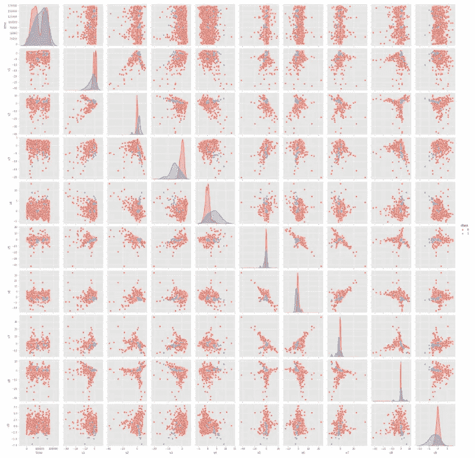
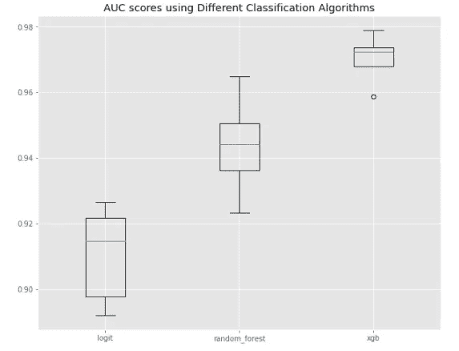
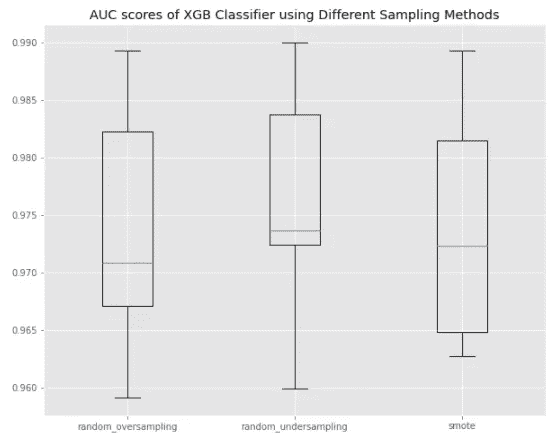
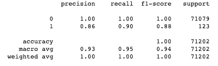
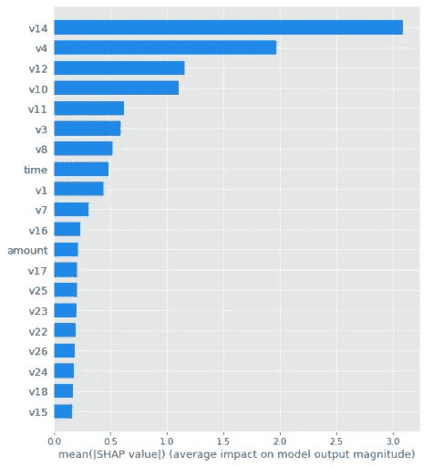
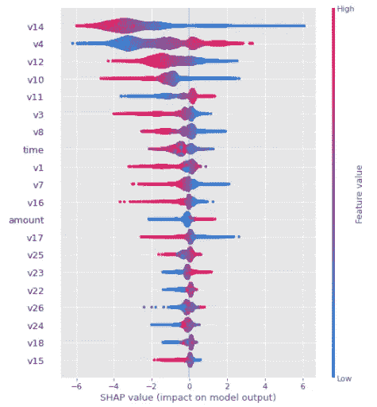

# 如何通过 5 个步骤建立一个识别信用卡欺诈的机器学习模型

> 原文：<https://towardsdatascience.com/how-to-build-a-machine-learning-model-to-identify-credit-card-fraud-in-5-stepsa-hands-on-modeling-5140b3bd19f1?source=collection_archive---------19----------------------->

## 使用 Kaggle 数据集的实际建模指南

随着电子商务和数字交易的激增，身份欺诈也已上升到每年影响数百万人。2019 年，仅美国的欺诈损失估计约为 169 亿美元，其中很大一部分包括信用卡欺诈损失。

除了加强网络安全措施，金融机构越来越多地转向机器学习，以在欺诈交易发生时识别和拒绝欺诈交易，从而限制损失。

我在 Kaggle 上偶然发现了一个[信用卡欺诈数据集](https://www.kaggle.com/mlg-ulb/creditcardfraud)，并建立了一个分类模型来预测欺诈交易。在本文中，我将通过 5 个步骤来构建一个有监督的机器学习模型。下面是五个步骤的概要:

1.  探索性数据分析
2.  列车测试分离
3.  建模
4.  超参数调谐
5.  评估最终模型性能

# 一.探索性数据分析

当开始一个新的建模项目时，为了理解数据集，从 EDA 开始很重要。在这种情况下，来自 Kaggle 的信用卡欺诈数据集包含 284，807 行 31 列。这个特定的数据集不包含空值，但是请注意，在处理现实中的数据集时，情况可能并非如此。

我们的目标变量被命名为`class`，它是 0 和 1 的二进制输出，1 代表欺诈交易，0 代表非欺诈交易。剩余的 30 列是我们将用来训练我们的模型的特征，其中绝大多数已经使用 PCA 进行了转换，因此是匿名的，而只有两列(`time`和`amount`)被标记。

## 目标变量

我们的数据集非常不平衡，因为数据集中的大多数行(99.8%)都是非欺诈性交易，并且有一个`class = 0`。欺诈交易仅占数据集的约 0.2%。

这种类别不平衡问题在欺诈检测中很常见，因为欺诈(希望如此)很少发生。由于这种类别不平衡的问题，我们的模型可能没有足够的欺诈案例可供学习，我们将通过在建模阶段试验抽样方法来缓解这一问题。

## 国际银行特征

为了初步了解我们的功能，我发现 seaborn 的 pairplot 函数非常有用，特别是因为如果我们引入`hue='class'`参数，我们可以通过目标变量绘制出分布。下图按标签显示了数据集中的前 10 个要素，橙色代表 0 或非欺诈性交易，蓝色代表 1 或欺诈性交易。



按目标变量值划分的数据集中前十个要素的成对图。

正如您在 pairplot 中看到的，一些特征的分布因标签而异，这表明这些特征可能对模型有用。

# 二。列车测试分离

由于数据集已经被清理，我们可以继续将数据集分成训练集和测试集。这是重要的一步，因为您无法根据模型训练的数据有效地评估模型的性能！

我使用 scikit-learn 的`train_test_split`函数将我们数据集的 75%分割为训练集，剩下的 25%作为测试集。值得注意的是，我将`stratify`参数设置为等于标签或`train_test_split`函数中的`y`,以确保在训练集和测试集中有我们标签的比例示例。否则，如果在我们的训练集中没有标签为 1 的例子，模型将不会学习欺诈交易是什么样的。同样，如果在我们的测试集中没有标签为 1 的例子，我们就不知道模型在遇到欺诈时会有多好的表现。

```
X_train, X_test, y_train, y_test = train_test_split(X, y, shuffle=True, stratify=y)
```

# 三。建模

由于我们的数据集是匿名的，所以没有特征工程要做，所以下一步是建模。

## 三. a .选择 ML 模型

有不同的分类模型可供选择，我尝试构建简单的模型来选择最佳的模型，稍后我们将调整超参数来进行优化。在这种情况下，我训练了一个逻辑回归模型、随机森林模型和 XGBoost 模型来比较它们的性能。

由于类别不平衡，在这种情况下，准确性不是一个有意义的度量。相反，我使用 AUC 作为评估指标，取 0 到 1 之间的值。AUC 测量模型将随机正例(`class = 1`)排在随机负例之上的概率。

为了评估模型性能，我使用分层 K-Fold 交叉验证按类别标签分层采样，因为我们的数据集是高度不平衡的。使用模型 AUC 分数，我做了一个箱线图来比较模型的 AUC 分数范围。



不同分类模型的 AUC 分数箱线图

毫不奇怪，XGBoost 似乎是我们三个选择中的最佳模型。XGBoost 模型的 AUC 中值为 0.970，相比之下，随机森林模型为 0.944，逻辑回归模型为 0.911。因此，我选择 XGboost 作为我未来的模型。

## 比较取样方法

如前所述，我还试验了不同的采样技术来处理类不平衡问题。我试用了`imblearn`的随机过采样、随机欠采样和 SMOTE 功能:

*   *随机过采样*使用替换对少数类进行采样，直到达到定义的阈值，我将其保留为默认值 0.5，因此我们的新数据集在 0 和 1 的标签之间有 50/50 的分割。
*   *随机欠采样*对多数类进行采样，默认情况下没有替换，但是您可以将其设置为使用替换进行采样，直到我们的数据集在 0 和 1 的标签之间有 50/50 的分割。
*   *SMOTE(合成少数过采样技术)*是一种数据扩充方法，它从少数类中随机选择一个示例，找到其最近邻居的 *k* (通常为 *k* =5)，选择一个随机邻居，并在该随机邻居和原始示例之间的特征空间中创建一个合成新示例。

我使用`imblearn.pipeline`中的管道函数来避免泄漏，然后使用分层 K-Fold 交叉验证来比较 XGBoost 模型与上面列出的三种不同采样技术的性能。



使用不同抽样方法比较 XGBoost 模型的 AUC 分数

三种取样方法的中值 AUC 分数非常接近，在 0.974 到 0.976 之间。最终，我选择了 SMOTE，因为它在 AUC 分数上的范围更小。

# 四。超参数调谐

我选择用一个叫做`hyperopt`的包来使用贝叶斯超参数调优，因为它比网格搜索或随机搜索等其他方法更快、更有见识。我想为我的 XGBoost 模型调优的超参数是:

*   `max_depth`:一棵树的最大深度；介于 4 到 10 之间的值。
*   `min_child_weight`:构成叶节点或分支末端的样本的最小权重之和；1 到 20 之间的值。
*   `subsample`:每棵树随机抽样观察；0.5 到 0.9 之间的值。
*   `colsample_bytree`:每棵树的柱或特征的随机样本；0.5 到 0.9 之间的值。
*   `gamma`:分割一个节点所需的最小损耗减少，用于防止过拟合；介于 0 和 5 之间的值。
*   `eta`:learning _ rate；介于 0.01 和 0.3 之间的值。

为了使用 hyperopt，我首先用超参数和它们各自的界限来设置我的搜索空间，以进行搜索:

```
space = {
    'max_depth': hp.quniform('max_depth', 4, 10, 2),
    'min_child_weight': hp.quniform('min_child_weight', 5, 30, 2),
    'gamma': hp.quniform('gamma', 0, 10, 2),
    'subsample': hp.uniform('subsample', 0.5, 0.9),
    'colsample_bytree': hp.uniform('colsample_bytree', 0.5, 0.9),
    'eta': hp.uniform('eta', 0.01, 0.3),
    'objective': 'binary:logistic',
    'eval_metric': 'auc'
}
```

接下来，我定义了一个目标函数来最小化将从先前定义的搜索空间接收的值:

```
def objective(params):
    params = {'max_depth': int(params['max_depth']),
              'min_child_weight': int(params['min_child_weight']),
              'gamma': params['gamma'],
              'subsample': params['subsample'],
              'colsample_bytree': params['colsample_bytree'],
              'eta': params['eta'],
              'objective': params['objective'],
              'eval_metric': params['eval_metric']}

    xgb_clf = XGBClassifier(num_boost_rounds=num_boost_rounds, early_stopping_rounds=early_stopping_rounds, **params)

    best_score = cross_val_score(xgb_clf, X_train, y_train, scoring='roc_auc', cv=5, n_jobs=3).mean()

    loss = 1 - best_score 

    return loss
```

下面列出了返回的最佳超参数，我们将用它来训练我们的最终模型！

```
best_params = {'colsample_bytree': 0.7,
               'eta': 0.2,
               'gamma': 1.5,
               'max_depth': 10,
               'min_child_weight': 6,
               'subsample': 0.9}
```

# 动词 （verb 的缩写）最终模型性能评估

为了训练最终的模型，我使用了`imblearn`的管道来避免泄漏。在管道中，我首先使用`SMOTE`来扩充数据集，并包含更多的正面类供模型学习，然后用第四步中找到的最佳超参数训练一个 XGBoost 模型。

```
final_model = imblearn.pipeline.Pipeline([
                   ('smote',SMOTE(random_state=1)), 
                   ('xgb', XGBClassifier(num_boost_rounds=1000, 
                                         early_stopping_rounds=10,                                                     
                                         **best_params))])
```

## **退伍军人指标**

以下是评估最终模型性能的一些指标:

**AUC**

最终模型的 AUC 得分为 0.991！这表明我们的最终模型能够很好地对订单欺诈风险进行排序。

**分类报告**



测试集分类报告

**精度**

`True Positives/(True Positives + False Positives)`

类别 0 的精度为 1，表示所有标记为属于类别 0 的项目确实是非欺诈性交易。类别 1 的精度是 0.86，这意味着 86%被标记为类别 1 的项目确实是欺诈交易。换句话说，最终的模型正确地预测了 100%的非欺诈交易和 86%的欺诈交易。

**召回**

`True Positives/(True Positives + False Negatives)`

类别 0 的召回为 1，这意味着所有非欺诈性交易都被标记为 1，即属于类别 0。第 1 类的召回率为 0.9，因此我们的最终模型将 90%的欺诈交易标记为属于第 1 类。这意味着最终的模型能够捕捉到 90%的欺诈交易。

**F1 得分**

`2 * (Recall * Precision)/(Recall + Precision)`

F1 分数是精确度和召回率的加权调和平均值。类别 0 的测试集上的最终模型预测的 F1 分数为 1，而类别 1 的最终模型预测的 F1 分数为 0.88。

## V.b .功能重要性

为了理解该模型，查看 Shap 摘要和特征重要性图是有用的。不幸的是，该数据集中的大多数特征都被匿名化了，但是图中显示 v14、v4 和 v12 是最终模型中最重要的前 3 个特征。



最终 XGBoost 模型的特性重要度图



最终 XGBoost 模型测试集的 Shap 摘要图

# 最后的想法

在仅仅五个步骤中，我们构建了一个 XGBoost 模型，该模型能够基于该数据集中提供的 30 个特征来预测交易是否是欺诈性的。

我们的最终模型的 AUC 值为 0.991，高得令人难以置信！但是，值得注意的是，这是使用预先清理(和处理)的数据集完成的。事实上，特征工程是建模中至关重要的一步，但由于使用匿名数据集的限制，我们在这里没有机会这样做。

我希望这个使用真实数据集的动手建模练习能够帮助您更好地理解创建机器学习模型来预测欺诈背后的机制。我很想知道匿名化的特征是什么，尤其是最具预测性的特征。如果你对它们有什么想法，请在下面评论！

要查看代码，请查看我在 Github 上的 [jupyter 笔记本文件](https://github.com/claudian37/DS_Portfolio/blob/master/credit_card_fraud/01_kaggle_creditcardfraud_modeling_final.ipynb)。谢谢大家！

## 参考

*   [Kaggle 信用卡诈骗数据集](https://www.kaggle.com/mlg-ulb/creditcardfraud)
*   [朱庇特笔记本文件](https://github.com/claudian37/DS_Portfolio/blob/master/credit_card_fraud/01_kaggle_creditcardfraud_modeling_final.ipynb)

## 脚注

[1]:标枪策略。2020 年身份欺诈研究:身份欺诈危机的起源。[https://www . javelin strategy . com/coverage-area/2020-身份-欺诈-研究-起源-身份-欺诈-危机](https://www.javelinstrategy.com/coverage-area/2020-identity-fraud-study-genesis-identity-fraud-crisis)