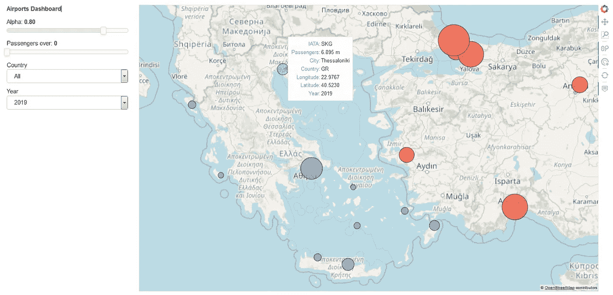
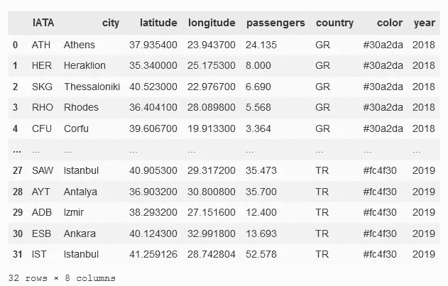
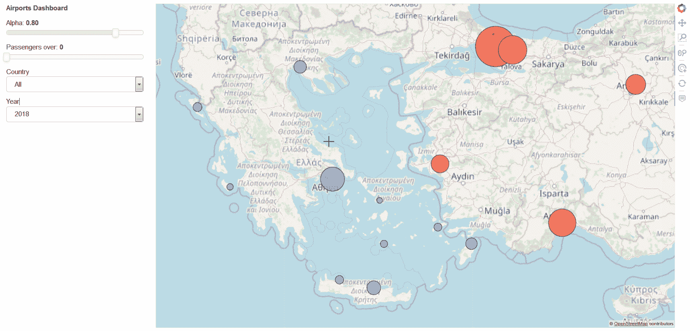

# 如何尽快用 Python 构建地图仪表盘

> 原文：<https://towardsdatascience.com/how-to-build-a-map-dashboard-with-python-asap-e278945fbd6d?source=collection_archive---------13----------------------->

## 使用几行 python 代码创建可共享地图仪表盘的一种非常简单、直接、容易且快速的方法。



机场仪表板

我们已经[看到了](/how-to-visualize-data-on-top-of-a-map-in-python-using-the-geoviews-library-c4f444ca2929)使用 python 和 geoviews 库在地图上绘制一些数据是多么容易。然而，说实话，每次当你想改变图中显示内容的特定方面时，编辑代码行会非常令人沮丧。因此，构建一个地图仪表板通常更有用、更方便，即使是最没有经验的用户也可以通过点击几下鼠标来更改地图。幸运的是，有一种简单的方法可以实现这一点，使用 Panel 和 Param。

[*Panel*](https://panel.holoviz.org/) *是一个开源的 Python 库，它允许您通过将用户定义的小部件连接到绘图、图像、表格或文本来创建自定义的交互式 web 应用程序和仪表盘。Panel 也可以与单独的*[*Param*](http://param.pyviz.org)*项目一起使用，以完全声明的方式创建带有或不带有关联可视化的交互式可配置对象。*

出于本教程的目的，我们将构建一个地图仪表板来可视化我国希腊和邻国土耳其最繁忙机场的客流量，以便进行比较，就像我们在 geoviews 的[演示](/how-to-visualize-data-on-top-of-a-map-in-python-using-the-geoviews-library-c4f444ca2929)中所做的那样。积分模块。这一次，数据集更新了 2019 年的客运量，现在包含 2018 年和 2019 年的数据，以及伊斯坦布尔的新机场。

数据集可以在[这里](https://www.dropbox.com/s/mymlk9cljj8nniq/airports_2019.csv?dl=0)找到。

首先，我们需要导入我们将要使用的必要的库和模块。

```
import pandas as pd
import numpy as np
import geoviews as gv
from geoviews import opts, dim 
import param, panel as pn
gv.extension('bokeh')
```

我们将前面提到的数据集读作`airports_df`，看起来像这样。



机场 _df

现在让我们做一些准备工作。

我们创建 HoverTool 来指定当我们将鼠标悬停在这些点上时显示的信息。

```
from bokeh.models import HoverTool
tooltips = [('IATA', '[@IATA](http://twitter.com/IATA)'),
            ('Passengers', '[@passengers](http://twitter.com/passengers){0.000 a}m'),
            ('City', '[@city](http://twitter.com/city)'),
            ('Country', '[@country](http://twitter.com/country)'),
            ('Longitude', '$x'),
            ('Latitude', '$y'),
            ('Year', '[@year](http://twitter.com/year)')
            ]
hover = HoverTool(tooltips=tooltips) 
```

我们创建了一个列表，其中包含所有的国家和值" *All"* 。所以在这种情况下，它包含值['GR '，' TR '，' All']。我们将在仪表板参数“国家”中使用该列表。

```
country_list = airports_df['country'].unique().tolist() 
country_list.append('All')
country_list
```

我们还创建了一个字典，其中包含我们使用的 tilemap 的主要选项，因此也包含整个地块的主要选项。

```
topts = dict(width=1100, height=680, xaxis=None, yaxis=None, \    show_grid=False)
```

现在让我们使用**参数**和**面板**构建仪表板。结构如下。首先，我们使用 Param 定义主对象，在这里我们设置仪表板选项的参数。在 Param 对象内部，我们还定义了绘图，在这里我们传递用户设置的参数。

现在，我们所要做的就是将上述对象传递给`dashboard`，并使用 Panel 连续显示`dashboard.param`和`dashboard.plot`，即左边是参数，右边是绘图。

```
dashboard = Airports(name="Airports Dashboard")
DashboardPanel = pn.Row(dashboard.param, dashboard.plot)
```

最后，有两种方式来运行仪表板。或者在同一个 jupyter 笔记本中，或者在单独的标签中。

对于第一个选项，只需键入

```
DashboardPanel.servable()
```

而对于第二个选项，只需键入

```
DashboardPanel.show()
```

仪表板将如下所示。



当然，用户可以在仪表板上添加更多的参数和图表。这个只是为了演示的目的。

今天到此为止。希望你觉得有用。下次见！

点击[这里](https://www.linkedin.com/in/christoszeglis/)，你可以随时在 LinkedIn 上找到我。