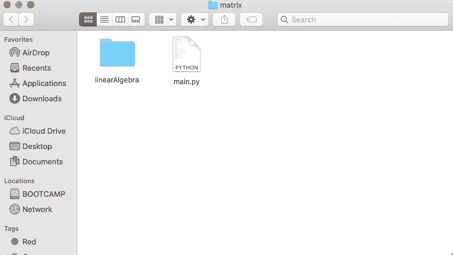
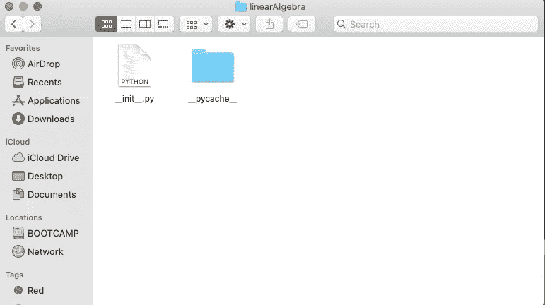

# 如何从头开始构建矩阵模块

> 原文：<https://towardsdatascience.com/how-to-build-a-matrix-module-from-scratch-a4f35ec28b56?source=collection_archive---------6----------------------->

## 如果您一直在为矩阵运算导入 Numpy，但不知道该模块是如何构建的，本文将向您展示如何构建您自己的矩阵模块

# 动机

Numpy 是一个有用的库，它使您能够轻松地创建矩阵和执行矩阵操作。如果你想知道用 Numpy 创建矩阵的技巧，请查看我的博客[这里](https://medium.com/@khuyentran1476/comprehensive-numpy-tutorials-for-beginners-8b88696bd3a2)。但是如果您想创建一个具有 Numpy 库中没有的特性的 matrix 类呢？为了能够做到这一点，我们首先应该了解如何构建一个矩阵类，使我们能够创建一个矩阵，该矩阵具有矩阵的基本功能，如打印、矩阵加法、标量、元素或矩阵乘法，具有访问和设置条目。

本教程结束时，您应该已经具备创建自己的矩阵模块的基础。


Joshua Sortino 在 [Unsplash](https://unsplash.com?utm_source=medium&utm_medium=referral) 上拍摄的照片

# 为什么上课？

创建一个类允许创建一类对象的新实例。每个类实例可以有不同的属性和方法。因此，使用一个类将使我们能够创建一个具有矩阵属性和多种功能的实例。比如 A = [[2，1]，[2，3]]，B = [[0，1]，[2，1]]，A + B 应该给我们一个矩阵[[2，3]，[4，4]]。

`__method__`是私有方法。即使您不能直接调用私有方法，Python 中的类中的这些内置方法将让编译器知道当您执行特定的函数或操作时要访问哪个方法。你只需要为你的目标使用正确的方法。

# 构建一个矩阵类

我将从我们想要创建的开始，然后根据我们的目标找到创建类的方法。我建议您在添加更多方法时测试您的类，看看该类的行为是否如您所愿。

## 创建并打印矩阵对象

我们希望我们的班级达到的目标如下

```
 >>> A = Matrix(dims=(3,3), fill=1.0)
	>>> print( A )
	------------- output -------------
	|   1.000,    1.000,    1.000| 
	|   1.000,    1.000,    1.000| 
	|   1.000,    1.000,    1.000| 
	----------------------------------
```

因此，我们想要创建一个带有参数`dims`和`fill`的`Matrix`对象。

```
class Matrix: 

  def __init__(self, dims, fill):    
     self.rows = dims[0]  
     self.cols = dims[1]   
     self.A = [[fill] * self.cols for i in range(self.rows)]
```

我们使用`__init__`作为构造函数来初始化我们类的属性(行、列和矩阵 A)。行和列由矩阵的第一和第二维指定。用`fill`作为值，用`self.cols`和`self.rows`作为矩阵的形状来创建矩阵 A。

我们还应该创建一个`__str__`方法，使我们能够打印如上所示的可读格式。

```
def __str__(self): 

  m = len(self.A) # Get the first dimension 

  mtxStr = '' mtxStr += '------------- output -------------\n'     

  for i in range(m):

     mtxStr += ('|' + ', '.join( map(lambda x:'{0:8.3f}'.format(x), self.A[i])) + '| \n') mtxStr += '----------------------------------' return mtxStr
```

## 缩放器和矩阵加法

目标:

标准矩阵-矩阵加法

```
 >>> A = Matrix(dims=(3,3), fill=1.0)
	>>> B = Matrix(dims=(3,3), fill=2.0)
	>>> C = A + B
	>>> print( C )
	------------- output -------------
	|   3.000,    3.000,    3.000| 
	|   3.000,    3.000,    3.000| 
	|   3.000,    3.000,    3.000| 
	----------------------------------
```

标量矩阵加法(逐点)

```
 >>>A = Matrix(dims=(3,3), fill=1.0)
	>>> C = A + 2.0
	>>> print( C )
	------------- output -------------
	|   3.000,    3.000,    3.000| 
	|   3.000,    3.000,    3.000| 
	|   3.000,    3.000,    3.000| 
	---------------------------------- 
```

我们使用`__add__`方法来执行正确的加法。

由于加法是可交换的，我们也希望能够在矩阵的右边进行加法。这可以通过调用左边的加法很容易地完成。

```
def __radd__(self, other):  
  return self.__add__(other)
```

## 逐点乘法

目标:

矩阵-矩阵逐点乘法

```
 >>> A = Matrix(dims=(3,3), fill=1.0)
	>>> B = Matrix(dims=(3,3), fill=2.0)
	>>> C = A * B
	>>> print( C )
	------------- output -------------
	|   2.000,    2.000,    2.000| 
	|   2.000,    2.000,    2.000| 
	|   2.000,    2.000,    2.000| 
	----------------------------------
```

标量矩阵逐点乘法

```
 >>> A = Matrix(dims=(3,3), fill=1.0)
	>>> C = 2.0 * A
	>>> C = A * 2.0
	>>> print( C )
	------------- output -------------
	|   2.000,    2.000,    2.000| 
	|   2.000,    2.000,    2.000| 
	|   2.000,    2.000,    2.000| 
	----------------------------------
```

使用`__mul__`方法和`__rmul__`方法进行左右点动

## 标准矩阵-矩阵乘法

目标:

```
 >>> A = Matrix(dims=(3,3), fill=1.0)
	>>> B = Matrix(dims=(3,3), fill=2.0)
	>>> C = A @ B
	>>> print( C )
	------------- output -------------
	|   6.000,    6.000,    6.000| 
	|   6.000,    6.000,    6.000| 
	|   6.000,    6.000,    6.000| 
	----------------------------------
```

矩阵乘法可以通过矩阵乘法专用的`__matmul__` 方法实现。

## 具有访问和设置条目的权限

目标:

```
 >>> A = Matrix(dims=(3,3), fill=1.0)
	>>> A[i,j]
	>>> A[i,j] = 1.0
```

使用`__setitem__`方法设置矩阵索引值，使用`__getitem__`方法获取矩阵索引值。

## 把所有东西放在一起

# 创建和使用模块

创建完类矩阵，就该把它变成一个模块了。将包含该类的文本重命名为`__init__.py`。创建一个名为`Matrix`的文件夹。将`main.py`和另一个名为`linearAlgebra`的文件放在这个文件夹中。将`__init__.py`文件放入`linearAlgebra`文件中。



文件夹矩阵包含 main.py 和 linear 代数



文件夹 linearAlgebra 包含 __init__。巴拉圭

使用`main.py`导入并使用我们的矩阵类。

# 结论

厉害！你已经学会了如何从头开始创建一个矩阵类。Python 类中还有其他方法可以让您为矩阵添加更多要素。因为你有创建一个类的基本知识，你可以创建你自己的符合你兴趣的 Matrix 版本。在[这个 Github repo](https://github.com/khuyentran1401/Numerical-Optimization-Machine-learning/tree/master/matrix) 中，您可以随意派生和使用本文的代码。

我喜欢写一些基本的数据科学概念，并尝试不同的算法和数据科学工具。你可以在 LinkedIn 和 Twitter 上与我联系。

如果你想查看我写的所有文章的代码，请点击这里。在 Medium 上关注我，了解我的最新数据科学文章，例如:

[](https://medium.com/@khuyentran1476/how-to-produce-creative-product-without-hitting-your-head-to-the-wall-86eb93207058) [## 如何生产创意产品(不碰壁)

### 创意是创造伟大产品的关键，但并不总是容易的。这个博客会给你策略去克服…

medium.com](https://medium.com/@khuyentran1476/how-to-produce-creative-product-without-hitting-your-head-to-the-wall-86eb93207058) [](/step-by-step-tutorial-web-scraping-wikipedia-with-beautifulsoup-48d7f2dfa52d) [## 用美丽的声音抓取维基百科

### 关于如何使用 Beautiful Soup 的分步教程，这是一个用于 web 抓取的简单易用的 Python 库

towardsdatascience.com](/step-by-step-tutorial-web-scraping-wikipedia-with-beautifulsoup-48d7f2dfa52d) [](/find-common-words-in-article-with-python-module-newspaper-and-nltk-8c7d6c75733) [## 用 Python 模块 Newspaper 和 NLTK 查找文章中的常用词

### 使用 newspaper3k 和 NLTK 从报纸中提取信息和发现见解的分步指南

towardsdatascience.com](/find-common-words-in-article-with-python-module-newspaper-and-nltk-8c7d6c75733) [](/choose-stocks-to-invest-with-python-584892e3ad22) [## 用 Python 选择要投资的股票

### 您计划在未来 3 年投资几只股票，每只股票的每一美元都有不同的预期回报…

towardsdatascience.com](/choose-stocks-to-invest-with-python-584892e3ad22) [](https://medium.com/@khuyentran1476/comprehensive-numpy-tutorials-for-beginners-8b88696bd3a2) [## 为您的数据科学项目提供 Numpy 技巧

### 创建数组、矩阵、执行矩阵运算、解决线性代数问题和常见数据科学的技巧…

medium.com](https://medium.com/@khuyentran1476/comprehensive-numpy-tutorials-for-beginners-8b88696bd3a2)