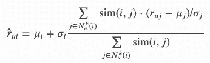

# 如何使用 Python Surprise 构建基于内存的推荐系统

> 原文：<https://towardsdatascience.com/how-to-build-a-memory-based-recommendation-system-using-python-surprise-55f3257b2cf4?source=collection_archive---------8----------------------->

## 使用 Python 中的 Surprise 库实现 kNN 风格推荐引擎的分步指南，从数据准备到预测。


照片由[阮一](https://unsplash.com/@happychan?utm_source=unsplash&utm_medium=referral&utm_content=creditCopyText)在 [Unsplash](https://unsplash.com/s/photos/cupcake-selection?utm_source=unsplash&utm_medium=referral&utm_content=creditCopyText) 上拍摄

啊，我们舒适的现代生活的极度痛苦，纸杯蛋糕看起来都很诱人，但你不可能都尝一尝，所以你应该吃哪一个？不管平台如何，您的选择通常几乎是无限的，但遗憾的是，作为消费者，您的资源并非如此。不要担心，推荐系统会来救你！

框架推荐系统是，我们有一组用户和一组项目，对于给定的用户，我们希望筛选出该用户可能喜欢的项目子集(评价高、购买、观看等。取决于确切的问题)。推荐系统无处不在，所有基于内容的非常成功的科技公司，如网飞、亚马逊、脸书，都非常依赖复杂的推荐系统来增加他们产品的消费。

在作为这篇文章基础的特定项目中，我专注于来自 [boardgamegeek](https://boardgamegeek.com/browse/boardgame) (截至 2020 年 3 月 31 日)的前 100 款游戏，处理我从该网站收集的 230 万个人用户评级。我主要使用了 [surprise](https://surprise.readthedocs.io/en/stable/index.html) ，这是一个专注于推荐系统的 Python scikit 库，其结构非常类似 scikit-learn。

在这篇文章中，我们将讨论基于记忆的模型。我们将讨论如何导入和准备数据，使用什么相似性度量，如何实现三个内置的 kNN 模型，如何应用模型验证，最后进行预测。关于这个项目的细节，请参考我的 [GitHub 库](https://github.com/MatePocs/boardgame_recommendation/blob/master/02_modelling_neighbours.ipynb)，我们将在这篇文章中涉及的工作大致对应于文件`02_modelling_neighbours.ipynb`中的代码。

## 目录

推荐系统
数据导入
数据准备
模型参数
KNN 模型
测试
预测
交叉验证
综合考虑
可能的改进

## 推荐系统

让我们从推荐系统家族的快速总结开始，这样我们就可以放置最近邻模型。

有两条主要的推荐路线可供您选择:

*   **基于内容的过滤**模型基于项目的描述和用户的历史偏好，我们不需要其他用户的意见来推荐。
    *举例:用户喜欢 Vlaada Chvátil 设计的三款游戏，所以我们推荐他设计的第四款游戏。*
*   **协同过滤**模型试图通过共同评级/拥有的项目来发现项目/用户之间的相似性。
    *例如:用户喜欢卡文纳，从我们对人群的分析中我们知道，那些喜欢卡文纳并知道奥丁盛宴的用户也倾向于喜欢第二款游戏，所以我们向用户推荐 FfO。*

在这个项目中，我们将采用协同过滤。在协作过滤组中，两种最著名的不同方法是:

*   **基于记忆的**模型根据用户-项目评分对计算用户/项目之间的相似度。
*   基于模型的模型(不可否认，一个古怪的名字)使用某种机器学习算法来估计收视率。一个典型的例子是用户项目评分矩阵的奇异值分解。

在这篇文章中，我们主要关注基于记忆的模型。所以再一次，推荐系统内部是协同过滤，而协同过滤内部是基于记忆的模型。

## 数据导入

首先，我们需要安装`surprise`包:

```
pip install scikit-surprise
```

完成后，您需要一个数据集，其中包含三个变量:用户 id、商品 id 和评级。这一点很重要，不要试图以用户项目评分矩阵的形式传递评分。从有 3 列且行数等于个人评分总数的数据开始。

如果你只是想练习，可以随意使用我的 GitHub 上的数据集。我个人将这些收集在一个`csv`文件中，分为三列，但是您也可以使用其他数据结构，或者直接从`pandas`T3 加载。

为了导入数据，您需要库中的这些类:

```
from surprise import Dataset, Reader
```

然后定义`file_path`(显然改成你的文件了):

```
file_path = './data_input/games_100_summary_w_testuser.csv'
```

最后，我们创建一个`Reader`对象，具有以下属性:

*   `line_format`:确保订单与您的文件匹配。
*   如果我们使用 csv，这是一个逗号。
*   `rating_scale`:具有最低和最高可能范围的元组。获得正确的参数很重要，否则部分数据将被忽略。如果你使用的是二进制数据，例如，用户喜欢/不喜欢的物品，你可以放入(0，1)。

```
reader = Reader(
    line_format='user item rating', sep=',', rating_scale = (1,10)
    )
```

要导入数据，使用`load_from_file`方法:

```
data = Dataset.load_from_file(file_path, reader=reader)
```

就这样，你应该有一种`surprise`可以使用的数据格式！现在，您可以将数据想象成一个稀疏矩阵，其中用户/项目是行/列，个人评级是该矩阵中的元素。大多数单元格可能是空的，但这完全没问题。在我使用的数据中，我有 230 万的收视率，大约 23 万用户，这意味着用户平均对 100 个游戏中的 10 个进行评分，因此矩阵中大约 90%是空的。

## 数据准备

这就是`surprise`第一次变得有点奇怪的地方，这个过程与`scikit-learn`中的分类器模型不相似，在那里你有一个大矩阵，你可以将它分成训练/验证/测试集，以你认为合适的方式进行交叉验证，因为它们本质上仍然是相同类型的数据。不，在`surprise`中，有三种不同的数据类，每一种都有其独特的用途:

*   `Dataset`:用于直接或通过交叉验证迭代器分割成训练集和测试集。后者意味着如果您在交叉验证中将一个`Dataset`作为参数传递，它将创建许多训练测试分割。
*   `Trainset`:作为模型`fit`方法中的一个参数。
*   `Testset`:作为模型`test`方法中的一个参数。

在我看来，`surprise`是一个相对有据可查的库，但还是有些古怪。例如，`Dataset`对象有一个方法`construct_testset`，但是除了在以前版本的文档页面中找到代码之外，没有解释它做什么，或者参数应该是什么。

我坚持在我的项目中使用记录良好的方法。我们正在准备两种不同的方法，它们的目的将在下面的章节中变得更加清楚。

我们将使用`model_selection`包中的以下内容:

```
from surprise.model_selection import train_test_split
```

首先，我们将数据分为`trainset`和`testset`，`test_size`设置为 20%:

```
trainset, testset = train_test_split(data, test_size=0.2)
```

同样，它与分类器/回归模型的工作方式有点不同，`testset`包含随机选择的用户/项目评级，而不是完整的用户/项目。一个用户可能在数据中有 10 个评级，其中 3 个现在被随机选择用于`testset`，不用于拟合模型。当我第一次注意到这一点时，我发现这很奇怪，但不完全忽略某些用户是完全合理的。

第二种方法是使用完整的数据和交叉验证进行测试。在这种情况下，我们可以通过`build_full_trainset`方法使用所有评级构建一个`Trainset`对象:

```
trainsetfull = data.build_full_trainset()
```

您可以使用`n_users`和`n_items`方法获得项目/用户的数量(同样的方法适用于`trainsetfull`，因为它们是同一类型的对象):

```
print('Number of users: ', trainset.n_users, '**\n**')
print('Number of items: ', trainset.n_items, '**\n**')
```

当 surprise 创建一个 Trainset 或 Testset 对象时，它获取`raw_id`(您在导入的文件中使用的那些)，并将它们转换成所谓的`inner_id`(基本上是一系列整数，从 0 开始)。你可能需要追溯到最初的名字。以条目为例(您可以对用户使用相同的方法，只需在代码中用`uid`替换`iid`，要获得`inner_iid`的列表，您可以使用`all_items`方法。要从原始 id 转换到内部 id，您可以使用`to_inner_iid`方法，然后使用`to_raw_iid`转换回来。

如何保存内部和原始项目 id 列表的示例:

```
trainset_iids = list(trainset.all_items())
iid_converter = lambda x: trainset.to_raw_iid(x)
trainset_raw_iids = list(map(iid_converter, trainset_iids))
```

我们的数据准备工作到此结束，接下来是时候研究一些模型参数了！

## 模型参数

当我们使用 kNN 类型的推荐算法时，有两个超参数可以调整:k 参数(是的，与模型类型名称中的 k 相同)和相似性选项。

**k 参数**相当简单，类似于它在一般 k 近邻模型中的工作方式:它是我们希望算法考虑的类似项目的上限。例如，如果用户评价了 20 个游戏，但是我们将 k 设置为 10，当我们估计对新游戏的评价时，将只考虑 20 个游戏中最接近新游戏的 10 个游戏。您还可以设置 **min_k** ，如果用户没有足够的评分，将使用全局平均值进行评估。默认情况下，它是 1。

我们在上一段中提到了彼此靠近的项目，但是我们如何确定这个距离呢？第二个超参数**相似性选项**定义了计算方法。

先来看看`sim_option` [配置](https://surprise.readthedocs.io/en/stable/prediction_algorithms.html#similarity-measure-configuration)。该参数是一个字典，具有以下键:

*   `shrinkage`:不需要基本的 kNN 型号，只在`KNNBaseline`型号中出现。
*   `user_based`:基本上，当你想要估计相似性时，有两条不同的路线。您可以计算每个项目与其他项目的相似程度，也可以对用户进行同样的计算。对于我的项目，我使用了`False`，考虑到我有 100 个项目和 23 万个用户。
*   `min_support`:相似度设为 0 的最小公共点数。例如:如果 min_support 为 10，并且有两个游戏，只有 9 个用户对这两个游戏进行了评级，则无论评级如何，这两个游戏的相似度都将为 0。我没有在我的项目中试验过这个，考虑到数据的范围，它似乎并不重要，所以我使用了默认的 1。
*   `name`:公式的类型，将在下面进一步讨论。

所有的相似性函数将返回一个介于 0 和 1 之间的数字给一个特定的 *(i，j)* 项目对。1 表示评级完全一致，0 表示两个项目之间没有联系。公式中， *rᵤᵢ* 是用户 *u* 对项目 *i* 的评分， *μᵢ* 是项目 *i* 的平均评分， *Uᵢⱼ* 是对项目 *i* 和 *j* 都进行了评分的用户集合。以下是`surprise` [相似性模块](https://surprise.readthedocs.io/en/v1.1.0/similarities.html)中的三个相似性指标:

`cosine`:


`MSD`:


其中 *msd(i，j)* 为:


`pearson`:


没有明确的好与坏的选择，虽然我很少看到`MSD`在例子中被使用，而且在我的数据中，`pearson`和`cosine`的表现确实明显更好。可以看出，`pearson`公式基本上是`cosine`公式的均值中心版本。

如何定义`sim_option`参数的示例:

```
my_sim_option = {
    'name':'MSD', 'user_based':False, min_support = 1
    }
```

现在我们做了所有的准备工作，我们终于可以训练一些模型了。

## KNN 模型

在`surprise`中有三种基本 [KNN 模型](https://surprise.readthedocs.io/en/v1.1.0/knn_inspired.html?highlight=knn)(我们不考虑第四种，`KNNBaseline`在这篇文章中)。它们定义了如何在预测中估计用户 *u* 对项目 *i* 的评价 *rᵤᵢ* 。下面的公式主要使用我们在上一节中讨论过的符号，一些新符号: *σᵢ* 是项目 *i* 的标准偏差， *Nᵤᵏ(i)* 是来自用户 *u* 评价的最接近项目 *i* 的项目的最大 *k* 项目。

事不宜迟，公式如下:

`KNNBasic`:


估计评级基本上是用户给相似项目的评级的加权平均值，由相似性加权。

`KNNWithMeans`:


根据项目的平均评分调整`KNNBasic`公式。

`KNNWithZScore`:



更进一步，也根据评分的标准偏差进行调整。

在下面的例子中，我们用三个 my_ parameters 来拟合一个`KNNWithMeans`模型。根据我的经验，如果你的项目的平均评分不同，你几乎不会想用`KNNBasic`。您可以随意更改这些参数，所有三种型号都使用完全相同的参数。您可以在下面的代码中将`KNNWithMeans`更改为`KNNBasic`或`KNNWithZScore`,其工作方式是一样的。

```
from surprise import KNNWithMeansmy_k = 15
my_min_k = 5
my_sim_option = {
    'name':'pearson', 'user_based':False, 
    }algo = KNNWithMeans(
    k = my_k, min_k = my_min_k, sim_option = my_sim_option
    )algo.fit(trainset)
```

因此，我们的模型是合适的。从技术上讲，在这一点上发生的所有事情就是模型计算相似性矩阵和均值/标准差(如果您选择它的话)。

您可以使用 sim 方法请求相似性矩阵，如下所示:

```
algo.sim()
```

它将是一个`numpy`数组格式。除非你想自己做一些预测，否则你可能不需要这个矩阵。

## 测试

一旦你训练好了你的模型，就该测试了，对吧？性能指标保存在`surprise`的[精度模块](https://surprise.readthedocs.io/en/stable/accuracy.html)中。这里有四种度量标准(RMSE、FCP、MAE、MSE)，但据我所知，行业标准是均方根误差，所以我们只使用这一个。这是我们今天最后的数学公式:


这个分数大致告诉你你的估计评分与实际评分的平均偏差。要获得测试分数，您所要做的就是使用您已经适应的算法上的测试方法创建一个`predictions`对象:

```
from surprise import accuracypredictions = algo.test(testset)accuracy.rmse(predictions)
```

假设根据我的数据，测试数据中的 RMSE 分数是 1.2891。这意味着在 1 到 10 的范围内，估计的评分平均比实际评分高或低约 1.2891。不伟大，也不可怕。

## 交叉验证

在前两节中，我们遵循了一种非常直接的方法:我们留出一个测试数据，训练模型，然后测试其性能。但是，如果您进行多次运行，使用交叉验证来测试您的模型的性能以及它是否过度拟合可能是一个更好的主意。

如前所述，在`surprise`中，测试和验证的工作方式有点不同。你只能在你的原始数据集对象上进行交叉验证，而不能为最终测试留出单独的测试部分，至少我找不到这样做的方法。所以我的过程基本上是这样的:

*   用不同的参数交叉验证了许多模型类型，
*   选择具有最低平均测试 RMSE 分数的配置，
*   整体训练那个模型`Dataset,`
*   用它来预测。

让我们讨论一下`cross_validate`方法的几个参数:

*   `cv`是我们定义模型使用的折叠类型的地方，类似于`scikit-learn`中的工作方式。我将通过输入一个整数来使用一个基本的 K 倍，你可以在[文档](https://surprise.readthedocs.io/en/stable/model_selection.html?highlight=cross%20validation#module-surprise.model_selection.split)中读到不同的 K 倍。
*   `n_jobs`:并行计算的折叠次数，如果你能腾出内存，将其设置为-1 将意味着所有的 CPU 并行工作。然而，当我在本地机器上这样做时，它崩溃了。我最终将它保留为默认的 1。

在下一部分中，我们将交叉验证的结果保存在`results`变量中:

```
from surprise.model_selection import cross_validateresults = cross_validate(
    algo = algo, data = data, measures=['RMSE'], 
    cv=5, return_train_measures=True
    )
```

请注意，运行这个可能需要几分钟，测试需要一段时间，交叉验证需要 5 次。

一旦完成，您就可以挖掘`results`变量来分析性能。例如，要得到平均测试 RMSE:

```
results['test_rmse'].mean()
```

很自然，你会这样做一段时间，尝试不同的模型，并以较低的`RMSE`分数为目标。一旦你对性能感到满意，并创建了一个你满意的`algo`模型，就该在整个数据集上训练算法了。你需要这一步，因为正如我提到的，你不能从交叉验证中做出预测。与上述未满车列相同的代码:

```
algo.fit(trainsetfull)
```

下一步，我们继续预测！

## 预言

最后，这就是我们做整个项目的原因，对吗？关于`surprise`的两个重要注意事项可能与您的期望不符:

*   只能对已经在数据集中的用户进行**预测。这也是为什么我认为在过程结束时根据整个数据训练模型是有意义的原因。**
*   您不会直接从模型中获得输出列表，只需一次调用，**您就可以请求一个特定用户对一个特定项目的估计评级**。但是，有一个解决方法，我们稍后将回到这个问题。

为了进行一次预测，您可以使用原始 id，因此要获得 id 为`161936`的游戏的`TestUser1`(在数据中至少有`min_k`个其他评分的用户)的估计评分，您需要您训练过的算法的`predict`方法:

```
algo.predict(uid = 'TestUser1', iid = '161936')
```

`predict`方法将返回这样一个字典:

```
Prediction(uid='TestUser1', iid='161936', r_ui=None, est=6.647051644687803, details={'actual_k': 4, 'was_impossible': False})
```

`r_ui`是`None`，因为用户没有该项目的实际评分。我们最终感兴趣的是第`est`项，即估计评分，在我们的例子中，我们估计评分为 6.647。

这一切都很好，但是我们如何为用户获得前 N 个推荐呢？您可以在文档中找到详细的解决方案[，我不打算在此复制，这些是基本步骤:](https://surprise.readthedocs.io/en/stable/FAQ.html)

*   `trainsetfull`上的列车模型。
*   用`build_anti_testset`方法创建一个“反测试集”。这基本上是我们原始数据集的补充。因此，如果用户对 100 款游戏中的 15 款进行了评级，我们的`testset`将包含用户没有评级的 85 款游戏。
*   用`test`方法在`anti_testset`上运行预测(其结果与`predict`方法的结构相似)。通过这一步，我们得到了数据中缺失的所有用户-项目评分对的估计评分。
*   对每个用户的估计评分进行排序，列出具有最高估计评分的 N 个项目。

## 把所有的放在一起

我认为将我们讨论的内容包含在一个连续的块中是有意义的。我们在下面的代码中采用的方法是交叉验证途径，因此我们使用交叉验证来测试性能，然后在整个数据集上拟合模型。

请注意，你很可能不会停止一个交叉验证，应该尝试不同的模型，直到你找到最好的。您可能还想促进前一节中链接的前 N 条建议。

从数据准备到惊喜预测

## 后续步骤

当谈到与`surprise`合作时，你有许多额外的选择，我打算在未来的博客文章中探索它们。

一个相当明显的下一步是用`SVD`和`SVDpp`方法探索基于模型的方法。这些使用矩阵分解来估计评级。此外，您可能已经注意到，在这个场景中，我没有使用`GridSearchCV`进行超参数调优。我发现使用`cross_validate`就足够了，考虑到我们只有几个参数，但是当涉及到更复杂的模型时，你肯定想使用`GridSearchCV`。

*更新:*如果你对实现基于模型的方法感兴趣，可以看看我系列的下一篇文章 [**如何使用 Python Surprise**](/how-to-build-a-model-based-recommendation-system-using-python-surprise-2df3b77ab3e5) 构建基于模型的推荐系统。

另一个有趣的领域是预测。有时，您只想在一些用户评级上运行您的模型，而不将它们集成到底层数据库中。例如，我从 boardgamegeek 收集数据，当我只想快速向某人展示模型时，我不希望那些评级与“官方”评级混在一起。为一个用户重新运行整个模型也是没有效率的。现在，对于我们讨论的三个 KNN 模型，完全可以仅从相似性矩阵、平均值和标准偏差进行预测。我会在以后的文章中描述这个过程，或者你可以看看我的 [GitHub](https://github.com/MatePocs/boardgame_recommendation/blob/master/recomm_func.py) 中的`recomm_func.py`脚本。

*更新:*如果你想了解更多关于这个自定义预测代码，看看 [**我的 Python 代码灵活推荐**](/my-python-code-for-flexible-recommendations-b4d838e9e0e0) 。

## 参考

[](https://en.wikipedia.org/wiki/Collaborative_filtering) [## 协同过滤

### 协同过滤(CF)是推荐系统使用的一种技术。协同过滤有两个含义，一个是…

en.wikipedia.org](https://en.wikipedia.org/wiki/Collaborative_filtering) 

接下来的三个链接是`scikit-surprise`的不同文档，我主要用的是第一个。

 [## 欢迎使用“惊喜”文档！-惊喜 1 文档

### 如果您对惊喜感到陌生，我们邀请您看一看入门指南，在那里您会找到一系列…

surprise.readthedocs.io](https://surprise.readthedocs.io/en/stable/index.html) [](https://pypi.org/project/scikit-surprise/) [## scikit-惊喜

### Surprise 是一个 Python scikit，它构建并分析处理显式评级数据的推荐系统。惊喜…

pypi.org](https://pypi.org/project/scikit-surprise/)  [## 主页

### Surprise 是一个 Python scikit，它构建并分析处理显式评级数据的推荐系统。惊喜…

surpriselib.com](http://surpriselib.com/)