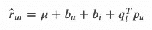

# 如何使用 Python Surprise 构建基于模型的推荐系统

> 原文：<https://towardsdatascience.com/how-to-build-a-model-based-recommendation-system-using-python-surprise-2df3b77ab3e5?source=collection_archive---------30----------------------->

## 使用 Python 中的 Surprise 库实现潜在因素推荐引擎的分步指南。


德瓦·威廉姆森在 [Unsplash](https://unsplash.com/s/photos/cupcake?utm_source=unsplash&utm_medium=referral&utm_content=creditCopyText) 上的照片

这篇文章是我的 Python 惊喜推荐系列的最后一篇，在这篇文章中，我展示了我在 boardgame 推荐引擎项目中使用的技术。(整个项目看我的 [GitHub 回购](https://github.com/MatePocs/boardgame_recommendation)。)

该系列的前几篇文章:

**第 1 部分** : [如何使用 Python Surprise 构建基于内存的推荐系统](/how-to-build-a-memory-based-recommendation-system-using-python-surprise-55f3257b2cf4):如果您不熟悉这个主题，尤其是数据导入和数据准备步骤，我建议您先阅读这篇文章，因为它们对于基于内存和基于模型的方法是相同的。

**第 2 部分** : [我的灵活推荐 Python 代码](/my-python-code-for-flexible-recommendations-b4d838e9e0e0):这篇文章包含了我为推荐框架编写的额外代码，它使人们无需重新训练整个模型就能创建预测。然而，这种方法只适用于 KNN 风格的简单模型。

我还愚蠢地用纸杯蛋糕做了一个类比，以封面图片为依据。在第一个帖子中，我们有许多纸杯蛋糕，不知道如何选择，在第二个帖子中，我们有一个奇怪的新来的纸杯蛋糕，努力整合它，现在…我想现在纸杯蛋糕排成一行，代表矩阵分解。这是我能想到的最好的了。

在这篇文章中，我们将讨论潜在因素模型如何工作，如何通过超参数调整来训练这样一个模型，以及我们可以从结果中得出什么其他结论。

## 基于模型的推荐系统

快速回顾一下我们的现状。在[推荐系统](https://en.wikipedia.org/wiki/Recommender_system)中，有一组被称为[协同过滤](https://en.wikipedia.org/wiki/Collaborative_filtering)的模型，它试图根据记录的用户项目偏好或评级来发现用户之间或项目之间的相似之处。在我之前的文章中，我们讨论了协作系统的一个子群，称为基于[记忆的](https://en.wikipedia.org/wiki/Collaborative_filtering#Memory-based)模型。它们被称为基于内存的，因为算法并不复杂，但需要大量内存来跟踪结果。

在这篇文章中，我们将讨论协作过滤模型的另一个子群:[基于模型的](https://en.wikipedia.org/wiki/Collaborative_filtering#Model-based)模型(这是一个相当愚蠢的名字)。与基于记忆的方法相反，这种方法使用某种机器学习算法。这一组中有许多不同的变体，我们将集中讨论奇异值分解方法。

在[惊喜](https://surprise.readthedocs.io/en/stable/matrix_factorization.html)中，有三种这样的模式:`SVD`、`SVDpp`、`NMF`，其中我只打算讨论`SVD`。`NMF`是一个简化版本，忽略了用户和项目的偏见。`SVDpp`增加了一个非常酷的功能，你还可以单独跟踪用户是否对项目进行了评级，这当然也应该是相关的信息，但我发现它并没有提高我的效率，同时增加了大量的计算时间。

## 数学公式

在 SVD 模型中，用户 *u* 对项目 *i* 的估计评分计算如下:



其中 *μ* 是总体平均评级，其他所有参数通过梯度下降法从模型中计算得出。因此，该模型将尝试在所有已知评级上拟合该估计评级，最小化 MSE，并返回最接近的拟合。

*bᵤ* 和 *bᵢ* 是标量，它们代表用户 *u* 或项目 *i* 的偏向。例如，用户 *u* 倾向于 *bᵤ* 偏离大平均评级。这些偏差可以在拟合模型时关闭，这基本上就是`NMF`模型。

*pᵤ* 和 *qᵢ* 是向量，它们的长度是模型的超参数 *n* 。它们是模型的实际[矩阵分解](https://en.wikipedia.org/wiki/Matrix_factorization_(recommender_systems))部分，这就是神奇之处。每个用户和物品将由他们的向量来表示，向量试图用 *n* 个数字来捕捉他们的本质。我们通过乘以项目-用户对(当然，加上平均值和偏差)来获得评级。

把这 n 个维度看作是人类可以理解的东西可能很有诱惑力。例如，如果我们处理棋盘游戏，第一个维度可以衡量规则手册有多复杂。现在，一个高度重视复杂性的用户(这意味着他们在*qᵢ*[*1*)*会给一个高复杂性的游戏一个高评级(这意味着高 *pᵤ* [ *1* )。然而，根据我的经验，这种情况很少发生，很难将意义与模型中的各个坐标相匹配。*

## *在惊讶中训练模型*

*假设您已经导入并设置了数据库(同样，如果您不确定如何做，请参考我的[上一篇文章](/how-to-build-a-memory-based-recommendation-system-using-python-surprise-55f3257b2cf4))，使用`SVD`类似于在 Surprise 中使用其他模型。首先，您需要导入模型:*

```
*from surprise import SVD*
```

*然后，您可以在列车组上安装模型，并使用`RMSE`分数(代表均方根误差，越低越好)测试模型性能:*

```
*SVD_model = SVD()
SVD_model.fit(trainset)
predictions = SVD_model.test(testset)
accuracy.rmse(predictions)*
```

*与基于内存的模型类似，为了预测特定用户的评级，您可以使用 predict 方法，但该用户需要在您的数据库中:*

```
*SVD_model.predict(uid = 'TestUser1', iid = '161936')*
```

## *分析模型*

*如您所见，拟合 SVD 模型很简单，但是分析结果有点复杂。*

*使用一个`SVD`对象的`pu`、`qi`、`bu`和`bi`方法，可以从数学公式中得到相应的值。在我的项目中，我发现`qi`是最有趣的:在已经拟合的`SVD`模型上调用`qi`方法将返回一个二维数组，其中高度是项目的数量，宽度是模型的`n_factor`参数(我们将在下一节讨论这些参数)。每行代表一个有`n_factor`个因素的项目，这些是模型发现的所谓潜在因素，它们代表评级计算中的项目。*

*正如我之前提到的，试图在这些坐标中找到容易理解的意义是很诱人的，但以我的经验来看，这并不会真的发生。然而，我认为一个真正有趣的方法是将这些潜在的因素作为聚类分析的基础，看看是否能从中发现什么有趣的东西。您可以使用`n_factor`潜在因素作为特征，并基于它们计算项目的距离，就像您在任何常规聚类分析中所做的那样。*

## *我们的超参数是什么？*

*任何机器学习过程的一个重要部分是调整超参数。在本节中，我们将惊奇地看一下`SVD`参数。*

*在我们开始之前，请注意，对于我的项目，默认参数下的 RMSE 分数是 1.332，在我的 GCP 虚拟机运行了几个小时之后，我设法将 RMSE 分数降到了 1.3210。这不是一个很大的改进…可能只是我的数据库，可能是因为默认参数在惊奇中被有效地设置。尽管如此，我认为考虑超参数仍然很重要。*

*我优化了四个超参数:*

*   *`n_factors`:我们在上一节已经简单的提到了这一点，这个参数决定了你的 *pᵤ* 和 *qᵢ* 向量的大小。这决定了模型将试图找到多少潜在因素。该数字越高，模型的能力越强，但也有更高的过度拟合几率。*
*   *`n_epochs`:该因子决定梯度下降计算重复的次数。增加该数值会使预测更加准确，但需要更长的计算时间。*
*   *`lr_all`:所有参数的学习率系数。这些是模型将用于最小化成本函数的步长，请参见[惊喜文档](https://surprise.readthedocs.io/en/stable/matrix_factorization.html)中的更多信息。*
*   *`reg_all`:所有参数的正则化因子。Surprise 使用 L2 正则化，这大致意味着它将尝试最小化参数平方值之间的差异。(参数为所有 *bᵤ、bᵢ、pᵤ* 和 *qᵢ* 。)*

*还有许多其他参数可以使用，其中大多数是不同的学习率或调整参数设置。从技术上讲，您可以为每四种模型参数设置不同的学习率或正则化，而`…_all`参数涵盖了所有这些参数。我认为没有必要详述这些细节。*

## *超参数调谐*

*我们将使用`GridSearchCV`来调整超参数。它的工作方式很像它在 scikit-learn 中的对应物，顾名思义，它将使用交叉验证在超参数网格上搜索所有可能的组合。*

*首先，我们需要一个字典，其中的键是超参数名称，值是您想要检查的不同项目的列表:*

```
*param_grid = {
    'n_factors':[5, 10,20],
    'n_epochs': [5, 10, 20], 
    'lr_all': [0.002, 0.005],
    'reg_all': [0.4, 0.6]}*
```

*你必须小心设置这些参数，因为每个可能的组合都会被检查。在我们的例子中，有 3 * 3 * 2 * 2 = 36 种不同的组合，对于其中的每一种，模型将运行多次，这取决于您选择的交叉验证。我将`cv`参数设为 5 倍，这意味着总共 36 * 5 = 180 次模型运行。*

*这可能需要很长时间，现在可能是开始考虑使用云计算的时候了。我最近写了一篇关于如何在 Google 云平台上快速设置免费[虚拟机的帖子。](/google-cloud-virtual-machine-for-data-science-work-7622579c5b0d)*

*一旦你有了你的参数网格，你可以像这样设置`GridSearchCV`对象:*

```
*gs_model = GridSearchCV(
    algo_class = SVD,
    param_grid = param_grid,
    n_jobs = -1,
    joblib_verbose = 5)*
```

*第一个参数`algo_class`是您想要使用的模型类型。`n_jobs` = -1 简单地告诉模型它可以使用所有可用的处理器，当您有一个可并行化的操作时，这是非常理想的。您可能想要更改的另一个参数是`cv`，我只是将其保留为默认值，它进行 5 重交叉验证。*

*然后你可以简单地拟合数据:*

```
*gs_model.fit(data)*
```

*请再次注意，surprise 处理数据库的方式有点不同，您只能将您的`GridSearchCV`放在整个数据集上，不能将其分为训练和测试。*

*最后，您可以从参数网格中获得导致最佳`RMSE`分数的参数列表:*

```
*gs_model.best_params*
```

## *我的过程*

*我和`GridSearchCV`一起工作的过程如下:*

*   *在整个数据上拟合一个`GridSearchCV`模型，其参数网格覆盖范围很广*
*   *计算交叉验证的`RMSE`分数*
*   *对不同的参数网格重复该过程，如果最佳参数似乎在中间，则向下钻取到较低的级别，或者如果最佳参数似乎在前一参数网格的边界，则探索较高/较低的参数*
*   *一旦`RMSE`得分下降最小，保存最佳超参数并在接下来的步骤中用于`SVD`模型*
*   *因为我想将结果与我之前的 KNN 型模型进行比较，所以我在`trainset`上运行了`SVD`模型，并在`testset`上计算了测试`RMSE`分数*

*另一种方法是简单地依赖 GSCV 分数，并在整个训练集中仅拟合最终模型一次。*

## *结论*

*我的推荐系统项目系列到此结束。*

*与所有这些不同的方法一起工作是很有趣的，尤其是他们的表现是如此的接近。我花了很多时间来确定最好的模型，但事实是，即使是最简单的 KNN 模型表现也相对较好。*

*我认为这部分是因为我的数据远没有推荐系统通常的那么稀疏。10%的可能用户项目评级被填充，这被认为是非常高的比率。想象一下，如果人们平均购买了亚马逊上所有产品的 10%!这个比例很高是因为我只关注了有史以来最受欢迎的 100 款桌游，这些游戏自然都很受欢迎。作为一个额外的奖励，平均评分非常接近和高，因为这些都是普遍认为是好游戏。*

## *参考*

*惊喜文档:*

 *[## 欢迎使用“惊喜”文档！-惊喜 1 文档

### 如果您对惊喜感到陌生，我们邀请您看一看入门指南，在那里您会找到一系列…

surprise.readthedocs.io](https://surprise.readthedocs.io/en/stable/index.html)* 

*我在该系列中的前几篇文章:*

*[](/how-to-build-a-memory-based-recommendation-system-using-python-surprise-55f3257b2cf4) [## 如何使用 Python Surprise 构建基于内存的推荐系统

### 使用 Python 中的 Surprise 库实现 kNN 风格推荐引擎的分步指南，来自 data…

towardsdatascience.com](/how-to-build-a-memory-based-recommendation-system-using-python-surprise-55f3257b2cf4) [](/my-python-code-for-flexible-recommendations-b4d838e9e0e0) [## 我的灵活推荐 Python 代码

### 我的额外定制 Python 代码，使您能够基于惊喜库运行更灵活的推荐…

towardsdatascience.com](/my-python-code-for-flexible-recommendations-b4d838e9e0e0)*