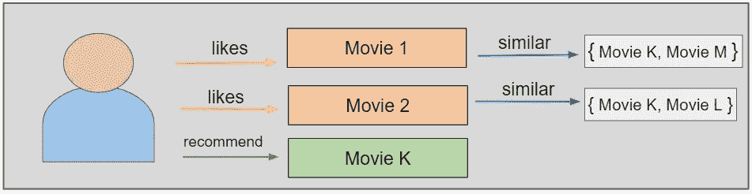
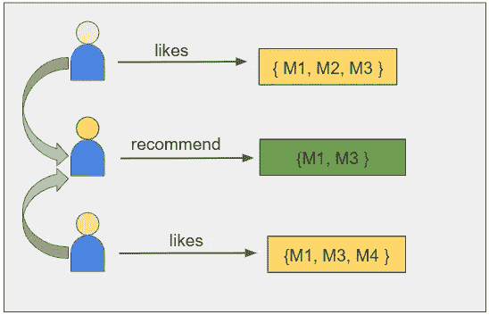
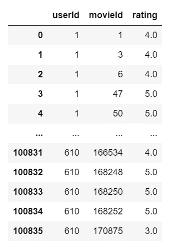
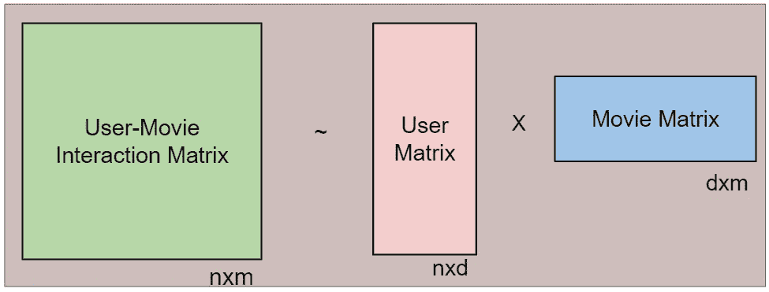
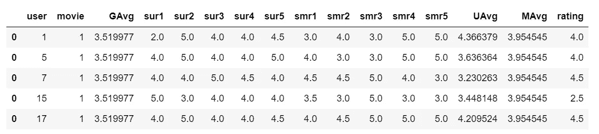
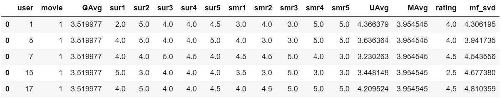
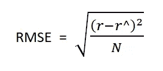
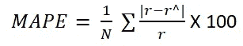
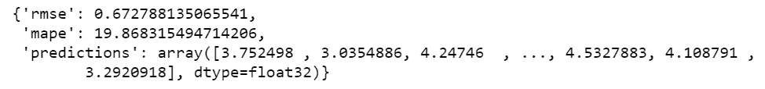

# 如何建立电影推荐系统

> 原文：<https://towardsdatascience.com/how-to-build-a-movie-recommendation-system-67e321339109?source=collection_archive---------4----------------------->


Noom Peerapong 在 [Unsplash](https://unsplash.com?utm_source=medium&utm_medium=referral) 上拍摄的照片

## [动手教程](https://towardsdatascience.com/tagged/hands-on-tutorials)，机器学习

## 构建简单推荐系统的逐步指南

你有没有想过 YouTube 是怎么推荐内容的，或者脸书是怎么推荐你的，新朋友？也许你已经注意到了 LinkedIn connections 的类似推荐，或者当你在浏览时亚马逊将如何推荐类似的产品。所有这些推荐都是通过推荐系统的实现而成为可能的。

推荐系统包括一类可以向用户建议“相关”项目的技术和算法。他们通过包括矩阵分解在内的多种技术，根据过去的数据预测未来的行为。

在这篇文章中，我将看看为什么我们需要推荐系统和不同类型的在线用户。然后，我将向您展示如何使用开源数据集构建您自己的电影推荐系统。

## 内容

*   为什么我们需要推荐系统？
*   推荐系统的类型
    A)基于内容的电影推荐系统
    B)协同过滤电影推荐系统
*   数据集
*   电影推荐系统的设计
*   实现
    步骤 1:基于矩阵分解的算法
    步骤 2:创建手工制作的特征
    步骤 3:为我们的电影推荐系统创建最终模型
*   性能指标
*   摘要


# 为什么我们需要推荐系统？

我们现在生活在一些人称之为“富足时代”的时代。对于任何给定的产品，有时有成千上万的选项可供选择。想想上面的例子:流媒体视频、社交网络、网上购物；这样的例子不胜枚举。推荐系统有助于个性化平台，帮助用户找到他们喜欢的东西。

最简单易行的方法就是推荐最受欢迎的单品。然而，要真正通过个性化推荐提升用户体验，我们需要专门的推荐系统。

从商业角度来看，用户在平台上找到的相关产品越多，他们的参与度就越高。这通常会增加平台本身的收入。各种消息来源称，多达 35-40%的科技巨头的收入仅来自推荐。

现在我们已经了解了推荐系统的重要性，让我们来看看推荐系统的类型，然后用开源数据构建我们自己的推荐系统！


# 推荐系统的类型

推荐系统中的机器学习算法通常分为两类:基于内容的系统和协同过滤系统。现代推荐系统结合了这两种方法。

让我们看看他们是如何使用电影推荐系统作为基础的。

# a)基于内容的电影推荐系统

基于内容的方法是基于电影属性的相似性。使用这种类型的推荐系统，如果用户观看一部电影，相似的电影被推荐。例如，如果用户观看亚当·桑德勒主演的喜剧电影，系统将向他们推荐相同类型或相同演员主演的电影，或者两者都推荐。考虑到这一点，构建基于内容的推荐系统的输入是电影属性。



图 1:基于内容的推荐系统概述(图片由作者创建)

# b)协同过滤电影推荐系统

通过协同过滤，该系统基于用户和电影之间过去的交互。考虑到这一点，协同过滤系统的输入由用户与他们观看的电影的交互的过去数据组成。

例如，如果用户 A 观看 M1、M2 和 M3，而用户 B 观看 M1、M3、M4，我们向相似的用户 c 推荐 M1 和 M3。为了更清楚地参考，您可以在下图中看到这种情况。



*图 2:协同过滤电影推荐系统的示例(由作者创建的图像)*

这些数据存储在一个名为用户-电影交互矩阵的矩阵中，其中行是用户，列是电影。

现在，让我们使用上面讨论的概念来实现我们自己的电影推荐系统。


# 数据集

对于我们自己的系统，我们将使用来自 GroupLens 的开源 [MovieLens 数据集](https://grouplens.org/datasets/movielens/)。这个数据集包含各种电影和用户的 100K 个数据点。

我们将使用三列数据:

*   使用者辩证码
*   电影 Id
*   等级

您可以在下面的图 3 中看到数据的快照:



图 3:数据快照(图片由作者提供)


# 设计我们的电影推荐系统

为了获得对用户的推荐，我们将预测他们对尚未观看的电影的评分。然后基于这些预测的评级，电影被编入索引并被推荐给用户。

为此，我们将使用电影和用户评级的过去记录来预测他们未来的评级。在这一点上，值得一提的是，在现实世界中，我们很可能会遇到没有历史的新用户或电影。这种情况被称为冷启动问题。

让我们简单看看如何解决冷启动问题。


# 冷启动问题

冷启动问题可以通过基于元信息的建议来处理，例如:

*   对于新用户，我们可以使用他们的位置、年龄、性别、浏览器和用户设备来预测推荐。
*   对于新电影，我们可以用流派、演员、剧组来推荐给目标用户。


# 履行

对于我们的推荐系统，我们将使用上面提到的两种技术:基于内容的和协同过滤。对于我们的基于内容的方法，为了找到电影之间的相似性，我们将使用余弦相似性函数。对于我们的协作过滤方法，我们将使用矩阵分解技术。

第一步是创建一个基于矩阵分解的模型。我们将使用这个模型的输出和一些手工制作的功能来为最终的模型提供输入。基本流程如下所示:

*   步骤 1:构建基于矩阵分解的模型
*   步骤 2:创建手工制作的特征
*   步骤 3:实现最终模型

我们将在下面详细讨论这些步骤。


# 步骤 1:基于矩阵分解的算法

[矩阵分解](https://datajobs.com/data-science-repo/Recommender-Systems-[Netflix].pdf)是一类用于推荐系统的协同过滤算法。由于非常有效，这一系列方法在[网飞奖挑战赛](https://netflixprize.com/index.html)期间广为人知。

矩阵分解算法通过将用户-电影交互矩阵分解成两个较低维度的矩形矩阵(比如 U 和 m)的乘积来工作。分解以这样的方式完成，使得乘积产生与用户-电影交互矩阵几乎相似的值。这里 U 代表用户矩阵，M 代表电影矩阵，n 代表用户数，M 代表电影数。

用户矩阵的每一行代表一个用户，电影矩阵的每一列代表一部电影。



图 4:矩阵分解(图片由作者创建)

一旦我们获得了 U 和 M 矩阵，基于用户-电影交互矩阵中的非空单元，我们执行 U 和 M 的乘积，并预测用户-电影交互矩阵中非空单元的值。

为了实现矩阵分解，我们使用了一个简单的名为 Surprise 的 Python 库，用于构建和测试推荐系统。数据帧被转换成训练集，一种被惊喜库接受的数据集格式。

```
from surprise import SVD
import numpy as np
import surprisefrom surprise import Reader, Dataset
# It is to specify how to read the data frame.
reader = Reader(rating_scale=(1,5))# create the traindata from the data frame
train_data_mf = Dataset.load_from_df(train_data[['userId', 'movieId', 'rating']], reader)# build the train set from traindata. 
#It is of dataset format from surprise library
trainset = train_data_mf.build_full_trainset()svd = SVD(n_factors=100, biased=True, random_state=15, verbose=True)
svd.fit(trainset)
```

现在模型准备好了。我们将存储这些预测，并作为附加特征传递给最终模型。这将有助于我们将协同过滤整合到我们的系统中。

```
#getting predictions of train set
train_preds = svd.test(trainset.build_testset())
train_pred_mf = np.array([pred.est for pred in train_preds])
```

请注意，我们还必须对测试数据执行上述步骤。


# 步骤 2:创建手工特征

让我们将数据帧格式的数据转换成用户-电影交互矩阵。在这类问题中使用的矩阵通常是稀疏的，因为用户很可能只对几部电影进行评级。

数据的稀疏矩阵格式(也称为 CSR 格式)的优点如下:

*   高效的算术运算:CSR + CSR，CSR * CSR 等。
*   高效的行切片
*   快速矩阵向量乘积

scipy.sparse.csr_matrix 是一个实用函数，可以有效地将数据帧转换为稀疏矩阵。

```
# Creating a sparse matrix
train_sparse_matrix = sparse.csr_matrix((train_data.rating.values, (train_data.userId.values, train_data.movieId.values)))
```

‘train _ sparse _ matrix’是 train_data 数据帧的稀疏矩阵表示。

我们将使用此稀疏矩阵创建 3 组特征:

1.  代表全球平均值的特征
2.  代表前五名相似用户的功能
3.  代表前五部类似电影的特写

让我们更详细地了解一下如何准备每一项。

## 1.代表全球平均值的特征

我们将采用的三个全球平均值是:

1.  所有用户对所有电影的平均评分
2.  所有用户对特定电影的平均评级
3.  特定用户给出的所有电影的平均评级

```
train_averages = dict()
# get the global average of ratings in our train set.
train_global_average = train_sparse_matrix.sum()/train_sparse_matrix.count_nonzero()
train_averages['global'] = train_global_average
train_averagesOutput: {‘global’: 3.5199769425298757}Next, let’s create a function which takes the sparse matrix as input and gives the average ratings of a movie given by all users, and the average rating of all movies given by a single user.# get the user averages in dictionary (key: user_id/movie_id, value: avg rating)
def get_average_ratings(sparse_matrix, of_users):# average ratings of user/axes
ax = 1 if of_users else 0 # 1 - User axes,0 - Movie axes# ".A1" is for converting Column_Matrix to 1-D numpy array
sum_of_ratings = sparse_matrix.sum(axis=ax).A1# Boolean matrix of ratings ( whether a user rated that movie or not)
is_rated = sparse_matrix!=0# no of ratings that each user OR movie..
no_of_ratings = is_rated.sum(axis=ax).A1# max_user and max_movie ids in sparse matrix
u,m = sparse_matrix.shape
# create a dictionary of users and their average ratings..
average_ratings = { i : sum_of_ratings[i]/no_of_ratings[i]for i in range(u if of_users else m)
if no_of_ratings[i] !=0}#return that dictionary of average ratings
return average_ratings
```

平均评级由用户给出:

```
train_averages['user'] = get_average_ratings(train_sparse_matrix, of_users=True)
```

电影的平均评级如下:

```
train_averages['movie'] = get_average_ratings(train_sparse_matrix, of_users=False)
```

## 2.代表前 5 名相似用户的功能

在这组功能中，我们将创建对特定电影进行评级的前 5 名相似用户。使用用户之间的余弦相似度来计算相似度。

```
# compute the similar Users of the "user"user_sim = cosine_similarity(train_sparse_matrix[user], train_sparse_matrix).ravel()
top_sim_users = user_sim.argsort()[::-1][1:] # we are ignoring 'The User' from its similar users.# get the ratings of most similar users for this movie
top_ratings = train_sparse_matrix[top_sim_users, movie].toarray().ravel()# we will make it's length "5" by adding movie averages to
top_sim_users_ratings = list(top_ratings[top_ratings != 0][:5])
top_sim_users_ratings.extend([train_averages['movie'][movie]]*(5 -len(top_sim_users_ratings)))
```

## 3.代表前 5 部相似电影的特征

在这组特征中，我们获得了由特定用户评价的前 5 部相似电影。使用电影之间的余弦相似度来计算该相似度。

```
# compute the similar movies of the "movie"
movie_sim = cosine_similarity(train_sparse_matrix[:,movie].T,
train_sparse_matrix.T).ravel()
top_sim_movies = movie_sim.argsort()[::-1][1:]# we are ignoring 'The User' from its similar users.
# get the ratings of most similar movie rated by this user
top_ratings = train_sparse_matrix[user, top_sim_movies].toarray().ravel()# we will make it's length "5" by adding user averages to
top_sim_movies_ratings = list(top_ratings[top_ratings != 0][:5])
top_sim_movies_ratings.extend([train_averages['user'][user]]*(5-len(top_sim_movies_ratings)))
```

我们为每个电影用户对添加所有这些特征，并创建一个数据框。图 5 是我们的数据框的快照。



图 5:包含 13 个特性的数据概述

以下是其内容的更详细的分类:

*   GAvg:所有评分的平均评分
*   这部电影的相似用户评分:sur1、sur2、sur3、sur4、sur5(对这部电影评分的前 5 名相似用户)
*   此用户评价的相似电影:smr1、smr2、smr3、smr4、smr5(用户评价的前 5 部相似电影)
*   用户平均评分
*   MAvg:这部电影的平均评分
*   分级:此用户对此电影的分级。

一旦我们准备好这 13 个特性，我们将添加矩阵分解输出作为第 14 个特性。在图 6 中，您可以看到添加步骤 1 的输出后的数据快照。



图 6:具有 13 个特征和矩阵分解输出的数据概述(图片由作者提供)

最后一列名为 mf_svd，是包含步骤 1 中执行的模型输出的附加列。


# 步骤 3:为我们的电影推荐系统创建一个最终模型

为了创建我们的最终模型，让我们使用 [XGBoost](https://xgboost.readthedocs.io/en/latest/) ，一个优化的分布式梯度增强库。

```
# prepare train data
x_train = final_data.drop(['user', 'movie','rating'], axis=1)
y_train = final_data['rating']
# initialize XGBoost model
xgb_model = xgb.XGBRegressor(silent=False, n_jobs=13,random_state=15,n_estimators=100)
# fit the model
xgb_model.fit(x_train, y_train, eval_metric = 'rmse')
```


# 性能指标

评价推荐系统的性能主要有两种方法:均方根误差(RMSE)和平均绝对百分比误差(MAPE)。RMSE 衡量的是平方损失，而 MAPE 衡量的是绝对损失。较低的值意味着较低的错误率，因此性能更好。

两者都很好，因为它们允许简单的解释。让我们来看看它们分别是什么:

# 均方根误差(RMSE)

RMSE 是误差平方平均值的平方根，由下式给出。



其中:
r 是实际收视率，
r^是预测收视率，
N 是预测总数

# 平均绝对百分比误差(MAPE)

MAPE 用百分比来衡量误差。它由下面的公式给出:



其中:
r 是实际收视率，
r^是预测收视率，
N 是预测总数

```
#dictionaries for storing train and test results
test_results = dict()
# from the trained model, get the predictions
y_est_pred = xgb_model.predict(x_test)
# get the rmse and mape of train data
rmse = np.sqrt(np.mean([ (y_test.values[i] - y_test_pred[i])**2 for i in
range(len(y_test_pred)) ]))
mape = np.mean(np.abs( (y_test.values- y_test_pred)/y_true.values )) * 100
# store the results in train_results dictionary
test_results = {'rmse': rmse_test, 'mape' : mape_test, 'predictions' : y_test_pred}
```



我们的模型在看不见的测试数据上得到 0.67 的 RMSE 和 19.86 的 MAPE，这是一个很好的模型。小于 2 的 RMSE 值被认为是好的，小于 25 的 MAPE 是极好的。也就是说，这种模式可以通过添加功能来进一步增强，这些功能将根据位置或流派的最佳选择进行推荐。我们还可以通过 A/B 测试实时测试各种模型的功效。


# 摘要

在本文中，我们学习了推荐系统的重要性，正在实现的推荐系统的类型，以及如何使用矩阵分解来增强系统。然后，我们构建了一个电影推荐系统，它考虑了用户-用户相似性、电影-电影相似性、全局平均值和矩阵分解。这些概念可以应用于任何其他用户-项目交互系统。

感谢阅读！如果你想自己试验这个自定义数据集，你可以在 [GroupLens](https://grouplens.org/datasets/movielens/) 下载带注释的数据，并在 [Github](https://github.com/RamyaVidiyala/MovieRecommenderSystem) 查看我的代码。


谢谢你的阅读。本文原载[此处](https://lionbridge.ai/articles/step-by-step-guide-to-building-a-movie-recommendation-system/)。我也将在未来写更多初学者友好的帖子。请在[媒体](https://medium.com/@ramyavidiyala)上关注我，以便了解他们。我欢迎反馈，可以通过 Twitter [ramya_vidiyala](https://twitter.com/ramya_vidiyala) 和 LinkedIn [RamyaVidiyala](https://www.linkedin.com/in/ramya-vidiyala-308ba6139/) 联系我。快乐学习！