# 从数据抓取到结果分析，构建完整的容器化机器学习解决方案

> 原文：<https://towardsdatascience.com/how-to-build-a-museum-attribute-collection-and-attribute-analysis-system-82a6a9a840a?source=collection_archive---------61----------------------->

## 这篇文章解释了如何一步一步地构建一个 ML 项目

# 介绍

在这里，我将描述如何建立一个系统来从维基百科中检索数据，将它们存储在 Postgres 数据库中，最后执行线性回归算法来预测城市人口和游客涌入之间的相关性。

> 在我的工作面试过程中，我被要求建立一个系统，从维基百科收集数据，并将其存储在数据库中。最后，我被要求执行一个小的线性回归 ML 算法来检查数据之间的关系。我正在分享我的过程和想法，关于我如何为任何可能有兴趣做类似项目的人建立这个系统。该项目可以很容易地扩展或适用于任何其他领域。

我为采访准备的演示文稿和代码可以在我的 [Github](https://github.com/ShiNik/wiki_ml) 上找到。

# **系统管道**

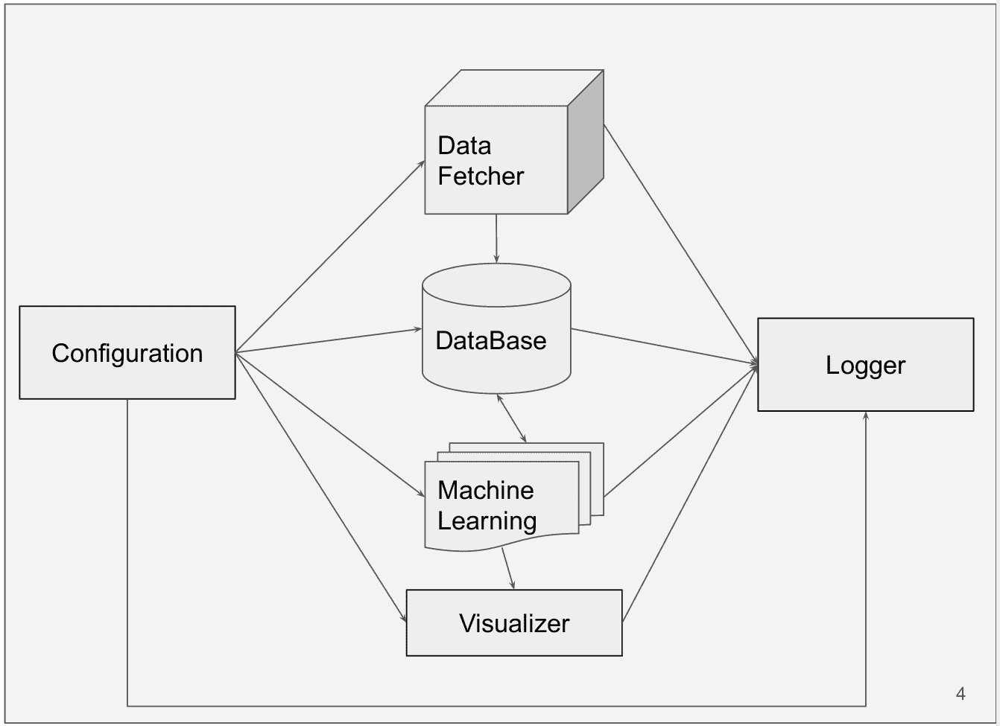

# Docker 编写模块

*   提供一致的执行环境
*   启动系统的单一命令
*   包含多个容器
*   在容器之间提供一个隔离的网络环境
*   根据依赖关系按顺序管理启动容器的协调

docker-compose 环境包含 4 个容器: [Postgres 数据库](https://hub.docker.com/_/postgres)、 [PgAdmin](https://www.pgadmin.org/download/pgadmin-4-container/) 、 [Python 3.7.6 应用主机](https://hub.docker.com/_/python)和 [Jupyter 笔记本](https://hub.docker.com/u/jupyter/)

要查看最终的 docker-compose 文件，请参考我的 [Github](https://github.com/ShiNik/wiki_ml/blob/master/docker-compose.yml) 。

# 数据提取器模块

数据提取是从万维网上自动挖掘数据或收集信息的过程。

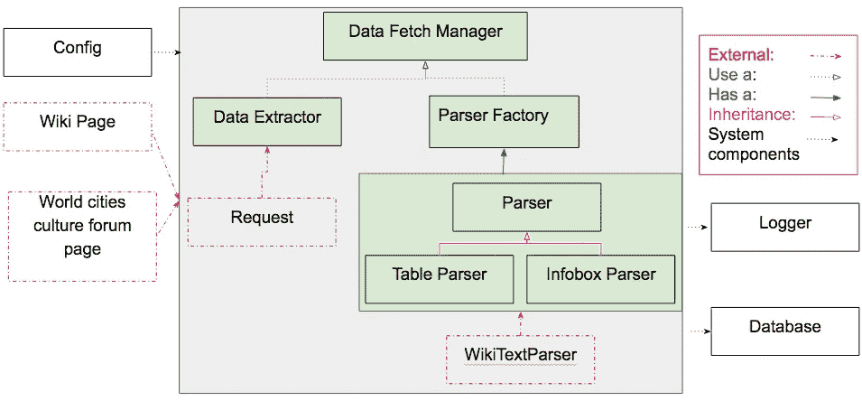

数据提取器模块-类图

本项目中使用的两个数据来源是[世界城市文化论坛 wiki 页面](http://www.worldcitiescultureforum.com/data/number-of-international-tourists-per-year)和[参观最多的博物馆 wiki 页面](https://en.wikipedia.org/wiki/List_of_most_visited_museums)。

结合使用 [wiki-api](https://en.wikipedia.org/w/api.php?action=help&modules=parse) 和 Python [请求](https://requests.readthedocs.io/en/master/)库来访问维基百科页面和检索信息。请求库以 wikitext 的形式获取文本。需要对 Wikitext 进行解析，以便从中提取完整信息的含义。

有许多库可用于解析 wikitext。在分析了几种之后，我决定使用 [wikitextparser](https://github.com/5j9/wikitextparser) 。然而，并不是所有的文本在经过解析器后都会变得非常清晰。为了解决这个问题，我编写了一个[后处理](https://github.com/ShiNik/wiki_ml/blob/master/src/my_package/parser.py)模块，使用 [Wiki 表规则](https://en.wikipedia.org/wiki/Help:Table)和[正则表达式](https://en.wikipedia.org/wiki/Regular_expression)在将文本存储到数据库之前对其进行更多的清理。

这些数据总共包括了 33 个城市和 46 个博物馆的信息。检索每个城市的以下特征:名称、人口、规模、报告年份、游客总数。对于每个博物馆，检索以下特征:名称、游客、类型、公共交通、位置、建立、建造、报告年份。

然而，一些维基页面有丢失的数据。下图显示了检索到的数据。缺失的数据用紫色标记。

检索到的数据和缺失的数据

# 数据库模块

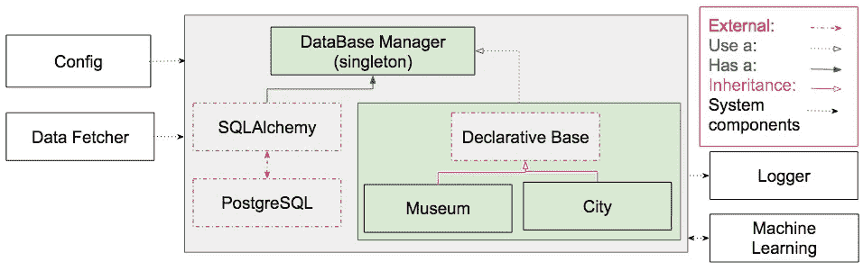

数据库模块-类图

我使用了 [postgres](https://www.postgresql.org/) 开源数据库，它与 [SQLAlchemy](https://www.sqlalchemy.org/) 一起支持这个项目。SQLAlchemy 是一个 Python SQL 工具包，它为开发人员提供了 SQLRelational Mapper 的全部功能和灵活性。如果你需要了解更多关于 AQLAlchemy 的知识，请参考他们的教程[。](https://www.sqlalchemy.org/library.html#tutorials)

因为数据是为博物馆和城市提取的，所以这个项目只需要 2 个表。每个博物馆和城市都有一个唯一的 id 作为主键。城市 id 是博物馆表中的外键。

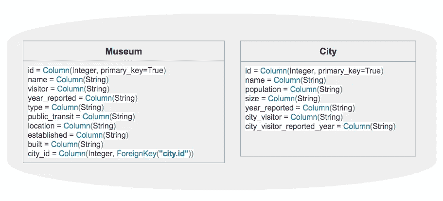

数据库表

有关该项目的数据库的详细信息，请参考我的 [Github](https://github.com/ShiNik/wiki_ml/blob/master/src/my_package/database_manager.py) 。

# 记录器、配置和可视化模块

记录器记录应用程序中发生的详细事件。日志有助于解决应用程序和基础设施性能问题。用户可以设置不同的日志记录级别。logger 模型在内部使用 python [日志](https://docs.python.org/3/library/logging.html)库。

该配置用于设置系统不同模块的参数，并避免使用任何硬编码设置。当前系统使用的一些配置包括主维基页面名称、数据库配置以及维基页面和数据库字段之间的翻译器。

可视化工具是一个独立的模块。它的工作是为了可视化的目的生成不同的图。

关于[记录器](https://github.com/ShiNik/wiki_ml/blob/master/src/my_package/log_manager.py)、[配置](https://github.com/ShiNik/wiki_ml/blob/master/src/my_package/config.py)和[可视化器](https://github.com/ShiNik/wiki_ml/blob/master/src/my_package/visualizer.py)的详细信息可以在我的 Github 中找到。

# 机器学习模块

机器学习模块的目标是创建一个线性回归算法，以探索城市人口和游客涌入之间的相关性。该模块由以下几个阶段组成:

*   数据清理
*   评估数据分布
*   线性回归
*   相互关系
*   模型评估
*   实验
*   结果分析

关于[机器学习模块](https://github.com/ShiNik/wiki_ml/blob/master/src/my_package/machine_learning_manager.py)的详细信息可以在我的 Github 中找到。

## 数据清理

为了获得更准确的预测结果，数据质量很重要。数据清理用于改善和提高数据质量。在本项目中，执行以下清理程序来清理和纠正数据，使其可用:

1-使用正则表达式从总体中删除不需要的字符，如逗号("，")

2-使用正则表达式从年份中提取数字

3-将数字数据从字符串转换为数字

4-删除丢失的数据

## 评估数据分布

数据分布是更好地理解数据的一个很好的工具。有许多方法可以评估数据分布，如直方图、箱线图等。在这个项目中，数据的分布用直方图和概率图来表示。

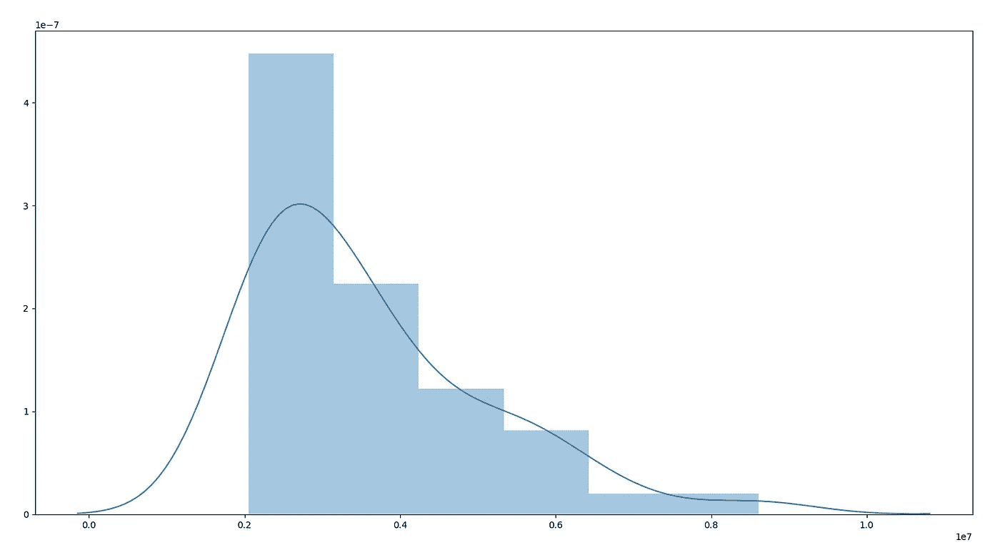

博物馆游客数据分布

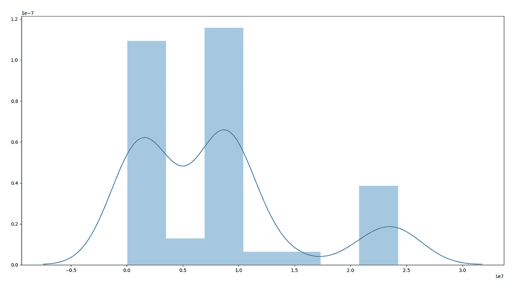

城市人口数据分布

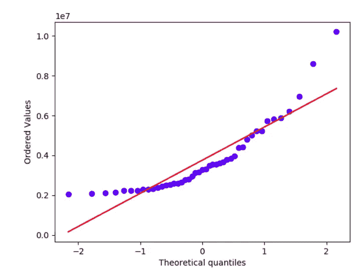

概率图博物馆游客

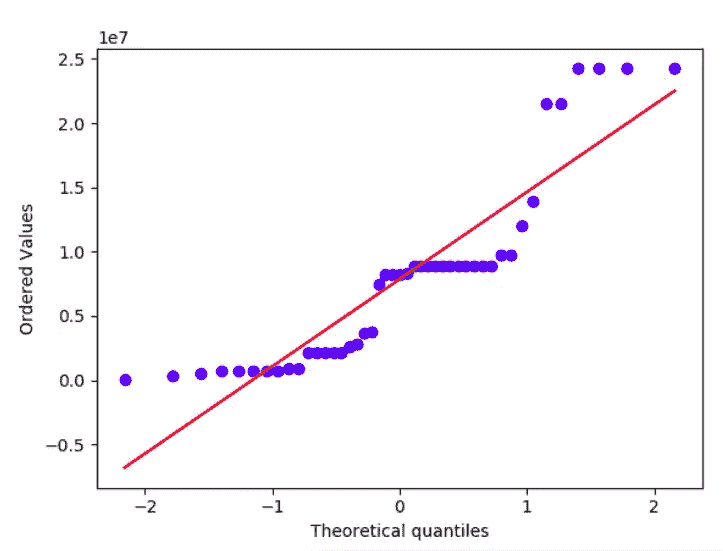

城市人口概率图

## 线性回归

L [线性回归](https://en.wikipedia.org/wiki/Linear_regression)是一种[线性](https://en.wikipedia.org/wiki/Linearity)方法，用于模拟一个[因变量](https://en.wikipedia.org/wiki/Dependent_variable)和一个或多个[自变量](https://en.wikipedia.org/wiki/Independent_variable)之间的关系。下图说明了线性回归方程和图表。

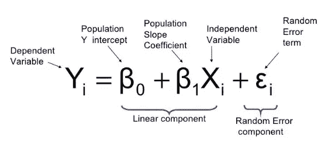

线性回归公式

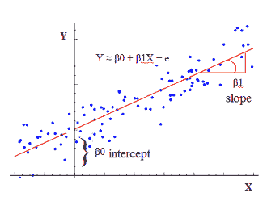

[线性回归](https://www.analyticbridge.datasciencecentral.com/profiles/blog/show?id=2004291:BlogPost:317210)

## 相互关系

当两组数据具有高相关值**时，它们被强有力地链接在一起。**

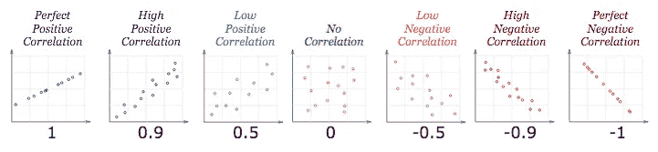

[相关性](https://www.mathsisfun.com/data/correlation.html)

相关性可能有价值:

*   1 是完美的正相关
*   0 表示没有相关性(这些值看起来根本没有关联)
*   -1 是完美的负相关
*   当值一起增加时，相关性为正，并且
*   当一个值随着另一个值的增加而减少时，相关性为负

## 模型评估

模型评估是用于选择最佳模型的方法，而不考虑架构或参数。估计模型对样本外数据的推广程度的过程称为模型评估过程。

最常见的模型评估程序是训练/测试分割程序。这是一个非常快速和简单的程序，并提供了非常精确的样本外性能估计。最佳实践之一是将数据随机分为训练集和测试集。我使用 Scikit 包中的 train_test_split 函数进行数据拆分。我选择 80%的数据用于训练，20%用于测试。

您总是需要一个评估指标来配合您选择的过程。度量标准的选择取决于您要解决的问题的类型。对于回归问题，平均绝对误差、均方误差和均方根误差通常用作评估指标。

## 实验

因为我的数据的值的范围是变化的，所以我也执行了数据标准化。

> 当要素具有不同的范围以将数据的值更改为通用范围时，数据规范化是一种经常作为机器学习的数据准备的一部分而应用的技术。

为了验证因变量(博物馆游客)和自变量(城市人口/城市游客)之间的相关性，散点图生成如下:

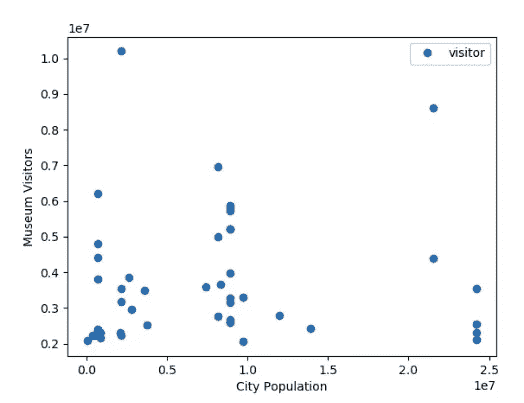

城市人口与博物馆游客

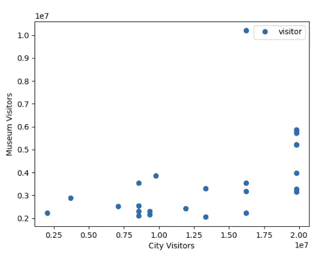

城市游客与博物馆游客

下图显示了模型评估程序:

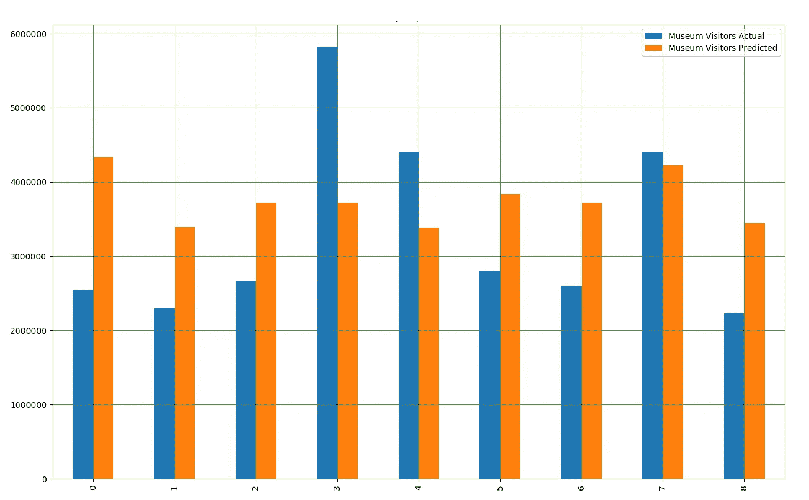

城市人口实际值与预测值对比结果

城市游客实际值与预测值对比结果

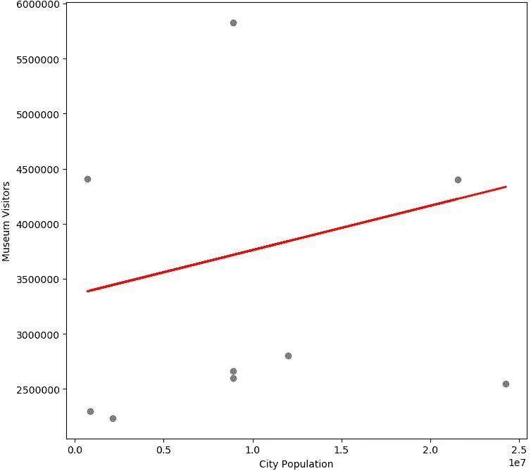

预测数据与测试数据

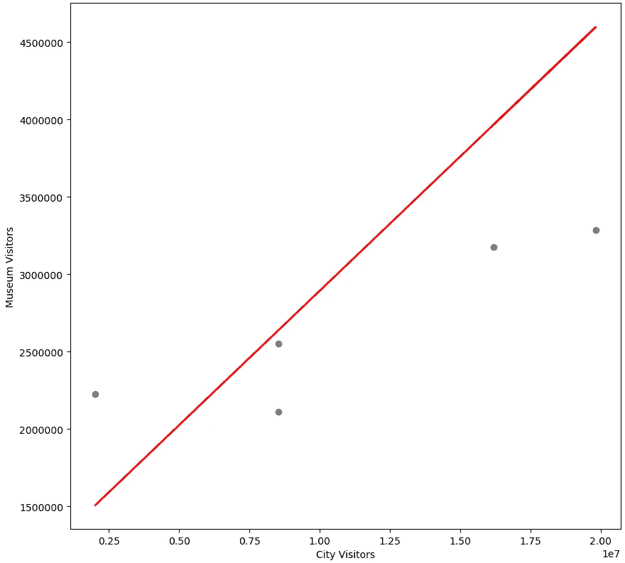

预测数据与测试数据

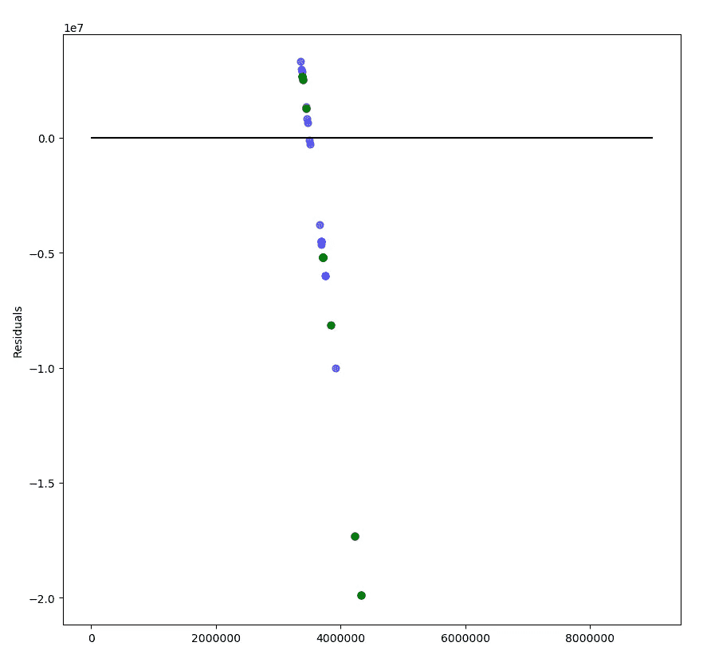

城市人口残差图

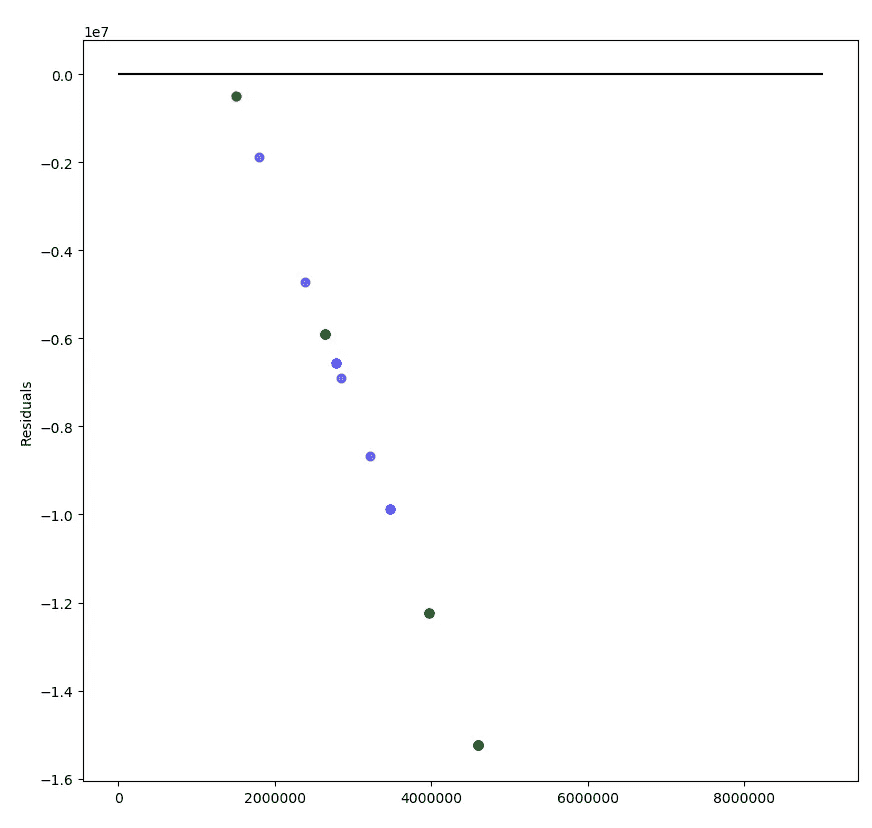

城市游客残差图

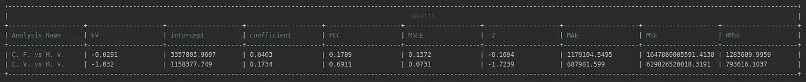

城市人口和城市游客误差评估

C.p:城市人口

C.v:城市游客

博物馆参观者

EV:解释的差异

PCC:皮尔逊相关系数

MSLE:均方对数误差

R2:决定系数(R)

平均绝对误差

MSE:均方差

RMSE:均方根误差

进行的另一个实验是为了找出最大游客量的城市人口、每个城市博物馆的所有游客和每个博物馆的游客之间的相关性。用城市游客代替城市人口进行了同样的分析。

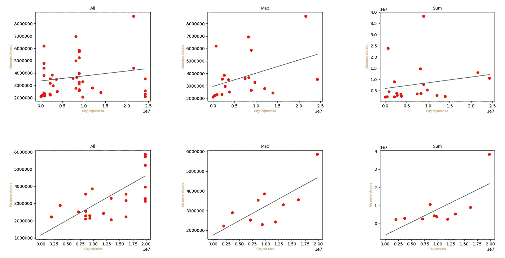

实验结果

Li 回归分析，最差结果用黄色标记，最佳结果用橙色标记

## 结果分析

1.  人口与博物馆参观者没有显著的相关性。
2.  单一的特征并不能很好地预测博物馆的参观者。
3.  由于需要更多的数据、错误的假设或较差的特征，模型不符合数据。
4.  数据收集不符合真实的数据分布，例如数据年份不匹配，博物馆游客仅涵盖 2018 年，但城市人口和城市游客属于任何一年。

# 改进

我认为将来可以对该项目进行一些改进:

## **系统级**

*   使用 NLP 为 wiki 提取信息
*   拥有一个交互系统来获取用户输入以进行关联
*   使用 JSON 文件而不是配置文件
*   使用 Django 和 Flask python 库添加 web 界面，以通过浏览器显示用户界面
*   分析数据库以提高性能

## **数据等级**

*   为了有效地提取特征，回顾关于游客和博物馆之间关系的现有方法
*   获取更多数据，如博物馆到公共交通、餐馆等的距离。
*   有了更多的数据，通过使用多元线性回归找到最相关的要素
*   执行决策树以找到访客最多时最有效的功能

# 结论

希望这篇文章对那些想知道如何做类似项目的人有所帮助。帖子的代码可以在我的 [Github](https://github.com/ShiNik/wiki_ml) 上找到。