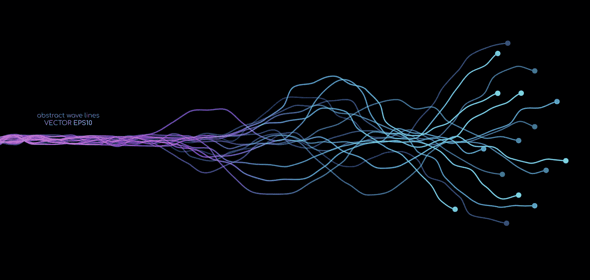
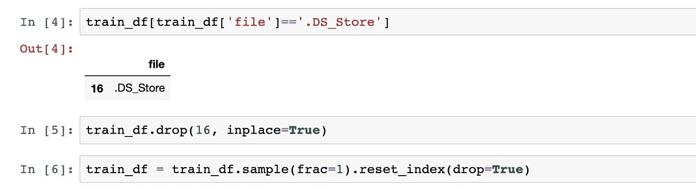
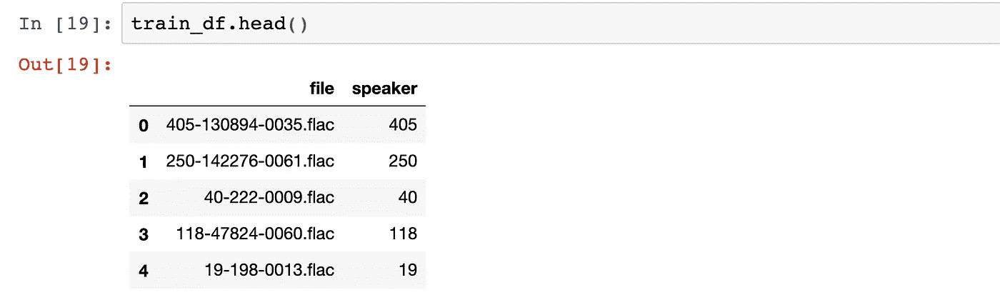
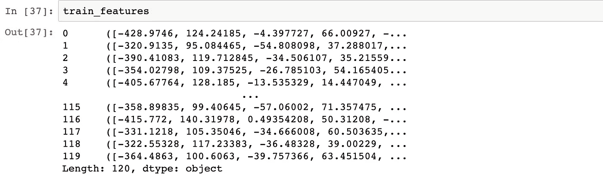
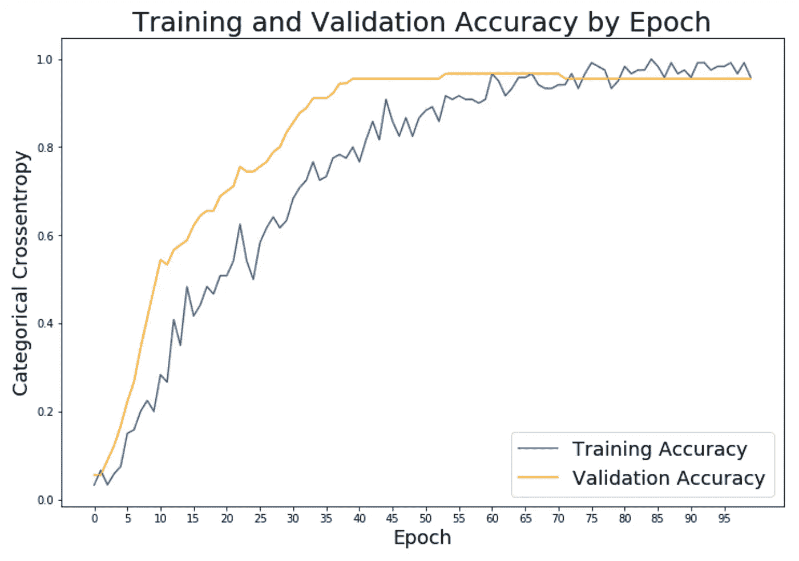
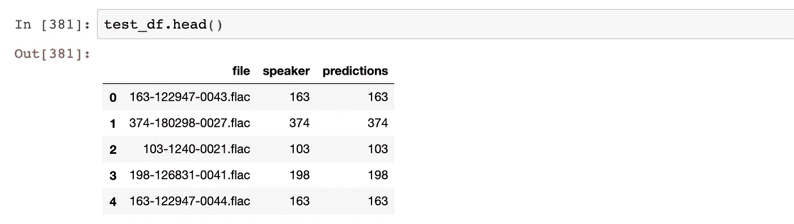
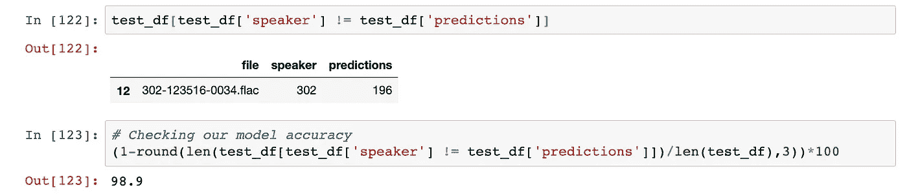

# 如何建立用于语音分类的神经网络

> 原文：<https://towardsdatascience.com/how-to-build-a-neural-network-for-voice-classification-5e2810fe1efa?source=collection_archive---------8----------------------->

## Python 的完整代码演练



[图片来自 Adobe Stock281653938 作者 korkeng](https://stock.adobe.com/search?k=neural&search_type=default-asset-click&asset_id=281653938)

如果能将我们的 Zoom 会议记录下来，用纯文本的形式告诉我们谁在会议中说了什么，这不是很好吗？这个项目诞生于记录会议告诉你每个人说了什么的想法。我们有许多将语音转换为文本的转录工具，但没有多少工具可以识别每个说话者。为此，我们将使用这里包含的所有代码从头开始构建一个 python 语音分类器。

首先，一如既往，我们需要数据。这个数据来自 [OpenSLR](http://www.openslr.org/12/) 。对于我们的训练数据，我们将使用 30 个不同的说话者和每个说话者 4 个样本，给我们 120 个样本。每个样本平均 15 秒，因此每个说话者大约一分钟用于训练。对于我们的问题陈述来说，30 个演讲者是一个很好的数量；因为我已经进行了这个项目，我可以断言一分钟足够给我们带来好的结果。

除了用于训练的 120 个样本，我们还需要验证和测试数据。我们将对 3 个样品进行验证，并对 3 个样品进行测试。由于我们有 30 个扬声器，我们需要 90 个样品进行验证，90 个样品进行测试。因此，我们将需要每个发言者的 10 个语音剪辑。

为了总结样本，我们将使用 120 个语音剪辑作为训练数据，90 个语音剪辑作为验证数据，90 个语音剪辑作为测试数据，总共 300 个语音剪辑。

一旦我们在三个不同的文件夹中有了用于训练、验证和测试的语音剪辑，我们就可以创建我们的熊猫数据框架了。我们需要导入*操作系统*，这样我们就可以从文件夹中的文件创建一个数据框架(我在 mac 上工作，对于其他操作系统，这个过程可能会有点不同)。我训练的文件夹叫 *30_speakers_train* 。

```
import os#list the files
filelist = os.listdir('30_speakers_train') #read them into pandas
train_df = pd.DataFrame(filelist)
```

这将为我的训练数据创建一个数据框架。检查数据帧的大小非常重要，这样可以确保它与文件夹中的文件数量相匹配。

让我们将文件列命名为“文件”。

```
# Renaming the column name to file
train_df = train_df.rename(columns={0:'file'})
```

有时一个[*’。DS_Store'*](https://en.wikipedia.org/wiki/.DS_Store) 文件已创建，我们必须找到并删除该特定文件才能继续。之后，我们需要重置数据帧的索引。这里有一个例子:



如何删除'的示例。“DS_Store”文件

```
# Code in case we have to drop the '.DS_Store' and reset the index
train_df[train_df['file']=='.DS_Store']
train_df.drop(16, inplace=True)
train_df = train_df.sample(frac=1).reset_index(drop=True)
```

现在，我们需要确定每个发言者。在我的文件名中，第一组数字是发言者 ID，因此我写了一点代码来创建一个具有该 ID 的列。

```
# We create an empty list where we will append all the speakers ids for each row of our dataframe by slicing the file name since we know the id is the first number before the hashspeaker = []
for i in range(0, len(df)):
    speaker.append(df['file'][i].split('-')[0])# We now assign the speaker to a new column 
train_df['speaker'] = speaker
```

我们的数据帧应该是这样的:



我们对验证和测试文件做同样的工作，得到三个不同的数据帧。

现在我们有了数据帧，我们需要写一个函数来提取每个音频文件的音频属性。为此，我们使用 librosa，这是一个很好的用于音频操作的 python 库。我们需要 pip 安装 librosa 并导入 librosa。下面是解析我们文件夹中的每个文件并从每个文件中提取 5 个数字特征的函数，即 mfccs、chroma、mel、contrast 和 tonnetz。

```
def extract_features(files):

    # Sets the name to be the path to where the file is in my computer
    file_name = os.path.join(os.path.abspath('30_speakers_train')+'/'+str(files.file))# Loads the audio file as a floating point time series and assigns the default sample rate
    # Sample rate is set to 22050 by default
    X, sample_rate = librosa.load(file_name, res_type='kaiser_fast')# Generate Mel-frequency cepstral coefficients (MFCCs) from a time series 
    mfccs = np.mean(librosa.feature.mfcc(y=X, sr=sample_rate, n_mfcc=40).T,axis=0)# Generates a Short-time Fourier transform (STFT) to use in the chroma_stft
    stft = np.abs(librosa.stft(X))# Computes a chromagram from a waveform or power spectrogram.
    chroma = np.mean(librosa.feature.chroma_stft(S=stft, sr=sample_rate).T,axis=0)# Computes a mel-scaled spectrogram.
    mel = np.mean(librosa.feature.melspectrogram(X, sr=sample_rate).T,axis=0)# Computes spectral contrast
    contrast = np.mean(librosa.feature.spectral_contrast(S=stft, sr=sample_rate).T,axis=0)# Computes the tonal centroid features (tonnetz)
    tonnetz = np.mean(librosa.feature.tonnetz(y=librosa.effects.harmonic(X),
    sr=sample_rate).T,axis=0)return mfccs, chroma, mel, contrast, tonnetz
```

每个 mfcc 是长度为 40 的数组，色度为 12，mel 为 128，对比度为 7，tonnetz 为 6。总的来说，从我们选择的音频特征中，每个语音片段有 193 个数字特征。如果你愿意，请随意尝试不同的方法:l [ibrosa 特征提取](https://librosa.github.io/librosa/0.6.0/feature.html)。我们将该函数应用于每个单独的音频文件，并存储该信息。请注意，这确实需要几分钟，甚至可能需要几个小时，这取决于您使用的数据量和您的计算能力。

```
train_features = train_df.apply(extract_features, axis=1)
```



现在，我们将每个文件的所有这些数字特征连接起来，这样我们就有一个包含 193 个数字的单个数组来输入我们的神经网络。

```
features_train = []
for i in range(0, len(train_features)):
    features_train.append(np.concatenate((
        train_features[i][0],
        train_features[i][1], 
        train_features[i][2], 
        train_features[i][3],
        train_features[i][4]), axis=0))
```

现在，我们可以将 X_train 设置为我们的特性的 numpy 数组:

```
X_train = np.array(features_train)
```

类似地，我们从一开始就为我们的验证和测试数据做同样的步骤。我们应该得到一个 *X_val* 和 *X_test* 。

现在，我们完成了我们的 *X* 数据。对于 *Y* ，我们需要演讲者的 id。请记住，我们正在进行监督学习，因此我们需要目标数据。我们从原始数据帧中得到这些，因此我们只得到这些值。

```
y_train = np.array(train_df['speaker'])
y_val = np.array(val_df['speaker'])
```

我们需要对 y 进行热编码，以便能够将其用于我们的神经网络。您需要从 *sklearn* 中导入 *LabelEncoder* ，从使用 *Tensorflow* 的 *keras* 中导入*to _ categorial*。

```
from sklearn.preprocessing import LabelEncoder
from keras.utils.np_utils import to_categorical# Hot encoding y
lb = LabelEncoder()
y_train = to_categorical(lb.fit_transform(y_train))
y_val = to_categorical(lb.fit_transform(y_val))
```

现在我们需要扩展我们的 *X* :

```
from sklearn.preprocessing import StandardScalerss = StandardScaler()
X_train = ss.fit_transform(X_train)
X_val = ss.transform(X_val)
X_test = ss.transform(X_test)
```

最后，我们准备好了有趣的部分:构建神经网络！我们将使用一个简单的前馈神经网络。输入将是我们的 193 个特征。我摆弄了一下辍学率，但是如果你愿意，你可以改变这些数值。使用 relu 是相当标准的。输出是 softmax，因为我们有 30 个不同的类，并且因为不同的类，我们使用分类交叉熵。

```
from keras.models import Sequential
from keras.layers import Dense, Dropout, Activation, Flatten
from keras.callbacks import EarlyStopping# Build a simple dense model with early stopping and softmax for categorical classification, remember we have 30 classesmodel = Sequential()model.add(Dense(193, input_shape=(193,), activation = 'relu'))
model.add(Dropout(0.1))model.add(Dense(128, activation = 'relu'))
model.add(Dropout(0.25))model.add(Dense(128, activation = 'relu'))
model.add(Dropout(0.5))model.add(Dense(30, activation = 'softmax'))model.compile(loss='categorical_crossentropy', metrics=['accuracy'], optimizer='adam')early_stop = EarlyStopping(monitor='val_loss', min_delta=0, patience=100, verbose=1, mode='auto')
```

现在，我们用训练和验证数据拟合模型:

```
history = model.fit(X_train, y_train, batch_size=256, epochs=100, 
                    validation_data=(X_val, y_val),
                    callbacks=[early_stop])
```

这是一些代码，用于查看训练和验证准确性的图表:

```
# Check out our train accuracy and validation accuracy over epochs.
train_accuracy = history.history['accuracy']
val_accuracy = history.history['val_accuracy']# Set figure size.
plt.figure(figsize=(12, 8))# Generate line plot of training, testing loss over epochs.
plt.plot(train_accuracy, label='Training Accuracy', color='#185fad')
plt.plot(val_accuracy, label='Validation Accuracy', color='orange')# Set title
plt.title('Training and Validation Accuracy by Epoch', fontsize = 25)
plt.xlabel('Epoch', fontsize = 18)
plt.ylabel('Categorical Crossentropy', fontsize = 18)
plt.xticks(range(0,100,5), range(0,100,5))plt.legend(fontsize = 18);
```

它应该是这样的:



看起来我们得到了一些很好的准确性！让我们用测试数据来检查这些值。我们可以用神经网络的结果生成预测，并将它们与实际值进行比较。

```
# We get our predictions from the test data
predictions = model.predict_classes(X_test)# We transform back our predictions to the speakers ids
predictions = lb.inverse_transform(predictions)# Finally, we can add those predictions to our original dataframe
test_df['predictions'] = predictions
```

现在，我们的测试数据 dataframe 应该是这样的:



```
# Code to see which values we got wrong
test_df[test_df['speaker'] != test_df['predictions']]# Code to see the numerical accuracy
(1-round(len(test_df[test_df['speaker'] != test_df['predictions']])/len(test_df),3))*100
```

您应该得到这样的结果:



98.9%的正确预测！我不得不运行神经网络四次，最终得到一个错误的预测。在前三次运行中，神经网络得到了所有正确的预测，但我想展示如何找到一个错误的预测。因此，通过一分钟的训练音频，神经网络对于 30 个扬声器来说近乎完美！

这证明了一个简单的神经网络有多么强大！希望对你有帮助！

这里是我的 [jupyter 笔记本](https://github.com/jurgenarias/Portfolio/blob/master/Blogs/Code/Voice_Classification_full_code_for_blogpost.ipynb)的链接，里面有所有的代码。我也使用卷积神经网络(CNN)做了这个和类似的项目，如果你感兴趣，你可以在这里 看到我的另一篇解释那个过程的帖子 [*。*](/voice-classification-with-neural-networks-ff90f94358ec)

## **来源:**

数据集:[http://www.openslr.org/12/](http://www.openslr.org/12/)

[1]大卫·卡斯帕，亚历山大·贝利，帕特里克·富勒， [Librosa:一个 Python 音频库(2019)](https://medium.com/@patrickbfuller/librosa-a-python-audio-libary-60014eeaccfb)

[2] Rami S. Alkhawaldeh，[DGR:使用一维常规神经网络的人类语音性别识别](https://www.hindawi.com/journals/sp/2019/7213717/) (2019)

[3]科里·贝克尔，[使用机器学习识别声音的性别](http://www.primaryobjects.com/2016/06/22/identifying-the-gender-of-a-voice-using-machine-learning/) (2016)

[4] [乔纳森·巴拉班](https://towardsdatascience.com/@ultimatist?source=post_page-----1ef708ec5f53----------------------)，[深度学习技巧和窍门](/deep-learning-tips-and-tricks-1ef708ec5f53) (2018)

[5] [Youness Mansar](https://medium.com/@CVxTz?source=post_page-----b0a4fce8f6c----------------------) ，[音频分类:一种卷积神经网络方法](https://medium.com/@CVxTz/audio-classification-a-convolutional-neural-network-approach-b0a4fce8f6c) (2018)

[6] [Faizan Shaik](https://www.analyticsvidhya.com/blog/author/jalfaizy/) h，[使用深度学习开始音频数据分析(附案例研究)](https://www.analyticsvidhya.com/blog/2017/08/audio-voice-processing-deep-learning/) (2017)

[7] [麦克·斯梅尔斯](https://medium.com/@mikesmales?source=post_page-----8bc2aa1990b7----------------------)，[利用深度学习的声音分类](https://medium.com/@mikesmales/sound-classification-using-deep-learning-8bc2aa1990b7)，(2019)

[8] [Aaqib Saeed](http://aqibsaeed.github.io/) ，[城市声音分类，第 1 部分](http://aqibsaeed.github.io/2016-09-03-urban-sound-classification-part-1/)，(2016)

[9] Marc Palet Gual，[使用运行在 FPGA 上的深度神经网络进行声音性别识别](https://upcommons.upc.edu/bitstream/handle/2117/86673/113166.pdf)，(2016)

[10] [Kamil Ciemniewski](https://www.endpoint.com/team/kamil_ciemniewski) ，[在 TensorFlow](https://www.endpoint.com/blog/2019/01/08/speech-recognition-with-tensorflow) ，【2019】中使用扩展卷积和 CTC 从零开始进行语音识别

[11] [Admond Lee](https://towardsdatascience.com/@admond1994?source=post_page-----81d0fe3cea9a----------------------) ，[如何用 Python 构建语音识别机器人](/how-to-build-a-speech-recognition-bot-with-python-81d0fe3cea9a) (2019)

[12] [阿德里安·易捷·许](https://medium.com/@adrianitsaxu?source=post_page-----486e92785df4----------------------)，[利用卷积神经网络结合 Keras 进行城市声音分类:理论与实现](https://medium.com/gradientcrescent/urban-sound-classification-using-convolutional-neural-networks-with-keras-theory-and-486e92785df4)，【2019】

[13] Sainath Adapa，K [aggle freesound 音频标记](https://github.com/sainathadapa/kaggle-freesound-audio-tagging) (2018)

[14] [歌词特征提取](https://librosa.github.io/librosa/0.6.0/feature.html)